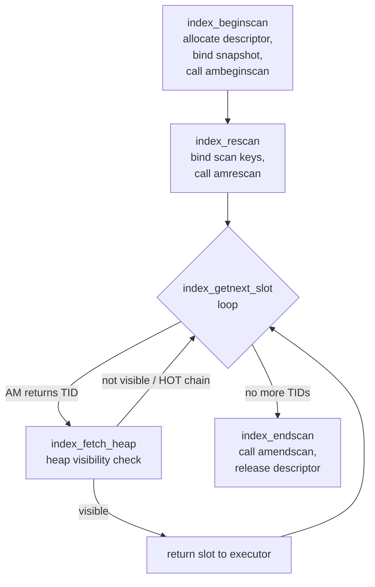

The generic index access manager (genam) is the uniform scan interface that sits between the executor and every index type. It means that the executor calls `index_beginscan`, `index_getnext_slot`, and `index_endscan` without knowing whether the underlying index is a [[subsystems/indexes/btree|B-tree]], [[subsystems/indexes/gin|GIN]], [[subsystems/indexes/gist|GiST]], [[subsystems/indexes/spgist|SP-GiST]], hash, or BRIN. Each AM receives and populates the same `IndexScanDescData` structure. The generic layer handles the heap fetch and recheck signaling above it. Understanding genam is directly useful when interpreting `EXPLAIN` output: the distinction between "Index Scan" and "Index Only Scan", what "Rows Removed by Index Recheck" counts, and why nested-loop inner sides show high loop counts all trace back to this layer.

## The IndexScanDesc Descriptor

`IndexScanDescData` (defined in `src/include/access/relscan.h`) is the shared state that the generic layer and the AM write to during a scan. It is allocated by `RelationGetIndexScan` inside the AM's `ambeginscan` call and freed by `IndexScanEnd` inside `index_endscan`. Neither caller nor AM frees it directly.

Key fields:

| Field | Who writes | Purpose |
|---|---|---|
| `indexRelation` | generic layer | Open index relation; AM dispatches through `rd_indam` |
| `heapRelation` | generic layer | Heap side; used for HOT chain traversal and visibility |
| `xs_snapshot` | generic layer | MVCC snapshot for visibility checks |
| `keyData` | generic layer (allocated); AM (filled in `amrescan`) | Array of `ScanKeyData` qualification conditions |
| `orderByData` | generic layer (allocated); AM (filled in `amrescan`) | Array of ORDER BY distance operators |
| `xs_heaptid` | AM (`amgettuple`) | TID of the current candidate tuple |
| `xs_recheck` | AM | When true, the executor must re-evaluate quals against the heap tuple |
| `xs_itup` / `xs_hitup` | AM | Index tuple data for index-only scans |
| `xs_want_itup` | executor | Requests that the AM populate `xs_itup` / `xs_hitup` |
| `kill_prior_tuple` | generic layer (`index_fetch_heap`) | Asks the AM to mark the previous entry dead on the next call |
| `opaque` | AM | AM-private state; genam never touches it |

The `opaque` pointer is the AM's extension point. B-tree stores its current leaf page and offset there. GIN stores its entry array iterator. GiST stores its queue of candidate pages. The generic layer never reads or writes `opaque`.

## Scan Keys

Each condition the planner pushes down to the index becomes one `ScanKeyData` entry in the `keyData` array. The struct carries the index column number (`sk_attno`), a strategy number (`sk_strategy`), the comparison value (`sk_argument`), and an `FmgrInfo` cache for the actual comparison function (`sk_func`). See [[subsystems/indexes/index-am|Index access method interface]] for how strategy numbers insulate the AM from SQL operator OIDs and how each AM defines its own set (btree's five range-bound strategies, GIN's two, GiST's seven).

The `SK_ISNULL` flag in `sk_flags` lets the AM handle `IS NULL` / `IS NOT NULL` conditions when the AM advertises `amsearchnulls = true` in its index access method capabilities struct.

`orderByData` works identically in structure but carries `ORDER BY operator(col, constant)` expressions. GiST uses this for KNN queries, where tuples are returned in ascending distance order.

## The Scan Lifecycle

`index_beginscan` allocates the descriptor via `RelationGetIndexScan`, stores the heap relation and snapshot, and calls the AM's `ambeginscan` (which may pin index pages). It also initialises an `IndexFetchTableData` for heap access. Scan keys are intentionally not passed here — they arrive in the separate `index_rescan` call that always follows immediately.

`index_rescan` populates `keyData` and calls `amrescan`. The separation is not cosmetic: for nested-loop inner-side index scans the executor calls `index_rescan` once per outer row with a fresh set of scan key values. This reuses the same descriptor that was allocated once for the whole plan node. This avoids repeated allocation. The AM can also reset its page-level state more cheaply than a full teardown.

`index_getnext_slot` is the primary fetch entry point for the executor. Internally it loops. It calls `index_getnext_tid` to ask the AM for the next matching TID (stored in `xs_heaptid`). It then calls `index_fetch_heap` to chase the TID through any HOT chain and verify visibility against the scan's snapshot. If the heap page yields nothing visible (the tuple was deleted, or the HOT chain is all dead), `kill_prior_tuple` is set. This lets the AM mark the index entry dead on the next `amgettuple` call. The loop then continues to the next TID.

`index_endscan` calls the AM's `amendscan` to release AM-level resources (page pins, internal queues). It then releases the heap fetch handle and the relcache reference count acquired at begin. Finally, it calls `IndexScanEnd` to free the descriptor memory.

## Index Scan vs Index-Only Scan

In a regular index scan (`EXPLAIN` reports "Index Scan"), `index_fetch_heap` always visits the heap page for every TID the AM returns. The heap visit is necessary to retrieve non-indexed columns and to verify MVCC visibility — the AM does not see heap tuple headers.

An index-only scan ("Index Only Scan" in `EXPLAIN`) skips the heap fetch when the [[subsystems/storage/visibility-map|visibility map]] confirms the heap page is all-visible. When a page is all-visible, every tuple on it is visible to every MVCC snapshot. So the per-tuple visibility check is unnecessary. The executor sets `xs_want_itup = true` before the first rescan. The AM then fills `xs_itup` or `xs_hitup` with the index tuple's column data. The generic layer checks the visibility map for the TID's page. If all-visible, it returns the index tuple data directly. If not, it falls back to `index_fetch_heap` even in index-only scan mode.

This is why an index-only scan can still show heap fetches in `EXPLAIN (BUFFERS)` or in `pg_stat_user_tables.heap_blks_read` immediately after heavy writes. Recently-modified pages have not yet been marked all-visible. So the executor reverts to heap visits for those pages until [[subsystems/background/autovacuum|autovacuum]] updates the visibility map.

## Recheck Conditions

Some index representations are inherently lossy. The index stores an approximation of the indexed value and can produce candidate TIDs that do not actually satisfy the query predicate. When the AM sets `xs_recheck = true` on a returned TID, it is telling the generic layer (and ultimately the executor) that the scan keys must be re-evaluated against the actual heap tuple. This must happen before the tuple is passed up the plan tree.

Common examples:

- **GIN phrase search**: GIN's entry index stores individual lexeme positions, not phrase structure. The AM returns all TIDs that contain the right lexemes and sets `xs_recheck`. The executor then re-evaluates the phrase-matching predicate against the full heap tuple.
- **GiST with lossy keys**: when a GiST index page overflows its key capacity it may store a bounding box larger than any individual key. Tuples within the bounding box but not matching the precise predicate pass the AM's `consistent` test and are returned with `xs_recheck`.
- **BRIN**: BRIN stores per-block-range summaries (min/max, bloom filters). A range whose summary overlaps the query range may contain no matching tuples. Every TID returned has `xs_recheck` set implicitly through its bitmap-scan-only interface.

The `EXPLAIN` line "Rows Removed by Index Recheck: N" counts how many tuples the executor fetched from the heap but then discarded after re-evaluating the predicate. A high recheck count on a GIN or GiST query indicates the index is not very selective for that particular query shape, or that the data does not fit the index's key representation tightly.

For `ORDER BY`-distance queries, the parallel flag `xs_recheckorderby` covers the analogous case. The AM returned distances that are lower bounds. The executor must re-sort or re-evaluate the order once actual distances are known.

## System Catalog Scans

`genam.c` also hosts `systable_beginscan` and its siblings, a higher-level wrapper used exclusively for system catalog access. These functions choose between an index scan and a full heap scan at runtime based on whether `IgnoreSystemIndexes` is set and whether the index is currently being rebuilt by `REINDEX`. This makes catalog code resilient to bootstrap and recovery conditions where indexes may not be trustworthy.

`systable_beginscan` translates scan key attribute numbers from heap column numbers to index column numbers, then opens the scan via the same `index_beginscan` / `index_rescan` pair. System catalog scans explicitly assert that `xs_recheck` is never true — lossy index conditions are not supported for catalog access.

## Related Topics

- [[subsystems/indexes/index-am|Index access method interface]] — `IndexAmRoutine`, capability flags, AM registration
- [[subsystems/indexes/btree|B-tree]] — tuple-at-a-time scan implementation, mark/restore for merge join
- [[subsystems/indexes/gin|GIN]] — posting list intersection, recheck requirement for phrase queries
- [[subsystems/indexes/gist|GiST]] — consistent function, KNN order-by distance scans
- [[subsystems/indexes/brin|BRIN]] — block-range summaries, bitmap-only scan mode
- [[subsystems/storage/visibility-map|Visibility map]] — all-visible page tracking that enables index-only scans
- [[subsystems/background/autovacuum|Autovacuum]] — sets all-visible bits, enabling index-only scan heap-fetch avoidance
- [[subsystems/executor/tuplestore|Tuplestore]] — executor-level buffering of index scan output in some plan nodes
