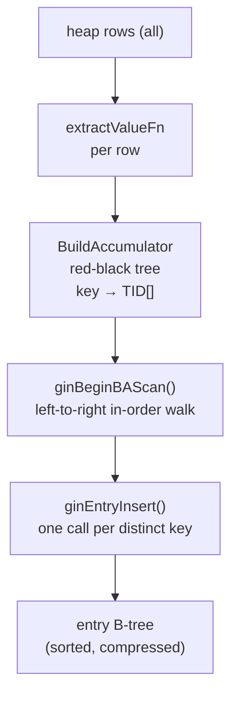
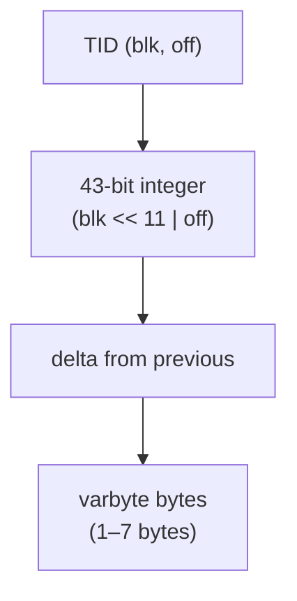

GIN's internal design makes two interrelated optimizations central to its efficiency: a bulk-build accumulator that avoids touching the B-tree once per indexed row, and a compressed posting-list encoding that stores thousands of heap TIDs per key in a compact variable-length format. These mechanisms explain why GIN can index a JSONB column with hundreds of common keys across millions of rows without either index-build time or storage cost becoming prohibitive. A third, complementary design — the consistency function contract — decouples key retrieval from query matching during scans, allowing GIN to remain generic across wildly different operator classes.

## Bulk Build Accumulator

Building a GIN index with `CREATE INDEX` involves decomposing every heap row into its constituent keys and recording which rows contain each key. Doing this naively — inserting each `(key, TID)` pair into the entry B-tree one at a time — would produce one B-tree descent and one page write per key extraction, at a cost proportional to `nrows × keys_per_row`. For a JSONB column with ten keys per document, that is ten B-tree insertions per row, each of which may cause a page split and WAL record.

The bulk-build path avoids this by accumulating all `(key, TID)` pairs in memory first. The `BuildAccumulator` (`ginbulk.c`) wraps a red-black tree (`rbtree.c`) whose nodes are `GinEntryAccumulator` structs, one per distinct `(attnum, key)` pair. Each node maintains a dynamically-growing `ItemPointerData` array holding every TID seen for that key so far. When a new TID arrives for a key that already has a node, the `ginCombineData` combiner appends the TID to the existing array. It doubles the array's capacity whenever it fills up. No B-tree page is touched during this phase.

When the accumulator's memory footprint exceeds `maintenance_work_mem`, it is flushed. `ginBeginBAScan()` starts an in-order walk of the red-black tree. `ginGetBAEntry()` then returns each distinct key together with its sorted TID list. Each returned entry is written to the entry B-tree with a single `ginEntryInsert()` call. Because the walk visits keys in their B-tree sort order, every insertion goes to the rightmost leaf of the current subtree. This produces a nearly-sequential write pattern with minimal page splits. After the flush, the accumulator is reset. Scanning then continues from where the heap left off.

The red-black tree insertion order is deliberately randomized for keys extracted from one row. Inserting sorted values into a binary search tree produces a degenerate chain. `ginInsertBAEntries()` (`ginbulk.c`) instead inserts entries in a level-order pattern — first the midpoint, then midpoints of each half, recursively. This produces a nearly-balanced tree even when the input is sorted (`ginInsertBAEntries()`, `ginbulk.c`).

The `shouldSort` flag on each accumulator node records whether TIDs arrived out of order. TIDs generally arrive in heap order, because the build scans the heap sequentially. So most nodes never need sorting. When a node does have `shouldSort` set, `ginGetBAEntry()` calls `qsort` on the TID array before returning it. The sorted array is then passed directly to `ginCompressPostingList()` for encoding.

## Posting List Compression

GIN stores each key's TID set as a `GinPostingList` — a compact, variable-length byte string. The first TID is stored verbatim as an uncompressed `ItemPointerData`. Every subsequent TID is represented as the *delta* from the previous TID. That delta is encoded in varbyte (also called variable-byte or group-varint) format.

A TID is first converted to a 43-bit unsigned integer: the 32-bit block number occupies the high bits, and the 11-bit offset number occupies the low bits. Eleven bits is enough for any offset number, because `MaxHeapTuplesPerPage < 2^11` on all supported block sizes. Keeping the offset in the low bits means that consecutive tuples on the same block produce very small deltas. The varbyte encoding then uses 7 bits of each byte for data, with the high bit as a continuation flag. A delta less than 128 fits in one byte. A delta spanning one block boundary requires at most two or three bytes. In the worst case — a TID spanning the full 32-bit block range — a delta needs 7 bytes (`ginpostinglist.c`).

The choice of delta encoding has an important property for [[subsystems/indexes/gin|GIN index internals]] VACUUM: removing a TID from a posting list never increases its encoded size. When a TID is removed, its successor's delta is replaced by the sum of the two deltas. A sum of two numbers is at most one bit wider than the larger summand. Widening by one bit grows the varbyte encoding by at most one byte. But the removed entry itself occupied at least one byte, so the total size is non-increasing. VACUUM can therefore reconstruct a smaller posting list on the same page without risking overflow (`ginpostinglist.c`, encoding comment).

Encoding is done by `ginCompressPostingList()`. It accepts an array of sorted `ItemPointer` values and a maximum byte budget, fills the `GinPostingList` struct up to the budget, and reports how many items it encoded. If not all items fit, the caller is expected to write the remainder into a subsequent posting-list segment. Decoding reverses the process: `ginPostingListDecodeAllSegments()` walks a chain of segments, accumulating the running sum and converting each integer back to a TID pair.

For a JSONB column where every document contains the key `"type"`, a million-row table might have a million TIDs for that single key. In sorted heap order the average delta between consecutive TIDs is tiny — often just an offset increment within the same page — so in practice most deltas encode in one or two bytes. The same million TIDs that would require 6 MB as raw `ItemPointerData` arrays compress to well under 2 MB in a posting list.

## Consistency Functions

During a GIN scan, finding which TIDs match a given query is a two-stage process. The first stage retrieves candidate TIDs from the posting lists for each extracted query key. The second stage determines whether those candidates actually satisfy the original query expression. GIN handles the first stage itself, but delegates the second stage entirely to the operator class through the consistency function contract.

The separation exists because GIN is generic: it does not understand the semantics of `@@` (text search), `@>` (JSONB containment), or `&&` (array overlap). All GIN knows is that `extractQueryFn` returned a set of keys, and that each key either matched some candidate TID or did not. The consistency function receives that binary vector and decides whether the tuple satisfies the query.

Two variants of the function exist. The boolean `GinConsistentFn` receives an array of `bool` values (`entryRes[]`), one per extracted query key, where `true` means the key was found in the index for this TID. It returns `true` if the tuple should be returned, optionally setting `recheckCurItem` to demand that the heap tuple be re-evaluated by the executor. The ternary `GinTriconsistentFn` receives `GinTernaryValue` values that can be `GIN_TRUE`, `GIN_FALSE`, or `GIN_MAYBE`. `GIN_MAYBE` arises when GIN cannot determine whether a key matches — for example, during a scan of a posting-tree page where only a range of TIDs has been loaded. In that case, the function can return `GIN_MAYBE` to mean "could match, needs recheck" (`ginlogic.c`).

An operator class need only implement one of the two variants. `ginInitConsistentFunction()` (`ginlogic.c`) sets up shims in both directions. If only the boolean function is provided, the ternary shim (`shimTriConsistentFn`) calls the boolean function with all `GIN_MAYBE` inputs replaced by every combination of `true`/`false` (up to four MAYBE inputs — more than that and the shim gives up and returns `GIN_MAYBE`). If only the ternary function is provided, the boolean shim calls it and maps `GIN_MAYBE` to `true` with `recheckCurItem = true`.

The practical consequence for query planning is that providing `GinTriconsistentFn` lets GIN skip heap fetches for candidates it can definitively reject at the index level. This reduces the number of rows the executor must re-evaluate. For high-selectivity queries over large posting lists this distinction meaningfully affects query latency.

## Opclass Validation

When `CREATE OPERATOR CLASS` or `ALTER OPERATOR FAMILY` is called, `ginvalidate()` (`ginvalidate.c`) checks that the opclass is internally consistent. The two truly required support functions are `GIN_EXTRACTVALUE_PROC` (proc 2) and `GIN_EXTRACTQUERY_PROC` (proc 3), which must always be present. Without them, GIN cannot decompose indexed values or query values into keys at all. `GIN_COMPARE_PROC` (proc 1) is optional because many opclasses use the default `btree`-style comparison on the key type. `GIN_COMPARE_PARTIAL_PROC` (proc 5) is optional and only needed for prefix or range key matching. The options function `GIN_OPTIONS_PROC` (proc 7) is optional.

For consistency functions, at least one of `GIN_CONSISTENT_PROC` (proc 4) or `GIN_TRICONSISTENT_PROC` (proc 6) must be present. Both are optional individually, because the shim layer bridges between them. Providing neither is an error.

The validator also checks that operator strategy numbers fall in the range 1–63. GIN does not define semantics for specific strategy numbers — those are opclass conventions — but it enforces an upper bound. It also checks that all operators are search operators rather than ORDER BY operators (GIN has no ordered-scan capability), and that support function signatures match their expected argument and return types.

## Related Topics

- [[subsystems/indexes/gin|GIN index internals]] — insert path, pending list, scan path, VACUUM, and physical page structure
- [[subsystems/indexes/jsonb-gin|JSONB GIN indexing]] — how the JSONB opclass uses these mechanisms
- [[subsystems/full-text-search|full-text search]] — `tsvector`/`tsquery` GIN operator class
