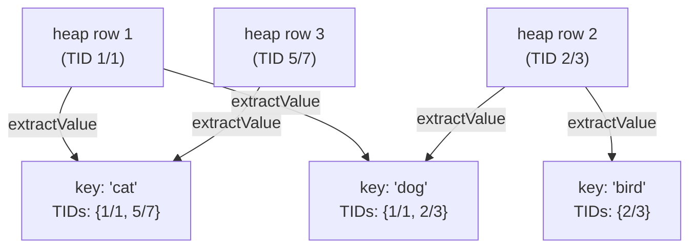
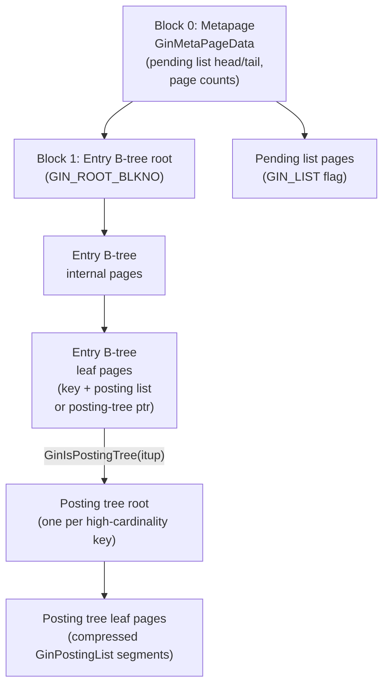
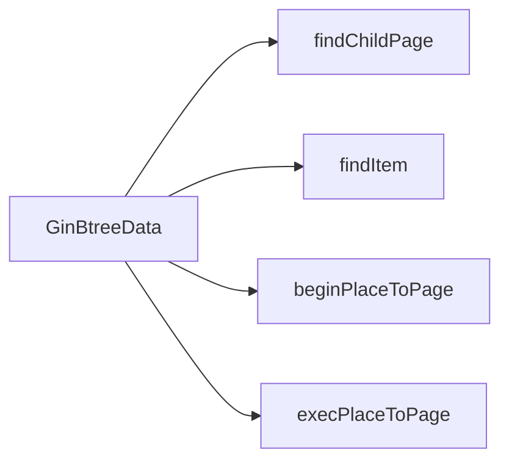
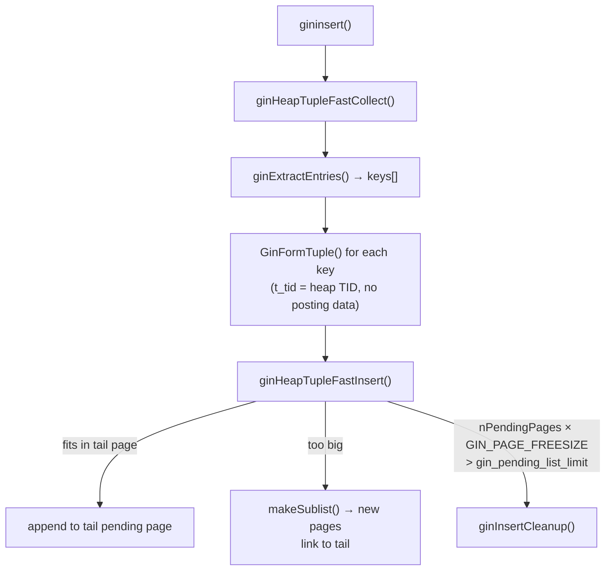
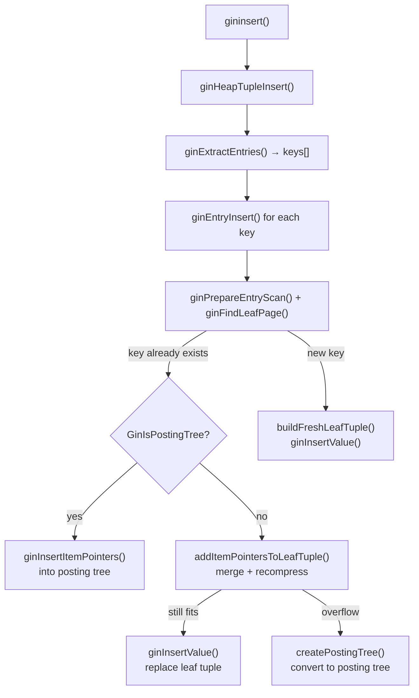
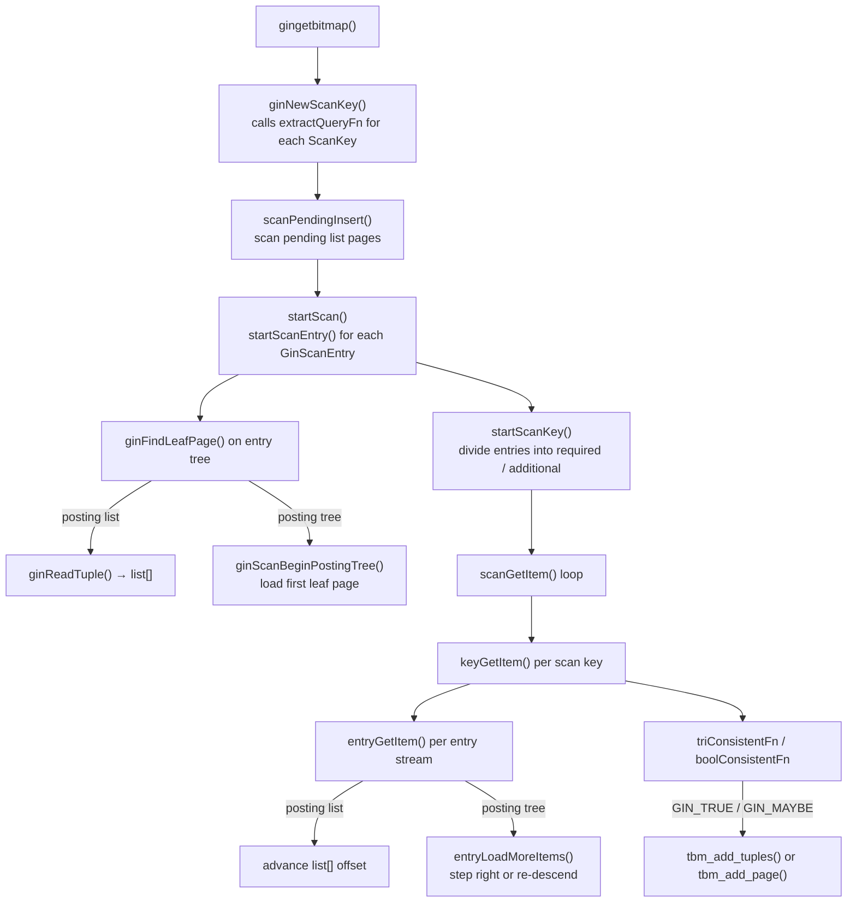

# GIN Index Internals

GIN (Generalized Inverted Index) is PostgreSQL's access method for indexing composite values — values that contain multiple *keys* — and answering containment queries efficiently. Where a [[subsystems/indexes/btree]] maps each whole row value to a set of TIDs, a GIN index inverts the relationship: it maps each *key extracted from a value* to the set of heap TIDs whose rows contain that key.

Canonical use cases:

- Full-text search: `tsvector` columns, where each lexeme is a key.
- JSONB containment (`@>`), where each top-level key/value pair is a key.
- Array containment (`@>`, `&&`), where each array element is a key.
- `hstore`, `ltree`, `intarray`, and similar extension types.

## The Core Concept: Inverted Index



Each leaf page of the GIN entry tree holds a `(key, posting)` pair. The posting is either a compressed inline list of TIDs (a *posting list*) or, when cardinality exceeds what fits on a page, a pointer to a separate B-tree of TIDs (a *posting tree*).

## Operator Class Interface

GIN delegates key extraction and query interpretation to the operator class. The support functions are stored in `GinState` (`src/include/access/gin_private.h`) per index column:

| Proc number | Field in `GinState` | Role |
|---|---|---|
| `GIN_COMPARE_PROC` (1) | `compareFn` | Compare two keys; drives B-tree ordering |
| `GIN_EXTRACTVALUE_PROC` (2) | `extractValueFn` | Decompose an indexed value into an array of keys |
| `GIN_EXTRACTQUERY_PROC` (3) | `extractQueryFn` | Decompose a query value into keys + strategy + search mode |
| `GIN_CONSISTENT_PROC` (4) | `consistentFn` | Given a boolean array of key-match results, decide if the original row satisfies the query |
| `GIN_COMPARE_PARTIAL_PROC` (5) | `comparePartialFn` | For prefix/range queries: compare a query key against an index key to decide if scanning should continue |
| `GIN_TRICONSISTENT_PROC` (6) | `triConsistentFn` | Ternary variant of `consistent` (`GIN_TRUE`/`GIN_FALSE`/`GIN_MAYBE`) used during index-only checks |

`extractQueryFn` also returns a `searchMode` flag:

- `GIN_SEARCH_MODE_DEFAULT` — only keys returned by `extractQueryFn` are scanned.
- `GIN_SEARCH_MODE_INCLUDE_EMPTY` — also match rows that had no keys extracted (empty items).
- `GIN_SEARCH_MODE_ALL` — scan every non-null key in the index (full-index scan over one column).

Source: `src/include/access/gin.h`, lines 22–37.

## Physical Index Structure

A GIN index file contains three categories of pages:



### Page Flags

All GIN pages carry a `GinPageOpaqueData` trailer (`src/include/access/ginblock.h`, line 31) whose `flags` field marks the page's role — entry vs. data page, leaf, metapage, pending-list page, deleted, or mid-split. See [[subsystems/indexes/gin-entry-and-wal|GIN Entry Page Management and WAL]] for the full flag reference.

### The Metapage (`GinMetaPageData`)

Always block 0. Tracks the pending list (`head`, `tail`, `tailFreeSize`, `nPendingPages`, `nPendingHeapTuples`) and planner statistics (`nTotalPages`, `nEntryPages`, `nDataPages`, `nEntries`). Source: `src/include/access/ginblock.h`, line 56.

### Entry Tree

The entry B-tree (root always at block 1, `GIN_ROOT_BLKNO`) holds one tuple per distinct key. Leaf tuples encode:

- The key value (the index column datum or, in multi-column indexes, a `(int2 attnum, keytype)` pair).
- A `GinNullCategory` byte distinguishing normal keys from NULL keys and empty/null item placeholders.
- Either: a compressed `GinPostingList` sequence of TIDs stored directly in the tuple (the *posting list* path), or a block number pointing to the root of a separate *posting tree* (the `GinIsPostingTree` path, signalled by `t_tid.ip_posid == GIN_TREE_POSTING == 0xffff`).

Source: `src/include/access/ginblock.h`, lines 229–258.

Internal entry-tree pages hold downlinks in the same `IndexTuple` format, with `t_tid.ip_blkid` holding the child block number (`GinGetDownlink`).

### Posting List (inline)

When cardinality is low enough, TIDs are encoded as a `GinPostingList` structure directly in the leaf tuple:

```c
typedef struct {
    ItemPointerData first;   /* first TID, stored uncompressed */
    uint16          nbytes;  /* byte length of varbyte-encoded deltas */
    unsigned char   bytes[]; /* varbyte-encoded delta-compressed TIDs */
} GinPostingList;
```

Source: `src/include/access/ginblock.h`, line 337. Multiple `GinPostingList` segments may be packed sequentially on a single posting-tree leaf page.

When a posting list grows too large to fit within `GinMaxItemSize` bytes after merging new TIDs, the leaf tuple is promoted to a posting tree. The compressed list is moved into a new B-tree, and the leaf tuple is rebuilt to contain only the root block number. The threshold is checked during every leaf-tuple update (`addItemPointersToLeafTuple()`, `gininsert.c`).

### Posting Tree

A posting tree is itself a B-tree (`GIN_DATA` pages) keyed on `ItemPointerData`. Its structure mirrors the entry B-tree but stores `PostingItem` records on internal pages:

```c
typedef struct {
    BlockIdData child_blkno;
    ItemPointerData key;   /* smallest TID on child subtree */
} PostingItem;
```

Source: `src/include/access/ginblock.h`, line 184. Leaf pages store one or more `GinPostingList` segments. The `GIN_COMPRESSED` flag distinguishes newer compressed leaves from pre-9.4 uncompressed pages.

#### Posting-tree leaf page management

Leaf pages of the posting tree are not a simple array of `GinPostingList` structs — they are managed as a sequence of variable-length compressed segments, each constrained to fall within defined size bounds (`gindatapage.c`):

| Constant | Value | Meaning |
|---|---|---|
| `GinPostingListSegmentMinSize` | 128 bytes | Merge with next segment if smaller |
| `GinPostingListSegmentTargetSize` | 256 bytes | Desired size after repack |
| `GinPostingListSegmentMaxSize` | 384 bytes | Split into two segments if larger |

When TIDs are inserted into a posting-tree leaf, the page is first *disassembled*: all its on-disk segments are read into a linked list of `leafSegmentInfo` nodes (the `disassembledLeaf` working struct) held in backend-local memory. New TIDs are merged into the appropriate segment. This may trigger a split (segment > max) or a merge (segment < min). The updated list is then *repacked* by `leafRepackItems()`. This function regenerates compressed segments and, if the data no longer fits, distributes them across the current page and a potential new right-sibling page.

The repack step produces a WAL description that records only the changed segments rather than a full page image. This keeps WAL volume low for incremental insertions (`computeLeafRecompressWALData()`). Full-page images are written only on the first modification after a checkpoint, as with any other page type.

Reading TIDs from a leaf page decodes the entire page's segments in order: `GinDataLeafPageGetItems()` iterates through the `GinPostingList` chain, decompresses each segment's varbyte-encoded deltas, and returns the TIDs as an `ItemPointer` array. `GinDataLeafPageGetItemsToTbm()` adds them directly to a `TIDBitmap` during a scan, avoiding an intermediate array allocation for large result sets.

## Shared B-tree Engine

Both the entry tree and the posting tree are driven by the same traversal engine rather than duplicating B-tree logic. `GinBtreeData` (`gin_private.h`) is a vtable-style struct. Its function pointers are populated differently depending on which tree is being operated on, so a single descent-and-split-propagation implementation can serve both structures:



Descending from root to leaf follows `findChildPage` at each internal level. The traversal handles concurrent-split safety by checking `isMoveRight` and stepping right when needed (`ginFindLeafPage()`, `ginbtree.c`). In search mode, the traversal discards the path after reaching the leaf. In insert mode, it retains a `GinBtreeStack` chain so a page split can propagate its downlink upward without re-descending (`ginInsertValue()`, `ginbtree.c`).

## Insert Path

### Fast inserts via the pending list



With `gin_fastupdate` enabled (the default), inserts avoid touching the main B-tree entirely. Each indexed value is decomposed into keys via `extractValueFn`. Each key is then wrapped into a minimal `IndexTuple` whose `t_tid` holds the heap TID — no posting data, just the raw mapping. All tuples for one heap row are written atomically to the *pending list*, a singly-linked chain of `GIN_LIST` pages whose head and tail are tracked in the metapage (`ginHeapTupleFastInsert()`, `ginfast.c`).

New tuples are appended to the tail page if space allows; otherwise a new sublist of pages is allocated and linked via the tail page's rightlink. After each fast insert, if the pending list has grown beyond `gin_pending_list_limit` (or the per-index `pendingListCleanupSize` reloption), a non-forced cleanup is triggered to drain the list into the main index.

This design amortizes the cost of B-tree insertions. A key that appears in many rows is accumulated in the pending list. It is then inserted into the entry B-tree in one operation per cleanup cycle, rather than once per row.

### Direct inserts into the entry B-tree



With `fastupdate` disabled, each row insertion goes directly into the main entry B-tree. For each extracted key, GIN navigates the entry B-tree to the correct leaf (`ginEntryInsert()`, `gininsert.c`). If the key already exists, the existing leaf tuple's TID list is merged with the new TID and recompressed. If the merged result no longer fits in the leaf tuple, the posting list is promoted to a posting tree. New keys produce a fresh leaf tuple immediately. The direct path provides predictable per-insert latency at the cost of higher average insert overhead.

## Pending List Cleanup

Draining the pending list into the main index is the central background operation that makes `fastupdate` practical. Cleanup is triggered in four contexts: non-forcibly from within a fast insert when the list exceeds the size threshold (using `work_mem`); forcibly during `ginbulkdelete` (VACUUM bulkdelete phase, using `maintenance_work_mem`); forcibly during `ginvacuumcleanup` when `ginbulkdelete` was not called; and on demand via `gin_clean_pending_list()` (`ginInsertCleanup()`, `ginfast.c`).

An exclusive lock on `GIN_METAPAGE_BLKNO` serializes concurrent cleanups while still permitting fast inserts to proceed. Pending pages are read sequentially. Their key→TID mappings are accumulated in a `BuildAccumulator` red-black tree. When the accumulator fills available memory, or after all pending tuples for a complete heap row have been collected, the accumulator is flushed: each distinct key is inserted into the main entry B-tree via `ginEntryInsert()`. The consumed pending pages are then unlinked and the metapage `head` pointer is advanced. This process repeats until all pages that existed at the start of cleanup have been drained.

The batching ensures that a single key appearing across many pending tuples results in exactly one entry B-tree insertion per cleanup cycle.

## Scan Path

GIN supports only bitmap scans — it does not implement `amgettuple`. A bitmap scan is the right primitive here: a single query key may match thousands of TIDs spread across many posting-tree pages. Materializing them all before returning control to the executor avoids the repeated re-entry overhead of a tuple-at-a-time interface (`gingetbitmap()`, `ginget.c`).



### Query Decomposition

Before any index pages are read, each SQL `WHERE` clause operand is decomposed by `extractQueryFn` into a set of index keys. The results are organized into `GinScanKeyData` structures (one per qualifier expression), each holding an array of `GinScanEntry` pointers for the individual keys extracted from that query value. Source: `src/include/access/gin_private.h`, lines 267–333.

### Required vs Additional Entries

The scan engine divides the entries of each scan key into *required* entries and *additional* entries. Required entries are those where at least one must match for the row to be a candidate at all. Additional entries are needed by `consistentFn` to make the final accept/reject decision, but a miss on an additional entry does not rule out the row. Entries are sorted by estimated match frequency (`predictNumberResult`), so the rarest required term drives forward progress. This lets the engine skip large TID ranges efficiently (`startScanKey()`, `ginget.c`).

### Entry Stream Traversal

Each scan entry is initialized by locating its leaf position in the entry B-tree. For entries with an inline posting list, all TIDs are decoded immediately into an in-memory array. For entries backed by a posting tree, only the leftmost leaf page is loaded initially. Additional pages are fetched on demand as the scan advances. The scan steps right through the leaf level, or re-descends from the posting-tree root when skipping ahead to a specific TID (`startScanEntry()` and `entryLoadMoreItems()`, `ginget.c`).

For partial-match queries (`isPartialMatch = true`) and `GIN_SEARCH_MODE_ALL/EVERYTHING` scans, the entry tree is traversed forward from the first matching key. All matching TIDs are accumulated into a `TIDBitmap` before the main scan loop runs (`collectMatchBitmap()`).

### Pending List Scan

The pending list must be scanned before the main index, not after. Each pending page is walked. Binary search is used within the page to test each heap row's keys against the query's scan entries. Matched TIDs are added to the bitmap. A row that appears in both the pending list and the main index — possible after a concurrent cleanup — simply sets the same bitmap bit twice, which is harmless. This duplicate-safe property is also why GIN cannot support `amgettuple`: there is no way to guarantee exactly-once delivery of TIDs from two independent streams.

### Result Combination

All scan key streams are advanced in lock-step to find the smallest TID that satisfies every key simultaneously. For each candidate TID, the `triConsistentFn` is evaluated with the current entry match flags (`GIN_TRUE`/`GIN_FALSE`/`GIN_MAYBE`). A `GIN_MAYBE` result or a lossy-page pointer causes `recheck = true` to be set, requiring the executor to re-evaluate the original predicate against the heap row (`scanGetItem()`, `ginget.c`).

## VACUUM

### Dead TID Removal

VACUUM's first pass over GIN flushes the pending list with a forced cleanup (using `maintenance_work_mem`), then scans all entry-tree leaf pages left to right. For each leaf tuple backed by an inline posting list, dead TIDs identified by VACUUM's callback are filtered out. The compressed tuple is then rebuilt. For leaf tuples backed by a posting tree, the root block number is recorded and processed separately: posting-tree leaf pages are swept to remove dead TIDs, and any posting-tree pages left empty are unlinked (`ginbulkdelete()`, `ginvacuum.c`).

### Statistics and Page Recycling

After the dead-TID pass, a second phase rescans all index pages to recount `nTotalPages`, `nEntryPages`, `nDataPages`, and `nEntries` for the metapage, records recyclable pages in the [[subsystems/storage/fsm|FSM]], and vacuums the FSM. If `ginbulkdelete` was not called (analyze-only mode), the pending list is flushed here instead (`ginvacuumcleanup()`, `ginvacuum.c`).

Deleted pages are safe to recycle only when no transaction that could have seen the page before deletion is still running. The delete XID is stored in `pd_prune_xid` and checked via `GlobalVisCheckRemovableXid()` in `GinPageIsRecyclable()`.

## GIN vs B-tree: When to Use Which

| Criterion | GIN | [[subsystems/indexes/btree]] |
|---|---|---|
| Query type | Containment, `@@`, `?`, `@>`, `&&` | Equality, range (`<`, `>`, `BETWEEN`) |
| Value type | Composite (array, tsvector, jsonb) | Scalar |
| Insert cost | High (key extraction + B-tree insertions per key) | Low (one insertion per row) |
| `fastupdate` | Amortizes insert cost via pending list | Not applicable |
| Scan output | Bitmap only; always requires recheck or exact match via `consistent` | Can return exact ordered TIDs |
| NULL handling | Explicit `GIN_CAT_NULL_*` categories; supports `IS NULL` searches | Standard null handling |
| Multi-key queries | Efficient: one posting-list lookup per key, then intersect | Require composite index or multiple index scans |

The general rule: use GIN when queries ask "does this composite value contain element X?" and B-tree for "is this scalar value in range [a, b]?".

## Build Path (Bulk Load)

Bulk index creation bypasses the pending list entirely. Keys extracted from all heap rows are sorted in memory using a `BuildAccumulator` — a red-black tree of `GinEntryAccumulator` nodes keyed by `(attnum, key)`. When the accumulator fills `maintenance_work_mem`, the sorted entries are flushed to the index in bulk via `ginEntryInsert()`. Because each key's complete posting list is assembled before being written to the B-tree, bulk builds are substantially faster than row-by-row insertion (`ginbuild()`, `gininsert.c`).

**PostgreSQL 18:** GIN indexes can now be built using parallel workers. Previously, only B-tree, hash, and BRIN supported parallel index creation; GIN was serial regardless of `max_parallel_maintenance_workers`. Parallelism applies to the main index construction phase — heap scanning and key accumulation are distributed across workers — while the pending list merge at the end of the build remains serial. This substantially reduces build time for large GIN indexes on multi-core systems.

## Key Data Structures Summary

| Structure | File | Purpose |
|---|---|---|
| `GinState` | `gin_private.h:56` | Per-index opclass function pointers and tuple descriptors |
| `GinBtreeData` | `gin_private.h:149` | Polymorphic B-tree engine; used for both entry tree and posting tree |
| `GinBtreeStack` | `gin_private.h:128` | Path from root to current page during traversal |
| `GinMetaPageData` | `ginblock.h:56` | Block 0: pending list pointers + planner stats |
| `GinPageOpaqueData` | `ginblock.h:30` | Per-page trailer: rightlink, flags, maxoff |
| `GinPostingList` | `ginblock.h:337` | Compressed (varbyte delta) TID segment |
| `PostingItem` | `ginblock.h:184` | Entry on posting-tree internal pages: child block + min TID |
| `GinScanKeyData` | `gin_private.h:267` | One query qualifier; holds entry array + consistency state |
| `GinScanEntryData` | `gin_private.h:335` | One extracted query key + current position in its posting stream |
| `GinTupleCollector` | `gin_private.h:452` | Accumulates index tuples for one heap row before fast insert |
| `GinEntryAccumulator` | `gin_private.h:418` | Node in the bulk-build red-black tree |
| `GinOptions` | `gin_private.h:25` | Storage for `fastupdate` and `pendingListCleanupSize` reloptions |

## Related Topics

- [[subsystems/indexes/gin-entry-and-wal|GIN Entry and WAL]] — details the WAL record format for GIN entry-tree and posting-tree modifications, complementing the insert and vacuum paths described here.
- [[subsystems/indexes/gin-build-posting-lists|GIN Build: Posting Lists]] — covers how `BuildAccumulator` assembles posting lists during bulk index creation, extending the build-path discussion above.
- [[subsystems/indexes/jsonb-gin|JSONB GIN Operator Class]] — shows how the `jsonb_ops` and `jsonb_path_ops` operator classes implement `extractValue` and `consistent` on top of the GIN interface described here.
- [[subsystems/full-text-search|Full-Text Search]] — explains how `tsvector` and `tsquery` are stored and matched, one of GIN's primary use cases.
- [[subsystems/indexes/index-am|Index Access Method Interface]] — documents the generic `IndexAmRoutine` contract that GIN implements, providing the broader context for GIN's `aminsert`, `amgetbitmap`, and `ambulkdelete` entry points.
- [[subsystems/executor/bitmap-and-or|Bitmap AND/OR Nodes]] — describes how the executor combines multiple GIN bitmap scans using `BitmapAnd` and `BitmapOr` nodes, which is the only way GIN results are consumed.
- [[subsystems/indexes/index-maintenance|Index Maintenance]] — covers HOT updates, fillfactor, and the general lifecycle of index pages that applies to GIN alongside other access methods.
- [[subsystems/indexes/btree|B-tree Indexes]] — the B-tree that underlies GIN's own entry-tree and posting-tree structure.
- [[code-paths/index-scan|Index Scan Code Path]] — how the executor drives the bitmap index scans that GIN's `amgetbitmap` interface produces.
- [[code-paths/vacuum|VACUUM Code Path]] — how VACUUM orchestrates the `ginbulkdelete` and `ginvacuumcleanup` phases described above.
