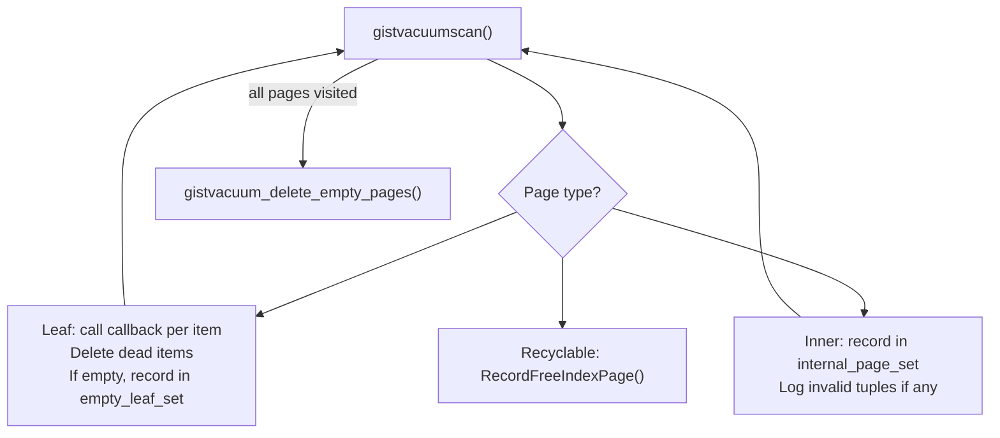

# GiST Scan State and Vacuum

[[subsystems/indexes/gist|GiST index]] covers the overall tree structure, the operator class contract, and the insert and build paths. This page focuses on the scan machinery: how a GiST index traversal is set up and driven, why it requires a priority queue rather than a simple descent, and how ordered (KNN) searches fit naturally into the same framework. It also covers the two-pass vacuum process that removes dead entries and reclaims empty pages.

## Scan state: why a queue is necessary

A B-tree scan is deterministic: the tree is totally ordered, so a range scan descends to the leftmost matching leaf and then follows a linked list of sibling pages. GiST makes no such guarantee. The tree is balanced but not ordered in any total sense. Inner-node keys are bounding predicates that may overlap, and the correct answer to a query might be scattered across many subtrees. Any branch that the `consistent()` callback cannot definitively rule out must be explored.

The correct model is a traversal that maintains a queue of pages yet to be visited. When a page is dequeued and read, each of its entries is tested with `consistent()`; entries that pass are enqueued for further exploration (index pages) or returned to the executor (leaf entries). This is not depth-first in general, and it is not breadth-first either — for ordered searches, the queue is ordered by distance and the traversal naturally becomes best-first.

The queue is a pairing heap (`GISTScanOpaqueData.queue`, `gist_private.h`), which provides O(log n) insert and O(log n) delete-min. For non-ordered searches, all entries are treated as having equal priority, but the heap still enforces that heap tuples (leaves already qualified) are returned before unvisited index pages. This ensures a depth-first flavour that terminates early under `LIMIT`.

## GISTScanOpaqueData

`GISTScanOpaqueData` (`gist_private.h`) is the private state attached to every GiST scan descriptor:

```c
typedef struct GISTScanOpaqueData
{
    GISTSTATE  *giststate;      /* cached opclass function info */
    Oid        *orderByTypes;   /* return types of ORDER BY expressions */

    pairingheap *queue;         /* unvisited items, ordered by distance */
    MemoryContext queueCxt;     /* memory context for the queue */
    bool        qual_ok;        /* false if quals can never be satisfied */
    bool        firstCall;

    IndexOrderByDistance *distances;  /* workspace for distance computation */
    OffsetNumber *killedItems;        /* LP_DEAD candidates */
    int          numKilled;
    BlockNumber  curBlkno;
    GistNSN      curPageLSN;

    /* non-ordered scan: buffer for results from one page */
    GISTSearchHeapItem pageData[BLCKSZ / sizeof(IndexTupleData)];
    OffsetNumber nPageData;
    OffsetNumber curPageData;
    MemoryContext pageDataCxt;
} GISTScanOpaqueData;
```

`GISTSTATE` caches all opclass support functions (one `FmgrInfo` per support function per index column), the two [memory contexts](subsystems/memory/contexts), and the tuple descriptors for leaf pages, inner pages, and index-only scan output. It is initialized once per scan by `initGISTstate()` and freed by `freeGISTstate()` in `gistendscan()`.

`queue` and `queueCxt` are managed together. The first call to `gistrescan()` allocates the queue in the scan's main `scanCxt`. Subsequent calls (rescans) create a separate `queueCxt` that can be reset cleanly without disturbing the rest of the scan state. This avoids [memory context](subsystems/memory/contexts) overhead in the common case where a scan is never rescanned.

## Initialisation: gistbeginscan and gistrescan

`gistbeginscan()` (`gistscan.c`) builds the `GISTSTATE` and allocates the `GISTScanOpaqueData`, but defers queue creation and scan-key processing to `gistrescan()`. This split matches the executor's API: `beginscan` creates the descriptor, `rescan` sets the actual predicates.

In `gistrescan()`, the scan keys are rewritten so that each key's function pointer is replaced by the corresponding `consistent()` function from `GISTSTATE.consistentFn`. The original operator's strategy number is preserved in `sk_strategy` and passed through to `consistent()` at call time, so the opclass knows which predicate to evaluate. Order-by keys receive analogous treatment: their function pointers are replaced by the `distance()` functions from `GISTSTATE.distanceFn`.

A NULL scan key with neither `SK_SEARCHNULL` nor `SK_SEARCHNOTNULL` set causes `qual_ok` to be set to `false`, short-circuiting the scan entirely on the first call to `gistgettuple()`. This reflects the assumption that all indexable GiST operators are strict with respect to NULL.

## Ordered (KNN) scans

When a query includes `ORDER BY <distance_operator>(<column>, <constant>)` and the opclass supplies a `distance()` support function (`GIST_DISTANCE_PROC`), the GiST scan becomes a best-first nearest-neighbour search without any changes to the traversal algorithm. The queue ordering, which is neutral for regular scans, now becomes load-bearing.

Each `GISTSearchItem` carries a `distances[]` array:

```c
typedef struct GISTSearchItem
{
    pairingheap_node  phNode;
    BlockNumber       blkno;        /* InvalidBlockNumber for heap tuples */
    union {
        GistNSN       parentlsn;    /* for index pages: split detection */
        GISTSearchHeapItem heap;    /* for leaf tuples: TID and recheck flags */
    } data;
    IndexOrderByDistance distances[FLEXIBLE_ARRAY_MEMBER];
} GISTSearchItem;
```

For an index page, `distances[i].value` holds the lower bound on the true distance returned by the opclass's `distance()` function for that page's bounding predicate. For a heap tuple (leaf page entry), it holds the distance to the actual indexed value. The pairing heap comparison function (`pairingheap_GISTSearchItem_cmp()`, `gistscan.c`) orders items so that smaller distances come out first. It also breaks ties by placing heap tuples before index pages. This ensures that if a qualified heap tuple and an unexplored page have the same distance bound, the heap tuple is returned first.

The consequence is automatic pruning: once the heap tuple at the front of the queue has distance `d`, any index page with distance bound `> d` can never contain a closer result and need never be dequeued. This is the Hjaltason–Samet incremental nearest-neighbour algorithm. It is efficient as long as `distance()` returns a tight lower bound. When the lower bound is loose (the opclass sets a `recheckDistances` flag), the actual distances must be recomputed from the heap. Results may then need to be re-sorted by the executor.

## Vacuum: two-pass architecture

GiST vacuum (`gistvacuum.c`) is structured in two passes driven by a single physical page scan:

**Pass 1 (leaf tuple deletion):** `gistvacuumscan()` iterates over every page in physical order. For each leaf page, it calls the vacuum callback for each item — if the callback says the item is dead, it is added to a deletion list for that page. Dead items are removed with a single `gistXLogUpdate()` record per page. Any leaf page that ends up empty after deletions has its block number recorded in `vstate.empty_leaf_set`. All inner pages have their block numbers recorded in `vstate.internal_page_set`.



**Pass 2 (empty page deletion):** `gistvacuum_delete_empty_pages()` iterates over the recorded internal pages looking for downlinks that point to members of `empty_leaf_set`. For each such downlink, it attempts to delete the child page and remove the downlink from the parent.

Page deletion requires holding locks on both parent and child simultaneously. To avoid deadlock (child must be locked before parent in the standard lock ordering), the code releases the parent lock, acquires the child lock, then re-acquires the parent lock before proceeding. Because the downlink might have moved during the gap, `gistdeletepage()` re-validates that the parent still contains the expected downlink before modifying anything. If validation fails — because a concurrent insert moved the downlink, or a concurrent insert added tuples to the leaf — the deletion is silently abandoned; the next VACUUM will retry.

A deleted leaf page is stamped with the current next `FullTransactionId` via `GistPageSetDeleted()`. The page cannot be recycled until that XID becomes older than `GlobalXmin`. This ensures that in-progress scans that already read the page's downlink cannot follow a stale pointer into a recycled page. This is the same mechanism used by [[subsystems/indexes/btree]] for deleted pages.

One important constraint: the last downlink in an inner page is never deleted. Removing it would leave the parent with no child. This would confuse the insertion code, which expects every inner page to have at least one downlink.

## The NSN split-detection check

During the page scan, some leaf pages may have split since the vacuum started. Such a split can move tuples to a lower-numbered right sibling that the scan has already passed. The code detects this by comparing `vstate.startNSN` (the NSN recorded at vacuum start) against `GistPageGetNSN(page)`. If the page's NSN is greater than `startNSN` and the rightlink points to a lower-numbered page, `gistvacuumpage()` recurses to that page before continuing (`gistvacuumpage()`, `gistvacuum.c`). This prevents the vacuum from missing dead tuples that were moved by a split occurring concurrently with the vacuum scan.

## Deferred leaf pruning

GiST leaf pages set `F_HAS_GARBAGE` when they contain items marked `LP_DEAD` but not yet physically removed. These items are pruned opportunistically by `gistprunepage()` during an insertion that finds the leaf full — before deciding that a page split is necessary. This amortises cleanup work across insertions and avoids unnecessary page splits when dead space is available.

The GiST vacuum does not mark items `LP_DEAD` itself; that flag is used to communicate between index scans (which spot dead items during a scan) and the next insertion or vacuum that touches the same page. BRIN, by contrast, has no per-tuple index entries and handles this differently; see [[subsystems/indexes/brin|BRIN index internals]].

## Opclass validation

`gistvalidate()` (`gistvalidate.c`) is invoked by `ALTER EXTENSION`, `CREATE OPERATOR CLASS`, and related commands to verify that a GiST opfamily is internally consistent. Its checks fall into three categories.

**Support function signatures.** For the opclass's own input type, each registered support function must match the expected signature. The required functions — `consistent` (proc 1), `union` (proc 2), `penalty` (proc 5), `picksplit` (proc 6), and `equal` (proc 7) — are verified with `check_amproc_signature()`. The optional functions — `compress` (3), `decompress` (4), `distance` (8), `fetch` (9), `options` (10), `sortsupport` (11) — are also verified when present, but their absence does not cause a validation failure. Support function numbers outside 1–11 are rejected unconditionally.

**Operator constraints.** Search operators must return `bool` and have matching argument types. ORDER BY operators are permitted — unlike BRIN, which rejects them — but only if a `distance` support function is also registered for the same type. The operator's result type must also be compatible with the declared sort opfamily.

**Completeness.** `gistvalidate()` checks that the named opclass has all five required support functions. Cross-type operator groups within the opfamily receive lighter scrutiny. GiST opfamilies legitimately contain operators that are binary-compatible with the opclass type, and such groups may have empty function sets. The validation does not attempt to enumerate expected strategies, because GiST opclasses are "a law unto themselves" in the strategy numbers they use — different opclasses for different data types use entirely different numbering schemes.

## Related Topics

- [[subsystems/indexes/gist|GiST index]]
- [[subsystems/indexes/gist-build-wal|GiST build and WAL]]
- [[subsystems/types/range-types|range types]]
