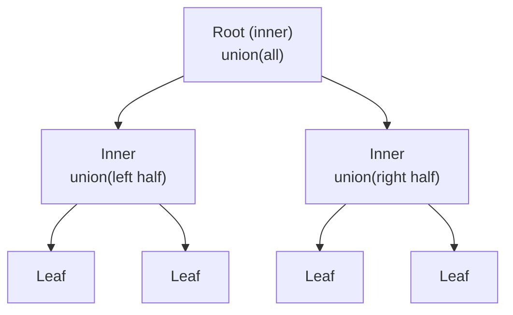

# GiST Index

The Generalized Search Tree (GiST) is not a single index algorithm — it is a balanced tree *framework* that lets user-defined data types plug in their own search predicates. Where B-tree hard-codes key comparison and range containment, GiST exposes a small set of callbacks (the *operator class contract*) and handles the generic tree mechanics itself. Any data type that can express "does this subtree possibly contain qualifying rows?" can be indexed with GiST. That property makes GiST the foundation for geometric types, range types, full-text proximity search, IP address containment, and PostGIS spatial indexing.

The framework lives in `src/backend/access/gist/`. The public API that operator class authors depend on is `src/include/access/gist.h`; the internal structures used by the access method itself are in `src/include/access/gist_private.h`.

## The operator class contract

Every GiST operator class must supply a set of support functions. The access method calls these at well-defined points; the functions supply all knowledge about the indexed data type. The constants in `gist.h` name each slot:

| Slot | Constant | Required | Purpose |
|------|----------|----------|---------|
| 1 | `GIST_CONSISTENT_PROC` | yes | Can the subtree rooted here contain any qualifying tuples? |
| 2 | `GIST_UNION_PROC` | yes | Compute the union key covering a set of entries |
| 3 | `GIST_COMPRESS_PROC` | no | Transform a value before storing it in the index |
| 4 | `GIST_DECOMPRESS_PROC` | no | Reverse a compress transformation before calling consistent |
| 5 | `GIST_PENALTY_PROC` | yes | Cost of inserting a new entry into an existing subtree |
| 6 | `GIST_PICKSPLIT_PROC` | yes | Divide a full page's entries into two groups |
| 7 | `GIST_EQUAL_PROC` | yes | Test two keys for equality (used during insertion fixup) |
| 8 | `GIST_DISTANCE_PROC` | no | Estimate distance for ORDER BY operator support |
| 9 | `GIST_FETCH_PROC` | no | Reconstruct an original value from a compressed key (index-only scans) |
| 10 | `GIST_OPTIONS_PROC` | no | Parse and validate storage options |
| 11 | `GIST_SORTSUPPORT_PROC` | no | Provide sort support for faster index builds |

The `GISTSTATE` struct caches `FmgrInfo` entries for all eleven functions across all index columns, together with the three tuple descriptors the access method needs (leaf tuples, non-leaf tuples, and index-only scan output). Every GiST operation receives a pointer to the appropriate `GISTSTATE`.

### consistent

`consistent()` is the predicate test. It receives a `GISTENTRY` (holding the index key, its page, offset, and a `leafkey` flag) plus the query argument and strategy number. On an inner page, the key is a union predicate covering all values in the subtree; the function must return `true` if the subtree *possibly* matches and `false` only if it is safe to prune the entire subtree. On a leaf page, the key represents a single indexed value.

The function also sets a `recheck` flag. When `recheck` is true, the engine knows the test was lossy — the index says "maybe", so the heap tuple must be rechecked against the original qualifier. This is how types that compress their keys (e.g., box types that store a bounding box instead of an exact polygon) still produce correct results.

### union

`union()` takes a `GistEntryVector` — a counted array of `GISTENTRY` values — and returns a single key that contains all of them. This is the GiST equivalent of B-tree's separator key, but it generalises "the maximum value in my left subtree" to "the bounding predicate of my left subtree". For geometric types, union is a bounding-box merge; for range types it is range union; for full-text it might be a merged tsvector.

The access method calls union when it needs to update an inner-node key after an insert or split changed what the subtree contains (gistunion(), gistutil.c).

### compress and decompress

Some types store a different (usually smaller) representation in the index than the original value. `compress()` converts the heap value to the indexed form; `decompress()` converts it back before `consistent()` is called. A polygon opclass might compress to its bounding box. `consistent()` then tests against that box and sets `recheck = true`, so exact polygon containment is verified against the heap. Types without compression simply omit both functions or provide identity transformations.

### penalty

Before inserting a new key, the access method must choose which subtree to descend into. `penalty()` quantifies the cost of inserting the new key into an existing subtree by comparing the new key to the union key already stored there. A lower penalty means less expansion of the union key — the subtree already covers the new value well. The function returns a `float4`. The access method (gistchoose(), gistutil.c) picks the child with the minimum penalty.

### picksplit

When a page is full, `picksplit()` divides its entries into two groups. It receives a `GistEntryVector` and fills a `GIST_SPLITVEC`:

```c
typedef struct GIST_SPLITVEC {
    OffsetNumber *spl_left;     /* entry indices going left */
    int           spl_nleft;
    Datum         spl_ldatum;   /* union key for the left group */
    bool          spl_ldatum_exists;

    OffsetNumber *spl_right;    /* entry indices going right */
    int           spl_nright;
    Datum         spl_rdatum;   /* union key for the right group */
    bool          spl_rdatum_exists;
} GIST_SPLITVEC;
```

Good `picksplit()` implementations minimise overlap between the two resulting union keys. Poor splits produce wide, overlapping bounding predicates that cause the search to follow many more branches than necessary — the GiST analogue of an unbalanced B-tree.

For multi-column indexes, the core GiST code calls `picksplit()` column by column through `gistSplitByKey()` (gistsplit.c). The `spl_ldatum_exists` / `spl_rdatum_exists` flags let `picksplit()` take into account decisions already made for earlier columns.

### distance

`distance()` supports `ORDER BY <operator>` queries — nearest-neighbour searches. It returns a `float8` lower bound on the true distance from the query point to the closest value the subtree might contain. During a scan, the access method uses a pairing heap to visit subtrees in distance order, producing results in nearest-neighbour sequence without scanning the whole index.

## Tree structure

A GiST index is a balanced tree of fixed-size pages. Every page is an 8 kB standard PostgreSQL page with a `GISTPageOpaqueData` opaque area:

```c
typedef struct GISTPageOpaqueData {
    PageGistNSN  nsn;           /* node sequence number, updated on splits */
    BlockNumber  rightlink;     /* right sibling */
    uint16       flags;
    uint16       gist_page_id;  /* 0xFF81, for pg_filedump identification */
} GISTPageOpaqueData;
```

Page flags:

| Flag | Meaning |
|------|---------|
| `F_LEAF` | Leaf page — tuples point to heap TIDs |
| `F_DELETED` | Page has been deleted and may be recycled |
| `F_TUPLES_DELETED` | Some tuples were deleted but the page has not been compacted |
| `F_FOLLOW_RIGHT` | The right sibling has no downlink yet — insertion must follow it |
| `F_HAS_GARBAGE` | Some tuples are dead but not yet removed |

**Inner nodes** hold *union keys* — one per child page. Each key is the result of calling `union()` over all values in that child's subtree. The key is a bounding predicate: if a search cannot possibly match anything inside the bounding predicate, the entire subtree is pruned.

**Leaf nodes** hold the actual indexed values (or their compressed forms) alongside heap tuple item pointers. The `leafkey` flag on a `GISTENTRY` tells `consistent()` and `compress()`/`decompress()` which representation they are dealing with.

The root is always block 0 (`GIST_ROOT_BLKNO`). A freshly created index has a single page that is simultaneously the root and a leaf; it gains inner layers as it grows.



## Search

A search walks the tree top-down using a queue of unvisited pages. For each inner-page tuple, the access method calls `gistindex_keytest()` (gistget.c), which invokes `consistent()` on the stored union key. If `consistent()` returns false, the entire subtree is skipped. If it returns true, the child page is added to the queue.

On leaf pages, `consistent()` is called against actual indexed values. If it returns true with `recheck = false`, the heap TID is returned directly to the executor. If `recheck = true`, the TID goes into the result set but is flagged for heap-level re-evaluation — the heap tuple will be fetched and the original WHERE condition re-applied.

For ordered (nearest-neighbour) scans, the queue is a pairing heap (`GISTScanOpaqueData.queue`) ordered by distance. The access method calls `distance()` for each candidate entry and inserts it at the appropriate position. Subtrees with a lower bounding distance are explored before subtrees further away. This gives exact nearest-neighbour results without exhaustive scanning. However, if `distance()` returns a lower bound (recheck = true), the final distances must be verified from the heap.

Each queue entry is a `GISTSearchItem`, carrying either a child block number or a heap pointer plus its distance data; see [[subsystems/indexes/gist-scan-vacuum|GiST Scan and Vacuum]] for the struct layout and how the pairing heap orders entries for nearest-neighbour scans.

## Insert

Inserting a tuple descends the tree by repeatedly calling `penalty()` at each inner node to choose the best child (gistchoose(), gistutil.c). The child with the smallest penalty — meaning its union key needs the least expansion to accommodate the new value — is selected. This greedy descent minimises bounding-predicate inflation, which is the key quality metric for GiST trees.

Once a leaf page is reached, the new tuple is placed there. If the leaf was already full, a split occurs. `picksplit()` divides all tuples (old plus new) into two groups. Each group goes into its own page, and a new downlink tuple is propagated up to the parent. The parent may also split if it is full, propagating upward until a non-full page is reached. A root split is the only case where the tree grows a new level; the root page is always kept at block 0, so a root split creates two child pages and rewrites the root in-place with two downlinks (gistplacetopage(), gist.c).

After a split, the parent's union key for the affected child must be updated to reflect the new contents. The access method re-walks upward through the `GISTInsertStack` (a linked list of page/buffer/LSN frames built during the descent), adjusting union keys as it goes.

## Lossy versus exact keys

Not every data type can store a perfectly faithful representation of its value in the bounded space of an index tuple. When a type's `compress()` function reduces the value to an approximate form — a bounding box rather than the full polygon, for example — the stored key is *lossy*. The `consistent()` function for a lossy key must always set `recheck = true` when it returns true. This lets the executor know to validate results against the heap. Index-only scans (`GIST_FETCH_PROC`) are possible only for types whose keys are exact.

## Concurrency

GiST uses a different concurrency protocol from [[subsystems/indexes/btree]] because splits can propagate upward in an unpredictable way. B-tree uses a right-link protocol (Lehman & Yao) where a split leaves a right-link pointer. This lets concurrent searchers follow splits without locking. GiST uses the same right-link mechanism but adds the **Node Sequence Number (NSN)**.

The NSN (`GISTPageOpaqueData.nsn`) is a monotonically increasing value stored in every page, updated only when the page splits. During a search, a thread records the parent page's LSN in `GISTSearchItem.parentlsn`. When it arrives at a child page, it compares `parentlsn` to the child's NSN. If `parentlsn < nsn`, the child split after the parent was read. This means there may be a right sibling page that the parent's downlink does not yet cover. The search then follows the `rightlink` to pick up that sibling before continuing.

The `F_FOLLOW_RIGHT` flag on the left half of an incomplete split signals that no downlink has been inserted yet for the right half. Any inserter that encounters this flag must complete the split before proceeding, using `gistfixsplit()` (gist.c). This cooperative repair means a crash during a split leaves the tree in a self-healing state: the next insertion that touches the affected path will finish the work. WAL records capture the split atomically enough that replay can reconstruct the final state.

Because GiST does not support unique indexes (`amcanunique = false` in gisthandler()), it avoids the predicate-lock complexity that B-tree's uniqueness checking requires. Predicate locks for serialisable isolation are still acquired at the page level during scans.

## Index builds

For small indexes, `gistbuild()` (gistbuild.c) inserts tuples one at a time, the same path as normal inserts. For larger indexes it switches to a *buffering build* strategy controlled by the `buffering` storage option (`GIST_OPTION_BUFFERING_AUTO/ON/OFF` in `GiSTOptions`).

In buffering mode, an in-memory and on-disk buffer (`GISTBuildBuffers`) is attached to each inner node at selected levels. Incoming tuples are pushed into the buffer for the appropriate node rather than descending all the way to a leaf. When a buffer is half full it is queued for emptying; flushing it pushes its tuples one level deeper. This batching reduces random I/O dramatically for large datasets because tuples heading to the same region of the tree travel together. The level granularity is controlled by `levelStep`; `pagesPerBuffer` controls how much temporary file space each buffer can consume.

## Common operator classes

| Operator class | Types | Capabilities |
|----------------|-------|-------------|
| `point_ops` / PostGIS geometry | Points, geometries | Bounding-box containment, nearest-neighbour (`<->`) |
| `range_ops` (int4range, tsrange, …) | Range types | Containment, overlap, adjacency |
| `inet_ops` | `inet`, `cidr` | Network containment (`>>=`, `<<=`) |
| `tsvector_ops` | `tsvector` | Full-text `@@` with proximity (`<->`) |
| `box_ops`, `polygon_ops`, `circle_ops` | Geometric types | Overlap, containment, left/right/above/below |

PostGIS registers its own operator class (`geometry_gist_ops`) that extends GiST with an R-tree-like spatial index. The `distance()` support function enables `ORDER BY ST_Distance(geom, point)` to use the index for nearest-neighbour retrieval.

## Vacuum and page deletion

GiST vacuum (`gistvacuum.c`) is a two-pass process. The bulk-delete pass (`gistbulkdelete()`) scans all leaf pages and marks dead tuples with `LP_DEAD`. Inner page tuples pointing to emptied subtrees are candidates for deletion, but removing a downlink requires careful handling: the child page cannot be recycled until no running scan could still be looking at it. The `GISTDeletedPageContents.deleteXid` field records the XID after which the page is safe to recycle (the same mechanism used by [[subsystems/indexes/btree]] for deleted pages).

Dead tuples on leaf pages are not pruned by vacuum itself but lazily, on a later insert; see [[subsystems/indexes/gist-scan-vacuum|GiST Scan and Vacuum]] for how the `F_HAS_GARBAGE` flag and `gistprunepage()` defer that cleanup.

## Relationship to other indexes

GiST's design contrasts sharply with [[subsystems/indexes/btree]] in three ways: it delegates all type knowledge to operator classes, it uses bounding predicates instead of comparison order, and it tolerates lossy keys with heap rechecks. It is complementary to [[subsystems/indexes/gin]]. GIN is better for types with many distinct elements per row (arrays, tsvectors) because it creates one index entry per element. GiST, by contrast, creates one entry per row and relies on `union()` to cover the whole row's content.

[[subsystems/indexes/brin]] operates at a coarser granularity (page ranges) and is appropriate only when values are physically ordered by the indexed column. GiST makes no assumptions about physical order and is therefore correct for spatial or range data regardless of heap layout.

The [[subsystems/planner/overview]] uses `gistcostestimate()` to estimate the fraction of the index that a GiST scan will touch. Because GiST cannot report exact selectivity without type-specific knowledge, the cost estimates tend to be conservative.

## Related Topics

- [[subsystems/indexes/gist-operators|GiST Operators]] — documents the built-in operator classes (geometric, range, inet, tsvector) that plug into the GiST framework described here.
- [[subsystems/indexes/gist-build-wal|GiST Build and WAL]] — covers the WAL record format and crash-recovery mechanics for GiST splits and buffering builds.
- [[subsystems/indexes/gist-scan-vacuum|GiST Scan and Vacuum]] — deeper detail on the leaf-scan loop, nearest-neighbour pairing heap, and two-pass vacuum internals.
- [[subsystems/indexes/gist-utilities|GiST Utilities]] — helper routines (gistutil.c, gistsplit.c) for union computation, penalty, and multi-column picksplit.
- [[subsystems/indexes/spgist|SP-GiST]] — space-partitioning variant of the generalised search tree, sharing the extensible operator-class model but using partitioning rather than bounding predicates.
- [[subsystems/indexes/index-am|Index Access Method Interface]] — the generic `IndexAmRoutine` layer that GiST (and every other index AM) plugs into.
- [[subsystems/indexes/index-only-scans|Index-Only Scans]] — explains the `GIST_FETCH_PROC` path that allows GiST to return values without a heap fetch when keys are exact.
