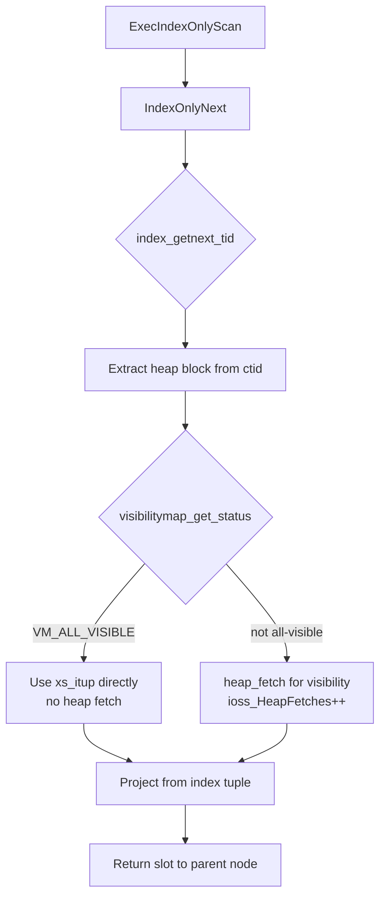

# Index-Only Scans

An index-only scan (IOS) satisfies a query entirely from the index without fetching the corresponding heap page for each matching tuple — provided the visibility map alone can establish visibility. When successful, it eliminates the most expensive part of a normal index scan: the random-I/O heap fetch per row.

## What an Index-Only Scan Is

A standard index scan returns an index entry, then fetches the heap tuple at the recorded `(block, offset)` ctid to obtain the full row and check visibility. An IOS skips the heap fetch when two conditions hold simultaneously:

1. All projected columns are available in the index itself (either as key columns or as `INCLUDE` columns).
2. The heap page containing the tuple is marked **all-visible** in the visibility map, meaning every tuple on that page is known to be visible to all current and future transactions — no per-tuple MVCC check is required.

When condition 2 fails for a particular page, the executor still fetches the heap tuple to perform a visibility check. It then discards the heap tuple's data and uses the index tuple's data for the output row. The number of such fallback fetches is reported as `Heap Fetches` in `EXPLAIN ANALYZE`.

## When the Planner Chooses an IOS

The planner builds an `IndexOnlyScanPath` in `create_index_paths()` when:

- The index covers all columns referenced in the target list and any pushed-down filter expressions (`index_can_return()` is true for each attribute).
- The estimated cost via `cost_index()` with `index_only = true` is lower than competing paths.

The critical cost term is `allvisfrac`: the fraction of the table's heap pages that are currently marked all-visible. `cost_index()` computes the expected number of heap fetches as `(1 - allvisfrac) * tuples_fetched`. It adds their I/O cost to the total. When `allvisfrac` approaches 1.0, the heap-fetch cost nearly vanishes. IOS then wins readily. When `allvisfrac` is low, the planner may prefer a plain index scan or sequential scan.

```c
/* cost_index() sketch (costsize.c) */
heap_pages = (1.0 - allvisfrac) * index_tuples_fetched / targrows;
run_cost += heap_pages * spc_random_page_cost;
```

PostgreSQL reads `allvisfrac` from `pg_class.relallvisible / relpages`. `VACUUM` and [[subsystems/background/autovacuum|autovacuum]] update this value.

## The Visibility Map's Role

The visibility map stores two bits per heap page: `VM_ALL_VISIBLE` (bit 0) and `VM_ALL_FROZEN` (bit 1). During an IOS, `IndexOnlyNext()` calls `visibilitymap_get_status()` for the heap block recorded in each index entry:

```c
/* nodeIndexonlyscan.c */
if (visibilitymap_get_status(rel, heap_block, &vmbuf) & VM_ALL_VISIBLE)
{
    /* No heap fetch needed; the index tuple is sufficient. */
    tuple->t_data = NULL;
}
else
{
    /* Fetch heap tuple for visibility check only. */
    xs_recheck = true;
    heap_fetch(rel, snapshot, &heaptuple, &buffer, false);
    node->ioss_HeapFetches++;
}
```

The visibility map file is much smaller than the heap (one byte covers 4 heap pages) so its pages stay in shared buffers. Reading it is essentially free compared to a heap page fetch. A page enters the all-visible state when `VACUUM` confirms that every tuple on it is visible to all active snapshots. It exits that state whenever any DML creates a non-visible tuple version on the page.

## INCLUDE Columns and IOS Coverage

`CREATE INDEX ... INCLUDE (col, ...)` stores extra columns in the index leaf pages without adding them to the B-tree key. This extends IOS coverage to queries that project those columns without widening the key space (which would increase index size, bloat, and scan cost).

```sql
-- Without INCLUDE: SELECT must fetch heap for "amount"
CREATE INDEX idx_orders_customer ON orders (customer_id);

-- With INCLUDE: IOS can satisfy the projection entirely
CREATE INDEX idx_orders_customer_inc ON orders (customer_id) INCLUDE (amount, status);

SELECT amount, status FROM orders WHERE customer_id = 42;
-- EXPLAIN: "Index Only Scan using idx_orders_customer_inc"
```

Key distinction: included columns are not usable as scan predicates or for ordering — they exist solely to make the leaf tuple self-contained for projection.

## xs_recheck and Heap Fetches in nodeIndexonlyscan.c

`IndexOnlyScanState` tracks scan state in the `IndexScanDesc` embedded within it. The `xs_itup` field of that descriptor points directly to the index tuple in the index buffer, bypassing heap deformation for the common (all-visible) path.

The `xs_recheck` flag is set when the access method signals that the index predicate may not be exact — for example GiST or GIN lossy matches. When `xs_recheck` is true, the executor must fetch and re-evaluate the heap tuple even if the page is all-visible. For B-tree indexes `xs_recheck` is always false, so the only source of heap fetches is non-all-visible pages.

`ioss_HeapFetches` in `IndexOnlyScanState` accumulates the count that `EXPLAIN ANALYZE` surfaces:

```
Index Only Scan using idx on t  (cost=0.43..8.45 rows=1 width=8)
  Index Cond: (id = 42)
  Heap Fetches: 0
```

`Heap Fetches: 0` confirms that every touched heap page was all-visible. Any nonzero value reveals that some pages have not been vacuumed recently enough.

## Cost Model Summary

```
IOS total cost ≈
    index_scan_cost(pages, tuples)
  + (1 - allvisfrac) * fetched_tuples * spc_random_page_cost
```

Compared to a plain index scan the second term is scaled down by `allvisfrac`, which can be close to 1.0 on tables that are read-heavy or vacuumed frequently. On write-heavy tables `allvisfrac` degrades. The cost advantage shrinks with it.

## Execution Flow



## Practical Guidance

**Verify IOS is working.**
```sql
EXPLAIN (ANALYZE, BUFFERS)
SELECT col1, col2 FROM t WHERE key = $1;
```
Check for `Index Only Scan` and `Heap Fetches: 0`. Non-zero fetches indicate stale visibility map pages.

**Drive heap fetches to zero with VACUUM.**
```sql
VACUUM t;               -- updates visibility map
VACUUM (FREEZE) t;      -- also sets VM_ALL_FROZEN, persists across wraparound
```
After a bulk load or heavy UPDATE/DELETE workload, run `VACUUM` before performance-critical queries to restore `allvisfrac`.

**Monitor IOS effectiveness with pg_stat_user_indexes.**
```sql
SELECT indexrelname,
       idx_tup_read,   -- index tuples returned by scans
       idx_tup_fetch   -- heap tuples fetched (non-IOS fetches)
FROM pg_stat_user_indexes
WHERE relname = 't';
```
When `idx_tup_fetch` approaches `idx_tup_read` most scans are falling back to the heap; when `idx_tup_fetch` is near zero IOS is working efficiently. Note that `idx_tup_fetch` counts heap fetches from all index scan types, not just IOS.

**Design indexes with INCLUDE for high-value covering patterns.**
Identify the most frequent SELECT column lists via [[subsystems/observability/pg-stat-statements|pg_stat_statements]]. Add those columns to an INCLUDE clause on the existing predicate index. Avoid including wide or frequently updated columns — they inflate leaf page size and increase index maintenance cost without improving selectivity.

**Partial indexes amplify IOS gains.**
A partial index on a hot subset of rows has fewer pages, higher `allvisfrac` relative to the full table, and smaller index files — all of which reinforce IOS cost advantages.

```sql
CREATE INDEX idx_active_orders ON orders (customer_id)
    INCLUDE (amount, status)
    WHERE status = 'active';
```

**Watch out for HOT updates and the visibility map.**
Heap-Only Tuple (HOT) updates do not invalidate the visibility map bit immediately, but any non-HOT update or deletion clears it for the affected page. Tables with frequent non-HOT updates will have chronically low `allvisfrac` and benefit less from IOS.

## Related Topics

- [[subsystems/storage/visibility-map|Visibility Map]] — the per-page all-visible and all-frozen bits that index-only scans consult to avoid heap fetches entirely.
- [[subsystems/indexes/btree|B-Tree Index]] — the primary access method for index-only scans; B-tree's exact matching means xs_recheck is never set, so heap fetches come only from non-all-visible pages.
- [[subsystems/planner/cost-model|Cost Model]] — explains how allvisfrac is used in cost_index() to price the expected number of fallback heap fetches and decide when IOS wins.
- [[subsystems/indexes/partial-indexes|Partial Indexes]] — partial indexes concentrate rows into smaller, frequently vacuumed structures that raise allvisfrac and amplify index-only scan gains.
- [[subsystems/background/autovacuum|Autovacuum]] — keeps pg_class.relallvisible accurate and marks heap pages all-visible, which is the prerequisite for zero-heap-fetch index-only scans.
- [[subsystems/planner/scan-selection|Scan Selection]] — the planner logic that compares IndexOnlyScanPath against plain index and sequential scan paths before committing to IOS.
- [[subsystems/observability/pg-stat-statements|pg_stat_statements]] — used to identify high-frequency queries whose SELECT column lists are candidates for INCLUDE-based covering indexes.
