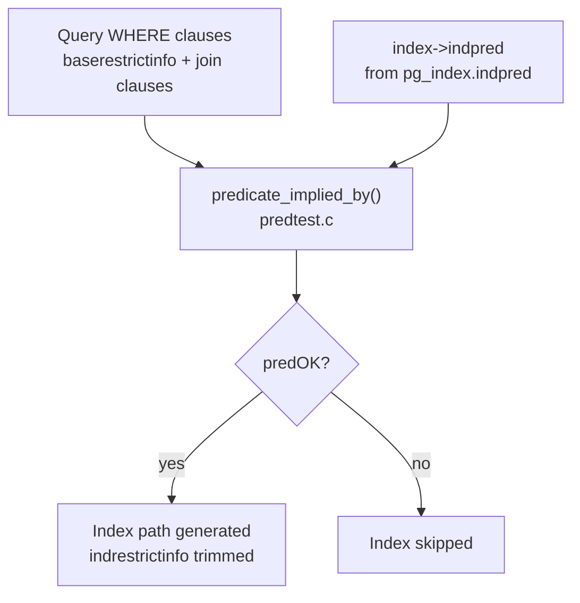

A partial index covers only a subset of a table's rows, defined by a `WHERE` predicate attached to the `CREATE INDEX` statement. The index AM stores entries only for rows satisfying that predicate at the time of the write. Rows that do not satisfy it are silently omitted. The predicate is stored as an expression tree in `pg_index.indpred` and parsed back into an `IndexOptInfo.indpred` list during planning.

Partial indexes serve two related goals. First, they are physically smaller. This improves cache efficiency and reduces vacuum work. Second, they contain statistics that are drawn only from the qualifying subset. As a result, selectivity estimates for queries that scan that subset are more accurate than those computed from a full-column histogram.

## Creating a Partial Index

```sql
-- Only index rows that have not been deleted
CREATE INDEX idx_orders_active ON orders (customer_id)
WHERE deleted_at IS NULL;

-- Index only the minority status
CREATE INDEX idx_jobs_pending ON jobs (created_at)
WHERE status = 'pending';

-- Exclude NULLs from a unique index
CREATE UNIQUE INDEX idx_users_email ON users (email)
WHERE email IS NOT NULL;
```

The predicate may reference any column of the table but must consist entirely of immutable operators and functions. PostgreSQL enforces this at `CREATE INDEX` time via `CheckPredicate()`. PostgreSQL rejects non-immutable functions outright (anything marked `STABLE` or `VOLATILE`, including `now()`, `current_timestamp`, and `random()`), because the planner cannot make sound deductions based on values that may differ between planning and execution time.

## Predicate Implication: How the Planner Decides

Before a partial index can be used for a given query, the planner must prove that every row the query touches is guaranteed to satisfy the index predicate. If the predicate is not provably implied by the query's own WHERE clause, the index cannot be used. Some rows the query needs might not appear in the index.

This proof happens in `check_index_predicates()` (`src/backend/optimizer/path/indxpath.c`). For each relation being planned, the function assembles a `clauselist` from the relation's `baserestrictinfo` (local WHERE conditions) plus any join clauses that are "movable to" this relation and any clauses derivable from equivalence classes. It then calls `predicate_implied_by(index->indpred, clauselist, false)`. It stores the result in `IndexOptInfo.predOK`.

`predicate_implied_by()` (`src/backend/optimizer/utils/predtest.c`) treats both its arguments as implicit-AND lists. It then proves implication recursively. For simple atomic clauses it applies operator-family knowledge: if the query has `status = 'pending'` and the index predicate is `status = 'pending'`, implication is trivially true. It also handles relational operators. For example, a query clause `amount > 1000` implies an index predicate `amount > 500`. AND-of-clauses implies a single predicate if any individual clause does. A single clause implies AND-of-predicates only if it implies every conjunct.



When `predOK` is true, a secondary benefit kicks in: the planner removes any query WHERE clause that is logically implied by the index predicate from `indrestrictinfo`. This means the executor does not need to recheck that condition as a filter on top of the index scan, because every row in the index already satisfies it by construction.

## Implication Is Not Symmetric

The planner checks `predicate_implied_by(indpred, query_clauses)`, not the reverse. The index predicate must be implied by the query, not the other way around.

| Index predicate | Query clause | Usable? |
|---|---|---|
| `status = 'pending'` | `status = 'pending'` | Yes — query implies predicate |
| `status = 'pending'` | `status = 'pending' AND priority > 5` | Yes — conjunction implies predicate |
| `amount > 500` | `amount > 1000` | Yes — stronger bound implies weaker |
| `amount > 500` | `amount > 100` | No — weaker bound does not imply stronger |
| `deleted_at IS NULL` | *(no clause on deleted_at)* | No — query allows non-NULL rows |

A common mistake is creating an index on a minority-value status column without matching the query's WHERE exactly. The planner does not use the index `WHERE status = 'active'` for a query that filters on `status IN ('active', 'pending')`, because the IN list does not imply `status = 'active'`.

## OR Paths and Partial Indexes

Even when `predOK` is false, a partial index can still participate in a BitmapOr plan. `generate_bitmap_or_paths()` calls `predicate_implied_by` against the combined clause set of all branches of an OR condition. If the predicate is implied by the full OR-expanded clause list, the index contributes to one branch of the bitmap scan. This is a narrower success case. It means partial indexes remain relevant for disjunctive queries that happen to cover the indexed subset in aggregate.

## Selectivity and Statistics

A partial index's catalog entry in `pg_class` records the number of pages and tuples for the indexed subset only. When the planner considers an index scan via this index, cost estimation uses those row and page counts, not the table's full statistics. For a table with 10 million rows where only 50,000 have `status = 'pending'`, a partial index on `status = 'pending'` carries statistics for those 50,000 rows. The planner sees a small, tight index rather than inferring selectivity from a population-wide column histogram. This approach tends to be more accurate, especially for skewed distributions where a global histogram would smear out the peak.

The physical size advantage is direct: fewer index pages mean more of the index fits in `shared_buffers`. Random I/O against the index is cheaper. Vacuum has less work to do on every cycle.

## Inspecting Partial Indexes

```sql
-- See predicate text for partial indexes on a table
SELECT indexname, indexdef, pg_get_expr(i.indpred, i.indrelid) AS predicate
FROM pg_indexes
JOIN pg_index i ON i.indexrelid = (quote_ident(schemaname) || '.' || quote_ident(indexname))::regclass
WHERE tablename = 'orders'
  AND i.indpred IS NOT NULL;

-- Physical size of the index
SELECT relname, pg_size_pretty(pg_relation_size(oid)) AS index_size
FROM pg_class
WHERE relkind = 'i'
  AND relname = 'idx_orders_active';
```

`pg_index.indpred` is a `pg_node_tree` (serialized expression). `pg_get_expr(indpred, indrelid)` decompiles it back to SQL text. A NULL value means the index is not partial.

## Practical Guidance

**Match the predicate exactly to the query.** The implication check is syntactic/semantic, not heuristic. If the index says `deleted_at IS NULL` and the query says `deleted_at IS NULL`, the planner proves it immediately. If the query omits the clause, the proof fails. The index is then invisible to the optimizer.

**Use partial indexes for sparse values, not common ones.** An index on `status = 'active'` where 95% of rows are active provides almost no size benefit. The right target is columns where a small minority of rows dominate query workloads—job queues, soft-delete patterns, unprocessed event logs, error states.

**Avoid non-immutable functions in predicates.** `CREATE INDEX ... WHERE created_at > now() - interval '30 days'` is rejected at DDL time. Use a fixed value or a generated column with an immutable expression.

**Audit predOK in EXPLAIN.** When `EXPLAIN` shows a sequential scan where a partial index should apply, run `EXPLAIN (ANALYZE, BUFFERS)` and check whether the index appears in the planner's consideration at all. If it does not appear, the predicate is likely not implied. Use `predicate_implied_by` logic mentally: enumerate what the planner knows about each column from the WHERE clause and verify the index predicate follows.

**Partial unique indexes for conditional uniqueness.** `CREATE UNIQUE INDEX ... WHERE email IS NOT NULL` enforces uniqueness only among non-NULL values. This is the standard idiom for optional-but-unique fields. It cannot be expressed as a plain unique constraint.

**Recheck behavior on UPDATE target relations.** When the indexed table is the target of an `UPDATE`, `DELETE`, or `SELECT FOR UPDATE`, `check_index_predicates()` deliberately does not remove implied quals from `indrestrictinfo`. EvalPlanQual (the concurrency-recheck mechanism) needs those predicates present in the plan to recheck visibility correctly. The index is still used. The planner does not elide the predicate clause from the plan.

## Related Topics

- [[subsystems/indexes/expression-indexes|Expression Indexes]] — like partial indexes, expression indexes extend what can be indexed beyond plain columns; the two features can be combined in a single `CREATE INDEX` statement.
- [[subsystems/planner/index-selection|Index Selection]] — covers how the planner weighs all candidate index paths, including evaluating `predOK` and cost estimates for partial indexes.
- [[subsystems/planner/selectivity-estimation|Selectivity Estimation]] — explains how per-column statistics and histogram data interact with partial-index row counts during cost modelling.
- [[subsystems/planner/bitmap-scans|Bitmap Scans]] — partial indexes can participate in BitmapOr plans even when `predOK` is false; this page explains how bitmap index paths are assembled and combined.
- [[subsystems/indexes/index-only-scans|Index-Only Scans]] — partial indexes that cover all needed columns enable index-only scans for the indexed subset, amplifying the size and I/O benefits.
- [[subsystems/catalog/pg-class|pg_class]] — stores the page and tuple counts for the partial index's own subset, which the planner reads for cost estimation.
- [[subsystems/planner/constraint-exclusion|Constraint Exclusion]] — a related planner mechanism that uses table constraints (rather than index predicates) to prove that certain rows or partitions can be skipped entirely.
- [[subsystems/indexes/btree|B-Tree Index]] — the general-purpose index type most often built as a partial index; the predicate narrows which rows of the underlying B-tree structure get an entry.
- [[subsystems/planner/predicate-pushdown|Predicate Pushdown]] — the broader planner technique of propagating WHERE conditions to lower plan nodes; predicate implication for partial indexes is a specialized instance of the same idea applied at the index level.