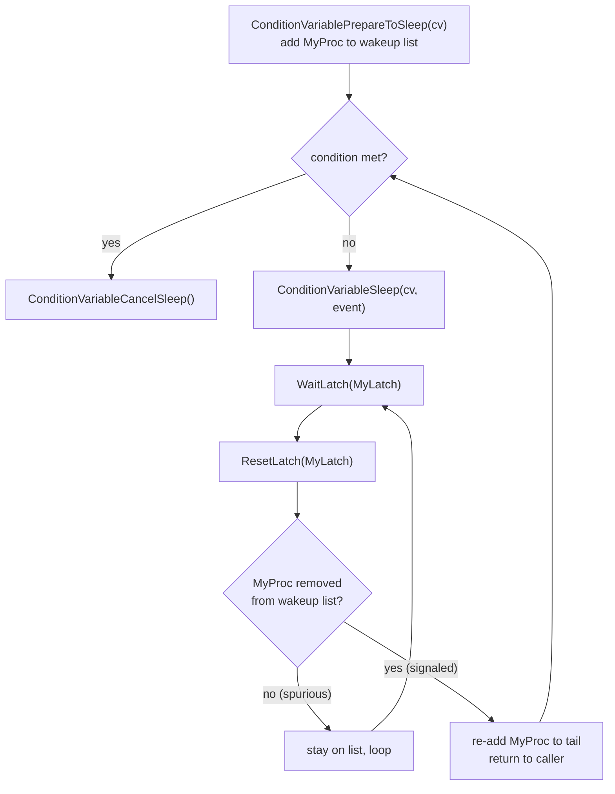

Condition variables give a backend a way to sleep until an externally managed condition becomes true. The backend does not need to know which other process will eventually satisfy it. Unlike [[subsystems/locking/lwlocks|LWLock]] waits, a condition variable sleep is interruptible — the wait loop calls `CHECK_FOR_INTERRUPTS()`, allowing query cancellation and other signals to break out of the sleep. They are also pointer-free by design, making them safe to embed in dynamic shared memory (DSM) segments.

## Structure

`ConditionVariable` is a small struct defined in `condition_variable.h`:

```c
typedef struct
{
    slock_t       mutex;    /* spinlock protecting the wakeup list */
    proclist_head wakeup;   /* list of wake-able processes */
} ConditionVariable;
```

The `mutex` is a [[subsystems/locking/spinlocks|spinlock]] that guards all mutations to `wakeup`. The `wakeup` field is an intrusive linked list of `PGPROC` entries, threaded through the `cvWaitLink` field of each `PGPROC`. Because `proclist_head` uses array indices (`pgprocno`) rather than pointers, the structure is relocatable across processes with different shared-memory base addresses — the key property that enables DSM use.

A `ConditionVariableMinimallyPadded` union pads the struct to the nearest power-of-two (16 or 32 bytes) so that an array of condition variables does not straddle a cache line boundary.

Each backend tracks at most one pending CV sleep at a time via the process-local pointer `cv_sleep_target` (a static variable in `condition_variable.c`). Only one `cvWaitLink` field exists per `PGPROC`, enforcing this one-at-a-time constraint.

## The Test-and-Sleep Loop

The canonical usage pattern is:

```c
ConditionVariablePrepareToSleep(cv);   /* optional but efficient */
while (condition is not yet met)
    ConditionVariableSleep(cv, WAIT_EVENT_BUFFER_IO);
ConditionVariableCancelSleep();
```

This pattern handles spurious wakeups correctly. `ConditionVariableSleep` does not guarantee the condition is true when it returns; it only guarantees that a signal or broadcast occurred (or that an interrupt fired). The caller must re-test.

The optional `ConditionVariablePrepareToSleep` call adds the backend to the wait list before the first condition test. This avoids one queue manipulation if the caller expects to sleep. If the condition is likely already met, omitting the prepare call is better — it avoids touching the shared wait list at all.

## Sleeping Without a Race

The sleep mechanism must avoid the lost-wakeup race: a signal arriving after the caller checks the condition but before the process blocks must not go undetected. The protocol in `ConditionVariableTimedSleep` (condition_variable.c) achieves this through a two-phase design:

1. On the first call with a fresh `cv_sleep_target`, `ConditionVariablePrepareToSleep` adds `MyProc` to the wait list and returns immediately. The caller retests the condition. If still unmet, it calls `ConditionVariableSleep` again.
2. On the second call, `MyProc` is already on the list. The backend calls `WaitLatch` and blocks on `MyProc->procLatch`.
3. On wakeup, the code re-acquires the spinlock and checks whether `MyProc` has been removed from the list. Removal is the signal that `ConditionVariableSignal` was called. If still on the list, the wakeup was spurious, and the backend sleeps again.
4. Whether removed or not, the code immediately pushes `MyProc` back to the tail of the wait list before returning to the caller. This ensures the caller does not miss a signal while it re-evaluates its condition.

Only a call to `ConditionVariableCancelSleep` permanently removes the process from the list, typically after the caller confirms the exit condition. `ConditionVariableCancelSleep` also returns `true` if the process was already absent from the list at the time of the call — a lightweight way to detect that a wakeup occurred.



## Signaling and Broadcast

`ConditionVariableSignal` (condition_variable.c) pops the first entry from the wait list under the spinlock and calls `SetLatch(&proc->procLatch)` to wake that single backend. It makes no claim that the condition is actually satisfied — signal simply means "check again." This is the standard condition-variable semantic: signalers notify, but they do not guarantee.

`ConditionVariableBroadcast` must wake all waiters that were present at the time of the call. The challenge is that awakened processes typically re-add themselves to the list immediately. They must stay on the list while re-testing the condition. A naive loop draining the list to empty could therefore run indefinitely.

The solution uses the broadcaster's own `cvWaitLink` as a sentinel. It pops and signals the first waiter, then inserts itself at the tail. It repeats this until it finds its own entry at the head of the list. Once the broadcaster dequeues its sentinel, it knows that every earlier entry has been signaled. A complication arises if another process's signal removes the sentinel first — the broadcaster treats this as "all prior waiters were woken" and exits safely. The cost is one extra wakeup, which is harmless (condition_variable.c).

## Interaction with Interrupts

`ConditionVariableTimedSleep` calls `CHECK_FOR_INTERRUPTS()` after each `WaitLatch` return. If an interrupt handler itself sleeps on a different condition variable, it will replace `cv_sleep_target` with the new CV. When the outer sleep resumes, it detects the mismatch (`cv != cv_sleep_target`) and returns as if signaled. The outer loop then re-enters the CV sleep and re-establishes its own entry in the wait list. This means interrupt handlers can safely use condition variables as long as they call `ConditionVariableCancelSleep` before returning.

## Timed Waits

`ConditionVariableTimedSleep` accepts a millisecond timeout. It records the wall-clock start time. After each wakeup, it subtracts elapsed time from the remaining budget and loops back to `WaitLatch` with the adjusted deadline. When the remaining timeout reaches zero or below, it returns `true`. `ConditionVariableSleep` is a thin wrapper that passes `timeout = -1`. This disables timeout handling entirely.

## Key Users

Condition variables appear throughout the backend wherever one process must wait for work done by another without knowing its identity:

| Subsystem | CV usage |
|-----------|---------|
| Buffer manager | Waiting for in-progress I/O to complete on a shared buffer (`WaitIO`, bufmgr.c) |
| B-tree parallel build | Coordinating leader and worker phases (nbtsort.c) |
| WAL receiver | Waiting for the WAL sender to catch up (walreceiver.c) |
| Checkpointer | Notifying backends that a requested checkpoint completed (checkpointer.c) |
| Replication slots | Waiting for a slot to become inactive (slot.c) |
| Logical replication origin | Waiting for a replay position to advance (origin.c) |
| Process signal | Waiting for signal handlers to complete (procsignal.c) |
| Parallel barrier | Phase synchronization across parallel workers (barrier.c) |

## Related Topics

- [[subsystems/locking/lwlocks|LWLock]] — heavier primitive with shared/exclusive modes; condition variables are for waiting on application-level conditions rather than data structure access
- [[subsystems/locking/spinlocks|Spinlock]] — the `mutex` inside every `ConditionVariable` is a spinlock; held only for list pointer manipulation, never across a sleep
