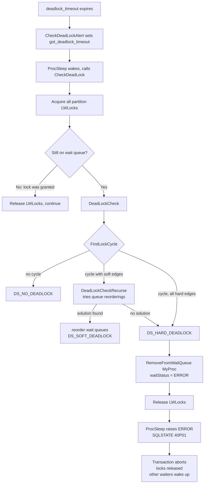

# Deadlock Detection

A deadlock is a cycle in the wait-for graph: transaction A holds a lock that B needs, B holds one that C needs, and C holds one that A needs. No participant can proceed. The cycle cannot break itself. PostgreSQL resolves this by detecting the cycle and aborting one participant. That frees the participant's locks, so the others can continue.

Detection is not continuous. The wait-for graph is expensive to build — it requires traversing every lock partition in shared memory under exclusive LWLocks. Deadlocks are also rare. Most lock waits resolve within milliseconds. PostgreSQL therefore delays the check: a backend blocked waiting for a lock starts a timer. It only runs the deadlock detector after `deadlock_timeout` (default 1 s) has elapsed without acquiring the lock.

## deadlock_timeout and lock_timeout are different things

These two GUC parameters are easy to confuse and have entirely different semantics.

`deadlock_timeout` is the delay before running the cycle-detection algorithm. It is not a wait-limit. A backend can wait far longer than `deadlock_timeout` on ordinary lock contention: the deadlock check runs at the 1 s mark and finds no cycle. The backend continues waiting. The parameter exists because building the wait-for graph is expensive. Constantly cycling through all lock partitions while holding all their LWLocks would also be disruptive.

`lock_timeout` is a simple time limit. If a backend has not acquired the lock within the configured interval, PostgreSQL cancels it with `ERROR: canceling statement due to lock timeout` (SQLSTATE `55P03`). This happens regardless of whether any deadlock exists. The two timeouts are independent; you can set both, one, or neither.

When both are set and the lock is not acquired within `deadlock_timeout`, the deadlock check runs first. If the check finds no cycle, the backend continues waiting. It stops when `lock_timeout` fires.

## How detection is triggered

When a backend enters `ProcSleep()` to wait for a lock, it enables the `DEADLOCK_TIMEOUT` timer. When the timer fires, the signal handler `CheckDeadLockAlert()` (in `proc.c`) sets the volatile flag `got_deadlock_timeout` and sets the process latch to wake the sleeping backend. On its next iteration of the wait loop, `ProcSleep()` checks the flag and calls `CheckDeadLock()`.

`CheckDeadLock()` first acquires exclusive LWLocks over all hash partitions of the lock table in ascending partition-number order — the same ordering discipline that prevents LWLock deadlocks elsewhere. Holding all partition locks simultaneously freezes the lock table snapshot for the duration of the check. Before doing any work, it verifies that the calling process is still on the wait queue. The process could have been granted the lock while waiting for the LWLocks. If it was already dequeued, the check short-circuits and returns immediately.

Only then does `CheckDeadLock()` call `DeadLockCheck()` from `deadlock.c` proper.

## Building the wait-for graph

PostgreSQL does not maintain a persistent wait-for graph. `DeadLockCheck()` constructs it on demand from live shared memory state: which `PGPROC` structs are currently waiting (`waitLock != NULL`), what lock mode they are waiting for, and which `PROCLOCK` entries show other backends already holding conflicting modes on that lock.

Each directed edge in the graph is an `EDGE` struct (defined in `deadlock.c`):

```c
typedef struct {
    PGPROC  *waiter;   /* the leader of the waiting lock group */
    PGPROC  *blocker;  /* the leader of the group it is waiting for */
    LOCK    *lock;     /* the lock being waited for */
    int      pred;     /* workspace for TopoSort */
    int      link;     /* workspace for TopoSort */
} EDGE;
```

The algorithm represents lock groups — parallel query workers sharing a transaction — by their group leader throughout the graph. This keeps the graph at the transaction level rather than the process level. It also means the algorithm correctly detects cycles involving parallel workers even when the group leader itself is not waiting.

`InitDeadLockChecking()` pre-allocates all working memory (`visitedProcs[]`, `deadlockDetails[]`, constraint arrays, wait-order arrays) in `TopMemoryContext` at backend startup. This is necessary for two reasons. `CheckDeadLock()` may still be running logic triggered from the context of a signal handler, where calling `palloc` would be dangerous. The check should also succeed even when the backend is under memory pressure.

## The detection algorithm: DFS over the wait-for graph

`FindLockCycle()` implements a depth-first search outward from the waiting process. It maintains a `visitedProcs[]` array of nodes already visited on the current path. The algorithm confirms a cycle when the DFS reaches a node already in `visitedProcs[]` at index 0 — meaning it has returned to the starting process. Returning to any *other* visited node means a cycle exists in the graph but does not involve the starting process. From that process's perspective, this is not a deadlock.

The DFS is structured as two mutually recursive helpers:

- `FindLockCycleRecurse()` visits a given process. For the process itself and for each member of its lock group, it calls `FindLockCycleRecurseMember()` to enumerate blocking relationships.
- `FindLockCycleRecurseMember()` looks at the lock a process is waiting for and finds all processes that block it, both directly (hard edges) and through queue position (soft edges). For each blocking process, it recurses into `FindLockCycleRecurse()`.

The result of a complete pass through `FindLockCycle()` is either a confirmed cycle or a clean return, plus a list of any soft edges found in the cycle and filled-in `deadlockDetails[]` records for error reporting.

### Hard edges and soft edges

`FindLockCycleRecurseMember()` distinguishes two kinds of blocking relationship. The distinction drives the entire resolution strategy.

**Hard edges** arise from actual lock conflicts: some backend holds a granted lock whose mode conflicts with what the waiting process needs. The holding process is not on the wait queue; it owns the lock. Aborting one of the two transactions is the only way to break a hard edge.

**Soft edges** arise from the ordering of the wait queue. Two backends are both waiting on the same lock. One is positioned ahead of the other in the queue with a conflicting request mode. The leading waiter does not hold the lock — it is only waiting for it. It occupies a position ahead of the following waiter. As long as that ordering is preserved, the conflict exists. Reordering the wait queue can eliminate a soft edge, by moving the would-be blocker behind the would-be blocked process. No transaction needs to be aborted.

The scan for hard edges always runs first. If a backend is both a hard blocker and a soft blocker (it holds a conflicting lock *and* is ahead in the queue), the algorithm classifies the relationship as hard — the stronger constraint.

## Soft deadlock resolution

`FindLockCycle()` may find a cycle that contains at least one soft edge. When it does, `DeadLockCheckRecurse()` attempts to eliminate the cycle through queue reordering. The algorithm tries each soft edge in the cycle as a candidate constraint to reverse. A constraint takes the form "waiter must precede blocker in the wait queue". After adding a constraint, it calls `TestConfiguration()` recursively to check whether that constraint, combined with any already active, produces a cycle-free graph. If the graph is still deadlocked, it backtracks and tries another soft edge.

`ExpandConstraints()` translates the active set of soft-edge constraints into concrete `WAIT_ORDER` structs, one per affected lock, by calling `TopoSort()` for each lock whose queue must be rearranged. `TopoSort()` produces a new queue ordering that satisfies all constraints while minimising disruption to the original order. It fails — returning false — only if the constraints are contradictory. This can happen when a proposed rearrangement would itself create a new cycle.

If the algorithm finds a consistent cycle-free configuration, `DeadLockCheck()` applies it. It reinitialises each affected `lock->waitProcs` doubly-linked list and re-inserts backends in the computed order. It then calls `ProcLockWakeup()` on each affected lock to wake any backends that are now runnable under the new arrangement. It raises no error. It returns `DS_SOFT_DEADLOCK` and all transactions continue.



## Hard deadlock and victim selection

When no queue reordering can break the cycle, `DeadLockCheck()` returns `DS_HARD_DEADLOCK`. The victim is the backend that ran `CheckDeadLock()` — always `MyProc`, the backend whose `deadlock_timeout` fired. The comment in `proc.c` notes that the code is structured to *allow* killing a different transaction in the future, but current practice is to kill the detector.

This means the most recently blocked process in a deadlock is the one that dies. The processes that had been waiting longest survive. This is a reasonable heuristic: the youngest waiter is the one that completed the cycle. Removing it is therefore the minimal intervention.

`CheckDeadLock()` calls `RemoveFromWaitQueue(MyProc, ...)`. That call unlinks the process from `lock->waitProcs`, recomputes `lock->waitMask`, and sets `MyProc->waitStatus` to `PROC_WAIT_STATUS_ERROR`. `CheckDeadLock()` also calls `ProcLockWakeup()`. This lets any process that was only blocked by the victim's position in the queue proceed.

Back in `ProcSleep()`, `CheckDeadLock()` returns and releases the LWLocks. The wait loop then reads `myWaitStatus` and sees `PROC_WAIT_STATUS_ERROR`. It calls `DeadLockReport()`, which raises:

```
ERROR:  deadlock detected
DETAIL:  Process 12345 waits for ShareLock on transaction 7890; blocked by process 67890.
         Process 67890 waits for ShareLock on transaction 12345; blocked by process 12345.
HINT:   See server log for query details.
```

The SQLSTATE is `40P01` (transaction rollback: deadlock detected). This is `ERROR`, not `FATAL` — the process does not exit. The error unwinds the current transaction via the normal exception mechanism, releasing all locks the victim held. Those releases wake the other participants in the deadlock. They can now proceed.

The server log additionally includes the currently-running query for each PID in the cycle, collected from `pgstat_get_backend_current_activity()`.

## Early deadlock detection in ProcSleep

`ProcSleep()` contains a fast path for a specific two-backend pattern that does not wait for `deadlock_timeout`. When a new waiter enters the queue, `ProcSleep()` scans the existing queue to determine the correct insertion point. If it finds a process already waiting that holds locks conflicting with the new waiter, *and* the new waiter holds locks that conflict with the existing waiter's request, a deadlock already exists. No waiting is needed to detect it. `ProcSleep()` records this via `RememberSimpleDeadLock()`, adds itself to the wait queue, and immediately calls `RemoveFromWaitQueue()` before ever sleeping. The calling code in `LockAcquireExtended()` then calls `DeadLockReport()` directly. This avoids the 1-second delay for the simplest two-party deadlock.

## The error and client-side handling

The `40P01` error causes the current transaction to abort. PostgreSQL automatically rolls back the partial work and releases all locks. The client receives the error and is responsible for deciding whether to retry the transaction.

Applications using PostgreSQL should treat `40P01` as a retriable error, not a programming bug. Deadlocks can occur in any application where multiple transactions touch shared rows in different orders, even without bugs. The standard defensive measure is to access rows in a consistent order across transactions. This prevents cycles from forming. When that is not possible, catching `40P01` and retrying is the correct response.

## Special cases

**[[subsystems/background/autovacuum|Autovacuum]] blocking**: when `FindLockCycleRecurseMember()` finds that the direct hard-blocker of the current backend is an autovacuum worker, it records the worker's `PGPROC` in `blocking_autovacuum_proc`. If the deadlock check finds no actual cycle (`DS_BLOCKED_BY_AUTOVACUUM`), `ProcSleep()` sends the autovacuum worker a `SIGINT`, requesting cancellation. Autovacuum processes catch `SIGINT` as a query-cancel signal and exit their current work gracefully. This gives autovacuum a clean way to yield to user transactions. Autovacuums running to prevent [[subsystems/transactions/xid-wraparound|XID wraparound]] are exempt from this cancellation to avoid the more serious risk of exhausting transaction IDs.

**Relation extension locks**: `FindLockCycleRecurseMember()` excludes `LOCKTAG_RELATION_EXTEND` locks from deadlock cycle detection entirely — it returns immediately for them. Backends hold extension locks only for the brief duration of appending a new page. They never acquire one while holding other heavyweight locks that could form a cycle. Extension locks therefore cannot participate in real deadlocks.

**Lock groups**: parallel query workers share a transaction and acquire locks as a group, with the group leader as the representative node in the deadlock graph. `FindLockCycleRecurse()` iterates over `checkProc->lockGroupMembers` to pick up waits from non-leader members. These members can themselves form cycles even when the leader is not waiting.

## Return codes

`DeadLockCheck()` returns one of the `DeadLockState` values:

| Value | Meaning |
|---|---|
| `DS_NOT_YET_CHECKED` | Initial state; check has not run |
| `DS_NO_DEADLOCK` | No cycle found |
| `DS_SOFT_DEADLOCK` | Cycle resolved by queue reordering |
| `DS_HARD_DEADLOCK` | Cycle cannot be resolved; victim will be aborted |
| `DS_BLOCKED_BY_AUTOVACUUM` | No cycle; direct blocker is an autovacuum worker |

## Key data structures

| Struct | Purpose |
|---|---|
| `EDGE` | One directed edge in the wait-for graph; also a queue-ordering constraint for `TopoSort` |
| `WAIT_ORDER` | A proposed new ordering of one lock's wait queue |
| `DEADLOCK_INFO` | Per-node cycle information saved for `DeadLockReport()` |
| `LOCK` | Shared-memory lock object; contains `waitProcs` queue and `procLocks` list |
| `PROCLOCK` | Associates a `PGPROC` with a `LOCK`; `holdMask` shows granted modes |

## Related Topics

- [[subsystems/locking/overview|Lock Manager Overview]] — the heavyweight lock manager whose `LOCK`, `PROCLOCK`, and wait-queue structures the deadlock detector traverses
- [[subsystems/locking/lwlocks|LWLocks]] — lightweight locks used to protect the lock-table hash partitions that must all be held during a deadlock check
- [[subsystems/locking/row-level-locking|Row-Level Locking]] — row-level locks that participate in the wait-for graph and can form deadlock cycles
- [[subsystems/locking/predicate-locking|Predicate Locking]] — serializable-isolation locks tracked separately from heavyweight locks, with their own cycle-detection pass
- [[subsystems/locking/lock-contention-and-slow-queries|Lock Contention and Slow Queries]] — diagnosing contention and the conditions that lead to deadlocks in practice
- [[troubleshooting/lock-waits|Lock Waits]] — operational guide for investigating blocked and deadlocked sessions using `pg_locks` and `pg_stat_activity`
- [[subsystems/transactions/mvcc|MVCC]] — the multi-version concurrency model that reduces but does not eliminate the need for heavyweight locks and the deadlocks they can produce
- [[architecture/process-architecture|Process Architecture]] — `PGPROC` and how backends are structured.
