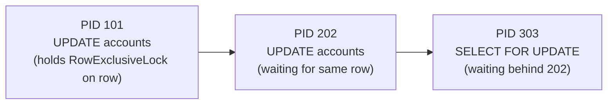

A query blocked on a heavyweight lock does no work: it sits in the kernel, waiting on a semaphore inside `LockAcquire`, consuming no CPU and executing no plan nodes. Profiling tools built around CPU time or the query plan — `EXPLAIN ANALYZE`, flame graphs, `pg_stat_statements` execution counts — have nothing to show for this time. This is why lock contention is one of the most commonly missed causes of "slow" queries. This page explains why that blind spot exists. It also covers the recurring application patterns that create contention. For the hands-on diagnostic workflow — the queries to find blocked backends, trace blocking chains, and resolve an active incident — see [[troubleshooting/lock-waits|Diagnosing Lock Waits]].

## Lock Waits Are Invisible to Standard Profiling Tools

A backend waiting on a lock is not consuming any resource a profiler tracks — no CPU, no I/O, no memory churn. It is simply asleep. `pg_stat_activity` is the only place the wait shows up. `wait_event_type = 'Lock'` marks a backend parked inside `LockAcquire`. `state` still reads `active` because PostgreSQL considers the statement in progress. `query_start` recedes into the past with no plan-node progress to show for it. None of this appears in a query plan, because locking happens beneath the executor, at the row and relation level, not as a plan node the optimizer reasons about.

Lock waits on `transactionid` are the most common case in practice. PostgreSQL represents a row-level write lock internally as a lock on the writing transaction's XID. As a result, a second writer targeting the same row blocks until the first transaction commits or rolls back.

## The Blocking Chain

A single slow transaction can block many backends. Those blocked backends can themselves become blockers, forming a chain. `pg_blocking_pids(pid)` reports only the immediate blockers of a given PID — resolving a chain down to its root cause requires walking it recursively (see [[troubleshooting/lock-waits|Diagnosing Lock Waits]] for the query).



The root of a chain is often not itself waiting on anything — a backend sitting in `idle in transaction` while holding locks is the most common root cause, since nothing forces it to release them.

## Common Contention Scenarios

Most contention incidents fall into one of a few recurring shapes:

- **Long-running transactions holding row locks.** Any transaction that opens a write and then waits on user input, an external call, or simply runs long holds its row locks for the entire duration, blocking any concurrent writer to the same rows.
- **DDL taking `AccessExclusiveLock`.** `ALTER TABLE`, non-concurrent `CREATE INDEX`, `TRUNCATE`, and `DROP TABLE` conflict with every other lock mode, including plain `SELECT`. A DDL statement queues behind existing queries and then blocks everything behind it until it completes. `CREATE INDEX CONCURRENTLY` avoids this by taking `ShareUpdateExclusiveLock` instead.
- **Autovacuum versus DDL.** [[subsystems/background/autovacuum|Autovacuum]]'s `ShareUpdateExclusiveLock` does not block reads or writes. It does conflict with `AccessExclusiveLock` and `ShareRowExclusiveLock`, so DDL and autovacuum can end up queued behind each other on a busy table.
- **Foreign key checks.** Inserting into a child table takes a `RowShareLock` on the referenced parent row to guard against a concurrent delete that would violate the constraint. A high insert rate against a small set of parent rows — a lookup table of statuses, for example — turns that guard into a hotspot.

Each of these is diagnosed with the same blocking-chain and `pg_locks` queries; see [[troubleshooting/lock-waits|Diagnosing Lock Waits]] for the full workflow, plus additional causes such as explicit `LOCK TABLE` statements.

## Lock Types Relevant to Application Developers

| Lock Mode | Acquired By | Conflicts With |
|---|---|---|
| `RowShareLock` | `SELECT FOR SHARE`, FK check | `AccessExclusiveLock` only (+ `ShareRowExclusiveLock`) |
| `RowExclusiveLock` | `INSERT`, `UPDATE`, `DELETE` | `ShareLock`, `ShareRowExclusiveLock`, `AccessExclusiveLock` |
| `ShareUpdateExclusiveLock` | `VACUUM`, `ANALYZE`, `CREATE INDEX CONCURRENTLY` | Itself, `ShareRowExclusiveLock`, `AccessExclusiveLock` |
| `ShareRowExclusiveLock` | `CREATE TRIGGER`, some FK operations | `RowExclusiveLock` and above |
| `AccessExclusiveLock` | DDL (`ALTER TABLE`, `DROP`, `TRUNCATE`) | Everything |

The full conflict matrix is defined in `lock.c` as `LockConflicts[]`. This table is what explains the scenarios above: `AccessExclusiveLock` conflicts with everything. This is precisely what makes DDL so disruptive on a busy table.

## SELECT FOR UPDATE and SELECT FOR SHARE

Applications need explicit row locking for correct read-modify-write patterns, where a transaction reads a row, computes a new value, and writes it back. Without `SELECT FOR UPDATE`, two concurrent transactions can each read the same value, compute the same result, and produce a lost update.

```sql
BEGIN;
SELECT balance FROM accounts WHERE id = 42 FOR UPDATE;
-- compute new balance
UPDATE accounts SET balance = ... WHERE id = 42;
COMMIT;
```

`FOR SHARE` is weaker: it prevents concurrent writes but allows other `FOR SHARE` readers. Use it when the transaction must protect a reference against deletion but has no intention of modifying the row itself.

### SKIP LOCKED for Queue Workloads

For job-queue patterns where multiple workers dequeue tasks, `FOR UPDATE SKIP LOCKED` avoids workers blocking each other:

```sql
SELECT id, payload
FROM jobs
WHERE status = 'pending'
ORDER BY created_at
LIMIT 1
FOR UPDATE SKIP LOCKED;
```

Each worker atomically claims a row. `SKIP LOCKED` skips rows already locked by another worker rather than waiting on them. This eliminates lock contention entirely for this access pattern.

## Related Topics

- [[subsystems/locking/overview|Locking Overview]] — covers the full lock mode hierarchy and conflict matrix that underlies all contention scenarios described here.
- [[subsystems/locking/deadlock|Deadlock Detection]] — explains how PostgreSQL detects and resolves deadlock cycles that can arise from the same blocking chains discussed here.
- [[subsystems/locking/row-level-locking|Row-Level Locking]] — detailed coverage of tuple-level locks, multixact encoding, and how row locks interact with transaction IDs.
- [[subsystems/locking/advisory-locks|Advisory Locks]] — application-level mutex patterns using session- and transaction-scoped advisory locks.
- [[subsystems/observability/pg-stat-activity|pg_stat_activity]] — the primary view for observing blocked queries, wait events, and idle-in-transaction sessions in real time.
- [[troubleshooting/lock-waits|Lock Waits Troubleshooting]] — operational playbook for diagnosing and resolving lock-wait incidents in production, including timeout configuration and DDL safety patterns.
- [[troubleshooting/slow-queries|Slow Queries Troubleshooting]] — complements this article by covering non-lock causes of query slowness such as sequential scans and plan regressions.
</content>
