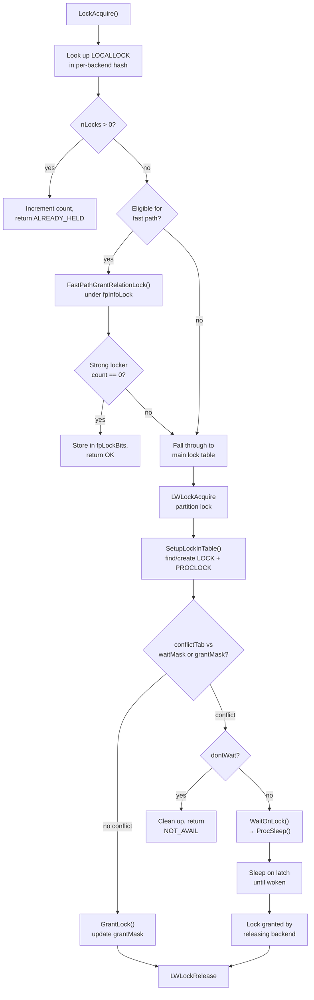
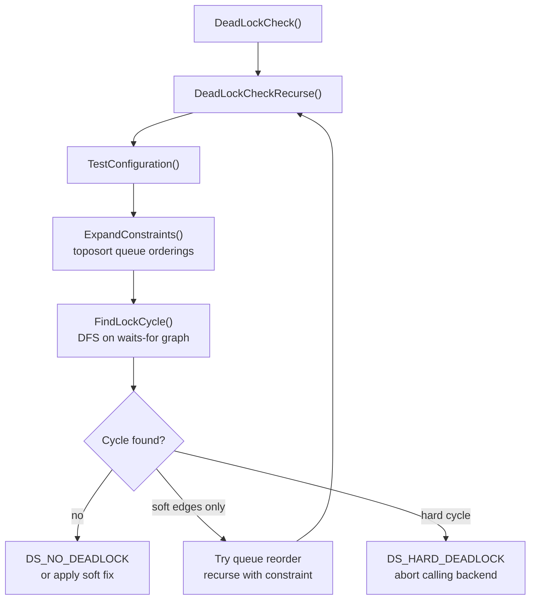

# Locking Subsystem Overview

PostgreSQL's locking subsystem mediates access to database objects between concurrent backends. It operates at multiple levels: coarse relation-level locks acquired at statement start, page and tuple locks taken during row operations, advisory locks managed by user code, and predicate locks used for serializable snapshot isolation. This article covers the heavyweight lock manager — the component backed by shared-memory hash tables. It is the foundation that all other levels build on.

The implementation lives primarily in `src/backend/storage/lmgr/lock.c`, with higher-level relation and tuple helpers in `lmgr.c`, deadlock detection in `deadlock.c`, and the per-backend wait infrastructure in `proc.c`.

## Lock Modes and the Conflict Table

The standard lock method defines eight lock modes, numbered 1–8 (`lock.c`, line 66):

| # | Name | SQL operations that acquire it |
|---|---|---|
| 1 | `AccessShareLock` | `SELECT` |
| 2 | `RowShareLock` | `SELECT FOR UPDATE/SHARE` |
| 3 | `RowExclusiveLock` | `INSERT`, `UPDATE`, `DELETE`, `MERGE` |
| 4 | `ShareUpdateExclusiveLock` | `VACUUM`, `ANALYZE`, `CREATE INDEX CONCURRENTLY` |
| 5 | `ShareLock` | `CREATE INDEX` (non-concurrent) |
| 6 | `ShareRowExclusiveLock` | `CREATE TRIGGER`, some forms of `ALTER TABLE` |
| 7 | `ExclusiveLock` | Blocks all DML; allows `AccessShareLock` only |
| 8 | `AccessExclusiveLock` | `DROP TABLE`, `TRUNCATE`, `REINDEX`, `LOCK TABLE` |

`LockConflicts[]` (`lock.c`, line 66) encodes the conflict semantics. It is a static bitmask array: entry `i` has a bit set for every mode `j` that conflicts with mode `i`. The full derived matrix is:

```
       AS  RS  RE  SUE  S  SRE  E  AE
AS      .   .   .   .   .   .   .   X
RS      .   .   .   .   .   .   X   X
RE      .   .   .   X   X   X   X   X
SUE     .   .   .   X   X   X   X   X
S       .   .   X   X   .   X   X   X
SRE     .   .   X   X   X   X   X   X
E       .   X   X   X   X   X   X   X
AE      X   X   X   X   X   X   X   X
```

`X` = conflict. Readers (`AccessShareLock`) conflict only with `AccessExclusiveLock`; writers (`RowExclusiveLock`) conflict with `ShareLock` and above; `ShareUpdateExclusiveLock` is self-conflicting. This prevents concurrent `VACUUM` runs on the same table.

## The LOCKTAG: Identifying Lockable Objects

A `LOCKTAG` (`lock.h`, line 164) is a 16-byte key that uniquely identifies any lockable object in the system. It carries four numeric fields, a type discriminator, and a lock-method identifier:

```c
typedef struct LOCKTAG {
    uint32 locktag_field1;
    uint32 locktag_field2;
    uint32 locktag_field3;
    uint16 locktag_field4;
    uint8  locktag_type;          /* LockTagType enum */
    uint8  locktag_lockmethodid;  /* DEFAULT_LOCKMETHOD or USER_LOCKMETHOD */
} LOCKTAG;
```

The `LockTagType` enum (`lock.h`, line 136) covers:

| Type | Locked object | Key fields |
|---|---|---|
| `LOCKTAG_RELATION` | Whole relation | db OID + rel OID |
| `LOCKTAG_RELATION_EXTEND` | Right to extend a relation | db OID + rel OID |
| `LOCKTAG_DATABASE_FROZEN_IDS` | `pg_database.datfrozenxid` | db OID |
| `LOCKTAG_PAGE` | One page of a relation | db OID + rel OID + block number |
| `LOCKTAG_TUPLE` | One physical tuple | db OID + rel OID + block + offset |
| `LOCKTAG_TRANSACTION` | Transaction (wait for XID done) | TransactionId |
| `LOCKTAG_VIRTUALTRANSACTION` | Virtual transaction | backend ID + local XID |
| `LOCKTAG_SPECULATIVE_TOKEN` | Speculative insert | XID + token |
| `LOCKTAG_OBJECT` | Non-relation database object | db OID + class OID + object OID + subid |
| `LOCKTAG_ADVISORY` | Advisory lock | four user-supplied integers |
| `LOCKTAG_APPLY_TRANSACTION` | Logical replication subscriber txn | db OID + subscription OID + XID + objid |

Because the LOCKTAG is the hash key, objects of any type share one hash table in shared memory. The `lockmethodid` byte lets advisory (`USER_LOCKMETHOD`) and regular (`DEFAULT_LOCKMETHOD`) locks coexist in the same table.

## Shared-Memory Data Structures

Three hash tables form the backbone of the lock manager (`lock.c`, lines 269–272):

- **`LockMethodLockHash`** — keyed by `LOCKTAG`; stores one `LOCK` per locked object.
- **`LockMethodProcLockHash`** — keyed by `PROCLOCKTAG` (a `(LOCK *, PGPROC *)` pair); stores one `PROCLOCK` per (object, backend) combination.
- **`LockMethodLocalHash`** — per-backend, not shared; stores `LOCALLOCK` structs with per-backend reference counts.

The lock manager partitions both shared tables into `NUM_LOCK_PARTITIONS` (128) independent [[subsystems/locking/lwlocks|LWLock]]-protected regions to reduce contention. A given lock object always belongs to the partition determined by the low-order bits of its hash code (`LockHashPartition(hashcode)`). The lock manager places its PROCLOCK entries in the same partition.

### The LOCK Struct

```c
typedef struct LOCK {
    LOCKTAG     tag;                          /* hash key */
    LOCKMASK    grantMask;                    /* bitmask of granted modes */
    LOCKMASK    waitMask;                     /* bitmask of awaited modes */
    dlist_head  procLocks;                    /* list of PROCLOCK objects */
    dclist_head waitProcs;                    /* priority wait queue of PGPROCs */
    int         requested[MAX_LOCKMODES];     /* request counts per mode */
    int         nRequested;
    int         granted[MAX_LOCKMODES];       /* grant counts per mode */
    int         nGranted;
} LOCK;
```

(`lock.h`, line 308.) `grantMask` is a bitmask of currently granted lock modes; it is the authoritative word on what is held on the object. `waitMask` covers modes currently being waited for. The lock manager updates both atomically when it grants or releases a lock. `requested[i]` counts the total number of requests for mode `i` including both granted and waiting requests; `granted[i]` counts only those actually granted.

### The PROCLOCK Struct

```c
typedef struct PROCLOCK {
    PROCLOCKTAG tag;          /* (LOCK *, PGPROC *) — hash key */
    PGPROC     *groupLeader;  /* for parallel workers */
    LOCKMASK    holdMask;     /* modes currently held by this backend */
    LOCKMASK    releaseMask;  /* modes to release (used by LockReleaseAll) */
    dlist_node  lockLink;     /* node in LOCK.procLocks */
    dlist_node  procLink;     /* node in PGPROC.myProcLocks[partition] */
} PROCLOCK;
```

(`lock.h`, line 369.) The lock manager creates a PROCLOCK as soon as a backend requests a lock, even before the lock is granted. `holdMask` starts at zero. `GrantLock()` sets it later. Backends that are merely waiting appear in the LOCK's `waitProcs` queue. Their PROCLOCK has `holdMask == 0` until the lock is awarded.

The `groupLeader` field supports parallel query: workers in a parallel group share the leader's locks, so they are not blocked by each other.

### The LOCALLOCK Struct

Each backend maintains a private hash table (`LockMethodLocalHash`) of `LOCALLOCK` entries. A `LOCALLOCK` counts how many times this backend holds a given (LOCKTAG, mode) pair. Because a backend can hold the same lock many times within a transaction (re-entrant locking), the local count allows re-entrant acquisitions to short-circuit the shared-memory path entirely. `LockAcquire()` (`lock.c`, line 895) detects re-entry before touching any shared state. The `lockOwners` array inside `LOCALLOCK` tracks which [[subsystems/memory/resource-owner|ResourceOwner]] subtransaction context holds each count, enabling fine-grained release at subtransaction abort.

## Acquiring a Lock

When a backend requests a lock it does not already hold, the manager must determine whether to grant it immediately or enqueue the backend as a waiter. The fast-path (described below) handles the common case for weak relation locks; all other requests go through the main shared hash tables.



The conflict check (`LockCheckConflicts()`, `lock.c`, line 1430) embodies an important fairness rule: a new request must still wait if any earlier waiter is queued for a conflicting mode. This holds even if no conflicting lock is currently held. This prevents newer arrivals from jumping the queue and starving earlier requests. Beyond that, the check consults `grantMask`. It first subtracts out the backend's own already-held modes, since a backend never conflicts with itself (`LockAcquireExtended()`, `lock.c`, line 768).

## Waiting for a Lock

When a conflict occurs and the backend must wait, `ProcSleep()` (`proc.c`, line 1012) inserts it into the lock object's wait queue. The backend then sleeps on its personal latch. Queue insertion is not strictly FIFO: if the arriving backend already holds locks that conflict with an earlier waiter's request, the lock manager places it ahead of that waiter. This avoids certain immediately-detectable deadlocks without invoking the full deadlock checker.

After joining the queue, the backend releases the partition LWLock and arms a `DEADLOCK_TIMEOUT` timer (default 1 second, `proc.c`, line 1200), then sleeps:

```c
WaitLatch(MyLatch, WL_LATCH_SET | WL_EXIT_ON_PM_DEATH, 0,
          PG_WAIT_LOCK | locallock->tag.lock.locktag_type);
```

The releasing backend is responsible for waking waiters. When it calls `ProcLockWakeup()`, that function scans the wait queue and grants the lock to any compatible waiters by updating their `holdMask` and setting their latch. No window exists where the lock is unclaimed between release and re-grant: the granting logic completes entirely before the waiter is woken.

If `DEADLOCK_TIMEOUT` fires before the latch is set, the `SIGALRM` handler marks `got_deadlock_timeout`. The backend then invokes deadlock detection before returning to sleep (`CheckDeadLock()`, `proc.c`, line 1299).

## Deadlock Detection

PostgreSQL triggers deadlock detection only after the `DEADLOCK_TIMEOUT` has elapsed. This keeps the common non-deadlock case free of any cycle-checking overhead. When invoked, the detector must hold all partition LWLocks (acquired in order) to get a consistent snapshot of the waits-for graph.

The detector models the situation as a directed waits-for graph, where each node is a backend (or lock group leader) and each directed edge A → B means "A is waiting for a lock held by B." A deadlock exists if and only if this graph contains a cycle (`DeadLockCheck()`, `deadlock.c`, line 217).

### Hard and Soft Edges

The graph distinguishes two kinds of dependency (`deadlock.c`, line 46):

- **Hard edge**: A is waiting for a mode that B currently holds (`proclock->holdMask` conflicts with `checkProc->waitLockMode`). This cannot be resolved without aborting a transaction.
- **Soft edge**: A is behind B in the same lock's wait queue. B's requested mode conflicts with A's. This can be resolved by reordering the queue.

A DFS from the waiting backend follows both kinds of edges and returns true if it finds a cycle back to the start node (`FindLockCycle()`, `deadlock.c`, line 442).

### Resolution Strategy

Before concluding a hard deadlock, the detector tries to find a consistent reordering of wait queues — a *soft resolution* — that eliminates all cycles. Soft edges represent ordering constraints that are a matter of queue position rather than held locks. By trying different queue orderings, PostgreSQL can sometimes break a cycle without aborting any transaction. `DeadLockCheckRecurse()` (`deadlock.c`, line 308) tests each candidate ordering for topological consistency and then checks it for remaining cycles. If the detector finds a cycle-free ordering, it applies the reorderings and returns `DS_SOFT_DEADLOCK`, allowing all backends to continue.

If no soft resolution exists, the detector returns `DS_HARD_DEADLOCK`. The detector designates the backend that triggered the check as the victim. It sets that backend's `waitStatus` to `PROC_WAIT_STATUS_ERROR`. The sleep then unwinds with an error code. `DeadLockReport()` fires before the transaction is aborted. Aborting the checking backend rather than an arbitrary holder keeps the resolution predictable from the waiter's perspective.



## Fast-Path Locking

Most relation locks taken by ordinary queries are weak locks (`AccessShareLock`, `RowShareLock`, `RowExclusiveLock`) that rarely conflict. Routing these through the shared hash table is expensive because it requires acquiring an LWLock partition lock for every lock and unlock.

The fast-path mechanism bypasses the shared hash tables for eligible relation locks (`lock.c`, line 215):

```c
#define EligibleForRelationFastPath(locktag, mode) \
    ((locktag)->locktag_type == LOCKTAG_RELATION && \
     (locktag)->locktag_field1 == MyDatabaseId && \
     (mode) < ShareUpdateExclusiveLock)
```

Each `PGPROC` carries:
- `fpLockBits` — a 64-bit word with 3 bits per slot encoding the lock mode (`proc.h`, line 291).
- `fpRelId[FP_LOCK_SLOTS_PER_BACKEND]` — 16 OID slots for the locked relations (`proc.h`, line 292).
- `fpInfoLock` — a per-backend LWLock protecting these fields.

An eligible lock acquisition touches only the backend's own `fpInfoLock` rather than the global partition lock. It checks the shared counter `FastPathStrongRelationLocks->count[partition]` to confirm no strong locker is present, then stores the relation OID and mode bits in the per-backend slots (`FastPathGrantRelationLock()`). The entire operation touches no shared hash tables.

The `FastPathStrongRelationLocks` counter exists to maintain coherence between the two paths. Whenever a backend acquires a strong lock (mode ≥ `ShareUpdateExclusiveLock`) on any relation, it increments the counter for that partition under a spinlock (`lock.c`, line 1740). A non-zero counter forces any concurrent fast-path attempt in that partition to fall through to the main lock table instead. In addition, when a strong lock is acquired, `FastPathTransferRelationLocks()` (`lock.c`, line 986) migrates any existing fast-path locks on that relation into the shared hash table. This lets the deadlock detector see them.

The eligibility check excludes `ShareUpdateExclusiveLock` from the fast path because it is self-conflicting. The fast-path slots hold modes 1–3 only (3 bits per slot accommodate values 0–7, but mode 0 is unused, and the eligibility check disqualifies modes ≥ 4).

## Tuple-Level Locking and MultiXact

Heavyweight locks are too coarse for row-level visibility: acquiring one per modified row would require O(rows) lock table entries. Instead, row locks are encoded directly in the tuple header's `t_xmax` field.

The four tuple lock strengths are (`src/include/nodes/lockoptions.h`, line 49):

| Mode | SQL syntax | `t_xmax` usage |
|---|---|---|
| `LockTupleKeyShare` | `SELECT FOR KEY SHARE` | XID set, `HEAP_XMAX_KEYSHR_LOCK` bit |
| `LockTupleShare` | `SELECT FOR SHARE` | XID set, `HEAP_XMAX_SHR_LOCK` bit |
| `LockTupleNoKeyExclusive` | `SELECT FOR NO KEY UPDATE` | XID set, `HEAP_XMAX_EXCL_LOCK` bit |
| `LockTupleExclusive` | `SELECT FOR UPDATE`, `DELETE` | XID set, both excl bits |

When a second transaction wants to lock a tuple that is already locked, `t_xmax` cannot hold two transaction IDs. PostgreSQL resolves this with `MultiXactId`: a synthetic XID that represents a *set* of transactions. The `pg_multixact` subsystem stores the member list. The tuple's `t_xmax` is replaced with the MultiXactId, and the `HEAP_XMAX_IS_MULTI` flag is set (`src/include/access/htup_details.h`, line 209).

A backend waiting on a tuple lock suspends against the `LOCKTAG_TRANSACTION` tag of the holding XID via `XactLockTableWait()` (`lmgr.c`), resuming when the holding transaction commits or aborts. For a MultiXact, the backend waits on each member XID in turn.

The four tuple modes form a compatibility matrix mirroring the relation-level one: `KeyShare` is compatible with everything except `NoKeyExclusive` and `Exclusive`; `Exclusive` conflicts with all other modes.

## Advisory Locks

Advisory locks use `USER_LOCKMETHOD` and `LOCKTAG_ADVISORY` with four user-supplied integers as the key. They are acquired and released by explicit user calls (`pg_advisory_lock`, `pg_advisory_unlock`, etc.) rather than by SQL statement lifecycle. Advisory locks can be transaction-scoped (released automatically at commit/rollback) or session-scoped (persist until explicit release or session end). Both varieties flow through the same `LockAcquire` / `LockRelease` path as ordinary locks. No special internal machinery exists; the separation comes entirely from passing `sessionLock = true` vs. `false` to `LockAcquire`.

## Predicate Locks (SSI)

Serializable snapshot isolation, implemented in `src/backend/storage/lmgr/predicate.c`, maintains a separate set of *predicate locks* that track read-set membership rather than mutual exclusion. A predicate lock records that a transaction has read from a particular relation, page, or tuple. The serializable conflict detector (`CheckForSerializableConflictOut`, `CheckForSerializableConflictIn`) uses these to detect rw-anti-dependency cycles that could produce non-serializable results.

Predicate locks do not block; they never cause a backend to sleep. Conflicts are detected post-hoc and result in a serialization failure error. The predicate lock subsystem is entirely separate from the heavyweight lock manager described in this article — it has its own shared-memory structures (`SERIALIZABLEXACT`, `PREDICATELOCK`, `PREDICATELOCKTARGET`) and its own conflict-checking logic. See `src/include/storage/predicate.h` for the interface, and [[subsystems/transactions/mvcc]] for the surrounding MVCC context.

## Lock Release

A lock release is designed to be cheap in the common case. The backend decrements its local reference count in `LOCALLOCK`. Only when that count reaches zero does it acquire the partition LWLock and touch shared memory. At that point, `grantMask` and the request/grant counters are adjusted. If no other backend holds or waits for the lock, the LOCK and PROCLOCK entries are removed from the shared hash tables (`LockRelease()`, `lock.c`, line 1959). If waiters are present, the lock is handed off immediately: `ProcLockWakeup()` scans the wait queue, grants the lock to any compatible waiter, and sets that waiter's latch, all before releasing the partition LWLock. This leaves no window where the object is unprotected.

At transaction end, all transaction-scoped locks are released in a single pass over both the default and advisory lock methods (`ProcReleaseLocks()`, `proc.c`, line 773). Session-scoped locks (those acquired with `sessionLock = true`) survive transaction boundaries and are only released by explicit unlock calls or session termination.

## Shared-Memory Sizing

The lock table capacity is governed by `max_locks_per_transaction` (default 64). Total lock entries are computed as:

```c
NLOCKENTS() = max_locks_per_xact * (MaxBackends + max_prepared_xacts)
```

(`lock.c`, line 57.) Running out of lock table space produces an `out of shared memory` error with a hint to increase `max_locks_per_transaction`. Fast-path locks do not consume entries in `LockMethodLockHash` and do not count toward this limit.

## Related Topics

- [[subsystems/locking/lwlocks|LWLocks]] — the lightweight locks used to protect the shared hash-table partitions inside the lock manager itself.
- [[subsystems/locking/deadlock|Deadlock Detection]] — deeper coverage of the waits-for graph, soft-edge resolution, and the DeadLockCheck algorithm.
- [[subsystems/locking/predicate-locking|Predicate Locking]] — the separate SSI lock subsystem that tracks read-sets to detect rw-anti-dependency cycles without blocking.
- [[subsystems/locking/row-level-locking|Row-Level Locking]] — how tuple-header bits, MultiXactId, and XactLockTableWait implement fine-grained row locks on top of the heavyweight manager.
- [[subsystems/locking/advisory-locks|Advisory Locks]] — user-managed locks that share the same LockAcquire/LockRelease path with a distinct lock method ID.
- [[subsystems/transactions/mvcc|MVCC]] — the snapshot and visibility layer that works alongside locking to provide isolation.
- [[troubleshooting/lock-waits|Lock Waits]] — practical guidance on diagnosing and resolving lock contention using pg_locks and wait-event data.
