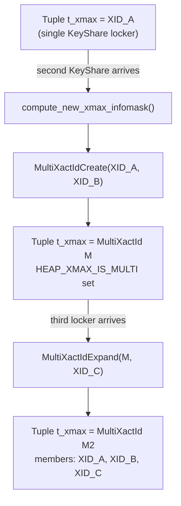
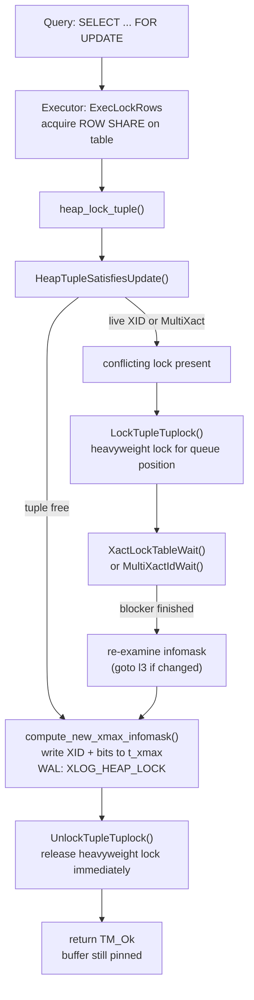

# Row-Level Locking

Row-level locking lets transactions claim exclusive or shared control over individual tuples without serialising the entire table. A referential integrity check needs to know that a referenced row will not disappear under it, but has no interest in preventing updates to non-key columns. An `UPDATE` that only touches a comment column need not conflict with a foreign-key check on the primary-key column. PostgreSQL exposes four distinct locking strengths precisely to capture these distinctions. It also stores the lock state directly in the tuple header rather than in the shared-memory lock table — a design that scales to millions of locked rows without exhausting any finite data structure.

## The Four Lock Modes

The SQL clauses `SELECT FOR KEY SHARE`, `SELECT FOR SHARE`, `SELECT FOR NO KEY UPDATE`, and `SELECT FOR UPDATE` map to an ordered four-level hierarchy defined in `LockTupleMode` (lockoptions.h):

| SQL clause | Internal mode | Typical operation |
|---|---|---|
| `FOR KEY SHARE` | `LockTupleKeyShare` | FK enforcement, advisory reads requiring key stability |
| `FOR SHARE` | `LockTupleShare` | Reads that must see a stable, non-modifiable row |
| `FOR NO KEY UPDATE` | `LockTupleNoKeyExclusive` | `UPDATE` touching only non-key columns |
| `FOR UPDATE` | `LockTupleExclusive` | `UPDATE` touching key columns, `DELETE`, `SELECT FOR UPDATE` |

The conflict rules are asymmetric by design. Each mode conflicts only with modes that would produce an incompatible outcome, not with everything stronger than it:

```
              UPDATE   NO KEY UPDATE   SHARE   KEY SHARE
UPDATE        block       block        block     block
NO KEY UPDATE block       block        block
SHARE         block       block
KEY SHARE     block
```

`FOR KEY SHARE` conflicts only with `FOR UPDATE` — the one operation that changes or removes the key columns the locker is interested in. `FOR NO KEY UPDATE` conflicts with `FOR SHARE` and above, but not with another `FOR NO KEY UPDATE` on the same row. Two non-key updates on a row still cannot both succeed: one must win and invalidate the other's version. `FOR UPDATE` conflicts with everything.

The KeyShare/Share distinction is the most non-obvious design decision in this table. It exists entirely to enable concurrency between foreign-key checks and non-key updates.

When a row is inserted into a child table, the trigger system acquires `FOR KEY SHARE` on the corresponding parent row to prevent its key from being deleted or updated to a different value. At the same time, another backend may be running `UPDATE parent SET description = 'new'` — a non-key update. `FOR KEY SHARE` is compatible with `LockTupleNoKeyExclusive`, so the non-key update succeeds immediately without waiting. Had foreign-key checks used `FOR SHARE`, they would conflict with `LockTupleNoKeyExclusive`, serialising all non-key parent updates against every child insert. In write-heavy workloads with large reference tables, this serialisation is a significant bottleneck that KeyShare eliminates.

The heap update code in `heap_update()` explicitly checks whether the modified attributes overlap with the relation's key attributes (heapam.c, around line 3239). If they do not, it acquires `LockTupleNoKeyExclusive` and sets `MultiXactStatusNoKeyUpdate`; if they do, it acquires `LockTupleExclusive` and sets `MultiXactStatusUpdate`. This automatic downgrade to a weaker lock strength is transparent to the SQL layer. No syntax forces one or the other; the engine chooses based on what the `UPDATE` actually changes.

### Implicit Acquisition by DML

Explicit `SELECT FOR ...` syntax is the user-visible surface. DML acquires the same lock modes implicitly:

- `DELETE` stamps the old tuple with `LockTupleExclusive` (it must change the key, in the sense that the row disappears).
- `UPDATE` touching key columns uses `LockTupleExclusive`; touching only non-key columns uses `LockTupleNoKeyExclusive`.
- `INSERT ... ON CONFLICT DO UPDATE` may acquire `LockTupleExclusive` on the conflicting row.

These implicit acquisitions share all the same infrastructure as explicit `SELECT FOR UPDATE`.

## Storing Locks in the Tuple Header

Relational databases conventionally record locks in shared memory. Row locks are impractical there because a single transaction can lock an unbounded number of rows — one lock manager entry per row would exhaust shared memory on any large scan. PostgreSQL avoids this by encoding the lock state directly into the tuple header fields that already exist for MVCC bookkeeping.

Every heap tuple has a `t_xmax` field (the transaction ID of the last deleter or locker) and two infomask words. When a transaction locks a row without deleting it, it writes its own XID into `t_xmax` and sets a combination of infomask bits that distinguishes a lock-only entry from an actual deletion:

| Infomask bit | Meaning |
|---|---|
| `HEAP_XMAX_LOCK_ONLY` | `t_xmax` is a locker, not a deleter |
| `HEAP_XMAX_KEYSHR_LOCK` | `FOR KEY SHARE` strength |
| `HEAP_XMAX_SHR_LOCK` | `FOR SHARE` strength (= `EXCL_LOCK \| KEYSHR_LOCK`) |
| `HEAP_XMAX_EXCL_LOCK` | `FOR NO KEY UPDATE` or `FOR UPDATE` strength |
| `HEAP_XMAX_IS_MULTI` | `t_xmax` is a MultiXactId, not a plain XID |
| `HEAP_XMAX_INVALID` | No valid locker or deleter present |
| `HEAP_KEYS_UPDATED` (infomask2) | Operation touches key columns (`FOR UPDATE`, key-modifying `UPDATE`, `DELETE`) |

`HEAP_XMAX_EXCL_LOCK` alone cannot distinguish `FOR NO KEY UPDATE` from `FOR UPDATE`; the `HEAP_KEYS_UPDATED` bit in `t_infomask2` carries that distinction. Visibility routines check `HEAP_XMAX_LOCK_ONLY` to decide whether a non-null `t_xmax` represents a deletion (which creates a dead tuple for a later snapshot) or merely a lock (which does not).

This design means row locks do not create new tuple versions. A locked tuple looks exactly like an unlocked one from MVCC's perspective. The same physical row is visible to concurrent readers. But it carries a "this XID has dibs" annotation in `t_xmax` that causes conflicting writers to wait. Because `t_xmax` is the same slot used by deleting transactions, a tuple cannot simultaneously record a lock and a committed deletion. The lock must be cleared (or superseded into a MultiXact containing the deleter) before a committed delete can be recorded.

### No Explicit Lock Release

A key consequence of this design is that row locks require no explicit release operation at transaction end. When a transaction commits or aborts, its XID transitions from "in progress" to "committed" or "aborted" in `pg_xact`. Any backend that subsequently reads the tuple and finds the XID in `t_xmax` will call `TransactionIdDidCommit()` or `TransactionIdDidAbort()`. For a locker-only transaction that committed, the code in `UpdateXmaxHintBits()` (heapam.c) sets `HEAP_XMAX_INVALID`, as if no lock had ever been present. This is because a committed lock has no effect on the row's visibility or modifiability. For a deleter that committed, it sets `HEAP_XMAX_COMMITTED`. This lazy evaluation means the per-tuple infomask is updated by the first reader after the transaction ends, not by the committing transaction itself. No "unlock all rows" step exists at commit time.

The lock manager's assertion code captures this invariant: in `DEBUG` builds, the heavyweight lock release loop emits a warning if a `LOCKTAG_TUPLE` lock is still held at commit (lock.c, line 2261). That warning is a bug indicator, not a normal event — tuple heavyweight locks are always released immediately after the infomask has been written (see below).

```mermaid
stateDiagram-v2
    [*] --> Unlocked : INSERT sets t_xmax = 0
    Unlocked --> LockedSingle : SELECT FOR ... writes XID + LOCK_ONLY bits
    LockedSingle --> LockedMulti : Second compatible locker arrives
    LockedMulti --> LockedMulti : Additional lockers expand the MultiXact
    LockedSingle --> Unlocked : Locker txn ends; HEAP_XMAX_INVALID set lazily by next reader
    LockedMulti --> Unlocked : All member txns end; HEAP_XMAX_INVALID set lazily
    Unlocked --> Deleted : UPDATE or DELETE writes deleter XID
    LockedSingle --> Deleted : Locker txn updates the same row
    LockedMulti --> Deleted : Updater member folded in via compute_new_xmax_infomask
    Deleted --> [*] : VACUUM removes the dead tuple
```



## MultiXact: Concurrent Lockers

A single `t_xmax` slot holds one XID. Two transactions simultaneously holding `FOR KEY SHARE` on the same row — an entirely valid state given the conflict table above — cannot both fit their XIDs into the four-byte field. PostgreSQL resolves this with the MultiXact subsystem.

When a second locker arrives and finds a live XID already in `t_xmax`, the lock machinery (via `compute_new_xmax_infomask()` in heapam.c) allocates a new `MultiXactId` that records both transactions as members, each tagged with its `MultiXactStatus`. The `MultiXactId` replaces the plain XID in `t_xmax`. `HEAP_XMAX_IS_MULTI` is set. Future lockers expand the MultiXact further via `MultiXactIdExpand()`.

Each `MultiXactMember` carries a `MultiXactStatus` flag that encodes both the member's lock strength and whether it is a pure locker or an active updater:

| MultiXactStatus | Lock strength | Role |
|---|---|---|
| `MultiXactStatusForKeyShare` | KeyShare | locker only |
| `MultiXactStatusForShare` | Share | locker only |
| `MultiXactStatusForNoKeyUpdate` | NoKeyExclusive | locker only |
| `MultiXactStatusForUpdate` | Exclusive | locker only |
| `MultiXactStatusNoKeyUpdate` | NoKeyExclusive | updater |
| `MultiXactStatusUpdate` | Exclusive | updater |

The six status values cover four explicit locking strengths plus two update strengths, because an in-progress update records itself in a MultiXact differently from a mere lock. An updater member means the row has been replaced by a new version; a locker member means the row is still the live version and only access is being controlled.

The MultiXact data lives in two SLRU areas under `pg_multixact/`: one mapping `MultiXactId` to a starting offset, and one storing the actual `(TransactionId, flags)` member arrays. These are small relative to `pg_xact`, because MultiXacts arise only when rows are concurrently locked. Most rows are either unlocked or held by a single locker. VACUUM is responsible for removing old MultiXact segments once all member transactions are known to be complete and the minimum live `MultiXactId` across all tables has advanced past them.



## Lock Upgrade

A transaction that already holds a weak lock on a row — say `FOR KEY SHARE` acquired by a foreign-key check — may later need to acquire a stronger lock on that same row, for example when that same transaction now updates the parent row. Rather than acquiring a fresh lock independently, `heap_lock_tuple()` detects self-overlap. This happens when the current XID is already a member of the MultiXact in `t_xmax`, and the requested mode is stronger than what is already held. In that case, it promotes the existing membership rather than waiting.

The promotion skips the heavyweight `LockTuple()` call that ordinary waiters must use, controlled by the `skip_tuple_lock` flag in `heap_lock_tuple()` (heapam.c, around line 4509). The reason for skipping is deadlock avoidance. Consider what would happen if the upgrading session waited on the tuple heavyweight lock while holding its existing infomask-level lock. If another session had already acquired the heavyweight lock and was itself waiting for the first session's XID to finish, the two would deadlock permanently. By skipping the heavyweight acquisition and instead waiting only for any conflicting MultiXact members (other than itself) to finish, the session avoids the deadlock trap.

When the current transaction holds the same or stronger lock already, `heap_lock_tuple()` returns `TM_Ok` immediately without re-locking (heapam.c, lines 4520–4545). The four cases for a non-multi xmax are:

- `LockTupleKeyShare` requested: any existing lock of any strength suffices.
- `LockTupleShare` requested: an existing Share or Exclusive lock suffices.
- `LockTupleNoKeyExclusive` requested: an existing Exclusive lock suffices.
- `LockTupleExclusive` requested: an existing Exclusive lock with `HEAP_KEYS_UPDATED` set suffices.

## Waiting for a Conflicting Locker

When a transaction encounters a conflicting lock, it follows a two-level wait protocol. The purpose of using two levels is to separate queue management (who gets the lock next) from conflict detection (who is actually blocking).

### The Heavyweight Lock as a Queue

The first level uses the standard lock manager's heavyweight locks keyed on the tuple's physical location (`LOCKTAG_TUPLE`). Each tuple lock mode maps to a `LOCKMODE` from the conventional lock hierarchy (heapam.c, `tupleLockExtraInfo`):

| Tuple mode | Heavyweight LOCKMODE |
|---|---|
| `LockTupleKeyShare` | `AccessShareLock` |
| `LockTupleShare` | `RowShareLock` |
| `LockTupleNoKeyExclusive` | `ExclusiveLock` |
| `LockTupleExclusive` | `AccessExclusiveLock` |

The `LockTupleTuplock()` macro (heapam.c, line 184) translates between the two: `LockTupleTuplock(rel, tup, mode)` calls `LockTuple(rel, tup, tupleLockExtraInfo[mode].hwlock)`. The waiter acquires this heavyweight lock before it sleeps on the XID. Once the blocking transaction finishes and the waiter wakes, it re-examines the tuple with the buffer latch held. If another transaction has modified the infomask in the meantime, the code jumps back to label `l3` (the start of the function's main check loop). The whole analysis then repeats.

Critically, this heavyweight lock is held only transiently — for just long enough to ensure queue ordering and to record the waiter's intention. It is released immediately after the new infomask has been written to the tuple (heapam.c, `UnlockTupleTuplock`, line 5062). The lock manager's shared-memory table therefore never accumulates one entry per locked row; at most one tuple-level heavyweight lock per backend exists at any given moment.

### Waiting on the Transaction

After acquiring the heavyweight lock, the waiter sleeps on the actual blocking XID or MultiXact:

- For a plain XID in `t_xmax`, `XactLockTableWait()` is used.
- For a MultiXact in `t_xmax`, `MultiXactIdWait()` iterates the member list and waits on each conflicting member XID.

`SKIP LOCKED` and `NOWAIT` modify this behavior via the `wait_policy` parameter (`LockWaitSkip` and `LockWaitError` respectively). With `SKIP LOCKED`, `ConditionalLockTupleTuplock()` is attempted; if it fails, the row is silently skipped (`TM_WouldBlock` is returned). With `NOWAIT`, the conditional attempt is used as well. Failure raises an error.

## Row lock acquisition mechanics

All explicit row locking flows through a single entry point (`heap_lock_tuple()`, heapam.c line 4378), which pins and exclusively latches the buffer containing the target tuple, then calls `HeapTupleSatisfiesUpdate()` to determine the current state:

- If `t_xmax` is invalid or the prior locker has committed or aborted, the tuple is free and the function proceeds immediately to stamp the new XID.
- If `t_xmax` holds a live XID or MultiXact, the function enters the two-level wait protocol.
- If the current session already holds a lock at least as strong as requested, it returns `TM_Ok` without re-locking.

The infomask manipulation is isolated in `compute_new_xmax_infomask()`, which handles all combinations: no prior lock, existing plain XID (locker or updater), existing MultiXact still running, and existing MultiXact fully done. The function emits a WAL record (`XLOG_HEAP_LOCK`) so that crash recovery can reconstruct the lock state. Without this, a crash between locking the tuple and completing a subsequent operation would leave `t_xmax` pointing to an aborted XID, which MVCC would treat as invalid. More importantly, any newly allocated `MultiXactId` or XID that had not yet appeared in any previous WAL record must be covered by a record before the page is written to disk. This prevents those IDs from being reused after a crash (heapam.c, line 5008–5015).

## Interaction with MVCC

Because a lock-only `t_xmax` does not advance `t_ctid` to a new tuple version, MVCC visibility is unaffected by whether a row is currently locked. A snapshot taken before a lock acquisition sees the same row as a snapshot taken after; the `HEAP_XMAX_LOCK_ONLY` bit tells visibility code to ignore the XID for tuple visibility purposes.

### Locked Tuples Are Visible but May Not Be Modifiable

A locked tuple is fully visible to concurrent readers. The lock creates no gap in visibility. The only effect from a reader's perspective involves writers. If a subsequent `UPDATE` or `DELETE` needs to modify that row, it may need to wait for the locking transaction to complete. This is because the infomask records a live XID that is incompatible with writing.

### EvalPlanQual for Concurrent Updates

`SELECT FOR UPDATE` (and by extension `FOR SHARE`, `FOR NO KEY UPDATE`, `FOR KEY SHARE`) combined with the `follow_updates` parameter handles the case where the target row was concurrently updated between the time the scan found it and the time the lock was acquired. If `heap_lock_tuple()` returns `TM_Updated` (meaning the row has been superseded by a newer version via `t_ctid`), the executor invokes `EvalPlanQual()` to recheck whether the updated version of the row still satisfies the query's WHERE clause. If it does, the new version is returned to the client. This re-evaluation is necessary because the row the plan originally found may no longer be the live version. The plan must be re-run against the version that was actually locked.

For `FOR KEY SHARE` specifically, if the concurrent update did not touch key columns (`HEAP_KEYS_UPDATED` is not set), the lock attempt can proceed without waiting at all. The key the locker cares about is intact in whatever version exists. The code skips the sleep entirely and follows the update chain to lock the new version as well (`follow_updates` path, heapam.c line 4592), preventing a subsequent delete from removing the key out from under the locker.

### Preserving Lockers Across Updates

The shared slot between locks and deletes has one consequential implication for updates: when `heap_update()` processes a tuple that already carries a lock-only `t_xmax`, it must preserve any surviving lockers rather than simply overwriting them. If the existing lock is still live (e.g., `FOR KEY SHARE` held by an ongoing foreign-key check), the update calls `compute_new_xmax_infomask()` with `is_update = true` to fold both the lock and the update XID into a new MultiXact. The new tuple version's own `t_xmax` then carries any surviving `FOR KEY SHARE` lockers. They continue to protect their interest in the key columns even after the update has written a replacement row (heapam.c, line 3560–3569).

## Table-Level Locks

Row locks never stand alone. Before any row lock is acquired, the executor takes a table-level lock to prevent DDL from removing the table out from under the row-locking session. `SELECT FOR UPDATE` and `SELECT FOR NO KEY UPDATE` acquire `ROW EXCLUSIVE` at the table level; `SELECT FOR SHARE` and `SELECT FOR KEY SHARE` acquire `ROW SHARE`. These table-level lock modes conflict with `ACCESS EXCLUSIVE` (taken by `DROP TABLE`, `TRUNCATE`, and schema-altering `ALTER TABLE`), but not with each other. As a result, concurrent readers and row-lockers do not block one another at the table level. The combination of table-level `ROW SHARE` / `ROW EXCLUSIVE` plus tuple-level infomask encoding is what allows PostgreSQL to scale row locking to arbitrarily large working sets while still protecting against DDL hazards.

## Full Locking Flow



## See Also

- [[subsystems/locking/overview]] — lock manager architecture and the heavyweight lock table
- [[subsystems/transactions/mvcc]] — how `t_xmax` and infomask bits interact with snapshot visibility
- [[subsystems/storage/buffer-manager]] — buffer pinning and latching that protects infomask writes
- [[code-paths/vacuum]] — MultiXact segment removal and tuple freezing
- [[code-paths/insert]] — how new tuples initialise `t_xmax` to `InvalidTransactionId`

## Related Topics

- [[subsystems/transactions/select-for-update|SELECT FOR UPDATE]] — how the parser and planner surface these lock modes through the `LockRows` node and the EvalPlanQual retry loop
- [[subsystems/locking/row-locking-patterns|Row Locking Patterns]] — practical guidance for choosing a lock strength and combining it with `NOWAIT` or `SKIP LOCKED`
- [[subsystems/locking/deadlock|Deadlock Detection]] — how PostgreSQL detects and resolves deadlocks that can arise when transactions wait for conflicting row locks
- [[subsystems/locking/predicate-locking|Predicate Locking]] — the separate SIREAD lock mechanism used for serialisable snapshot isolation, complementing tuple-level locking
- [[subsystems/transactions/multixact|MultiXact Internals]] — deep dive into the SLRU-backed subsystem that stores concurrent locker membership lists
- [[subsystems/transactions/hint-bits|Hint Bits]] — how `UpdateXmaxHintBits()` lazily caches committed/aborted state in the tuple header to avoid repeated `pg_xact` lookups
- [[subsystems/transactions/isolation-levels|Isolation Levels]] — how `SELECT FOR UPDATE` and weaker modes interact with READ COMMITTED and REPEATABLE READ semantics
- [[subsystems/storage/heap|Heap Storage]] — physical layout of the heap page and tuple header fields (`t_xmax`, `t_infomask`) that row locking writes into
