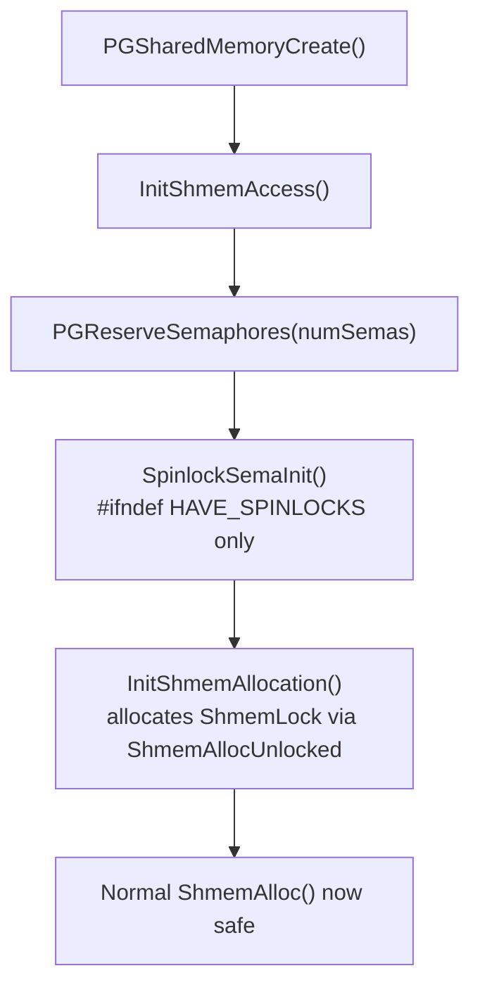

`spin.c` handles one specific concern: bootstrapping spinlock support during shared memory initialization. It also provides a complete semaphore-backed fallback on platforms that lack hardware test-and-set instructions. On the vast majority of production platforms, PostgreSQL takes the fast path through `s_lock.h` hardware atomics. `spin.c` contributes nothing at runtime except two tiny sizing functions. Its significance lies in the initialization ordering it enforces. It also lies in the correctness properties it preserves during that window before any spinlock can be used.

## Two Separate Concerns in One File

`spin.c` has a dual personality controlled by the `HAVE_SPINLOCKS` preprocessor define. When the define is present (x86, ARM, PPC, and virtually every modern platform), the build compiles only `SpinlockSemas()` and `SpinlockSemaSize()` into the binary. Both functions return zero. They exist solely to participate in the `CalculateShmemSize()` accounting in `ipci.c` without requiring callers to special-case the platform. When `HAVE_SPINLOCKS` is absent, the build compiles in the full emulation layer. Those functions then return meaningful values.

The `NUM_EMULATION_SEMAPHORES` macro unifies this:

```c
#ifndef HAVE_SPINLOCKS
  #ifndef HAVE_ATOMICS
    #define NUM_EMULATION_SEMAPHORES (NUM_SPINLOCK_SEMAPHORES + NUM_ATOMICS_SEMAPHORES)
  #else
    #define NUM_EMULATION_SEMAPHORES (NUM_SPINLOCK_SEMAPHORES)
  #endif
#else
  #define NUM_EMULATION_SEMAPHORES 0
#endif
```

PostgreSQL defines the constants in `src/include/pg_config_manual.h`: `NUM_SPINLOCK_SEMAPHORES` is 128 and `NUM_ATOMICS_SEMAPHORES` is 64. These values are compile-time limits on the pool of OS semaphores available to the emulation layer. Changing them requires recompiling.

## The Initialization Ordering Problem

The most subtle property of `spin.c` is how `SpinlockSemaInit()` works around a chicken-and-egg constraint. Spinlocks must be available before any code can call `ShmemAlloc()`. This is because `ShmemAlloc()` acquires `ShmemLock` (itself a spinlock) to serialize access to the shared memory freelist. But allocating memory for the spinlock emulation array requires... calling an allocator.

The resolution is `ShmemAllocUnlocked()`, a lower-level routine that bumps the shared memory offset without acquiring any lock (ShmemAllocUnlocked(), shmem.c). `SpinlockSemaInit()` calls it explicitly:

```c
spinsemas = (PGSemaphore *) ShmemAllocUnlocked(SpinlockSemaSize());
for (i = 0; i < nsemas; ++i)
    spinsemas[i] = PGSemaphoreCreate();
SpinlockSemaArray = spinsemas;
```

This is safe at the moment it runs because the postmaster is single-threaded and no backend has forked yet. After this call returns, `SpinlockSemaArray` holds valid entries. Any subsequent `S_INIT_LOCK` / `TAS` / `S_UNLOCK` calls can then find their semaphore by index lookup.

The call sequence in `CreateSharedMemoryAndSemaphores()` (ipci.c) makes the ordering explicit:



`SpinlockSemaInit()` must follow `PGReserveSemaphores()`. The semaphores it calls `PGSemaphoreCreate()` on must already be registered with the OS. It must precede `InitShmemAllocation()` because that function initializes `ShmemLock`. `ShmemLock`'s `SpinLockInit()` call sets `slock_t` to a valid semaphore index.

## How Emulated Spinlocks Map to Semaphores

In the emulation, `slock_t` is a plain `int` holding a 1-based index into `SpinlockSemaArray`. A value of 0 is intentionally invalid, so uninitialized locks trigger a bounds check rather than silently using the wrong semaphore (`s_check_valid()`, spin.c). The TAS operation becomes `PGSemaphoreTryLock`. This call is non-blocking. It returns false if the semaphore is already zero — the equivalent of the atomic test failing:

```c
int
tas_sema(volatile slock_t *lock)
{
    int lockndx = *lock;
    s_check_valid(lockndx);
    /* TAS macros return 0 if *success* */
    return !PGSemaphoreTryLock(SpinlockSemaArray[lockndx - 1]);
}
```

Unlock posts the semaphore back to 1. This is a binary semaphore pattern. The semaphore starts at 1 (unlocked). Acquiring decrements it to 0 (locked). Releasing increments it back to 1.

## The Nested Atomics Problem

A second correctness constraint appears in `s_init_lock_sema()`. PostgreSQL emulates atomic CAS operations via spinlocks when `HAVE_ATOMICS` is not defined. If that emulated atomic operation were to execute inside an existing spinlock critical section, both would compete for the same semaphore index. This would cause a deadlock.

The `nested` parameter to `s_init_lock_sema()` separates the two pools:

| Pool | Offset into array | Count |
|---|---|---|
| Normal spinlocks | 1 | `NUM_SPINLOCK_SEMAPHORES` (128) |
| Atomic-emulation spinlocks | 1 + `NUM_SPINLOCK_SEMAPHORES` | `NUM_ATOMICS_SEMAPHORES` (64) |

Spinlocks initialized with `nested=false` draw from the first pool; those backing atomic emulation use `nested=true` and draw from the second. Because an atomic operation inside a spinlock critical section always draws its lock from a different semaphore than the outer lock, the nesting is safe.

Assignment is round-robin using a static counter:

```c
idx = (counter++ % sema_total) + offset;
```

Multiple logical spinlocks map onto the same underlying semaphore. This is deliberate. The comment in `spin.c` explains that no process should hold more than one spinlock at a time. As a result, mapping N spinlocks onto a smaller pool of semaphores only adds contention, not correctness problems. Keeping the pool small (128 semaphores) reduces the consumption of OS semaphores to a manageable level, since each semaphore is a kernel-managed object.

## Performance Characteristics of the Fallback

Every acquire and release in the emulation path involves a `semop(2)` or equivalent system call. Historical PostgreSQL benchmarks showed the emulation consuming roughly 40% of total CPU time in configurations relying on it. This is not a tunable problem; it is fundamental to the cost of a kernel call versus a single atomic instruction. The fallback exists only to allow PostgreSQL to build and run correctly on architectures where no TAS primitive is accessible from C, not as a practical production configuration.

On any platform where `HAVE_SPINLOCKS` is defined, none of the emulation code is reachable at runtime. `SpinlockSemas()` returns 0. `SpinlockSemaSize()` also returns 0. PostgreSQL reserves no semaphores for this purpose.

## Related Topics

- [[subsystems/locking/spinlocks|Spinlocks]] — the full spinlock mechanism: hardware TAS implementations, the `s_lock()` wait loop, `SpinDelayStatus`, and which shared structures use spinlocks
- [[subsystems/locking/lwlocks|LWLock]] — the next level up; LWLock state words use embedded spinlets that also depend on the initialization established here
