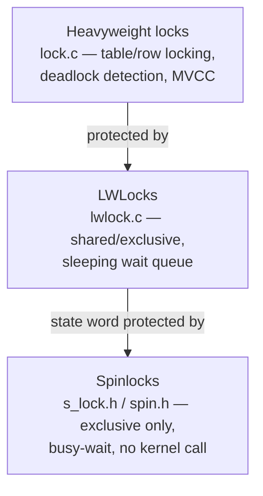
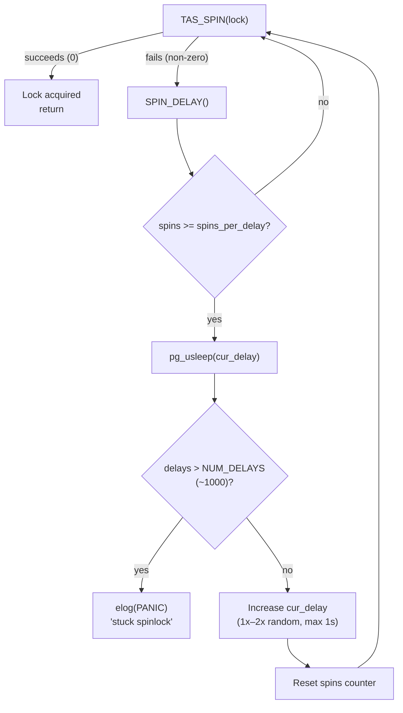
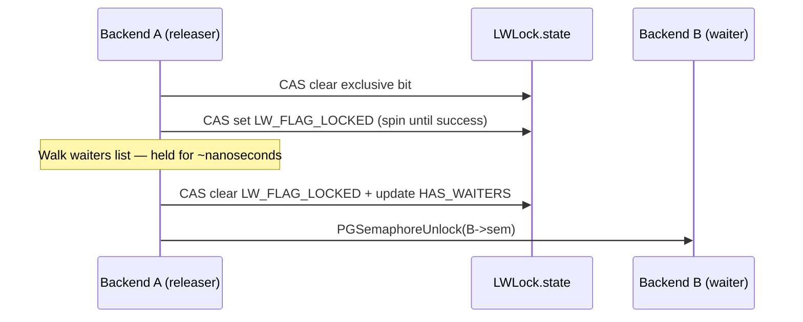

# Spinlocks

A spinlock is the simplest and fastest mutual-exclusion primitive in PostgreSQL. It is a single integer in shared memory that flips between zero (free) and one (held) using a single atomic CPU instruction. A backend that wants to acquire a spinlock executes that instruction in a tight loop — *spinning*. It continues until it succeeds. There is no kernel involvement, no sleep, no queue, and no owner record. The entire contract is: hold the lock for as few CPU instructions as possible, then release it.

Spinlocks occupy the bottom of the three-level locking hierarchy. Spinlocks protect the internal state of LWLocks. LWLocks protect shared data structures. Heavyweight locks provide user-visible concurrency control with deadlock detection and MVCC interaction.



## The slock_t type

`slock_t` is a platform-dependent integer typedef declared in `src/include/storage/s_lock.h`. Its size and alignment match whatever atomic instruction the platform uses:

| Platform | slock_t type | Atomic instruction |
|---|---|---|
| x86 / x86-64 | `unsigned char` (1 byte) | `LOCK XCHGB` |
| ARM / AArch64 | `int` (4 bytes) | `__sync_lock_test_and_set` |
| PowerPC | `unsigned int` (4 bytes) | `LWARX / STWCX.` |
| SPARC | `unsigned char` (1 byte) | `LDSTUB` |
| MIPS | `unsigned int` (4 bytes) | `LL / SC` |
| HP PA-RISC | 16-byte struct | `LDCWX` (needs 16-byte alignment) |
| zSeries (s390) | `unsigned int` (4 bytes) | `CS` (compare-and-swap) |
| MSVC / Windows | `LONG` (4 bytes) | `InterlockedCompareExchange` |
| Generic GCC | `int` or `char` | `__sync_lock_test_and_set` |

The type is deliberately opaque to callers; use it only through the macros below. Never read or write the raw integer directly from code outside `s_lock.h`.

## Low-level platform macros

These macros are internal to `s_lock.h`. Callers must use the `spin.h` wrappers instead.

| Macro | Signature | Purpose |
|---|---|---|
| `TAS(lock)` | `int TAS(slock_t *lock)` | Atomic test-and-set. Returns 0 on success (lock acquired), non-zero if already held. Does **not** loop. |
| `TAS_SPIN(lock)` | `int TAS_SPIN(slock_t *lock)` | Like `TAS`, but used while spinning on a contended lock. On x86-64 and PPC, first does a plain read to avoid asserting the bus lock unnecessarily; otherwise identical to `TAS`. |
| `S_LOCK(lock)` | `int S_LOCK(slock_t *lock)` | Acquire, looping via `s_lock()` if the first `TAS` fails. Returns the number of delay loops taken. |
| `S_UNLOCK(lock)` | `void S_UNLOCK(slock_t *lock)` | Release. On TSO architectures (x86) this is a compiler barrier + store-zero. On weakly-ordered architectures (ARM, PPC, SPARC, MIPS) this emits a hardware memory fence before clearing. |
| `S_INIT_LOCK(lock)` | `void S_INIT_LOCK(slock_t *lock)` | Initialize to unlocked (zero). Usually equivalent to `S_UNLOCK`. |
| `S_LOCK_FREE(lock)` | `bool S_LOCK_FREE(slock_t *lock)` | Non-atomic read — returns true if the lock looks free. Suitable only for diagnostic or fast-path tests, not for serialization. |
| `SPIN_DELAY()` | `void SPIN_DELAY(void)` | Issue a CPU hint inside the spin loop: `REP NOP` (`PAUSE`) on x86, `ISB` on AArch64, nothing on most others. Reduces pipeline penalties and memory bus traffic. |

### x86-64 TAS in detail

```c
/* from s_lock.h, __x86_64__ branch */
#define TAS_SPIN(lock)    (*(lock) ? 1 : TAS(lock))

static __inline__ int
tas(volatile slock_t *lock)
{
    slock_t _res = 1;
    __asm__ __volatile__(
        "   lock            \n"
        "   xchgb   %0,%1  \n"
:       "+q"(_res), "+m"(*lock)
:       /* no inputs */
:       "memory", "cc");
    return (int) _res;
}
```

`LOCK XCHGB` is both the atomic exchange and an implicit full memory fence on x86. `TAS_SPIN` avoids the bus-lock prefix on the first check of a contended lock (plain load). It only issues `LOCK XCHGB` when the lock appears free. The `"+m"(*lock)` output operand and the `"memory"` clobber together prevent the compiler from reordering any shared-memory accesses across the instruction.

### ARM / AArch64 TAS

On AArch64, `TAS` delegates to `__sync_lock_test_and_set(lock, 1)` (a GCC built-in backed by `LDAXR` / `STLXR` with acquire semantics). The release macro uses `__sync_lock_release` (backed by `STLR`, a store-release). The acquire semantics on `LDAXR` prevent the reordering of loads and stores from the critical section to before the lock acquisition. The release semantics on `STLR` prevent the reordering of those loads and stores to after the unlock. `SPIN_DELAY()` emits `ISB` (Instruction Synchronization Barrier) to prevent speculative execution from consuming excessive resources during spinning.

### PowerPC TAS

PPC uses a `LWARX` (load-and-reserve) / `STWCX.` (store-conditional) loop. If another CPU writes to the same cache line between `LWARX` and `STWCX.`, the store conditional fails. The loop then retries. `S_UNLOCK` emits `LWSYNC` (lightweight sync, a store-release fence) before clearing the lock word.

## The public API: spin.h wrappers

`src/include/storage/spin.h` provides the hardware-independent interface that all PostgreSQL code uses:

```c
#define SpinLockInit(lock)      S_INIT_LOCK(lock)
#define SpinLockAcquire(lock)   S_LOCK(lock)
#define SpinLockRelease(lock)   S_UNLOCK(lock)
#define SpinLockFree(lock)      S_LOCK_FREE(lock)
```

These are thin macro wrappers. There is no function-call overhead. The underlying `S_LOCK` macro expands to:

```c
#define S_LOCK(lock) \
    (TAS(lock) ? s_lock((lock), __FILE__, __LINE__, __func__) : 0)
```

If `TAS` succeeds on the first try (the common case), the caller acquires the lock in a single atomic instruction. The fast path then returns immediately. Only when `TAS` fails does control go to `s_lock()` in `s_lock.c`.

### Typical usage pattern

```c
SpinLockAcquire(&some_shared_struct->mutex);
/* --- critical section: a handful of instructions --- */
some_shared_struct->counter++;
SpinLockRelease(&some_shared_struct->mutex);
```

Shared memory initialization must call `SpinLockInit` once before any backend can acquire the lock.

## The s_lock() wait loop

`s_lock()` in `src/backend/storage/lmgr/s_lock.c` implements the escalating backoff when a lock is contended:



Key constants (defined in `s_lock.c`):

| Constant | Value | Meaning |
|---|---|---|
| `DEFAULT_SPINS_PER_DELAY` | 100 | Initial tight-spin iterations before first sleep |
| `MIN_SPINS_PER_DELAY` | 10 | Floor for the adaptive spin count |
| `MAX_SPINS_PER_DELAY` | 1000 | Ceiling for the adaptive spin count |
| `NUM_DELAYS` | 1000 | Total sleep iterations before declaring a stuck spinlock |
| `MIN_DELAY_USEC` | 1 000 µs (1 ms) | Minimum sleep duration |
| `MAX_DELAY_USEC` | 1 000 000 µs (1 s) | Maximum sleep duration |

`spins_per_delay` is per-process and adapts. It increases rapidly when a backend acquires a lock without sleeping (a sign of a multiprocessor). It decreases slowly when a backend needs to sleep (a sign of a uniprocessor). PostgreSQL uses the shared estimate in `ProcGlobal->spins_per_delay` to propagate experience across backends. Each backend initializes from it at startup and updates it at exit via `update_spins_per_delay()`.

### SpinDelayStatus

```c
typedef struct {
    int         spins;      /* iterations in current tight-spin phase */
    int         delays;     /* total sleep phases so far */
    int         cur_delay;  /* current sleep duration in µs */
    const char *file;       /* source location for error reporting */
    int         line;
    const char *func;
} SpinDelayStatus;
```

`SpinDelayStatus` is stack-allocated. It carries the state for a single wait episode. `LockBufHdr()` (buffer header locking) uses it directly via `init_local_spin_delay` / `perform_spin_delay` / `finish_spin_delay`. Any code that implements a spinlock-like CAS loop without going through `SpinLockAcquire` does the same.

## When spinlocks are appropriate

A spinlock is the right tool when **all** of the following hold:

1. The critical section completes in a handful of CPU instructions (typically under 1 µs on modern hardware).
2. Nothing inside the critical section can sleep, block, or call `CHECK_FOR_INTERRUPTS()`.
3. The protected data is too small or too frequently accessed to justify an LWLock's overhead.
4. No I/O, no `palloc`, no function calls that might block.

When any of these conditions fails, use an LWLock instead. The cost of a `futex` or semaphore operation is large but bounded. The cost of starving a spinlock holder by sleeping while holding a spin is unbounded. That unbounded cost risks the 1-minute timeout.

## Relationship to LWLocks

LWLocks use spinlocks internally to protect their own wait-list manipulation. Specifically, the `LW_FLAG_LOCKED` bit embedded in the `LWLock.state` atomic word acts as a micro-spinlock guarding the `waiters` list. The `LWLockWakeup` function sets this bit using a CAS loop (the same `perform_spin_delay` / `SpinDelayStatus` pattern) while it walks the waiters list and moves entries to a local wake list.



The key layering rule: spinlocks protect the LWLock's own metadata. LWLocks protect shared application data. A spinlock is never held while sleeping or waiting for another lock.

## Key spinlocks in PostgreSQL

### ShmemLock

`ShmemLock` is a global `slock_t *` declared in `src/backend/storage/ipc/shmem.c`. It protects the shared-memory segment header and the `ShmemIndex` hash table used to locate named structures in shared memory. `ShmemAlloc()` holds it only for the duration of the pointer arithmetic and hash-table update needed to carve out a new segment. `LWLockNewTrancheId()` also acquires it briefly to assign a new tranche ID.

### Buffer header lock (BM_LOCKED)

Each buffer descriptor (`BufferDesc`) in the shared buffer pool contains a 32-bit atomic `state` field. Bit 22 (`BM_LOCKED`) acts as an embedded spinlock protecting the rest of the header fields (dirty flag, usage count, reference count, tag). `LockBufHdr()` performs the locking:

```c
uint32
LockBufHdr(BufferDesc *desc)
{
    SpinDelayStatus delayStatus;
    uint32          old_buf_state;

    init_local_spin_delay(&delayStatus);
    while (true)
    {
        old_buf_state = pg_atomic_fetch_or_u32(&desc->state, BM_LOCKED);
        if (!(old_buf_state & BM_LOCKED))
            break;                      /* we set it; done */
        perform_spin_delay(&delayStatus);
    }
    finish_spin_delay(&delayStatus);
    return old_buf_state | BM_LOCKED;
}
```

`pg_atomic_fetch_or_u32` atomically ORs `BM_LOCKED` into `state` and returns the old value. If the old value already had `BM_LOCKED` set, someone else held the lock. The loop then spins. `UnlockBufHdr` releases the lock. It clears `BM_LOCKED` via `pg_atomic_write_u32`.

PostgreSQL holds the buffer header lock only long enough to read or update the flag word — typically 5–10 instructions. A separate `BufferContent` LWLock (one per buffer) protects the actual buffer content, not `BM_LOCKED`.

Buffer state bit layout:

| Bits | Constant | Meaning |
|---|---|---|
| 0–17 | `BUF_REFCOUNT_MASK` | Pin count (up to 262143) |
| 18–21 | usage count | Clock-sweep usage counter |
| 22 | `BM_LOCKED` | Header spinlock |
| 23–31 | `BUF_FLAG_MASK` | Status flags (dirty, valid, tag-valid, etc.) |

### WAL insert locks

WAL insertion uses a tranche of LWLocks (`WALInsertLocks`) rather than spinlocks for the insert serialization itself. But the coordination of which inserter is at which LSN uses `LWLockUpdateVar` / `LWLockWaitForVar`. This mechanism also relies on the `LW_FLAG_LOCKED` embedded spinlet described above. In older PostgreSQL versions (before the WAL insert lock redesign in PG 9.4) a pair of actual spinlocks guarded WAL buffer allocation.

### ProcGlobal fields

`ProcGlobal` (`PROC_HDR`) does not itself contain a named spinlock as of PG 16. But the `known_assigned_xids_lck` spinlock embedded in `ProcArrayStruct` protects the known-assigned XIDs array during hot-standby XID tracking. PostgreSQL holds this lock only to append or remove a single XID from a sorted array.

## The semaphore fallback (HAVE_SPINLOCKS not defined)

When PostgreSQL is configured with `--disable-spinlocks`, the `HAVE_SPINLOCKS` define is absent. In that case, `s_lock.h` declares `slock_t` as plain `int`. The TAS / unlock operations then forward to semaphore-based functions in `spin.c`:

| Macro | Implementation |
|---|---|
| `TAS(lock)` | `tas_sema(lock)` — `semop(2)` acquire |
| `S_UNLOCK(lock)` | `s_unlock_sema(lock)` — `semop(2)` release |
| `S_INIT_LOCK(lock)` | `s_init_lock_sema(lock, false)` |
| `S_LOCK_FREE(lock)` | `s_lock_free_sema(lock)` |

Each semaphore operation requires a kernel call. Historical measurements showed PostgreSQL spending ~40% of its time in `semop` under this emulation. The fallback exists only for highly exotic platforms where no hardware TAS instruction is accessible from C. Modern Linux, macOS, and Windows builds always have `HAVE_SPINLOCKS` defined. They use the native atomic path.

## Memory ordering guarantees

Since PostgreSQL 9.5, the spinlock macros themselves are responsible for all compiler and hardware memory barriers. Callers no longer need to use `volatile`-qualified pointers to access shared data inside a critical section.

| Architecture | Acquire fence | Release fence |
|---|---|---|
| x86 / x86-64 | Implicit (TSO model; `LOCK XCHGB` is a full barrier) | Compiler barrier only (`""` asm clobber) |
| AArch64 | `LDAXR` (acquire-load semantics in `__sync_lock_test_and_set`) | `STLR` (release-store semantics in `__sync_lock_release`) |
| PowerPC | `LWARX` + `LWSYNC` after success | `LWSYNC` before store-zero |
| SPARC (v8+) | `MEMBAR #LoadStore | #LoadLoad` | `MEMBAR #LoadStore | #StoreStore` |
| MIPS | `SYNC` after `SC` | `SYNC` before store-zero |

`TAS()` and `TAS_SPIN()` must guarantee that no load or store *after* the macro runs happens before the lock is obtained. Conversely, `S_UNLOCK()` must guarantee that no load or store *inside* the critical section is reordered to *after* the lock release.

## Deadlock risk and livelock

Spinlocks have no deadlock detector. If two backends both want locks A and B but acquire them in opposite orders, the result is a deadlock. PostgreSQL will not diagnose this deadlock until the ~2-minute timeout fires. At that point, `elog(PANIC)` kills the server. Even inconsistent lock ordering among three or more spinlocks can cause livelock. Each backend continuously re-acquires one lock while waiting for another. This prevents any progress.

Rules to prevent deadlock:

1. Never acquire two spinlocks simultaneously unless their ordering is globally consistent and documented.
2. Never hold a spinlock while acquiring an LWLock (LWLock acquisition can sleep, violating the "no sleep" contract).
3. Never hold a spinlock across a function that might block, do I/O, or call `elog(ERROR)`.

In practice, most critical sections requiring a spinlock need only one at a time. The buffer header lock is a notable exception where the spin-loop CAS implementation in `LockBufHdr` avoids the "holding two spinlocks" problem by encoding the lock state into the buffer's existing atomic state word.

## Observability

Spinlock waits are intentionally invisible to `pg_stat_activity`. The `wait_event` infrastructure reports events via `pgstat_report_wait_start` / `pgstat_report_wait_end`. `perform_spin_delay` does call these, but only after the process has slept at least once (the fast tight-spin phase is silent). When a spinlock takes long enough to sleep, it appears as `wait_event_type = 'SpinDelay'` and `wait_event = 'SpinDelay'` (the `WAIT_EVENT_SPIN_DELAY` enum value). Healthy systems rarely show this event. Its appearance indicates abnormal contention.

Because the typical spinlock acquisition takes 1–10 ns, profiling spinlock overhead requires CPU-level sampling (perf, DTrace, dtrace-based tools) rather than PostgreSQL's wait event infrastructure.

## Key source files

| File | Role |
|---|---|
| `src/include/storage/s_lock.h` | All platform-specific `slock_t`, `TAS`, `TAS_SPIN`, `S_LOCK`, `S_UNLOCK`, `SPIN_DELAY` definitions; `SpinDelayStatus` struct |
| `src/include/storage/spin.h` | Public `SpinLockAcquire` / `SpinLockRelease` / `SpinLockInit` / `SpinLockFree` wrappers |
| `src/backend/storage/lmgr/s_lock.c` | `s_lock()` wait loop, `perform_spin_delay`, `finish_spin_delay`, adaptive `spins_per_delay` management |
| `src/backend/storage/buffer/bufmgr.c` | `LockBufHdr` / `UnlockBufHdr` — `BM_LOCKED` spinlet implementation |
| `src/backend/storage/ipc/shmem.c` | `ShmemLock` global spinlock protecting shared memory allocation |
| `src/backend/storage/ipc/procarray.c` | `known_assigned_xids_lck` — hot-standby XID array spinlock |

## See also

- [[subsystems/locking/lwlocks]] — LWLock internals; spinlocks protect LWLock state itself
- [[subsystems/locking/overview]] — full three-level locking hierarchy
- [[subsystems/storage/buffer-manager]] — `BM_LOCKED` buffer header spinlock in context
