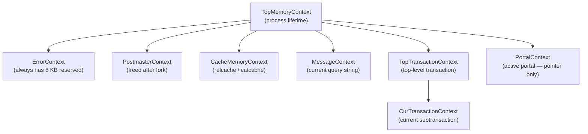
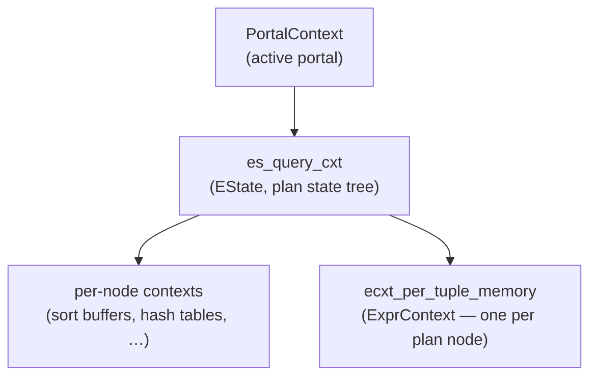
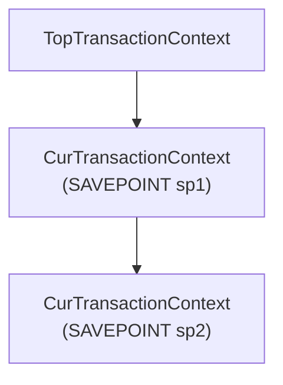

# Memory Contexts

PostgreSQL's memory context system is the foundation of all dynamic memory allocation in the backend. Rather than calling `malloc` and `free` individually for every object, code allocates from a named context. It reclaims the entire context in one operation when the associated work is done. This eliminates most per-object bookkeeping. It also makes it safe to bail out on error without hunting down every outstanding allocation.

C has no garbage collector. A backend handles dozens of allocations per tuple, hundreds per query, and thousands per transaction. Tracking each one to ensure it is freed at exactly the right moment — and freed exactly once, even through error paths — is impractical at that scale. The solution is to associate allocations with a scope: deleting the right context at the right time makes every allocation in it disappear automatically, both faster and more reliably than per-chunk bookkeeping. A single walk of its block list can free the entire contents of a context (`AllocSetReset`, `aset.c`). Error handling reduces to deleting the appropriate context tree rather than unwinding a registry of individual pointers.

## The context tree

Every memory context is a node in a tree. The structure is defined in `src/include/nodes/memnodes.h`:

```c
typedef struct MemoryContextData
{
    NodeTag     type;               /* identifies allocator implementation */
    bool        isReset;
    bool        allowInCritSection;
    Size        mem_allocated;
    const MemoryContextMethods *methods;  /* virtual function table */
    MemoryContext parent;
    MemoryContext firstchild;
    MemoryContext prevchild;
    MemoryContext nextchild;
    const char *name;
    const char *ident;
    MemoryContextCallback *reset_cbs;
} MemoryContextData;
```

PostgreSQL stores children as a singly-linked list threaded through `firstchild`/`nextchild`, with a back-pointer via `prevchild` for O(1) unlinking. Deleting a parent recursively deletes all descendants first. So deleting only its root frees an entire subtree (`MemoryContextDeleteChildren`, `mcxt.c`).

`MemoryContextReset` goes a step further than deletion. It deletes all child contexts. Then it resets — but does not destroy — the named context itself. The context survives the reset, ready to accept new allocations. Meanwhile, PostgreSQL reclaims all the storage that it and its former children held. This is what most callers actually want. It avoids the overhead of recreating the context on the next cycle.

## Well-known global contexts

The globals declared in `src/include/utils/memutils.h` and initialized across the backend lifecycle form the backbone of the context tree:



**`TopMemoryContext`** — the root of the entire tree. Allocating here is effectively permanent. This context is never reset or deleted. Used for long-lived tables such as the open-file descriptors in `fd.c`.

**`ErrorContext`** — initialized with 8 KB reserved and marked `allowInCritSection = true`. This ensures that `ereport(ERROR, ...)` can always allocate the memory it needs to format and propagate an error. This holds even when the backend is otherwise out of memory (`MemoryContextInit`, `mcxt.c`).

**`PostmasterContext`** — the postmaster's working context. After forking, a backend can delete this context. This reclaims memory that the postmaster was using but no longer needs. Non-`EXEC_BACKEND` builds must wait until authentication is complete. This is because `pg_hba.conf` data lives here.

**`CacheMemoryContext`** — permanent storage for the relcache and system catalog caches. Like `TopMemoryContext`, it is never reset. Subsidiary data for a single cache entry lives in a child context of `CacheMemoryContext`. This makes it easy to release an entry without touching anything else (`src/backend/utils/cache/catcache.c`).

**`MessageContext`** — holds the current command message from the client and any derived parse/plan trees in simple-Query mode. Reset at the top of each iteration of the PostgresMain loop (`src/backend/tcop/postgres.c`).

**`TopTransactionContext`** — created at the start of each top-level transaction and deleted at commit or abort. Anything that must survive until the end of the top-level transaction lives here (`AtStart_Memory`, `xact.c`).

**`CurTransactionContext`** — in a top-level transaction, identical to `TopTransactionContext`. At each savepoint, PostgreSQL creates a fresh child context. It then points `CurTransactionContext` at it. If the subtransaction aborts, PostgreSQL deletes that child context immediately. If it commits, the context survives until the enclosing transaction finishes.

**`PortalContext`** — not a distinct permanent context but a global pointer that tracks whichever portal is currently executing. The executor state context (`es_query_cxt`) is a child of this portal context.

## Creating, resetting, and deleting contexts

An allocator-specific constructor such as `AllocSetContextCreate` creates every context. It calls the common initializer `MemoryContextCreate` (`mcxt.c`) to fill in the header fields and link the new context into its parent's child list. Callers never invoke `MemoryContextCreate` directly. The allocator constructor is the public API.

Resetting a context (`MemoryContextReset`) is the most common operation in hot paths. It deletes all child contexts. It fires any registered reset callbacks in reverse registration order. It then calls the type-specific reset method, which returns all allocations within the context to its internal block pool. The context object itself survives, ready to be used again — this cycle-without-recreation is the point of the design.

Deleting a context (`MemoryContextDelete`) removes it permanently. PostgreSQL recursively deletes children, fires callbacks, and unlinks the context from its parent's child list. The type-specific destructor then releases all backing storage, including the context header.

**Reset callbacks** (`MemoryContextRegisterResetCallback`) extend the cleanup model to resources that live alongside palloc'd memory but are not themselves palloc'd — open file descriptors, reference counts on cache objects, foreign-library buffers. Callbacks fire before the allocator's own reset logic runs. This means they can still safely read context-owned memory.

## Implicit context and explicit switching

`palloc(size)` allocates from `CurrentMemoryContext` (`mcxt.c`). This implicit context removes the need to thread a context argument through every function in the system. Code that wants allocations in a specific context switches temporarily:

```c
oldcontext = MemoryContextSwitchTo(target_context);
/* allocations here go into target_context */
result = palloc(...);
MemoryContextSwitchTo(oldcontext);
```

`pfree` and `repalloc` are context-independent. They inspect the 3-bit `MemoryContextMethodID` encoded in the uint64 chunk header immediately preceding the pointer. They look up the appropriate `MemoryContextMethods` entry in the global `mcxt_methods[]` array. They then dispatch to the right allocator. This means you can free a pointer that was not allocated in `CurrentMemoryContext` without any bookkeeping (`MCXT_METHOD` macro, `mcxt.c`).

## AllocSet: the default allocator

`AllocSetContext` (`aset.c`) is the general-purpose allocator used everywhere the other specialized allocators are not explicitly chosen.

### Block and chunk layout

AllocSet obtains memory from the OS in large blocks via `malloc`. Each block has a small `AllocBlockData` header (`aset`, `prev`, `next`, `freeptr`, `endptr`). Within a block, individual allocations are called chunks. A `MemoryChunk` header (a `uint64`) precedes each chunk. This header encodes the allocator ID and either the freelist index (for small chunks) or a flag indicating the chunk occupies a dedicated block (for large chunks).

### Freelist bins

For small allocations (up to `allocChunkLimit`, capped at 8192 bytes), AllocSet rounds the requested size up to the next power of two. It then places the allocation in one of 11 freelist bins:

| Bin | Chunk size |
|-----|-----------|
| 0 | 8 bytes |
| 1 | 16 bytes |
| 2 | 32 bytes |
| 3 | 64 bytes |
| 4 | 128 bytes |
| 5 | 256 bytes |
| 6 | 512 bytes |
| 7 | 1024 bytes |
| 8 | 2048 bytes |
| 9 | 4096 bytes |
| 10 | 8192 bytes |

`ALLOC_MINBITS = 3` (minimum chunk size 8 bytes), and `ALLOCSET_NUM_FREELISTS = 11`. Bin selection uses `AllocSetFreeIndex`, which computes `ceil(log2(size))` via a bit-scan intrinsic. On `pfree`, AllocSet places a small chunk back on the appropriate freelist (it stores the free link in the chunk's own memory). On the next `palloc` of a matching size, AllocSet reuses the chunk without touching `malloc`.

Requests larger than `allocChunkLimit` bypass the freelist entirely. Each such allocation gets its own dedicated block from `malloc`. AllocSet returns that block to `malloc` immediately on `pfree`.

### The keeper block and block growth

The first block allocated for a context also contains the `AllocSetContext` header itself. AllocSet never returns this "keeper block" to `malloc` on reset. Reset only clears its content (`AllocSetReset`). Contexts that are reset frequently, such as per-tuple expression contexts, therefore avoid a `malloc`/`free` round-trip on every cycle. Subsequent blocks start at `initBlockSize`. They double in size up to `maxBlockSize`.

The standard size presets are defined in `src/include/utils/memutils.h`:

| Macro | minContextSize | initBlockSize | maxBlockSize |
|-------|---------------|--------------|-------------|
| `ALLOCSET_DEFAULT_SIZES` | 0 | 8 KB | 8 MB |
| `ALLOCSET_SMALL_SIZES` | 0 | 1 KB | 8 KB |
| `ALLOCSET_START_SMALL_SIZES` | 0 | 1 KB | 8 MB |

Contexts using `ALLOCSET_DEFAULT_SIZES` or `ALLOCSET_SMALL_SIZES` are eligible for the global AllocSet freelist (`context_freelists[]` in `aset.c`). This freelist caches up to 100 recently deleted contexts, so creating a new one of the same size class requires no `malloc` call at all.

## Generation: append-only allocator

`GenerationContext` (`generation.c`) targets workloads where code allocates chunks in batches and frees them in roughly the same order — FIFO or by generation. Instead of per-size freelists, each block tracks `nchunks` (total allocations) and `nfree` (freed chunks). When `nfree == nchunks`, the block is empty. Rather than immediately returning it to `malloc`, the context keeps one such "free block" around for reuse (`freeblock` field). This avoids a `malloc`/`free` cycle for the common case of steady-state streaming.

The practical benefit over AllocSet for streaming workloads (e.g. `tuplesort`, `ReorderBuffer`) is that the allocator returns memory to the OS block-by-block as callers free chunks, rather than accumulating it in a global freelist until the context is reset. This matters when tuple stores hold large amounts of data that they process and discard incrementally.

`tuplesort.c` uses `GenerationContextCreate` for its tuple storage context (`state->base.tuplecontext`), and `reorderbuffer.c` uses it for the tuple context (`buffer->tup_context`).

## Slab: fixed-size object pool

`SlabContext` (`slab.c`) allocates only objects of a single fixed size, specified at context creation. SlabContext divides all blocks into identically sized slots, with no fragmentation between different size classes. It tracks free chunks via a per-block free list and a "high watermark" pointer for chunks that have never been used.

SlabContext organizes blocks into `SLAB_BLOCKLIST_COUNT` (3) bucket lists partitioned by the number of free chunks they contain. New allocations always come from the fullest non-full block. This minimizes the number of sparsely populated blocks. SlabContext retains empty blocks up to a limit (`SLAB_MAXIMUM_EMPTY_BLOCKS = 10`) before returning them to `malloc`.

`reorderbuffer.c` uses the Slab allocator for the fixed-size change and transaction-record contexts (`buffer->change_context`, `buffer->txn_context`), where predictable per-object overhead and efficient reclamation matter more than flexibility.

## The executor's context tree

When a query starts, the executor builds a context subtree under the active portal's context. The root of this subtree is `es_query_cxt` (named "ExecutorState"), allocated as a child of `PortalContext`. The `EState` node itself lives inside `es_query_cxt`, so releasing the entire executor state requires only `MemoryContextDelete(estate->es_query_cxt)` (`CreateExecutorState` / `FreeExecutorState`, `execUtils.c`).



Each plan node that evaluates expressions gets its own `ExprContext` with a `ecxt_per_tuple_memory` child AllocSet (`CreateExprContextInternal`). Before evaluating expressions for each tuple, the executor resets this context via `ResetExprContext` (a macro expanding to `MemoryContextReset(econtext->ecxt_per_tuple_memory)`). This ensures expression-evaluation temporaries do not accumulate across tuples.

The canonical pattern in a plan node's fetch loop is:

```c
ResetExprContext(econtext);
/* evaluate projections, quals, etc. for this tuple */
```

The executor resets the per-tuple context at the *start* of each cycle rather than at the end. This means the tuple that a plan node returns remains valid until the executor calls the node again for the next tuple. This is a safe implicit convention that avoids copying results just to hand them to the caller.

For nodes that must retain state across multiple inner-node cycles (e.g. `Unique` saving the previous distinct value, or aggregate nodes accumulating transition state), that data lives in `es_query_cxt` or the node's own context, not the per-tuple context.

## Transaction memory and savepoints

At the start of each top-level transaction, PostgreSQL creates `TopTransactionContext` and `CurTransactionContext` as a matched pair pointing to the same context. This context becomes the default allocation context for transaction work (`AtStart_Memory`, `xact.c`). The context tree then mirrors the savepoint nesting directly. Each `SAVEPOINT` creates a fresh child context. It then redirects `CurTransactionContext` to it (`AtSubStart_Memory`).

This design makes subtransaction abort trivially cheap. PostgreSQL simply deletes the child context, instantly reclaiming everything allocated since the savepoint, with no need to identify or unwind individual allocations. Subtransaction commit is equally simple. PostgreSQL retains the child context as-is. Its allocations naturally inherit the lifetime of the enclosing transaction.



At top-level commit, PostgreSQL deletes `TopTransactionContext`, freeing `SUB1`, `SUB2`, and all other descendants in a single recursive walk — no per-object accounting required. Abort follows the same path. But cleanup first switches to `TransactionAbortContext` (a small fixed-size context pre-allocated to guarantee memory is available during cleanup) before deleting `TopTransactionContext`.

## Memory accounting and debugging

`MemoryContextStats(context)` (`mcxt.c`) prints a recursive summary of a context tree to `stderr`. PostgreSQL calls it automatically on out-of-memory errors (before raising `ERROR`) to help diagnose what the backend was holding. PostgreSQL limits output to 100 children per parent to bound output size.

The `pg_backend_memory_contexts` view (backed by `src/backend/utils/adt/mcxtfuncs.c`) exposes the same information via SQL. It returns one row per context with columns including `name`, `ident`, `parent_name`, `level`, `total_bytes`, `total_free_bytes`, `used_bytes`, and `free_chunks`. A DBA can send `SIGINT` to a backend to trigger a `LOG_SERVER_ONLY` dump of the same data without needing a database connection.

`MemoryContextMemAllocated(context, recurse)` returns the total bytes held in blocks for a context, optionally recursing into children. Accounting happens at the block level (`mem_allocated` in `MemoryContextData`), not per chunk, to minimize overhead on the allocation hot path.

## See also

- [[subsystems/executor/overview]]
- [[subsystems/transactions/mvcc]]
- [[architecture/overview]]
