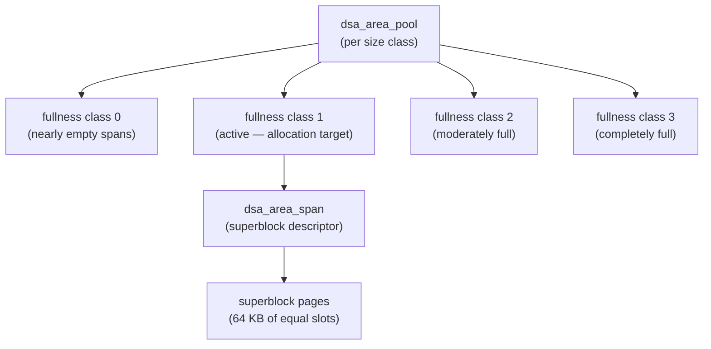

A Dynamic Shared Area (DSA) is a shared-memory heap that multiple backends can allocate from concurrently. While raw DSM segments (see [[subsystems/storage/shared-memory|shared memory]]) let processes share a fixed slab of memory, they provide no allocator. A DSA wraps one or more DSM segments with size-classed pools, a free-page manager, and the locking discipline needed to make `dsa_allocate` / `dsa_free` safe across processes. Because shared memory cannot hold regular C pointers — each process maps segments at its own virtual address — DSA introduces `dsa_pointer`, a position-independent pseudo-pointer. Callers must translate it to a local address before use.

## The dsa_pointer abstraction

A `dsa_pointer` is a 64-bit (or 32-bit on platforms where `SIZEOF_DSA_POINTER == 4`) integer. Its upper bits identify the segment. Its lower `DSA_OFFSET_WIDTH` bits encode the byte offset within that segment. On 64-bit builds, the offset field is 40 bits wide. This allows segments up to 1 TB and up to 1024 segments per area (`dsa.c`). On 32-bit builds, the field is 27 bits. This limits segments to 128 MB with 32 segments per area.

`dsa_get_address(area, dp)` converts a `dsa_pointer` to a local pointer. It checks for stale segment mappings. It attaches the segment on demand if this backend has not yet seen it. It then returns `mapped_address + offset` (`get_segment_by_index()`, `dsa.c`). The caller is responsible for not dereferencing an old `dsa_pointer` after the object has been freed. DSA offers no equivalent of use-after-free detection.

`InvalidDsaPointer` (value 0) is the null sentinel. Callers test with `DsaPointerIsValid(dp)` rather than comparing to NULL.

## Area lifecycle and attachment

A caller creates an area once with `dsa_create(tranche_id)`. This call allocates an initial 1 MB DSM segment. It pins the segment to prevent premature cleanup. It embeds the `dsa_area_control` struct at the start of that segment (`create_internal()`, `dsa.c`). The `tranche_id` is a caller-supplied [[subsystems/locking/lwlocks|LWLock]] tranche. DSA cannot allocate tranche IDs itself because they are scarce and not recyclable.

Other backends join by calling `dsa_attach(handle)`, where the handle is the DSM handle of the first segment (returned by `dsa_get_handle()`). Attachment increments a reference count in `dsa_area_control.refcnt` under the area lock. Each attached backend obtains its own `dsa_area` struct (allocated with `palloc` from the [[subsystems/memory/contexts|memory context]] of the attaching backend) that holds process-local segment mappings.

Two variants handle the case where the area must live inside pre-existing shared memory rather than a fresh DSM segment: `dsa_create_in_place(place, size, tranche_id, segment)` and `dsa_attach_in_place(place, segment)`. These are used, for example, when an area is embedded inside a larger shared structure allocated from the main shared memory segment.

By default, the current [[subsystems/memory/resource-owner|ResourceOwner]] owns an area and detaches it when that scope ends. Calling `dsa_pin_mapping(area)` extends the mapping until session end. Calling `dsa_pin(area)` / `dsa_unpin(area)` keeps the area itself alive even after all backends have detached.

## Segment management and growth

The control block tracks up to `DSA_MAX_SEGMENTS` DSM segment handles in a flat array indexed by a `dsa_segment_index`. DSA adds segments on demand: `make_new_segment()` follows a geometric growth schedule — starting at 1 MB, doubling after every two segments, capped at the segment-size limit imposed by `DSA_OFFSET_WIDTH`. The area lock (`dsa_area_control.lock`) protects all segment-level operations.

To avoid scanning every segment when looking for a contiguous run of free pages, DSA groups segments into 16 bins by their largest contiguous free run. `contiguous_pages_to_segment_bin(n)` maps a page count to `floor(log2(n)) + 1` (capped at 15). `get_best_segment()` starts from the lowest bin that could satisfy the request and scans upward. Along the way, it re-bins segments whose free-page state has drifted from the stored bin value (`rebin_segment()`, `dsa.c`).

Each segment carries its own header (`dsa_segment_header`), a `FreePageManager` for tracking free 4 KB page runs, and a pagemap. The pagemap is an array of `dsa_pointer` values, one per page. Each entry maps a page number back to the span descriptor that owns it.

## Size-classed pools and superblocks

DSA satisfies requests of 8192 bytes or smaller from one of 40 size classes: 8, 16, 24 … 8192 bytes, with spacing widening at larger sizes (`dsa_size_classes[]`, `dsa.c`). Each size class has a dedicated `dsa_area_pool` containing a per-pool LWLock and four lists of span descriptors, one per fullness class. This means small-object allocation contends only on the per-pool lock, not the global area lock.

A **superblock** is a 64 KB (16 pages) aligned run of pages allocated from the free-page manager. DSA divides it into equal-sized slots for a single size class. The metadata for a superblock is a `dsa_area_span` object. This object lives in a separate "span-of-spans" block to avoid circularity: creating a normal superblock requires a span descriptor. So the first allocation bootstraps by storing the span descriptor inline at the start of a one-page block (`DSA_SCLASS_BLOCK_OF_SPANS`, `dsa.c`).

Allocations always come from the head of fullness class 1, which `ensure_active_superblock()` keeps populated. If class 1 is empty, the function promotes a span from a higher class. If no spans have free slots at all, it allocates a new superblock. When a span fills completely, it moves to class 3. When a slot is freed and the span drops below the threshold, it descends toward class 0. `destroy_superblock()` returns a completely empty span to the free-page manager. It will also unpin and release the backing DSM segment entirely if the segment becomes fully free — segment 0 (the one holding `dsa_area_control`) is exempt from this reclamation.

Free objects within a span use an embedded singly-linked freelist: the first two bytes of each free slot hold the index of the next free object (`NextFreeObjectIndex` macro, `dsa.c`). For newly initialized objects that have never been allocated, a separate "high watermark" (`ninitialized`) avoids touching pages unnecessarily.

## Large allocations

Requests larger than 8192 bytes bypass the pool machinery entirely. `dsa_allocate_extended()` allocates a `dsa_area_span` from `DSA_SCLASS_BLOCK_OF_SPANS`. It then takes the area lock to find or create a segment with enough contiguous pages. It calls `FreePageManagerGet()` to claim them. `dsa_allocate_extended()` stores the span descriptor in the pagemap at the first page of the allocation. On `dsa_free()`, DSA takes the area lock. It returns the pages to the free-page manager. It re-bins or frees the segment if now empty.

## Concurrent access and locking discipline

DSA uses two levels of locking:

| Lock | Protects |
|---|---|
| `dsa_area_control.lock` (area lock) | Segment list, segment bins, total size, freed-segment counter |
| `dsa_area_pool[i].lock` (per-pool lock) | Span lists and fullness classes for size class *i* |

The ordering invariant is pool lock first, area lock second — `destroy_superblock()` holds a pool lock when it then acquires the area lock. Violating this order would deadlock.

Segment freeing involves a subtlety across processes. When `destroy_superblock()` frees a segment, it increments `dsa_area_control.freed_segment_counter` while holding the area lock. Other backends detect this change lazily: `check_for_freed_segments()` reads the counter with a read barrier before each `dsa_get_address()` or `dsa_free()` call. If the counter has advanced, it acquires the area lock and unmaps any segment whose `dsa_segment_header.freed` flag is set (`check_for_freed_segments_locked()`, `dsa.c`). This avoids per-operation locking. It still guarantees that a backend never resolves a `dsa_pointer` through a stale mapping.

## Key data structures

| Structure | Lives in | Purpose |
|---|---|---|
| `dsa_area` | Backend-local (`palloc`) | Per-process handle; holds `segment_maps[]` array |
| `dsa_area_control` | Shared memory (start of segment 0) | Area-wide state: handle, segment handles, pools, locks |
| `dsa_area_pool` | `dsa_area_control.pools[]` | Per-size-class span lists and lock |
| `dsa_area_span` | Shared memory (span-of-spans block) | Superblock descriptor: freelist, fullness, page range |
| `dsa_segment_map` | Backend-local (in `dsa_area`) | Cached mapping for one segment: `mapped_address`, `fpm`, `pagemap` |
| `dsa_segment_header` | Start of each DSM segment | Magic, bin membership, freed flag |

## Related Topics

- [[subsystems/storage/shared-memory|Shared memory]] — DSM segments that DSA is built on top of
- [[subsystems/memory/contexts|Memory contexts]] — backend-local allocation; DSA is its shared-memory counterpart
- [[subsystems/memory/resource-owner|ResourceOwner]] — owns DSA mappings by default and detaches them at scope exit
- [[subsystems/locking/lwlocks|LWLocks]] — used for both the area lock and per-pool locks
