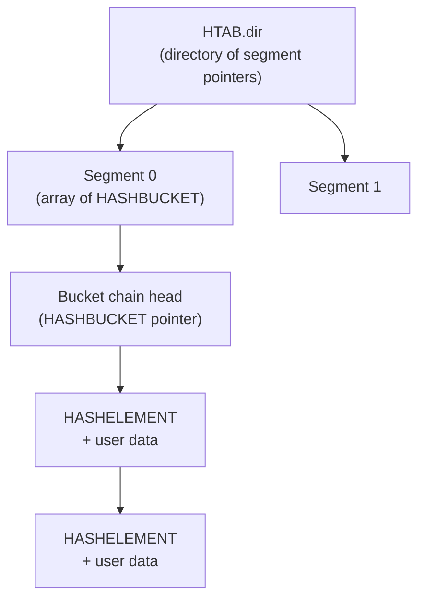

Dynamic hash tables (dynahash) are PostgreSQL's general-purpose in-memory associative data structure, used pervasively across backend, shared memory, and catalog code. A single implementation covers both per-backend private tables that can grow without bound and fixed-size shared-memory tables guarded by partitioned locking. Both table types have stable entry pointers and support sequential scans concurrent with insertions.

## Structure and memory layout

Every hash table has two header structures. `HASHHDR` holds the mutable control state — directory size, bucket count, masks, and freelists. It may reside in shared memory. `HTAB` is a per-backend wrapper. It points to `HASHHDR`, stores function pointers (hash, match, keycopy, alloc), and caches a few heavily-used scalar fields to avoid shared-memory reads on every lookup (`hash_create()`, `dynahash.c`).

The physical layout uses a three-level directory:

Each bucket is the head of a singly-linked chain of `HASHELEMENT` nodes. A `HASHELEMENT` stores only a forward link and the precomputed hash value; the caller's key and value data immediately follow it at a `MAXALIGN`-rounded offset (`ELEMENTKEY()` macro, `dynahash.c`). Because entries are linked nodes rather than open-addressed slots, pointers to entries remain stable after inserts. Hash conflicts also never require moving large entries.

The default segment size is 256 buckets (`DEF_SEGSIZE`, `dynahash.c`). The default initial directory is 256 segment pointers (`DEF_DIRSIZE`). The initial bucket count is the next power of two at or above the requested `nelem`, targeting a load factor of 1. For private tables, the directory can be reallocated as the table grows. For shared tables, it is fixed at creation time.

## Key type selection

`hash_create()` requires exactly one of three flags to select key semantics:

| Flag | Hash function | Comparison | Key copy |
|---|---|---|---|
| `HASH_STRINGS` | `string_hash` | `strncmp` (keysize−1) | `strlcpy` |
| `HASH_BLOBS` | `tag_hash` (or `uint32_hash` for 4-byte keys) | `memcmp` | `memcpy` |
| `HASH_FUNCTION` | caller-supplied | `memcmp` (default) | `memcpy` (default) |

Using `HASH_BLOBS` for integer keys is a common pattern. Callers must ensure there are no undefined padding bits in the key when using `memcmp`-based comparison.

## Entry lifecycle and freelists

dynahash allocates entries in batches (`element_alloc()`, `dynahash.c`). It links them onto per-freelist chains rather than returning them to the [[subsystems/memory/contexts|memory context]] individually. `choose_nelem_alloc()` chooses the number of elements per batch to make the allocation a power of two in total bytes. This minimizes waste when the default palloc allocator rounds up. Removed entries go back on the freelist immediately. This makes deletion O(1) and guarantees that a delete followed by an insert never needs to allocate.

For partitioned shared tables, `HASHHDR` carries 32 `FreeListData` slots (`NUM_FREELISTS = 32`), each with its own spinlock, entry count, and free chain. A given hashcode always maps to a freelist by `hashcode % NUM_FREELISTS`. When a freelist is exhausted and the allocator cannot obtain more shared memory, `get_hash_entry()` scans the other 31 freelists before giving up. This borrowing protocol upholds an invariant: deleting an entry always makes room for a new one, even when shared memory is completely full (`get_hash_entry()`, `dynahash.c`).

## Dynamic expansion

Private (non-shared, non-partitioned) tables expand by splitting one bucket at a time (`expand_table()`, `dynahash.c`). Expansion occurs when the total entry count exceeds `max_bucket` (that is, when the load factor exceeds 1). The split algorithm follows Larson (CACM 1988). The new bucket number is `max_bucket + 1`. The corresponding "old" bucket is `new_bucket & low_mask`. `expand_table()` redistributes entries in the old bucket between old and new by re-evaluating `calc_bucket()` against updated masks. Because only one old bucket feeds one new bucket at a time, no global rehash is ever needed.

Three conditions block expansion: the table is partitioned (bucket splits would require cross-partition locking), the table is frozen, or a sequential scan is active. In all three cases insertion proceeds at a higher-than-desired load factor rather than failing.

`dir_realloc()` doubles the directory (array of segment pointers) if the current directory runs out of room. This reallocation frees the old directory with `pfree()`. So dynahash only permits it for private tables using the default palloc allocator.

Callers size shared tables at creation using `hash_estimate_size()` and `hash_select_dirsize()` to pre-allocate enough memory for the expected maximum. The `ShmemInitHash()` function in `shmem.c` wires the creation and re-attachment sequence for shared tables registered in the [[subsystems/storage/shared-memory|shared memory]] index.

## Partitioned locking for shared tables

Creating a shared table with `HASH_PARTITION` permanently disables bucket splits. Callers divide the bucket space into partitions using the low-order bits of the hash value. Callers hold a separate [[subsystems/locking/lwlocks|LWLock]] per partition. Because `calc_bucket()` maps hash values to buckets using `high_mask`/`low_mask` bit operations, the low-order bits of the hash value reliably identify which partition a key falls in. This makes it safe for multiple backends to search or modify different partitions simultaneously without global coordination (`get_hash_value()`, `dynahash.c`).

The lock table, proclock table, and several other heavily-used shared structures employ this pattern. A caller searching a partitioned table must compute `get_hash_value()` first, derive the partition number, acquire the appropriate LWLock, then call `hash_search_with_hash_value()`.

## Sequential scans

`hash_seq_init()` / `hash_seq_search()` / `hash_seq_term()` provide a cursor-based full-table scan. The scan state (`HASH_SEQ_STATUS`) tracks the current bucket index and the current element within that bucket. A caller may delete the element just returned. But the caller must not delete any other element while the scan is active. That other element might be the one `curEntry` is pointing at.

To prevent bucket splits from reordering entries mid-scan (splits can move elements from one bucket to another), each active scan registers the table pointer in a backend-local array (`seq_scan_tables[]`, `dynahash.c`). The `has_seq_scans()` check blocks `expand_table()` while any scan is registered. The registration count caps at 100 (`MAX_SEQ_SCANS`).

Callers that know no new entries will be inserted can call `hash_freeze()` to permanently suppress both bucket splits and scan registration. Callers can iterate a frozen table with `hash_seq_init` without needing `hash_seq_term`. dynahash does not permit freezing on shared tables.

`seq_scan_level[]` tracks open scans by subtransaction nesting level. `AtEOXact_HashTables()` and `AtEOSubXact_HashTables()` clean up leaked scans at transaction boundaries — warning on commit, silently cleaning on abort.

## Key structs and flags reference

| Symbol | Location | Role |
|---|---|---|
| `HTAB` | `dynahash.c` | Per-backend handle; opaque to callers |
| `HASHHDR` | `dynahash.c` | Shared control block (directory size, masks, freelists) |
| `HASHELEMENT` | `hsearch.h` | Intrusive linked-list node prepended to every entry |
| `FreeListData` | `dynahash.c` | Spinlock + nentries + freeList chain (32 per partitioned table) |
| `HASHCTL` | `hsearch.h` | Parameter struct passed to `hash_create()` |
| `HASHACTION` | `hsearch.h` | Enum: `HASH_FIND`, `HASH_ENTER`, `HASH_ENTER_NULL`, `HASH_REMOVE` |
| `HASH_SEQ_STATUS` | `hsearch.h` | Sequential scan cursor |

| Flag | Meaning |
|---|---|
| `HASH_ELEM` | Required; sets `keysize` and `entrysize` |
| `HASH_STRINGS` | String keys (null-terminated, truncated to keysize) |
| `HASH_BLOBS` | Binary keys (no undefined padding) |
| `HASH_FUNCTION` | Caller-supplied hash function |
| `HASH_COMPARE` | Caller-supplied comparison function |
| `HASH_KEYCOPY` | Caller-supplied key-copy function |
| `HASH_CONTEXT` | Use a specific `MemoryContext` instead of `TopMemoryContext` |
| `HASH_SHARED_MEM` | Table lives in shared memory; allocator must return NULL on OOM |
| `HASH_PARTITION` | Enable partitioned locking; disables bucket splits |
| `HASH_FIXED_SIZE` | Prohibit growth beyond initial allocation |
| `HASH_ATTACH` | Attach to an already-initialized shared table |

## Comparison with simplehash

PostgreSQL also ships `src/include/lib/simplehash.h`, a code-generated open-addressing hash table. Simplehash is faster for small fixed-layout tables (no pointer chasing, better cache locality). But it requires entries to be moveable on insert. It also does not support shared memory, partitioned locking, or stable pointers. Dynahash is the correct choice whenever entries must not move, the table lives in shared memory, or partitioned concurrent access is required.

## Related Topics

- [[subsystems/memory/contexts|Memory contexts]] — private dynahash tables are allocated inside a dedicated child context; `hash_destroy()` simply deletes that context
- [[subsystems/storage/shared-memory|Shared memory]] — `ShmemInitHash()` registers shared dynahash tables in the shmem index and handles the create-vs-attach distinction
- [[subsystems/locking/lwlocks|LWLocks]] — the standard locking primitive for partitioned shared hash tables
