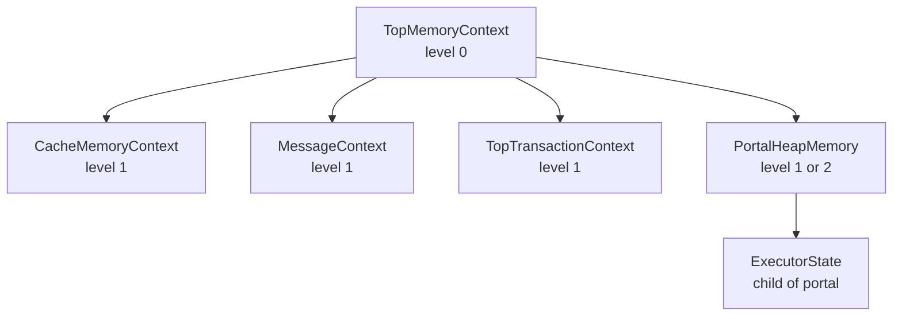

PostgreSQL exposes the internal [[subsystems/memory/contexts|memory context]] tree of a running backend as queryable SQL rows via `pg_backend_memory_contexts()`. It also lets privileged users trigger an equivalent dump to the server log for any backend via `pg_log_backend_memory_contexts(pid)`. These two functions are the primary tools for diagnosing memory growth in long-lived backends, identifying leaky PL/pgSQL routines, and understanding why a connection's resident memory never shrinks.

## What the output represents

`pg_backend_memory_contexts()` is a set-returning function implemented in `src/backend/utils/adt/mcxtfuncs.c`. It performs a recursive pre-order walk of the entire context tree starting at `TopMemoryContext`, emitting one row per context. `PutMemoryContextsStatsTupleStore` performs the walk. It calls the allocator-specific `stats` method on each context to populate a `MemoryContextCounters` struct, then recurses through the `firstchild`/`nextchild` linked list.

Key columns:

| Column | Meaning |
|---|---|
| `name` | The context's constant name string (e.g. `"CacheMemoryContext"`, `"ExecutorState"`). For `dynahash` contexts the hash table name is promoted into this column. |
| `ident` | An optional discriminating label set at runtime via `MemoryContextSetIdentifier`. Portal contexts carry the query text here; relcache entry contexts carry the relation name. Truncated to 1024 bytes. |
| `parent` | The `name` of the immediate parent context. NULL for `TopMemoryContext`. |
| `level` | Depth in the tree. `TopMemoryContext` is 0; each child increments by one. |
| `total_bytes` | All bytes committed to the process in OS-level blocks for this context alone (not including descendants). |
| `total_nblocks` | Number of OS blocks backing the context. |
| `free_bytes` | Bytes inside committed blocks that are not holding live data — unused block tails plus chunks sitting on internal freelists. |
| `free_chunks` | Number of freed chunks sitting on internal freelists, ready to be reused without going back to the OS. |
| `used_bytes` | `total_bytes - free_bytes`. Bytes that are actually holding live palloc'd data. |

PostgreSQL computes `used_bytes` as the difference, not as a separately tracked quantity. The source reflects this directly: `values[8] = Int64GetDatum(stat.totalspace - stat.freespace)`.

## total_bytes vs used_bytes: what the gap means

`total_bytes` represents memory that the process has acquired from the OS allocator. The process will not release this memory until the context is reset or deleted. `used_bytes` is the fraction of that holding live data right now. The gap has two sources:

- **Unused block tails.** AllocSet allocates in exponentially growing blocks. When a block is partially filled and a new allocation needed a fresh block, the tail of the previous block sits idle. This is normal and bounded — at most one block's worth per doubling.
- **Freelist chunks.** When `pfree` frees a small chunk, it goes back onto the context's internal freelist rather than returning to the OS. It appears in `free_bytes` and increments `free_chunks`. A context with a high `free_chunks` value relative to its size has fragmented state. Future same-size allocations in the same context will reuse the memory, but the context cannot return it to the OS until it is reset.

A context where `total_bytes` is large but `used_bytes` is small indicates fragmentation or accumulated freelist entries. A context where both are large and growing across queries indicates a genuine leak — live data that should have been freed is accumulating.

## Reading the context tree

The tree structure matters as much as the per-row numbers. A typical backend looks roughly like this:

**`TopMemoryContext` (level 0)** is always the root. It is never reset. Anything allocated here is permanent for the life of the process. Its direct `used_bytes` should be modest and stable. Growth here across queries points to a leak in process-lifetime data structures.

**`CacheMemoryContext` (level 1)** holds the relation descriptor cache (relcache) and system catalog caches (catcache). It grows on first access to each relation or catalog entry. It stays resident — this is by design. A backend that has touched many distinct tables will show a large `CacheMemoryContext`. This is not a leak. It is the cache doing its job. The number of distinct objects the backend has touched bounds this growth.

**Portal contexts** (named `PortalHeapMemory`, with the query text in `ident`) exist for each open cursor or active query. They are children of `TopMemoryContext`. They should appear and disappear as queries open and close. Seeing portal contexts persist after a query has nominally finished means either an explicit cursor was not closed, or the client library is holding an open result set. The executor's working storage (`ExecutorState` and its children) lives under the portal context.

**`TopTransactionContext` and `CurTransactionContext`** hold allocations tied to the current transaction. They disappear at commit or rollback. Savepoints nest child contexts under `TopTransactionContext`. Subtransaction abort deletes the child.

## Signaling another backend

`pg_log_backend_memory_contexts(pid)` sends `PROCSIG_LOG_MEMORY_CONTEXT` to a backend identified by PID. This works by calling `SendProcSignal`, which marks a flag in the target's `PGPROC` entry. On the target's next `CHECK_FOR_INTERRUPTS()` call — which happens at most query cancellation check points — it invokes `ProcessLogMemoryContextInterrupt`. This writes the full context tree to the server log.

This mechanism is useful when:
- The target backend is stuck in a long-running query and cannot be reached via a parallel SQL connection.
- You need another backend's context tree, not your own (which `pg_backend_memory_contexts()` always returns).
- You want the output in the server log alongside other log lines from that backend, for correlation.

The function requires superuser privilege or the `pg_signal_backend` role. Because an unbounded stream of signals from an unprivileged user could fill the log, the privilege check is intentional. If the target process exits between the `BackendPidGetProc` lookup and the `kill()` call, the function returns `false` with a WARNING rather than raising an error. So it is safe to use in a loop over all backend PIDs.

## Diagnosing memory growth

**Unclosed cursors in PL/pgSQL.** A PL/pgSQL function that opens a cursor with `OPEN c FOR ...` and never executes `CLOSE c` leaves a portal context alive for the duration of the calling transaction. Each call to the function from within the same transaction adds another portal. Query `pg_backend_memory_contexts` filtering on `name = 'PortalHeapMemory'` to count live portals. The `ident` column shows the query text for each one.

**Accumulated prepared statements.** Each `PREPARE` statement creates a `CachedPlanContext` entry under `CacheMemoryContext`. A backend that prepares many distinct queries accumulates these entries. Unlike relcache entries, prepared statement plans are not shared across backends. Each backend holds its own copy. Applications that generate ad-hoc `PREPARE` names (common with some ORMs) cause indefinite growth. Watch for many `CachedPlanContext` children under `CacheMemoryContext`.

**Long-lived relcache growth.** A backend in a pgBouncer session-mode pool may run for hours, touching many different tables. Each newly accessed relation adds a child context under `CacheMemoryContext` that stays for the process lifetime. Transaction-mode pooling sidesteps this by routing each transaction to a potentially different backend, so no single process accumulates a large cache. Session-mode pooling does not.

**Identifying the leak pattern.** The most reliable approach is to snapshot `pg_backend_memory_contexts` at two points in time and compare `used_bytes` per context name. Contexts whose `used_bytes` grow monotonically across queries that should be equivalent are leaking. Contexts that grow then shrink are behaving correctly. A context that grows and never shrinks, but only during specific query types, points directly at the code path that allocates into it.

## Resetting memory without restarting

Terminating the connection is the only way to fully reset a backend's memory profile. `pg_terminate_backend(pid)` or closing the client connection causes the process to exit; the OS then releases all its memory. Transaction-mode connection pooling achieves a similar effect economically: because each transaction may run on a different backend, no single backend accumulates long-lived state from application-level query patterns. Session-mode pooling — where a client-side connection maps to one backend for its lifetime — does not provide this reset. It is therefore more susceptible to gradual memory growth in workloads that touch many distinct tables or use many prepared statements.

## Related Topics

- [[subsystems/memory/contexts|memory contexts]] — architecture of the context tree, allocator types, and lifetime rules
- [[subsystems/executor/tuplestore|tuplestore]] — set-returning function infrastructure used by `pg_backend_memory_contexts`
- [[subsystems/background/autovacuum|autovacuum]] — long-lived background process where CacheMemoryContext growth is also observable
