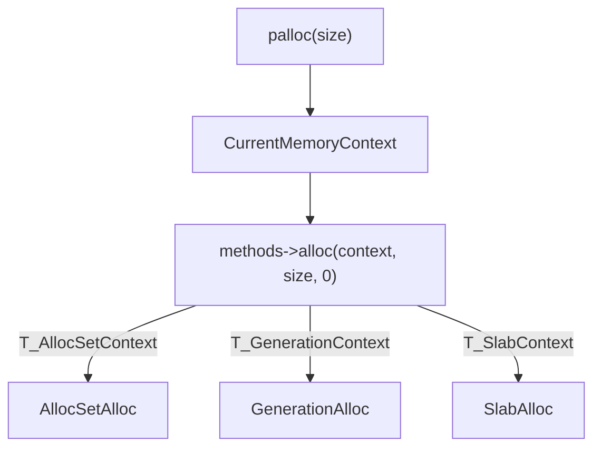
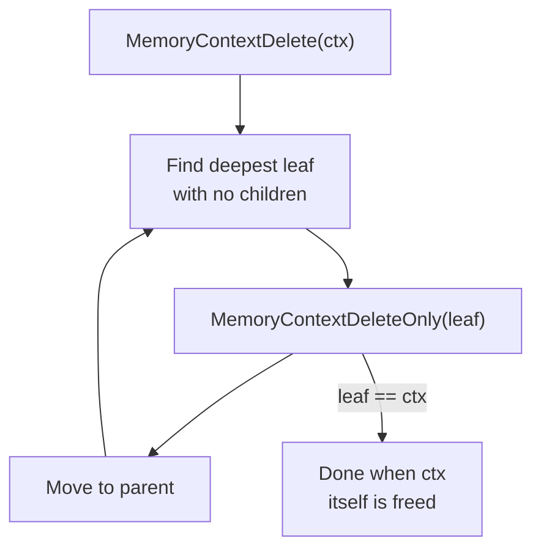
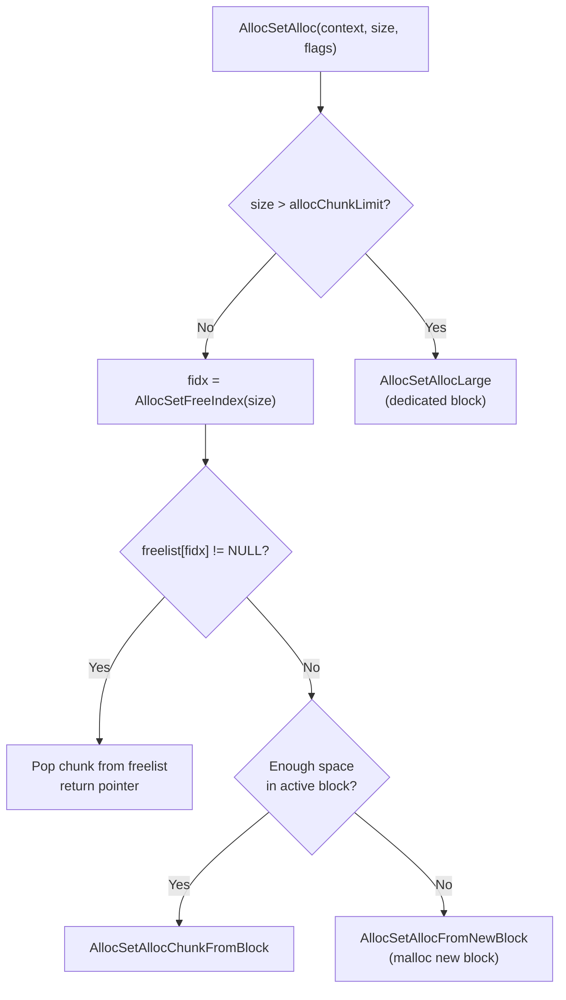
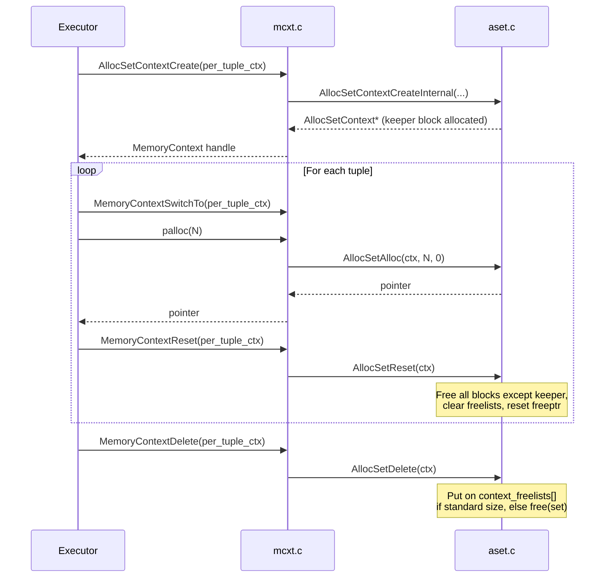

# palloc Memory Allocator

PostgreSQL does not use `malloc` and `free` directly in backend code. Instead, every allocation goes through `palloc`, a context-aware wrapper that binds each chunk to a *memory context*. This design makes it trivial to release all memory associated with a query, a transaction, or a relation scan in a single operation, without tracking individual pointers. The allocator is defined in `src/backend/utils/mmgr/` and its public API in `src/include/utils/palloc.h`.

## palloc vs malloc

| Property | malloc/free | palloc/pfree |
|---|---|---|
| Context binding | None; caller must track all pointers | Every chunk belongs to exactly one `MemoryContext` |
| Bulk deallocation | Manual — free each pointer individually | `MemoryContextReset` or `MemoryContextDelete` frees everything at once |
| OOM handling | Returns `NULL` | Raises `ERROR` by default (never returns `NULL` unless `MCXT_ALLOC_NO_OOM` is set) |
| Zero-fill option | `calloc` | `palloc0` or `MCXT_ALLOC_ZERO` flag |
| Huge allocations | `malloc` accepts any size | Regular `palloc` is limited to ~1 GB; `MCXT_ALLOC_HUGE` lifts the cap |
| Critical sections | Allowed | Forbidden by default (asserted); opt-in via `allowInCritSection` |

`palloc` always allocates from `CurrentMemoryContext`, the process-global pointer that identifies which context is active at any moment.

## The palloc family

```
palloc(size)              → allocate from CurrentMemoryContext, ERROR on OOM
palloc0(size)             → same, but zero-fill the result
palloc_extended(size, flags) → allocate with explicit flag control
repalloc(ptr, size)       → resize an existing allocation in-place (or copy)
pfree(ptr)                → release a chunk back to its owning context
```

`palloc` and `palloc0` are deliberately written as thin wrappers that delegate immediately to `context->methods->alloc` with no flags:

```c
void *
palloc(Size size)
{
    void *ret;
    MemoryContext context = CurrentMemoryContext;

    context->isReset = false;
    ret = context->methods->alloc(context, size, 0);
    Assert(ret != NULL);
    return ret;
}
```

`palloc0` calls the same `alloc` method and then `MemSetAligned(ret, 0, size)`. PostgreSQL deliberately does the zeroing in `mcxt.c` rather than inside the individual context implementations, so the `MCXT_ALLOC_ZERO` flag behaves uniformly regardless of context type.

`pfree` does not take a context argument. It reads the method ID out of the chunk header to dispatch to the right implementation:

```c
void
pfree(void *pointer)
{
    MCXT_METHOD(pointer, free_p) (pointer);
}
```

`MCXT_METHOD` extracts the `MemoryContextMethodID` from the 8-byte `MemoryChunk` header that precedes every user-visible pointer. It then indexes into the global `mcxt_methods[]` dispatch table (see below).

`repalloc` works the same way: it dispatches to `context->methods->realloc` via the chunk header, without the caller needing to know which context the pointer belongs to.

## palloc_extended flags

`palloc_extended` (and `MemoryContextAllocExtended`) accept a bitmask of flags defined in `palloc.h`:

| Flag | Value | Effect |
|---|---|---|
| `MCXT_ALLOC_HUGE` | `0x01` | Lifts the normal ~1 GB cap by skipping the `AllocHugeSizeIsValid` check; used for very large sort buffers, hash tables, etc. |
| `MCXT_ALLOC_NO_OOM` | `0x02` | Return `NULL` instead of raising `ERROR` on allocation failure; the caller must check the return value |
| `MCXT_ALLOC_ZERO` | `0x04` | Zero-fill the returned memory, equivalent to `palloc0` |

The `MCXT_ALLOC_ZERO` flag is handled entirely in `mcxt.c` and never passed down to the context implementation. `MCXT_ALLOC_HUGE` and `MCXT_ALLOC_NO_OOM` are passed through to the `alloc` method and must be respected by every implementation.

## MemoryContextData: the base type

Every memory context, regardless of implementation, begins with a `MemoryContextData` header (`src/include/nodes/memnodes.h`). All context types share the struct, which acts as a base class in C++ terms:

| Field | Type | Purpose |
|---|---|---|
| `type` | `NodeTag` | Identifies the concrete context type (`T_AllocSetContext`, `T_SlabContext`, etc.) |
| `isReset` | `bool` | `true` when no allocations have been made since creation or last reset; avoids a no-op `reset` call |
| `allowInCritSection` | `bool` | When `true`, `palloc` inside a critical section does not Assert-fail; used only for `ErrorContext` |
| `mem_allocated` | `Size` | Running total of bytes held from the OS for this context |
| `methods` | `const MemoryContextMethods *` | Pointer to the vtable for this context type |
| `parent` | `MemoryContext` | Parent context, or `NULL` for top-level contexts |
| `firstchild` | `MemoryContext` | Head of the singly-linked child list |
| `prevchild` | `MemoryContext` | Previous sibling in parent's child list |
| `nextchild` | `MemoryContext` | Next sibling in parent's child list |
| `name` | `const char *` | Human-readable context name (static string) |
| `ident` | `const char *` | Optional runtime identifier for stats output |
| `reset_cbs` | `MemoryContextCallback *` | Linked list of callbacks to fire before reset/delete |

## MemoryContextMethods: the vtable

`MemoryContextMethods` is the virtual function table stored as a pointer in `MemoryContextData.methods`. A global array `mcxt_methods[]` in `mcxt.c` holds one populated entry per context type, indexed by `MemoryContextMethodID`:

| Method | Signature | Purpose |
|---|---|---|
| `alloc` | `void *(context, size, flags)` | Allocate `size` bytes; handle `HUGE` and `NO_OOM` flags |
| `free_p` | `void (pointer)` | Release one chunk back to the context |
| `realloc` | `void *(pointer, size, flags)` | Resize an existing chunk |
| `reset` | `void (context)` | Release all allocations, keep the context struct itself alive |
| `delete_context` | `void (context)` | Release everything including the context struct |
| `get_chunk_context` | `MemoryContext (pointer)` | Return the context that owns a given chunk |
| `get_chunk_space` | `Size (pointer)` | Return total bytes consumed by a chunk, including overhead |
| `is_empty` | `bool (context)` | `true` if no allocations since creation or last reset |
| `stats` | `void (context, printfunc, passthru, totals, stderr)` | Accumulate or print memory usage statistics |
| `check` | `void (context)` | (Debug only) Validate internal consistency, warn on anomalies |

The build compiles in the `check` method only when `MEMORY_CONTEXT_CHECKING` is defined. "Bogus" entries in `mcxt_methods[]` cover reserved IDs. They fire an `elog(ERROR)` if somehow reached, guarding against corrupted chunk headers.



## CurrentMemoryContext and MemoryContextSwitchTo

`CurrentMemoryContext` is a process-global `MemoryContext` pointer defined in `mcxt.c` and exported via `palloc.h`. All `palloc` calls implicitly allocate from this context.

`MemoryContextSwitchTo` is an inline function that atomically sets `CurrentMemoryContext` to a new value and returns the old one, enabling a save/restore pattern:

```c
static inline MemoryContext
MemoryContextSwitchTo(MemoryContext context)
{
    MemoryContext old = CurrentMemoryContext;
    CurrentMemoryContext = context;
    return old;
}
```

The canonical idiom throughout the executor and planner is:

```c
MemoryContext oldcxt = MemoryContextSwitchTo(myContext);
/* ... allocations here go into myContext ... */
MemoryContextSwitchTo(oldcxt);
```

There is no stack; callers are responsible for saving and restoring the old value. Failing to restore it is a common source of allocation-to-wrong-context bugs.

## MemoryContextReset and MemoryContextDelete

`MemoryContextReset` frees all allocations within a context and all its children, but leaves the context structs themselves alive and ready for reuse. It first deletes all children via `MemoryContextDeleteChildren`. Then it calls the context's `reset` method. The `isReset` flag short-circuits the call when no allocations have occurred since the last reset.

`MemoryContextDelete` goes further: it destroys the context and all its descendants entirely, freeing every resource including the context headers themselves. It traverses children iteratively (not recursively) to avoid stack overflows during error cleanup:



`MemoryContextDeleteOnly` fires reset callbacks, delinks the context from its parent, and calls `methods->delete_context`. Both `MemoryContextReset` and `MemoryContextDelete` run any registered `MemoryContextCallback` functions before touching memory. This lets subsystems clean up external resources (open file descriptors, relation locks, etc.) tied to the context's lifetime.

## AllocSet: the standard implementation

`AllocSetContext` (`src/backend/utils/mmgr/aset.c`) is the general-purpose implementation used for almost all PostgreSQL memory contexts. It organises memory into *blocks* obtained from `malloc` and partitions each block into power-of-2 *chunks*.

### Block layout

An `AllocBlock` is a contiguous region obtained via `malloc`. The initial block is special: PostgreSQL allocates it together with the `AllocSetContext` header itself, in a single `malloc` call. This makes it the *keeper block*, which survives `AllocSetReset`. Subsequent blocks are allocated on demand and freed on reset.

| `AllocBlockData` field | Purpose |
|---|---|
| `aset` | Back-pointer to the owning `AllocSetContext` |
| `prev` / `next` | Doubly-linked list of all blocks in the set |
| `freeptr` | Start of unallocated space within this block |
| `endptr` | One past the last byte of the block |

Blocks grow geometrically: the second block has size `initBlockSize`, and each subsequent block doubles the previous size up to `maxBlockSize`. Oversized chunks (larger than `allocChunkLimit`) always get a dedicated block. When the chunk is freed, PostgreSQL fully returns this block to `malloc`.

### Chunk header: MemoryChunk

An 8-byte `MemoryChunk` header (`src/include/utils/memutils_memorychunk.h`) precedes every allocated chunk. This header packs four fields into a single `uint64 hdrmask`:

| Bits | Field | Purpose |
|---|---|---|
| 3:0 (4 bits) | `MemoryContextMethodID` | Which vtable to use for `pfree`/`repalloc` dispatch |
| 4 (1 bit) | `external` | If set, the chunk owns its entire block (oversize allocation); fields below are not valid |
| 34:5 (30 bits) | `value` | For AllocSet: freelist index (0–10); for Generation: unused |
| 64:35 (30 bits) | `block_offset` | Byte distance from chunk to start of its block (enables finding the block without a back-pointer) |

The `MemoryContextMethodID` in the low 4 bits is what makes `pfree(ptr)` work without knowing which context `ptr` belongs to. `GetMemoryChunkMethodID` reads those 4 bits and indexes into `mcxt_methods[]` to dispatch the `free_p` call.

```
 64        35 34        5  4   3:0
 +-----------+-----------+--+----+
 | blk_offset|   value   |ex| ID |
 +-----------+-----------+--+----+
                                 ^ MemoryContextMethodID
                              ^ external flag
              ^ freelist index (AllocSet) / alignment (AlignedAlloc)
 ^ offset back to AllocBlock
```

When `MEMORY_CONTEXT_CHECKING` is compiled in, PostgreSQL prepends a second 8-byte field, `requested_size`. This expands the header to 16 bytes and enables sentinel-byte checks for out-of-bounds writes.

### Freelist design

`AllocSetContext` maintains an array of 11 free-chunk lists:

```c
MemoryChunk *freelist[ALLOCSET_NUM_FREELISTS];  /* [0..10] */
```

Freelist `k` holds chunks of size `1 << (k + ALLOC_MINBITS)` bytes, where `ALLOC_MINBITS = 3`:

| Index | Chunk size |
|---|---|
| 0 | 8 bytes |
| 1 | 16 bytes |
| 2 | 32 bytes |
| 3 | 64 bytes |
| 4 | 128 bytes |
| 5 | 256 bytes |
| 6 | 512 bytes |
| 7 | 1 024 bytes |
| 8 | 2 048 bytes |
| 9 | 4 096 bytes |
| 10 | 8 192 bytes |

Requests larger than 8 192 bytes (or `allocChunkLimit`, whichever is smaller) bypass the freelists entirely and receive a dedicated block.

`AllocSetFreeIndex` computes the freelist index for a given size using a bit-scan instruction (`pg_leftmost_one_pos32`). This function is hot enough that the source code explicitly notes the bit-scan optimisation.

### AllocSetAlloc fast path



1. If `size > allocChunkLimit`, `AllocSetAlloc` delegates to `AllocSetAllocLarge`. This function `malloc`s a dedicated block and marks the chunk as *external*.
2. Otherwise, `AllocSetAlloc` computes `fidx` and checks `freelist[fidx]`. If a free chunk is available, it pops the chunk and returns immediately. This is the common case.
3. If the freelist is empty and the active block has room, `AllocSetAlloc` carves a new chunk directly from `block->freeptr`, using `AllocSetAllocChunkFromBlock`.
4. If the active block is full, `AllocSetAlloc` calls `AllocSetAllocFromNewBlock`. This function carves the remaining space in the old block into smaller freelist chunks, to avoid waste. It then `malloc`s a new block at the next power-of-2 size and continues the allocation from there.

### AllocSetFree: returning to the freelist

For normal (non-external) chunks, `AllocSetFree` simply pushes the chunk onto the head of the appropriate freelist. It returns no memory to the OS:

```c
link->next = set->freelist[fidx];
set->freelist[fidx] = chunk;
```

For external (oversized) chunks, `AllocSetFree` immediately returns the entire dedicated block to `malloc` via `free(block)`.

### AllocSetReset: the keeper block

`AllocSetReset` frees all blocks *except* the keeper block and clears all freelists. It resets the keeper block's `freeptr` to just after its header. This means:

- No `malloc`/`free` round-trip for the common case of a context that is created, populated, and reset repeatedly (e.g., per-tuple contexts in the executor).
- The context object itself (`AllocSetContext`) remains at the same address.
- `nextBlockSize` is reset to `initBlockSize` so the next cycle starts over with the same growth sequence.

### Context freelist (AllocSet recycling)

`AllocSetDelete` does not always call `free` on the context struct. If the context's `(minContextSize, initBlockSize)` pair matches one of two well-known profiles (`ALLOCSET_DEFAULT_SIZES` or `ALLOCSET_SMALL_SIZES`), `AllocSetDelete` places the context on a process-level freelist of up to 100 contexts (`context_freelists[]`). The next `AllocSetContextCreate` call with the same profile pulls from this freelist instead of calling `malloc`. This avoids repeatedly allocating the fixed-size header and keeper block.

## Generation context

`GenerationContext` (`src/backend/utils/mmgr/generation.c`) is designed for FIFO allocation patterns — queues of tuples, expression evaluation lists — where objects are freed in roughly the same order they were allocated.

Key differences from AllocSet:

- No per-context freelist array. `GenerationFree` decrements a `nfree` counter on the owning block. When `nfree` equals `nchunks`, the block is entirely free. `GenerationContext` then either stores it in `context->freeblock` for recycling, or returns it to `malloc`.
- Blocks are doubly-linked via `ilist`. The "current" block (`context->block`) receives new allocations.
- Free chunks are not individually relinked into size-class lists. As a result, `pfree` runs in O(1) time with low constant overhead. There is also no size-class rounding waste.
- Blocks become reclaimable as a unit when all their chunks are freed. As a result, memory returns to the OS more predictably than with AllocSet when the working set shrinks.

The tradeoff: if objects are *not* freed in FIFO order (e.g., one long-lived object per block), blocks never become fully free. Memory usage can then grow unboundedly. `GenerationContext` is used in the executor's expression evaluation (`ExprContext`), and in `tuplestore`.

## Slab context

`SlabContext` (`src/backend/utils/mmgr/slab.c`) is specialised for allocating large numbers of *fixed-size* objects efficiently, such as lock table entries, buffer headers, or per-process state structs.

Key properties:

- All chunks within a slab have exactly the same size, set at context creation time. `SlabAlloc` always returns a chunk of exactly `chunkSize` bytes.
- Blocks are partitioned into exactly `chunksPerBlock` chunks. Free chunks within a block are tracked via an embedded singly-linked list (the next-chunk pointer is stored in the freed chunk's own memory).
- Blocks are grouped into `SLAB_BLOCKLIST_COUNT` (3) partitions of a `dclist_head blocklist[]` array, ordered by number of free chunks. New allocations always come from the "fullest" block (lowest free-chunk count, i.e., `blocklist[0]`). This bin-packing strategy minimises the number of live blocks and maximises the chance that empty blocks can be returned to `malloc`.
- PostgreSQL caches up to `SLAB_MAXIMUM_EMPTY_BLOCKS` (10) fully empty blocks in `emptyblocks`, rather than freeing them immediately. This avoids `malloc`/`free` churn when allocations and frees alternate rapidly.
- `repalloc` is unsupported on slab chunks (all chunks are the same size; resizing makes no sense).

`SlabContext` is used for `LockMethodLockHash`, per-backend `PGPROC` structures, and similar pools.

## Bump context

`BumpContext` (`src/backend/utils/mmgr/bump.c`) is the simplest possible allocator: a pure bump pointer with no chunk headers and no ability to `pfree` individual chunks. It trades `pfree` support for maximum throughput and minimal memory overhead (no 8-byte header per chunk). The only supported release operation is a context reset or delete. PostgreSQL uses it for short-lived, write-once data, such as parse tree construction, where every node is discarded together.

In practice, most `pfree` calls in PostgreSQL are unnecessary from a correctness standpoint. The executor creates a fresh `MemoryContext` for each query (or for each tuple, for per-row operations). When the query finishes, `MemoryContextDelete` or `MemoryContextReset` frees every chunk at once in O(blocks) time, regardless of how many individual `pfree` calls were or were not made. Explicitly calling `pfree` on individual pointers within a short-lived context just adds overhead without saving memory sooner.

`pfree` *does* matter for:
- Oversized AllocSet chunks (external blocks are returned to the OS immediately).
- Long-lived contexts (`CacheMemoryContext`, `TopTransactionContext`) where memory must be returned incrementally.
- Slab and Generation contexts where per-block occupancy tracking enables block recycling.

The convention is: prefer `MemoryContextReset` / `MemoryContextDelete` for short-lived contexts, and use `pfree` only when the containing context outlives the chunk's useful lifetime.

## Standard well-known contexts

| Variable | Lifetime | Typical use |
|---|---|---|
| `TopMemoryContext` | Process lifetime | Permanent backend state |
| `ErrorContext` | Process lifetime | Error recovery; pre-allocated with `allowInCritSection = true` |
| `PostmasterContext` | Postmaster lifetime | Shared postmaster data |
| `CacheMemoryContext` | Process lifetime | Relation and type caches |
| `TopTransactionContext` | Transaction | Per-transaction allocations freed on commit/abort |
| `CurTransactionContext` | Subtransaction | Per-subtransaction state |
| `PortalContext` | Portal (cursor) lifetime | Query result data |
| `MessageContext` | Message lifetime | Parsed query text, per-command temporary data |

## Allocation lifecycle example



## See also

- [[subsystems/memory/contexts]] — full context hierarchy, well-known contexts, and transaction integration
- [[subsystems/executor/overview]] — how the executor creates and resets per-query and per-tuple contexts
- [[subsystems/transactions/mvcc]] — transaction-scoped contexts and visibility
