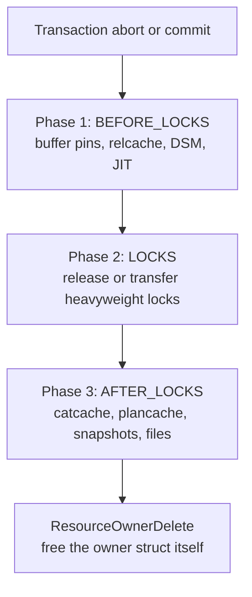

# ResourceOwner

PostgreSQL's [[subsystems/memory/contexts|memory context]] system handles the lifetime of heap-allocated memory very well: delete the right context and every allocation in it vanishes. But memory is not the only resource a backend acquires. A query reads buffer pages. The shared buffer pool pins those pages while the query uses them, and the query must unpin them when it finishes. It acquires heavyweight locks that other backends are waiting on. It pins catalog tuples, relcache entries, and plan cache objects whose reference counts must remain balanced. None of these are memory; none of them disappear when a palloc context is freed.

ResourceOwner solves this problem with a parallel tracking structure. This structure records every such resource the moment code acquires it. It releases them all automatically when the scope ends, including when an error ends the scope. It is the mechanism that prevents buffer pin leaks, lock hangs, and corruption of catalog reference counts in a backend that can be interrupted at any point.

## The core idea

A `ResourceOwner` is an opaque object that holds references to currently-held resources. Code that acquires a shared resource — `ReadBuffer`, `LockAcquire`, `SearchSysCache`, and many others — records that acquisition in the currently-active resource owner before returning to its caller. Code that releases the resource removes it from the owner. If the backend reaches a clean endpoint (query completion, transaction commit), all resources should already be released individually. The owner is then empty. If an error interrupts execution, the resource owner framework walks whatever remains and releases everything.

This mirrors exactly what memory contexts do for palloc'd memory, and the design is intentionally analogous. Like memory contexts, resource owners form a tree; releasing a parent walks all descendants first. Unlike memory contexts, they do not own the storage of the resources themselves. They hold *references* to shared objects. Releasing means decrementing reference counts or calling specific release functions, not freeing memory.

The README in `src/backend/utils/resowner/` captures the original motivation clearly: rather than expecting every part of the executor to have bulletproof cleanup code, the system localizes the tracking problem. A single module knows about all outstanding references; everyone else just needs to call Enlarge/Remember on acquisition and Forget on release.

Memory contexts alone are not sufficient for this because the resources tracked by ResourceOwner are not owned by the backend exclusively. A buffer pin tells the buffer manager "I am reading this page — do not evict it." The pin is a flag in shared memory, not a heap allocation. Freeing the backend's palloc context does not update the buffer manager's pin count. Similarly, a heavyweight lock is a record in the lock manager's shared hash table. Abandoning it without releasing it means other backends waiting on that lock will wait forever. ResourceOwner provides the layer of accounting needed to drive the correct release calls — `ReleaseBuffer`, `LockRelease`, `ReleaseCatCache` — at the right time. Memory context cleanup and resource owner cleanup are complementary operations that must both happen on error exit.

## The owner tree

Resource owners are linked in a parent-child tree maintained in each `ResourceOwnerData` node (resowner.c). Each node records its parent and the head of a singly-linked list of children via `firstchild` and `nextchild` pointers. The tree for a typical transaction with one subtransaction and two portals looks like this:

```
TopTransactionResourceOwner  (created at BEGIN or first command)
  └── SubTransaction owner   (created at SAVEPOINT)
        ├── Portal "unnamed" (simple query)
        └── Portal "cur1"    (DECLARE CURSOR)
```

Three global pointers navigate this tree at runtime:

- `TopTransactionResourceOwner` — the root, created when a top-level transaction starts (`AtStart_ResourceOwner`, xact.c). It lives for the full duration of the transaction. At top level, `CurTransactionResourceOwner` is initialised to the same node.
- `CurTransactionResourceOwner` — the innermost transaction-level owner. At the top level it equals `TopTransactionResourceOwner`; inside a subtransaction it points to the subtransaction's owner. This is the parent used when creating new portal owners.
- `CurrentResourceOwner` — the owner that should record the next resource acquisition. During portal execution this points to the portal's owner. During parsing, planning, or utility execution with no portal it typically points to `CurTransactionResourceOwner`.

The distinction between `CurTransactionResourceOwner` and `CurrentResourceOwner` matters. `CurTransactionResourceOwner` is the transaction-level anchor — it changes only when a subtransaction starts or ends. `CurrentResourceOwner` is ephemeral — it changes any time control passes into or out of a portal. Between portals, they are equal. While a portal is active, `CurrentResourceOwner` points to the portal's owner. This owner is a child of `CurTransactionResourceOwner`.

`CurrentResourceOwner` is `NULL` in two cases: when no transaction is open, and when the backend is inside a failed transaction. Attempting to acquire a query-lifespan resource in either state is a programming error; the Enlarge/Remember calls will crash or assert rather than silently produce a dangling resource.

When a portal is created (`portalmem.c`), it allocates its own resource owner as a child of `CurTransactionResourceOwner`. While the portal is executing, `CurrentResourceOwner` points to the portal's owner. This way, all buffer pins and locks taken during query execution are charged to that portal. When the portal closes cleanly, PostgreSQL transfers its remaining resources (usually only locks) to the parent transaction owner. It then deletes the portal's owner.

## What gets tracked

The `ResourceOwnerData` struct (resowner.c) contains a separate `ResourceArray` for each distinct resource type. Keeping them separate — rather than one polymorphic list — means the release code for each type can be written as a simple loop that calls the correct release function directly, without dynamic dispatch or type checking. It also means leak warnings can identify exactly what was leaked by type.

The full set of built-in resource types is:

| Field | Resource type | Released by |
|---|---|---|
| `bufferarr` | Buffer pins (shared buffer pool) | `ReleaseBuffer` |
| `bufferioarr` | In-progress buffer I/O | `AbortBufferIO` |
| `catrefarr` | Catcache tuple references | `ReleaseCatCache` |
| `catlistrefarr` | Catcache list pins | `ReleaseCatCacheList` |
| `relrefarr` | Relcache relation references | `RelationClose` |
| `planrefarr` | Plan cache references | `ReleaseCachedPlan` |
| `tupdescarr` | TupleDesc reference counts | `DecrTupleDescRefCount` |
| `snapshotarr` | Registered snapshots | `UnregisterSnapshot` |
| `filearr` | Virtual file descriptors | `FileClose` |
| `dsmarr` | Dynamic shared memory segments | `dsm_detach` |
| `jitarr` | [[subsystems/executor/jit-llvm|JIT]] compilation contexts | `jit_release_context` |
| `cryptohasharr` / `hmacarr` | Cryptographic contexts | `pg_cryptohash_free` / `pg_hmac_free` |

Locks are the exception to this structure. Rather than a `ResourceArray`, the owner has a small fixed-size cache (`locks[]`, up to `MAX_RESOWNER_LOCKS = 15` entries) with overflow spilling to the lock manager's own hash table. This is a performance optimisation. Iterating the lock table is slower when many locks from other owners are present. The cache therefore makes commit and abort faster in the common case.

## The ResourceArray storage model

Each `ResourceArray` inside an owner starts empty. PostgreSQL allocates no memory for it until code acquires the first resource of that type. PostgreSQL allocates the arrays from `TopMemoryContext`, so they outlast any query-level context that might be deleted on error.

For small sets (up to 64 items, controlled by `RESARRAY_MAX_ARRAY`), the array is a simple linear structure: IDs are packed sequentially and scanned linearly on removal. Once a set exceeds that threshold, the array switches to open-addressing hash table mode with a maximum load factor of 75%. This way, lookups remain O(1) even when a portal holds hundreds of buffer pins. PostgreSQL stores all resource IDs as `Datum` values, which are wide enough to hold any pointer or integer on all supported platforms. A per-array sentinel `invalidval` distinguishes occupied from empty slots — for buffer arrays this is `InvalidBuffer`, for pointer arrays it is `NULL`.

The array grows by doubling capacity, maintaining the power-of-two size invariant required by the hash mode. Growth happens through an explicit two-step protocol: the caller must first call the type-specific `ResourceOwnerEnlarge*` function (e.g. `ResourceOwnerEnlargeBuffers`) to ensure there is room. It then acquires the resource and calls `ResourceOwnerRemember*` to record it. This split is deliberate. If memory for the array is exhausted, the enlargement fails *before* the resource is acquired. This keeps the database consistent. There is never a window where a resource is held but untracked.

The lock cache departs from this pattern. Each owner has a fixed array of `MAX_RESOWNER_LOCKS` (15) lock slots. This covers the typical case — most query-level resource owners hold far fewer locks than that. When the cache overflows, PostgreSQL stores a sentinel value. This value indicates that code must consult the lock manager's own hash table instead. Committing or aborting with an overflowed cache is slightly slower because it requires traversing the lock manager's global data structure rather than the owner's compact local list.

## Acquisition and release protocol

Every resource type that integrates directly with the framework follows the same three-step pattern:

1. **Enlarge** — call `ResourceOwnerEnlarge<Type>(CurrentResourceOwner)` to guarantee capacity. This may allocate or reallocate the underlying `ResourceArray` storage. It must happen before acquiring the resource. This way, any out-of-memory failure happens at a point where the resource has not yet been taken.
2. **Acquire** — perform the actual acquisition (pin the buffer, take the lock, open the file, register the snapshot).
3. **Remember** — call `ResourceOwnerRemember<Type>(CurrentResourceOwner, resource)` to record it in the owner's array.

Releasing is the mirror image:

1. **Forget** — call `ResourceOwnerForget<Type>(CurrentResourceOwner, resource)` to remove the entry from the array. This does not release the resource; it only removes the tracking entry.
2. **Release** — perform the actual release (unpin the buffer, drop the lock, close the file).

The Forget-before-Release ordering matches the Enlarge-before-Acquire ordering. Both are defensive: the tracking operation happens first. If the tracking fails (in Enlarge), or if the subsequent operation fails (hypothetically in Forget, though array removal never actually fails), the resource is either never taken or still tracked.

The `CurrentResourceOwner` at release time must be the same owner that was current at acquisition time. Releasing while a different owner is active would cause problems. It would either remove the entry from the wrong array (if the resource ID happens to match something in the wrong owner), or fail to find the entry at all. The README is explicit on this point: the constraint could be relaxed with additional bookkeeping, but there has been no need.

Extension authors commonly find `CurrentResourceOwner` confusing. It is a backend-global variable that changes frequently during query processing, pointing to different portal or subtransaction owners as execution proceeds. Extension code that acquires a resource in one context and releases it in another must either ensure the owner has not changed, or save and restore `CurrentResourceOwner` around the release call, or use `ResourceOwnerForgetBuffer` on the specific owner object rather than relying on the global.

## Three-phase release

`ResourceOwnerRelease` does not free everything in one pass. The framework calls it three times in sequence, each time with a different `ResourceReleasePhase` value. The transaction manager (xact.c) handles this sequencing explicitly. After abort or commit, it calls `ResourceOwnerRelease` with `RESOURCE_RELEASE_BEFORE_LOCKS`. It then does any additional cleanup that must happen between locks and post-lock resources, and calls `ResourceOwnerRelease` twice more.

The three phases are:

**Phase 1 — `RESOURCE_RELEASE_BEFORE_LOCKS`**: releases all resources visible to other backends. This includes buffer pins (`ReleaseBuffer`), relcache references (`RelationClose`), dynamic shared memory segments (`dsm_detach`), JIT contexts, and cryptographic hash contexts. These must be released before locks are dropped. The reason is sequencing correctness. When this backend releases a heavyweight lock, any backend waiting on it will immediately proceed. If this backend still holds buffer pins at that moment, there is a brief window of risk. The other backend could see buffer state that the lock was supposed to protect. By releasing all shared-visible resources first, the transition is clean.

**Phase 2 — `RESOURCE_RELEASE_LOCKS`**: releases or transfers heavyweight locks. On top-level commit and abort, `ProcReleaseLocks` sweeps all locks held by the process in a single call, which is more efficient than iterating the resource owner's lock cache. On subtransaction commit, PostgreSQL *transfers* locks to the parent resource owner rather than releasing them. Locks always persist until the end of the outermost transaction, regardless of which subtransaction originally acquired them. On subtransaction abort, locks acquired since the savepoint are released.

**Phase 3 — `RESOURCE_RELEASE_AFTER_LOCKS`**: releases backend-internal reference counts. This includes catcache tuple references (`ReleaseCatCache`), catcache list pins, plan cache references (`ReleaseCachedPlan`), tuple descriptor reference counts (`DecrTupleDescRefCount`), registered snapshots (`UnregisterSnapshot`), and open temporary files (`FileClose`). These are all local to the backend and carry no shared-state implications. As a result, they can safely wait until after lock release.

The release function recurses depth-first: for each phase, it fully processes all descendants of an owner before handling the owner itself. This preserves ordering invariants. PostgreSQL frees a portal's buffer pins in phase 1 before touching the transaction owner's phase-1 resources.



After all three phases complete, `ResourceOwnerDelete` frees the owner struct and its `ResourceArray` storage. The delete function asserts that all arrays are empty before freeing. As a result, any path that skips a phase, or jumps straight to delete without releasing, will fail in debug builds.

On commit, if any tracked resources remain at phase entry, the framework emits a WARNING (via `PrintBufferLeakWarning`, `PrintRelCacheLeakWarning`, etc.) rather than a PANIC. PostgreSQL still releases the resource, but the warning signals a bug in the executor or extension code that should have cleaned up earlier. On abort, PostgreSQL releases resources silently without warnings, since an error exit may legitimately leave some cleanup unfinished.

## Subtransactions and savepoints

Each `SAVEPOINT` statement starts a subtransaction. `AtSubStart_ResourceOwner` (xact.c) creates a new resource owner whose parent is the current `CurTransactionResourceOwner`. It then updates `CurTransactionResourceOwner` and `CurrentResourceOwner` to point to the new owner. The subtransaction's owner records all resources acquired while that subtransaction is active — buffer pins, locks, catalog references.

On `ROLLBACK TO SAVEPOINT`, `AtSubAbort_ResourceOwner` resets `CurrentResourceOwner` back to the subtransaction owner. The abort path then calls `ResourceOwnerRelease` on it through all three phases. Buffer pins and catalog references acquired since the savepoint are released. Locks acquired since the savepoint are also released (unlike at subtransaction commit, where they would be transferred instead). The parent owner sees none of this — it is completely isolated from the subtransaction cleanup.

On `RELEASE SAVEPOINT` or a subtransaction that commits without error, the resource owner processing transfers locks upward rather than releasing them. It then deletes the subtransaction owner. The surviving locks are now recorded in the parent owner and will persist until the top-level transaction ends. The subtransaction's own code should have released buffer pins and catalog references before it committed. If any remain, they generate warnings.

This structure means that `ROLLBACK TO SAVEPOINT` has a precisely bounded cleanup cost. It processes only the resources acquired since the most recent savepoint, not the entire transaction. Deep savepoint nesting — common in ORMs that use savepoints for each statement in an auto-commit-like mode — does not cause any cascading re-scan of the full transaction state.

## Portal lifetimes and resource transfer

A portal's resource owner is created as a child of `CurTransactionResourceOwner` (portalmem.c). When the portal closes normally, `ResourceOwnerNewParent` transfers any remaining resources — in practice, mostly locks — to the parent transaction owner. The portal's owner is then deleted. PostgreSQL does not release the locks themselves; it holds them until the enclosing transaction ends.

If transaction abort cleans up a portal, it follows the same three-phase release as any other owner in the tree, releasing rather than transferring locks.

For long-running cursors that survive across multiple transactions (held portals), `ResourceOwnerNewParent` re-parents the portal's resource owner to the new transaction's resource owner at each transaction boundary (portalmem.c).

## Snapshot tracking

Resource owners track registered snapshots alongside buffer pins and catalog references. `RegisterSnapshot` adds a registered snapshot to `snapshotarr`; `UnregisterSnapshot` removes it. This matters because registered snapshots extend the oldest transaction horizon that the MVCC machinery must consider. As long as a snapshot is registered, tuples visible to it cannot be vacuumed away.

The resource owner guarantees release of a snapshot registered for a query when the query ends, even on error. Without this, a long-running backend could accumulate stale registered snapshots and prevent vacuum from reclaiming dead tuples. This is a form of table bloat that is difficult to diagnose, because the offending snapshot is invisible to normal monitoring queries.

The active snapshot stack (`PushActiveSnapshot` / `PopActiveSnapshot`) operates separately from registered snapshots. The two interact: a snapshot pushed onto the active stack is typically also registered, so the resource owner knows about it.

## Extension callbacks

Not all resource types need their own `ResourceArray` field. Extensions and subsystems can register a callback with `RegisterResourceReleaseCallback`. The callback receives the current release phase, a commit/abort flag, and a caller-supplied argument. `ResourceOwnerRelease` invokes it at the end of each phase, after handling the built-in resource types.

This is how extensions that acquire OS resources, connection handles, or other non-standard objects participate in the cleanup protocol. The callback is responsible for scanning its own data structures to find objects associated with the current resource owner and releasing them.

The callback API is the correct integration point for extension code that wraps OS-level handles (network connections, file descriptors obtained via `open(2)`, shared memory mappings), resources obtained from external libraries, or any reference-counted object whose lifetime should align with a query or transaction. `ResourceOwnerRelease` calls the callback once per phase. This lets the callback spread its cleanup work across the same three phases that built-in resources use — releasing shared-visible resources in phase 1, locks in phase 2, and backend-local cleanup in phase 3.

### Writing extension code safely

Extension code that acquires resources and integrates with `ResourceOwner` should follow this discipline:

1. Register a release callback once at library load time with `RegisterResourceReleaseCallback`. The callback uses its `arg` to find a module-local list of tracked objects.
2. Before acquiring a resource, record the current `CurrentResourceOwner` alongside the resource handle in the module-local list.
3. On explicit release, remove the entry from the list and perform the release. On error, the registered callback will find the entry and release it during the appropriate phase.

Never store a resource handle without recording which `ResourceOwner` was current at acquisition time. Without that association, the release callback cannot distinguish resources belonging to different nested queries or portals executing within the same transaction.

## Relationship to memory contexts

ResourceOwner and [[subsystems/memory/contexts|MemoryContext]] are parallel but distinct tracking systems. They address different dimensions of the same problem: memory contexts manage heap allocations owned exclusively by this backend; resource owners manage references to shared state owned jointly with other backends or the OS.

A query abort triggers both systems. PostgreSQL deletes the memory context tree for the query, reclaiming all palloc'd storage for executor nodes, plan trees, tuple slots, sort keys, hash tables, and temporary buffers. Simultaneously, it releases the resource owner tree, returning buffer pins to the pool, releasing locks to the lock manager, and decrementing catalog reference counts. One operation without the other would be incomplete: freeing the memory without releasing the buffer pins would leave shared state pinned indefinitely; releasing the pins while leaving the memory allocated would cause memory leaks.

The systems interact in one specific way: PostgreSQL allocates `ResourceArray` storage from `TopMemoryContext`, not from the transaction-level or query-level context. If PostgreSQL allocated it from the transaction context instead, deleting that context on error would free the array storage first. The resource owner would then have no chance to iterate it and release the resources it tracks. Allocating from `TopMemoryContext` ensures the tracking arrays outlive any early cleanup. This matters because such cleanup might happen before the resource owner release pass runs. `ResourceOwnerDelete` frees the arrays explicitly once it confirms they are empty.

It is tempting to consider unifying resource owners and memory contexts into a single object type. The PostgreSQL source notes this temptation explicitly and rejects it, because usage patterns differ sufficiently. Memory contexts are created and destroyed frequently (one per query, one per tuple slot in some executor paths). Resource owners, by contrast, are created only for transactions, subtransactions, and portals. The overhead of tracking resource arrays for every memory context would be unjustified.

## Consequences for buffer pin management

Because every buffer pin goes through `ReadBuffer` → `ResourceOwnerEnlargeBuffers` → pin acquired → `ResourceOwnerRememberBuffer`, the owner always has an accurate census of which buffers are pinned by the current query or portal. This has several practical consequences:

**Pin leak detection.** If a pin remains at commit time, the framework emits a warning naming the buffer. Without this accounting, a leaked pin would silently prevent the clock-sweep eviction algorithm from choosing the buffer as a victim. This would degrade effective cache size over time. The bug would be nearly impossible to diagnose from outside because `pg_buffercache` shows the buffer as pinned but not by any visible process (the pin count is incremented in shared memory, but the pinning query has already returned to the client).

**Bounded pin accumulation during sequential scans.** A sequential scan of a large table reads pages in order. It pins each page for the duration of tuple processing on that page, then releases it before moving to the next. At any instant, the scan holds at most a small number of pins. The resource owner's `bufferarr` therefore stays small regardless of table size. The total outstanding pins across an entire executor tree is bounded by the depth of the executor node tree and the number of relations it touches simultaneously, not by the data volume being processed.

**Safe abort from any point in execution.** An error partway through a complex operation — say, partway through building a hash table in a hash join — leaves the executor state in an unknown condition. PostgreSQL will delete the memory context for the query, but that is insufficient. Any pages pinned for hash bucket chains are still pinned in shared memory. The phase-1 resource owner cleanup finds them all via `bufferarr` and calls `ReleaseBuffer` for each. This returns them to the eviction pool before PostgreSQL releases any lock.

**Concurrent buffer I/O tracking.** The `bufferioarr` array tracks in-progress I/O operations — situations where the backend has started reading or writing a buffer but has not yet completed the I/O. On abort, the framework must cancel any in-progress I/O via `AbortBufferIO` before it can release the pin. Phase 1 processes `bufferioarr` before `bufferarr` to ensure this ordering. On commit, any remaining entries in `bufferioarr` indicate a serious programming error and trigger `PANIC`.

## Catalog reference counting

Catcache and relcache entries stored in shared memory carry reference counts. Every `SearchSysCache` call that returns a `HeapTuple` pins the catcache slot for that tuple; every `RelationIdGetRelation` call (and the many functions that call it internally) pins the relcache entry for the relation. These pins serve as a hold: they signal to the invalidation machinery that the entry is in active use and must not be recycled or overwritten.

The resource owner records each such pin in `catrefarr` and `relrefarr` respectively. When the query completes normally, the executor and planner should have released every pin they acquired via `ReleaseSysCache` and `RelationClose`. If any pins survive to the phase-3 commit cleanup, the framework emits a warning and forces the release. On abort, the cleanup happens silently.

The correctness implication is significant. A pin held beyond the end of a transaction prevents cache invalidation from taking effect for that specific entry. Suppose another backend performs a `DDL` operation, such as altering a column type, that invalidates the catalog tuple. PostgreSQL then defers the invalidation message sent to this backend for the pinned entry, until the reference count drops to zero. The entry will continue to serve stale data to any code path that accesses it through the cache. In normal operation this window is tiny (sub-millisecond: the pin is released at transaction end), but a pin leaked by buggy code could extend it indefinitely.

Relcache pins differ slightly: PostgreSQL expects them to persist across multiple queries within a session. `RelationIdGetRelation` increments a reference count; `RelationClose` decrements it. The relcache keeps the entry resident as long as any reference is held. The resource owner releases any references acquired during a transaction at the transaction's end. This happens even if the caller forgets to call `RelationClose` explicitly.

Plan cache references (`planrefarr`) follow a similar pattern. A cached plan pinned for execution must be released when execution ends, whether by success or error. This allows PostgreSQL to invalidate and rebuild the plan if the underlying schema changes.

## Auxiliary process owners

Background workers and auxiliary processes (checkpointer, WAL writer, [[subsystems/background/autovacuum|autovacuum]] workers, etc.) are not query-driven but they do acquire buffer pins and sometimes locks. They cannot use the transaction owner machinery because they never begin transactions in the normal sense. Instead they use `AuxProcessResourceOwner`, a single long-lived owner created once by `CreateAuxProcessResourceOwner` (resowner.c).

PostgreSQL registers `ReleaseAuxProcessResources` as an `on_shmem_exit` callback. This ensures it runs even if the process exits abnormally. This prevents the shared buffer pool from retaining phantom pins after a background process crashes. Background workers that wish to run SQL (and therefore manage transactions in the usual way) do not use `AuxProcessResourceOwner`; they use the standard transaction resource owner machinery just like a regular backend.

## Detecting resource leaks

The leak detection behaviour at commit time — warnings from `PrintBufferLeakWarning`, `PrintRelCacheLeakWarning`, `PrintSnapshotLeakWarning`, and so on — is intentionally diagnostic rather than fatal. Making it fatal would crash the backend on any executor bug, which is worse than the leak itself. Making it silent would hide bugs indefinitely. A WARNING level message is visible in the server log, alertable by monitoring tools, and leaves the backend alive for further investigation.

In development builds with assertions enabled, the framework is stricter. Some paths use `Assert` directly to verify that an owner is empty before deletion rather than relying on the commit-path warnings alone. The combination of assertions in debug builds and warnings in production builds gives both fast feedback during development and graceful recovery in deployment.

PostgreSQL suppresses leak warnings at abort time entirely. On abort the framework does not know whether the unreleased resources represent a bug or a normal consequence of the error path interrupting cleanup that had not yet begun. Emitting warnings on every error abort would flood the log with noise.

## See also

- [[subsystems/memory/contexts|Memory Contexts]] — parallel system for palloc'd memory lifetime
- [[subsystems/locking/overview|Heavyweight Locks]] — lock acquisition records tracked by resource owners
- [[subsystems/storage/buffer-manager|Buffer Manager]] — buffer pin acquisition and release
- [[subsystems/catalog/syscache|Catalog Cache]] — catcache reference counting
- [[subsystems/transactions/subtransactions|Subtransactions]] — how savepoints interact with resource owner nesting
