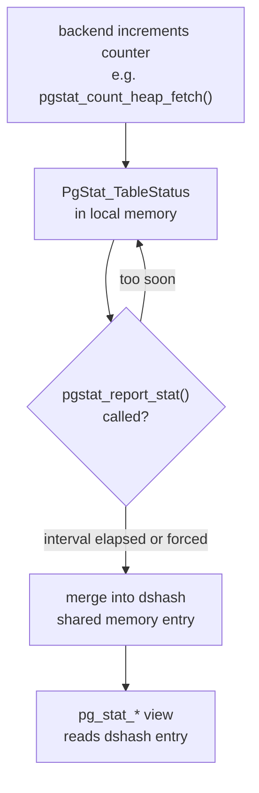

# PostgreSQL Observability Overview

PostgreSQL exposes its runtime behaviour through a set of system views backed by the cumulative statistics subsystem and shared-memory process state. The same infrastructure records query execution counts, block I/O, lock waits, and vacuum progress — all readable from SQL without any external agent.

## Cumulative Statistics Architecture

Before PostgreSQL 15, a dedicated **stats collector** background process received UDP datagrams from backends. It periodically wrote per-table, per-index, and per-function counters to files under `pg_stat/`. Queries against the `pg_stat_*` views read those files, so results could lag by up to one `PGSTAT_STAT_INTERVAL` (500 ms). PostgreSQL 15 eliminated the collector process: backends now accumulate counters locally and flush them directly into a shared-memory `dshash` table, removing both the UDP round-trip and the on-disk files. See [[subsystems/background/stats-collector|Cumulative Statistics System]] for the dshash layout, the per-backend flush mechanics, and how individual `PgStat_Kind` entries are structured.

For users, the practical effect is that statistics become visible sooner after each update and are no longer silently dropped under UDP packet loss — a known failure mode of the old collector on heavily loaded systems.

## Stats Targets: PgStat_Kind

Every stats entry belongs to exactly one kind, defined by the `PgStat_Kind` enum in `pgstat.h`. Each kind has a fixed entry shape and a well-defined set of counters. The view functions in `pgstatfuncs.c` read entries of the appropriate kind and project SQL-visible columns from the struct fields.

| Kind constant | Tracks | Primary view |
|---|---|---|
| `PGSTAT_KIND_DATABASE` | Database-wide counters (commits, rollbacks, block I/O) | `pg_stat_database` |
| `PGSTAT_KIND_RELATION` | Per-table and per-index access counters | `pg_stat_user_tables`, `pg_stat_user_indexes` |
| `PGSTAT_KIND_FUNCTION` | Call count and total time for PL functions | `pg_stat_user_functions` |
| `PGSTAT_KIND_REPLSLOT` | Per-replication-slot lag and WAL retained | `pg_replication_slots` |
| `PGSTAT_KIND_SUBSCRIPTION` | Per-subscription apply worker stats | `pg_stat_subscription` |
| `PGSTAT_KIND_ARCHIVER` | WAL archiving success/failure counts | `pg_stat_archiver` |
| `PGSTAT_KIND_BGWRITER` | Background writer buffer writes | `pg_stat_bgwriter` |
| `PGSTAT_KIND_CHECKPOINTER` | Checkpoint frequency and duration (PG 17+) | `pg_stat_checkpointer` |
| `PGSTAT_KIND_IO` | I/O broken down by backend type and context (PG 16+) | `pg_stat_io` |
| `PGSTAT_KIND_SLRU` | SLRU cache hit/miss counts (commit log, etc.) | `pg_stat_slru` |
| `PGSTAT_KIND_WAL` | WAL record and byte counts, sync timing | `pg_stat_wal` |

The kind taxonomy means adding a new stats target is a self-contained change: define a new `PGSTAT_KIND_*` value, declare the entry struct, register flush and snapshot callbacks, and write the view function. This requires no changes to the central dshash or the flush machinery.

## Process-Local Pending List and Flush Timing

When a backend increments a counter — for example, `pgstat_count_heap_fetch(rel)` in `pgstat.h` — the increment goes into a `PgStat_TableStatus` entry in the backend's per-relation status array. This is purely in local memory. PostgreSQL writes nothing to shared memory until the backend calls `pgstat_report_stat()`.

PostgreSQL calls `pgstat_report_stat()` from the idle loop (between client commands), and at transaction commit and abort. It skips the flush if fewer than `PGSTAT_MIN_INTERVAL` milliseconds have passed since the last flush and the pending list has not been growing for more than `PGSTAT_MAX_INTERVAL`. When it does flush, `pgstat_report_stat()` merges each pending entry into the shared dshash table with a spinlock per entry, and clears the local pending list. The function also returns a suggested timeout (`PGSTAT_IDLE_INTERVAL`, 10 000 ms) that callers can use to schedule the next forced flush during idle time.



The rate-limiting prevents a workload with a high transaction rate from turning every commit into a shared-memory contention point. At 10 000 transactions per second, without rate limiting, that would be 10 000 spinlock contests per second on every table's stats entry. With the 1 000 ms floor, it collapses to at most one shared write per second per entry.

## pg_stat_activity and PgBackendStatus

`pg_stat_activity` is not backed by the cumulative stats subsystem at all — it reads live `PgBackendStatus` entries straight out of a shared-memory array instead of accumulated counters. See [[subsystems/background/stats-collector|Cumulative Statistics System]] for the full `PgBackendStatus` field layout and the `st_changecount` torn-read protocol.

Because it reads live state, `pg_stat_activity` always reflects the current moment. A session that finishes a query between two reads simply will not appear as active in the later read; there is no flush lag. This is fundamentally different from `pg_stat_user_tables`. There, rows represent counters that may lag slightly behind, due to the flush interval.

## Wait Events Infrastructure

Every backend records what it is currently blocked on — a lock, an [[subsystems/locking/lwlocks|LWLock]], an I/O call, or any other wait point — in a `wait_event_info` field inside its `PgBackendStatus` entry. It sets and clears this field via `pgstat_report_wait_start()` / `pgstat_report_wait_end()`, with a single atomic 32-bit store. See [[subsystems/background/stats-collector|Cumulative Statistics System]] for the bit-layout encoding and the full set of wait event categories.

**PostgreSQL 17:** The `pg_wait_events` system view makes the complete list of all known wait event types queryable from SQL with human-readable descriptions. Previously this list existed only in documentation. It can be joined with `pg_stat_activity` to enrich monitoring queries. Extensions can also register custom wait events via the extension API, replacing the generic `WAIT_EVENT_EXTENSION` placeholder. Those custom events then appear in both `pg_stat_activity` and `pg_wait_events`.

### stats_fetch_consistency (PG 15+)

The `stats_fetch_consistency` GUC controls how `pg_stat_*` views interact with the in-memory cache within a single session:

| Value | Behaviour | Cost |
|---|---|---|
| `none` | Each view access hits shared memory directly | Lowest |
| `cache` | First access per transaction caches the result; subsequent reads within the same transaction return the cached snapshot | Medium |
| `snapshot` | All stats for a transaction are captured atomically at first access | Highest |

`none` is the default. `cache` is useful when you join multiple `pg_stat_*` views and want counts to be mutually consistent. `snapshot` is primarily for testing.

## Key Views and What They Answer

| View | Question it answers | Key columns | Notes |
|---|---|---|---|
| `pg_stat_activity` | What are sessions doing right now? | `state`, `wait_event_type`, `wait_event`, `query`, `query_start`, `xact_start` | One row per backend including [[subsystems/background/autovacuum|autovacuum]] workers and walsenders |
| `pg_stat_statements` | Which queries are slow or high-frequency? | `calls`, `mean_exec_time`, `stddev_exec_time`, `rows`, `shared_blks_hit`, `shared_blks_read` | Requires the `pg_stat_statements` extension; reset with `pg_stat_statements_reset()` |
| `pg_stat_user_tables` | Which tables have high dead-tuple counts or are missing index scans? | `n_dead_tup`, `n_live_tup`, `seq_scan`, `idx_scan`, `last_autovacuum`, `last_autoanalyze` | Also exposed as `pg_stat_all_tables` for system tables |
| `pg_stat_user_indexes` | Which indexes are unused? | `idx_scan`, `idx_tup_read`, `idx_tup_fetch` | `idx_scan = 0` since last reset means the index has never been used |
| `pg_stat_bgwriter` | How often are checkpoints occurring and how much dirty data is written? | `checkpoints_timed`, `checkpoints_req`, `buffers_checkpoint`, `buffers_clean`, `buffers_backend` | In PG 17 the checkpoint counters moved to `pg_stat_checkpointer` |
| `pg_stat_checkpointer` | Checkpoint frequency and cost (PG 17+) | `num_timed`, `num_requested`, `write_time`, `sync_time` | Split out from `pg_stat_bgwriter` in PG 17 |
| `pg_stat_wal` | WAL generation rate | `wal_records`, `wal_bytes`, `wal_sync`, `wal_sync_time`, `wal_write_time` | Useful for estimating replication lag risk and I/O budget |
| `pg_stat_io` | I/O broken down by backend type and operation context | `backend_type`, `context`, `reads`, `writes`, `extends`, `evictions`, `reuses` | Added in PG 16; `context` values include `bulkread`, `bulkwrite`, `normal`, `vacuum` |
| `pg_locks` + `pg_blocking_pids()` | Which sessions are blocked and by whom? | `pid`, `locktype`, `relation`, `mode`, `granted` | Join on `pid`; `pg_blocking_pids(pid)` returns the array of blocker PIDs |
| `pg_stat_progress_vacuum` | How far through a VACUUM is the current pass? | `heap_blks_scanned`, `heap_blks_vacuumed`, `index_vacuum_count`, `num_dead_item_ids` | Also available for CREATE INDEX, ANALYZE, CLUSTER, COPY, BASE_BACKUP |

## Diagnostic Query Recipes

Buffer hit rate across all databases — a value below about 99% on an OLTP workload suggests the shared_buffers allocation is too small or the working set exceeds available memory:

```sql
SELECT datname,
       blks_hit,
       blks_read,
       round(blks_hit::numeric / nullif(blks_hit + blks_read, 0) * 100, 2) AS hit_rate_pct
FROM pg_stat_database
ORDER BY blks_read DESC;
```

Tables with the highest sequential scan count are index candidates. A table that is scanned sequentially thousands of times per minute is almost certainly missing a useful index:

```sql
SELECT relname, seq_scan, idx_scan,
       round(seq_scan::numeric / nullif(seq_scan + idx_scan, 0) * 100, 1) AS seq_pct,
       n_live_tup
FROM pg_stat_user_tables
WHERE seq_scan > 0
ORDER BY seq_scan DESC
LIMIT 20;
```

Connections by state and wait event — useful for spotting an accumulation of idle-in-transaction sessions or a cluster of backends all blocked on the same wait:

```sql
SELECT state, wait_event_type, wait_event, count(*)
FROM pg_stat_activity
WHERE pid <> pg_backend_pid()
GROUP BY state, wait_event_type, wait_event
ORDER BY count(*) DESC;
```

Whether autovacuum is keeping up — tables where dead tuples are accumulating faster than autovacuum can reclaim them will bloat and eventually slow queries:

```sql
SELECT relname,
       n_dead_tup,
       n_live_tup,
       round(n_dead_tup::numeric / nullif(n_live_tup + n_dead_tup, 0) * 100, 1) AS dead_pct,
       last_autovacuum,
       last_autoanalyze
FROM pg_stat_user_tables
WHERE n_dead_tup > 1000
ORDER BY n_dead_tup DESC
LIMIT 20;
```

Finding sessions that are blocked:

```sql
SELECT pid, pg_blocking_pids(pid) AS blocked_by, query, state
FROM pg_stat_activity
WHERE cardinality(pg_blocking_pids(pid)) > 0;
```

Top 10 queries by mean execution time (`pg_stat_statements` required):

```sql
SELECT query, calls, round(mean_exec_time::numeric, 2) AS mean_ms,
       round(stddev_exec_time::numeric, 2) AS stddev_ms
FROM pg_stat_statements
ORDER BY mean_exec_time DESC
LIMIT 10;
```

Indexes that have never been scanned and are not backing a constraint:

```sql
SELECT schemaname, relname, indexrelname, idx_scan
FROM pg_stat_user_indexes
WHERE idx_scan = 0
  AND NOT EXISTS (
    SELECT 1 FROM pg_constraint c
    WHERE c.conindid = indexrelid
  )
ORDER BY pg_relation_size(indexrelid) DESC;
```

## Correlating Views

`pg_stat_activity` and `pg_locks` share `pid` as the join key. Combining them gives the full lock context for any waiting session: the lock type, the relation, the mode requested, and whether the lock has been granted.

```sql
SELECT a.pid, a.query, a.wait_event_type, a.wait_event,
       l.locktype, l.relation::regclass, l.mode, l.granted
FROM pg_stat_activity a
JOIN pg_locks l USING (pid)
WHERE a.wait_event_type = 'Lock';
```

`pg_stat_statements` records a `queryid` for each normalised query. Starting with PG 14, `auto_explain` embeds the same identifier as `"Query Identifier"` in its JSON output when `compute_query_id` is enabled. This lets you join aggregate statistics (calls, mean time) against actual execution plans captured for specific slow invocations. For this to work, `pg_stat_statements` must appear before `auto_explain` in `shared_preload_libraries`. This way, PostgreSQL computes the query identifier before `auto_explain` logs the plan.

## Related Topics

- [[subsystems/observability/pgstat-shmem|pgstat Shared Memory]] — describes the dshash table and dynamic shared memory segment that backs the cumulative stats architecture discussed here
- [[subsystems/observability/pgstat-per-subsystem|Per-Subsystem Stats]] — covers how each PgStat_Kind entry is structured and how individual subsystems register flush and snapshot callbacks
- [[subsystems/observability/wait-events|Wait Events]] — deep dive into the wait event encoding, class hierarchy, and how custom extension wait events are registered
- [[subsystems/observability/pg-stat-activity|pg_stat_activity]] — detailed coverage of the PgBackendStatus shared-memory array and session state fields that this view reads
- [[subsystems/observability/pg-stat-statements|pg_stat_statements]] — covers query normalisation, the queryid computation, and how this extension integrates with auto_explain
- [[subsystems/background/autovacuum|Autovacuum]] — autovacuum workers are visible in pg_stat_activity and their progress is tracked by pg_stat_progress_vacuum, referenced throughout this article
- [[troubleshooting/slow-queries|Slow Queries]] — applies the diagnostic views and recipes covered here to systematically identify and resolve slow-query problems
- [[subsystems/observability/auto-explain|auto_explain]] — logs EXPLAIN plans for slow queries and, since PG 14, tags them with the same queryid used to correlate against pg_stat_statements
- [[subsystems/background/stats-collector|Cumulative Statistics System]] — the shared-memory statistics architecture that pg_stat_activity and the other views described here are built on
- [[subsystems/locking/overview|Locking Subsystem Overview]] — the heavyweight lock manager whose wait state is exposed through the `Lock` wait_event_type surfaced in pg_stat_activity
- [[subsystems/locking/lock-contention-and-slow-queries|Lock Contention and Slow Queries]] — practical patterns for diagnosing lock waits using pg_stat_activity and pg_locks, as shown in the correlating-views query above
