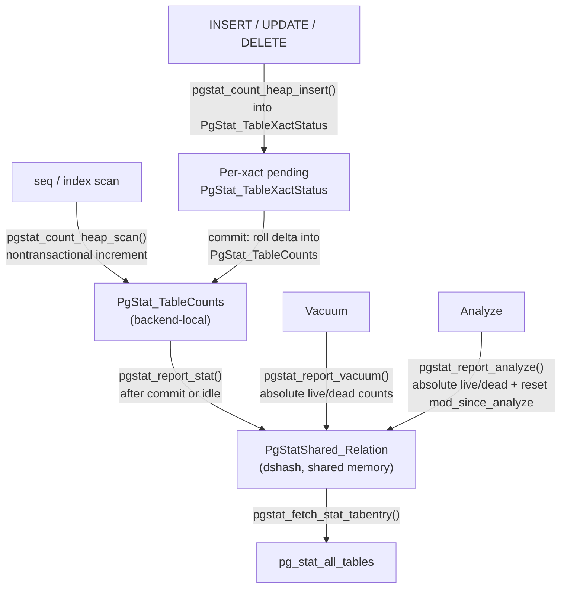

# pg_stat_all_tables and pg_stat_user_tables

`pg_stat_all_tables` is the central view for per-table runtime statistics in PostgreSQL. It exposes cumulative counters that backends accumulate during normal query execution and flush into shared memory. It also exposes summary figures that vacuum and analyze write back after each run. The view covers every relation with physical storage — regular tables, partitioned tables, [[subsystems/storage/toast|TOAST]] tables, and materialized views — and provides the raw data behind autovacuum scheduling, analysis of index usage, and bloat estimation.

In practice, most diagnostic work focuses on `pg_stat_user_tables`. This view is a filtered subset of `pg_stat_all_tables` that excludes the system's catalog schemas (`pg_catalog`, `information_schema`, and `pg_toast`). The companion view `pg_stat_sys_tables` limits to those system schemas instead. All three views share identical columns; only the `WHERE` clause differs. As a result, anything that works against one works against the others.

## The three views and what they include

`system_views.sql` defines `pg_stat_all_tables` as a join of `pg_class`, `pg_index`, and `pg_namespace`, filtered to `relkind IN ('r', 't', 'm', 'p')` — regular tables, TOAST tables, materialized views, and partitioned tables. The join to `pg_index` is what allows `idx_scan` to aggregate index scans across all of a table's indexes: the view sums `pg_stat_get_numscans(I.indexrelid)` for every `pg_index` entry belonging to each table.

The three views are distinguished purely by schema filter:

- `pg_stat_all_tables` — all relkinds above, all schemas visible to the current user
- `pg_stat_user_tables` — same, but `schemaname NOT IN ('pg_catalog', 'information_schema')` and `schemaname !~ '^pg_toast'`
- `pg_stat_sys_tables` — restricted to `pg_catalog`, `information_schema`, and `pg_toast` schemas

Partitioned tables (`relkind = 'p'`) appear in the view but will show zero scan and DML counters in almost all cases, because queries route through the leaf partitions rather than the parent. The leaf partitions appear as regular tables (`relkind = 'r'`) and carry their own per-partition statistics. When you need a whole-table picture for a partitioned table, you must aggregate across all partitions manually.

TOAST tables appear under the `pg_toast` schema with autogenerated names. They accumulate their own scan and DML statistics independently from the main table. This is relevant when you're investigating access patterns for large-value columns.

## Column reference

### Identification

`relid` is the table's OID, matching `pg_class.oid`. `schemaname` and `relname` are the unqualified schema and table names respectively. Together these three columns let you join the view back to `pg_class`, `pg_stat_user_indexes`, or `pg_statio_user_tables` without additional catalog lookups.

One practical note: in certain edge cases involving `pg_stat_reset()` or catalog rebuilds, the view includes entries for tables that no longer exist. This happens because the shared-memory entries persist until PostgreSQL explicitly evicts them. If you see a row in the view with no matching entry in `pg_class`, you can safely ignore it or trigger a reset to clear stale entries.

### Scan and fetch counters

`seq_scan` counts sequential scans initiated on the table heap. `seq_tup_read` counts the heap tuples returned during those scans. The distinction matters: a scan that reads 1 million rows counts once in `seq_scan` but 1 million times in `seq_tup_read`. The `pgstat_count_heap_scan` and `pgstat_count_heap_getnext` macros in `pgstat.h` increment these inline. They are lightweight increments into a backend-local counter, which PostgreSQL later flushes to shared memory.

`idx_scan` aggregates index scans across all indexes associated with the table. `idx_tup_fetch` combines two sources: heap fetches driven by bitmap index scans (counted on the table's own statistics entry as `tuples_fetched`) and heap fetches from simple index scans (counted on each index's statistics entry). The view adds them together. This means `idx_tup_fetch` can exceed `idx_scan` when a single index scan fetches many rows. It can also be much lower than `seq_tup_read` when index scans are highly selective.

`last_seq_scan` and `last_idx_scan` record the timestamp of the most recent sequential or index scan. They come from `PgStat_StatTabEntry.lastscan`. The flush function updates this field whenever `numscans` increments. These timestamps are useful for determining how recently each access path was actually exercised — a table with `idx_scan = 5000` but `last_idx_scan` from six months ago may have had a workload shift in the interim.

### DML counters

`n_tup_ins`, `n_tup_upd`, and `n_tup_del` are cumulative counts of physical tuple insertions, updates, and deletes since the counters were last reset. Critically, these **include operations from aborted transactions**. The accounting is asymmetric by design: PostgreSQL increments nontransactional counters like `numscans` and `tuples_hot_updated` immediately, as operations happen. Transactional counters — inserts, updates, deletes — accumulate in a per-subtransaction `PgStat_TableXactStatus` chain during the transaction. PostgreSQL promotes them to the pending `PgStat_TableCounts` at commit or abort time.

The reason for counting aborted DML is straightforward: aborted transactions leave dead tuple versions behind, just as committed ones do. Vacuum has to clean them up regardless. Tracking them in `n_tup_ins`, `n_tup_upd`, and `n_tup_del` gives a complete picture of heap churn. `n_live_tup` and `n_dead_tup` estimate the net committed change better.

`n_tup_hot_upd` counts updates performed as HOT (Heap Only Tuple) updates. These are cases where the new row version fits on the same heap page as the old one, and no indexed column was modified. As a result, PostgreSQL does not need to write a new index entry. A high fraction of HOT updates is desirable: HOT updates avoid all overhead of index maintenance and can reuse space from dead tuple versions on the same page immediately, reducing bloat. The fraction `n_tup_hot_upd / n_tup_upd` is a quick diagnostic for fillfactor adequacy. See [[subsystems/storage/hot|HOT Updates]] and [[subsystems/storage/fillfactor|Fillfactor]] for the mechanics.

`n_tup_newpage_upd` (added in PG 16) counts updates where the new row version could not fit on the original page and landed on a different page entirely. This is the opposite of HOT. When `n_tup_newpage_upd` is a large fraction of `n_tup_upd`, updates are scattering row versions across the heap. This increases the number of pages vacuum must visit, widens the heap, and can degrade sequential scan performance over time.

The relationship between the three update counters is:

```
n_tup_upd = n_tup_hot_upd + n_tup_newpage_upd + (same-page non-HOT updates)
```

The residual — updates that stayed on the same page but could not use HOT (because an indexed column changed) — is not tracked separately. For a complete picture of update patterns, you can compute it as `n_tup_upd - n_tup_hot_upd - n_tup_newpage_upd`.

It is important to understand that `n_tup_upd` counts the number of **row versions written**, not the number of logical rows updated. A single `UPDATE` that modifies one row writes one new row version. A single `UPDATE` that modifies 10,000 rows writes 10,000 new row versions. The counter increments by the row count of the operation, not by one per statement.

### Tuple estimates: live and dead

`n_live_tup` and `n_dead_tup` are the statistics collector's estimates of live and dead tuple counts in the table. These are not real-time queries against the heap. PostgreSQL maintains them by accumulating deltas that reflect transaction outcomes into shared memory, and periodically overwrites them with absolute counts from vacuum and analyze.

When a transaction commits, the backend computes `delta_live_tuples` (net of inserts minus deletes this transaction) and `delta_dead_tuples` (updates plus deletes, since old row versions become dead on commit) and records them in `PgStat_TableCounts`. `pgstat_relation_flush_cb()` (in `pgstat_relation.c`) flushes these deltas to shared memory. It holds a per-entry [[subsystems/locking/lwlocks|LWLock]] long enough to add the increments:

```c
tabentry->live_tuples += lstats->counts.delta_live_tuples;
tabentry->dead_tuples += lstats->counts.delta_dead_tuples;
/* Clamp live_tuples in case of negative delta_live_tuples */
tabentry->live_tuples = Max(tabentry->live_tuples, 0);
tabentry->dead_tuples = Max(tabentry->dead_tuples, 0);
```

When a transaction aborts, inserts contribute negative live-tuple deltas (those rows never existed) and deletes contribute no dead-tuple deltas (the rows remain live). At abort time, PostgreSQL walks the subtransaction chain in `PgStat_TableXactStatus` to propagate the correct signs upward.

Vacuum provides a stronger anchor. `pgstat_report_vacuum()` writes absolute values directly: `tabentry->live_tuples = livetuples` where `livetuples` is the count vacuum observed by scanning the heap. This resets whatever accumulated drift had occurred. Analyze does the same via `pgstat_report_analyze()`, with a correction for any in-flight changes in the current transaction at the time analyze ran.

The practical implication is that `n_live_tup` and `n_dead_tup` are at their most reliable immediately after a vacuum run and at their least reliable during periods of heavy DML without maintenance. A table that has not been vacuumed or analyzed recently can show substantially wrong estimates.

There is one additional subtlety with analyze. `pgstat_report_analyze()` corrects its written values for in-flight changes in the current transaction. It subtracts rows inserted or deleted by the transaction currently running the ANALYZE from the live/dead counts. This is necessary because those rows will also be reported when the transaction commits. Without this adjustment, the same row would be counted twice: once in the analyze report and once in the transaction flush. The adjustment is conservative (it can undercount slightly if other concurrent transactions commit during the analyze scan) but prevents systematic double-counting.

An ANALYZE that spans a long time on a busy table may see its `n_live_tup` reset to a value that immediately drifts again as further DML commits. This is expected and benign; `n_live_tup` is an estimate, not a guarantee.

### Maintenance-scheduling counters

`n_mod_since_analyze` counts the total tuple modifications — inserts, updates, and deletes — since the last ANALYZE ran. This is the field autovacuum reads (as `tabentry->mod_since_analyze`) to decide whether statistics are stale enough to warrant a new analyze run. The threshold logic in `autovacuum.c` is:

```
anlthresh = autovacuum_analyze_threshold + autovacuum_analyze_scale_factor * reltuples
```

When `n_mod_since_analyze` exceeds `anlthresh`, autovacuum schedules an analyze. The default `autovacuum_analyze_scale_factor` is 0.2, meaning a table with 100,000 rows triggers autoanalyze after about 20,000 modifications. After analyze completes, `pgstat_report_analyze()` resets `mod_since_analyze` to zero. The reset is conditional on the `resetcounter` flag. For partitioned root tables, where analyze does not scan the heap directly, PostgreSQL does not clear the counter.

`n_ins_since_vacuum` tracks pure inserts since the last vacuum. The motivation is that insert-heavy append-style tables can accumulate a large number of rows without producing many dead tuples, yet still need periodic vacuuming to mark newly inserted tuples as frozen. Without a separate insert counter, these tables would not trigger autovacuum's dead-tuple threshold for a long time. The insert-triggered vacuum uses its own threshold:

```
vacinsthresh = autovacuum_vacuum_insert_threshold + autovacuum_vacuum_insert_scale_factor * reltuples
```

`pgstat_report_vacuum()` zeroes the counter after any vacuum completes, regardless of whether the vacuum was triggered by dead tuples or inserts. This means a dead-tuple-driven vacuum also resets the insert counter. It is worth noting that the comment in `pgstat_report_vacuum()` (in `pgstat_relation.c`) acknowledges a subtlety. A non-aggressive vacuum may skip pages, so PostgreSQL zeroes `ins_since_vacuum` even when freeze work may be incomplete. The expectation is that an anti-wraparound vacuum will handle any stragglers.

Both `n_mod_since_analyze` and `n_ins_since_vacuum` can be examined alongside the autovacuum threshold parameters to estimate how close a table is to triggering maintenance:

```sql
SELECT s.relname,
       s.n_mod_since_analyze,
       round(current_setting('autovacuum_analyze_threshold')::numeric
         + current_setting('autovacuum_analyze_scale_factor')::numeric
         * c.reltuples) AS analyze_threshold,
       round(100.0 * s.n_mod_since_analyze /
         nullif(current_setting('autovacuum_analyze_threshold')::numeric
           + current_setting('autovacuum_analyze_scale_factor')::numeric
           * c.reltuples, 0), 1) AS analyze_pct_full
FROM pg_stat_user_tables s
JOIN pg_class c ON c.oid = s.relid
WHERE c.relkind = 'r'
ORDER BY analyze_pct_full DESC NULLS LAST
LIMIT 20;
```

Tables at or above 100% are overdue for autoanalyze and should appear in the autovacuum worker queue on the next scan cycle.

### Maintenance timestamps and counts

`last_vacuum` and `last_autovacuum` record when a manual `VACUUM` or an autovacuum worker last finished processing the table. `vacuum_count` and `autovacuum_count` are the cumulative counts of those runs. Distinguishing manual from automatic runs is important in practice: manual vacuum typically runs to completion on the whole table, while autovacuum can be interrupted or throttled. A table that shows `autovacuum_count = 0` after months of operation may have `autovacuum_enabled = false` in its storage options. Alternatively, its autovacuum thresholds may be set high enough that autovacuum has never detected the need.

`last_analyze`, `last_autoanalyze`, `analyze_count`, and `autoanalyze_count` mirror this for statistics collection. `pgstat_report_vacuum()` or `pgstat_report_analyze()` (both in `pgstat_relation.c`) set all eight fields. The code checks `IsAutoVacuumWorkerProcess()` to route the timestamp to the autovacuum field vs. the manual field:

```c
if (IsAutoVacuumWorkerProcess())
{
    tabentry->last_autovacuum_time = ts;
    tabentry->autovacuum_count++;
}
else
{
    tabentry->last_vacuum_time = ts;
    tabentry->vacuum_count++;
}
```

This means the timestamps reflect completion of the relevant operation on the table, not the start of a cycle run by an autovacuum worker that may have vacuumed many tables.

## How statistics reach shared memory

Statistics move from backends to shared memory in a staged, asynchronous pipeline designed to minimize lock contention.

**Stage 1: per-backend accumulation.** Each backend holds a `PgStat_TableStatus` struct (defined in `pgstat.h`) for every relation it has touched in the current session. This struct contains a `PgStat_TableCounts` subfield for nontransactional event counts (scan counts, hot updates) and a linked list of `PgStat_TableXactStatus` records, one per nesting level of the transaction, for DML counts that must respect commit/abort semantics.

PostgreSQL creates the `PgStat_TableStatus` entry lazily. `pgstat_init_relation()` marks a relation as stats-eligible when it is first opened via the relcache, but does not allocate the pending entry. PostgreSQL calls `pgstat_assoc_relation()` only when the first actual stat increment occurs on that relation. This two-phase approach avoids memory allocation for relations that are opened but never read or written.

Nontransactional increments such as `pgstat_count_heap_scan()` write directly into `PgStat_TableCounts`. Transactional increments — `pgstat_count_heap_insert()`, `pgstat_count_heap_update()`, `pgstat_count_heap_delete()` — write into the innermost `PgStat_TableXactStatus`. At subtransaction commit, the inner level's counts propagate upward. At top-level commit, the final counts roll into `PgStat_TableCounts` as `delta_live_tuples`, `delta_dead_tuples`, and `changed_tuples`. At abort, signs are reversed.

**Stage 2: flush to shared memory.** `pgstat_report_stat()` (in `pgstat.c`) triggers the flush. It runs:
- immediately after a transaction commits or rolls back
- on an idle backend, after `PGSTAT_IDLE_INTERVAL` (10 seconds)
- forced on session exit

The minimum interval between non-forced flushes is `PGSTAT_MIN_INTERVAL` (1000 ms). If a backend commits hundreds of transactions per second, not every commit triggers a flush — the pending increments accumulate between flushes to amortize the overhead of locking shared memory.

In shared memory, table statistics live in a `PgStatShared_Relation` entry inside a dynamic shared memory (DSM) hash table introduced in PG 15. Before PG 15, a dedicated statistics collector process collected stats; it received UDP-like messages over a local socket. The shared-memory design replaced this entirely. It eliminated the inter-process messaging latency, the risk of stats loss during the drain cycle of the collector's receive buffer, and the dependencies in startup/shutdown sequencing. The new design also makes statistics immediately visible to the writer's own session without any round-trip, which is why `pg_stat_xact_all_tables` can show in-transaction data.

Statistics persist across server restarts. At shutdown, the checkpointer writes all shared memory statistics to `pg_stat/pgstat.stat` in the data directory. At the next startup, the startup process reads this file and repopulates the shared-memory hash table. If the server crashed without a clean shutdown, the stats file may be absent or stale; in this case, PostgreSQL discards the file and starts with empty statistics. This is why a server that was recently crash-recovered may show zero counts and null timestamps across all stat views.

A dedicated LWLock protects each `PgStatShared_Relation` entry. The flush function `pgstat_relation_flush_cb()` (in `pgstat_relation.c`) holds that lock for only as long as it takes to add the pending increments, minimizing contention between concurrent backends flushing stats for the same table.



**Stage 3: snapshot consistency.** The `stats_fetch_consistency` GUC (called `pgstat_fetch_consistency` in the code) controls what a single query sees when it accesses multiple statistics entries:

- `none` — each call reads directly from shared memory; values can be inconsistent within a query
- `cache` (default) — the first read of a given entry is cached for the duration of the query; subsequent accesses to the same entry return the cached value
- `snapshot` — all entries are snapshotted once at first access; the entire query sees a point-in-time view

For most diagnostic purposes the default `cache` is appropriate. The `snapshot` mode is useful when writing monitoring queries that join multiple stats views and need a consistent picture, at the cost of more memory.

## Relation to pg_class

`pg_class.reltuples` and `pg_class.relpages` are the planner's tuple and page estimates, updated only when ANALYZE or autovacuum runs. `n_live_tup` and `n_dead_tup` in `pg_stat_all_tables` are the statistics collector's running estimates, updated continuously as DML commits and flushes.

The two sources serve different consumers. The planner uses `reltuples` from `pg_class` to estimate selectivity and cardinality for join ordering, index selection, and aggregation strategy. Autovacuum uses `n_mod_since_analyze` and `n_ins_since_vacuum` from the statistics collector to decide when to schedule maintenance — it does not read `pg_class.reltuples` for this decision, only to compute the scale-factor thresholds.

After a burst of DML without an ANALYZE run, the two sources will diverge. `n_live_tup` in `pg_stat_all_tables` will reflect the new row count (subject to flush lag), while `pg_class.reltuples` still holds the pre-burst estimate. The planner will be wrong; the autovacuum scheduler will be correct about needing to run. ANALYZE must complete before PostgreSQL updates `pg_class.reltuples` and the planner becomes accurate again.

A useful diagnostic to detect this divergence directly:

```sql
SELECT c.relname,
       c.reltuples::bigint         AS planner_estimate,
       s.n_live_tup                AS stats_collector_estimate,
       abs(c.reltuples - s.n_live_tup)
         / nullif(greatest(c.reltuples, s.n_live_tup), 0) AS relative_divergence,
       s.last_autoanalyze,
       s.n_mod_since_analyze
FROM pg_class c
JOIN pg_stat_user_tables s ON s.relid = c.oid
WHERE c.relkind = 'r'
  AND c.reltuples > 10000
ORDER BY relative_divergence DESC NULLS LAST;
```

Tables with high `relative_divergence` and large `n_mod_since_analyze` are the most likely candidates for a forced ANALYZE.

Note that `pg_class.reltuples` can be `-1` for a table that has never been analyzed. In this case the planner falls back to a default row estimate of 100, which is usually wildly wrong for any non-trivial table.

See [[subsystems/catalog/core-catalogs|pg_class]] and [[code-paths/analyze|ANALYZE code path]] for more on how `reltuples` and `relpages` are updated.

## Caveats and accuracy limits

**Stats lag activity.** Because PostgreSQL flushes pending increments at most once per second by default, the view is always slightly behind real activity. Under workloads with a high commit rate, the lag can be up to `PGSTAT_MAX_INTERVAL` (60 seconds) if flush attempts fail to acquire the lock and are deferred. For most monitoring purposes this lag is acceptable.

**Crashes lose in-flight stats.** If a backend crashes before flushing its pending stats, PostgreSQL loses those increments. The cumulative counters (`n_tup_ins`, `seq_scan`, etc.) will undercount by the amount that was in-flight. PostgreSQL accepts this as a known limitation of the "best effort" statistics design.

**Counters are never decremented by vacuuming alone.** `n_tup_ins`, `n_tup_upd`, and `n_tup_del` are strictly cumulative and only decrease when someone calls `pg_stat_reset()` or `pg_stat_reset_single_table_counters()`. Running VACUUM does not subtract from them. This means you cannot infer the current row count by subtracting `n_tup_del` from `n_tup_ins`; use `n_live_tup` for that approximation.

**Partitioned tables aggregate poorly.** A partitioned table's own stats row is almost always empty. Useful statistics are distributed across the partitions. Aggregating `n_live_tup`, `n_dead_tup`, and `seq_scan` across all partitions requires a join to `pg_inherits` and is not built into any standard view.

**`track_counts` must be on.** The `track_counts` GUC (default `on`) gates all statistics collection. With `track_counts = off`, every counter reads zero. The check in `pgstat_init_relation()` (in `pgstat_relation.c`) disables the entire per-relation tracking path when the GUC is off. As a result, no increments ever reach shared memory.

**Shared tables appear under `InvalidOid`.** Shared catalogs (like `pg_authid`) have their statistics stored under database OID `InvalidOid` rather than the current database's OID. The view handles this transparently. But if you query `pg_stat_all_tables` across multiple databases (e.g. via dblink), you may see the same shared-catalog rows appear in every database. Each row reflects the global state.

**TRUNCATE resets the delta counters.** When `TRUNCATE` runs, `pgstat_count_truncate()` marks the table's pending stats with a `truncdropped` flag. When PostgreSQL flushes these stats, the flush code resets `live_tuples`, `dead_tuples`, and `ins_since_vacuum` to zero, before applying any pending deltas. This means the view will show these fields as zero (or close to it) after a truncate, even if rows were inserted afterward in the same transaction.

## Diagnostic patterns

### Detecting bloat candidates

Tables with high `n_dead_tup` relative to `n_live_tup` are accumulating dead-tuple bloat. A ratio above roughly 20% is worth investigating. Combine with `last_autovacuum` to distinguish between two cases. Some tables are being vacuumed regularly but are producing dead tuples faster than vacuum can remove them. Others simply have not had autovacuum run recently.

```sql
SELECT relname,
       n_live_tup,
       n_dead_tup,
       round(100.0 * n_dead_tup / nullif(n_live_tup + n_dead_tup, 0), 1) AS dead_pct,
       last_autovacuum,
       last_vacuum
FROM pg_stat_user_tables
WHERE n_live_tup + n_dead_tup > 10000
ORDER BY dead_pct DESC NULLS LAST;
```

Note that `n_live_tup` and `n_dead_tup` are estimates. For a more accurate physical measurement, use `pgstattuple` or the approaches in [[subsystems/storage/table-and-index-bloat|Table and Index Bloat]].

### Identifying full-table-scan hotspots

A high `seq_scan` count on a large table, combined with a low `idx_scan`, suggests queries are doing full table scans where an index might help. The ratio `seq_tup_read / seq_scan` gives the average tuples read per sequential scan — a proxy for the table size as experienced by queries:

```sql
SELECT relname,
       seq_scan,
       idx_scan,
       seq_tup_read / nullif(seq_scan, 0) AS avg_tup_per_seq_scan,
       n_live_tup
FROM pg_stat_user_tables
WHERE seq_scan > 50
  AND n_live_tup > 10000
ORDER BY seq_tup_read DESC;
```

Tables where `avg_tup_per_seq_scan` is close to `n_live_tup` get fully scanned every time. If `seq_scan` is high and `idx_scan` is near zero, there may be no suitable index. If `idx_scan` is non-zero but `seq_scan` still dominates, the query planner may be choosing sequential scans because the table is small, the indexes are not selective, or statistics are stale.

### Finding unused indexes

Cross-reference `pg_stat_user_tables` with `pg_stat_user_indexes` to find indexes that are never used by queries:

```sql
SELECT t.relname AS table,
       i.indexrelname AS index,
       i.idx_scan,
       pg_size_pretty(pg_relation_size(i.indexrelid)) AS index_size
FROM pg_stat_user_indexes i
JOIN pg_stat_user_tables t ON t.relid = i.relid
WHERE i.idx_scan = 0
  AND NOT EXISTS (
      SELECT 1 FROM pg_constraint c
      WHERE c.conindid = i.indexrelid
  )
ORDER BY pg_relation_size(i.indexrelid) DESC;
```

An index with `idx_scan = 0` after a representative workload is a candidate for removal, provided it does not enforce a constraint. Unused indexes impose maintenance overhead on every `INSERT`, `UPDATE`, and `DELETE`, and increase the likelihood that updates cannot use HOT. The exclusion of constraint-enforcing indexes (`pg_constraint.conindid`) prevents accidentally dropping primary keys and unique constraints.

Counter resets are a gotcha here: if someone called `pg_stat_reset()` recently, all indexes will show `idx_scan = 0`, regardless of whether they are useful. Always check `pg_stat_user_tables.last_autovacuum` or another proxy to estimate when the counter was last reset.

### Diagnosing autovacuum health

Healthy autovacuum leaves `last_autovacuum` timestamps spread across recent time with no table far behind its peers. Two patterns indicate that autovacuum cannot keep up with the workload: many tables clustered at the same `last_autovacuum` time, suggesting autovacuum is serializing through tables rather than running concurrently; or tables with `last_autovacuum IS NULL` combined with high `n_dead_tup`.

```sql
SELECT relname,
       n_dead_tup,
       n_mod_since_analyze,
       n_ins_since_vacuum,
       last_autovacuum,
       last_autoanalyze,
       autovacuum_count
FROM pg_stat_user_tables
WHERE (last_autovacuum < now() - interval '1 day'
       OR last_autovacuum IS NULL)
  AND n_live_tup > 1000
ORDER BY n_dead_tup DESC;
```

Tables where `n_mod_since_analyze` is large but `last_autoanalyze` is stale have planner statistics that are out of date. This can cause bad query plans. The effect is often visible as sudden plan regressions after bulk loads. See [[subsystems/background/autovacuum|Autovacuum]] and [[subsystems/background/vacuum-tuning|Vacuum Tuning]] for how to tune the relevant thresholds.

### Evaluating HOT update efficiency

The ratio `n_tup_hot_upd / n_tup_upd` measures how many updates avoided index maintenance. For workloads that update non-indexed columns heavily, a high HOT fraction (above 80%) is typical. A low fraction on a table with few indexes, or no indexes on the columns being updated, suggests the fillfactor is too high — pages are filling completely, leaving no room for new row versions.

```sql
SELECT relname,
       n_tup_upd,
       n_tup_hot_upd,
       round(100.0 * n_tup_hot_upd / nullif(n_tup_upd, 0), 1) AS hot_pct,
       n_tup_newpage_upd,
       round(100.0 * n_tup_newpage_upd / nullif(n_tup_upd, 0), 1) AS newpage_pct
FROM pg_stat_user_tables
WHERE n_tup_upd > 1000
ORDER BY hot_pct ASC;
```

`n_tup_newpage_upd` being a large fraction of `n_tup_upd` is a stronger signal of heap fragmentation: row versions get written to new pages, pulling the heap wider. Lower fillfactor values (e.g. 70–80%) leave slack space on each page for HOT chains to grow without spilling.

## Resetting counters

`pg_stat_reset()` resets all cumulative statistics for the current database — including all per-table entries — in one operation. This is useful after a schema change or a load test to start measuring a clean workload baseline.

`pg_stat_reset_single_table_counters(reloid)` resets counters for a single table (defined in `pgstatfuncs.c`). Both functions write zeros into the shared memory entry for all cumulative counters. Neither function affects the maintenance timestamps (`last_vacuum`, `last_autovacuum`, `last_analyze`, `last_autoanalyze`). PostgreSQL preserves those, so autovacuum scheduling is not disrupted.

After a reset, `n_live_tup` and `n_dead_tup` will read as zero until the next vacuum or analyze run writes back absolute values. DML counters restart from zero and accumulate normally. The reset timestamp is visible in `pg_stat_user_databases.stats_reset` at the database level, but there is no per-table reset timestamp in the view itself.

## The in-transaction variant

`pg_stat_xact_all_tables` (with the matching `pg_stat_xact_user_tables` and `pg_stat_xact_sys_tables`) shows only the statistics accumulated within the current transaction. These views read from the in-memory `PgStat_TableXactStatus` pending state, not from shared memory. They are useful for:

- confirming that a particular statement touched a specific table
- measuring the row impact of a single bulk operation within a transaction
- verifying that a trigger fired the expected number of times during a test

The transaction-local views carry `seq_scan`, `seq_tup_read`, `idx_scan`, `idx_tup_fetch`, `n_tup_ins`, `n_tup_upd`, `n_tup_del`, `n_tup_hot_upd`, and `n_tup_newpage_upd`. They omit all the maintenance fields (`n_live_tup`, `n_dead_tup`, timestamps, etc.) because those are only meaningful as cumulative shared-memory values. The transaction views reset to zero at the start of each new transaction.

## Putting it together: a regular monitoring baseline

Because all counters are cumulative and reset only on explicit request, the most reliable way to use `pg_stat_user_tables` for continuous monitoring is to capture periodic snapshots and compute rates between them. A monitoring query that records the view every five minutes can then report inserts-per-second, dead-tuple growth rate, and autovacuum frequency as derived metrics.

A minimal baseline query to run periodically:

```sql
SELECT now()                            AS snapshot_at,
       relid,
       relname,
       seq_scan,
       seq_tup_read,
       idx_scan,
       n_tup_ins,
       n_tup_upd,
       n_tup_del,
       n_tup_hot_upd,
       n_live_tup,
       n_dead_tup,
       n_mod_since_analyze,
       n_ins_since_vacuum,
       last_autovacuum,
       last_autoanalyze,
       autovacuum_count,
       autoanalyze_count
FROM pg_stat_user_tables
ORDER BY relname;
```

Storing this in a monitoring table and computing differences between consecutive snapshots gives you:

- `(n_tup_ins[t2] - n_tup_ins[t1]) / interval_seconds` → insert rate
- `n_dead_tup[t2] - n_dead_tup[t1]` → dead-tuple accumulation rate between vacuums
- `autovacuum_count[t2] - autovacuum_count[t1]` → autovacuum runs in the window

The `last_autovacuum` timestamp is more useful than the count for detecting stalled autovacuum, since the count only tells you how many times it ran in total, not whether the most recent run was recent enough.

## How autovacuum uses this view

The autovacuum launcher reads `pg_stat_user_tables` (via the internal `pgstat_fetch_stat_tabentry()` function) for every table in every database on each autovacuum cycle. For each table, it retrieves the `PgStat_StatTabEntry` and runs the threshold calculation in `relation_needs_vacanalyze()` in `autovacuum.c`. The decision tree is:

1. If `n_dead_tup > vacthresh`, schedule a dead-tuple vacuum
2. If `n_ins_since_vacuum > vacinsthresh`, schedule an insert-triggered vacuum
3. If `n_mod_since_analyze > anlthresh`, schedule an analyze
4. If the table's `relfrozenxid` is too old, schedule a forced anti-wraparound vacuum regardless of counters

The thresholds for (1), (2), and (3) use `pg_class.reltuples` as the base for the scale factor. This is one place where the `pg_class` estimate and the stats-collector counters interact. If `reltuples` is vastly wrong, because the table has grown enormously since last analyze, PostgreSQL computes `vacthresh` and `anlthresh` against the old size. This can trigger vacuum too early or too late, until analyze corrects `reltuples`.

This coupling explains why a very large table that PostgreSQL has never analyzed can appear healthy in `pg_stat_user_tables` (low `n_mod_since_analyze` relative to old `reltuples`), while the planner works with completely stale cardinality estimates. The fix is to force a manual `ANALYZE`, which updates `reltuples` and resets `n_mod_since_analyze` simultaneously.

## See also

- [[subsystems/observability/overview|Observability overview]]
- [[subsystems/background/autovacuum|Autovacuum]]
- [[subsystems/background/vacuum-tuning|Vacuum Tuning]]
- [[subsystems/storage/hot|HOT Updates]]
- [[subsystems/storage/fillfactor|Fillfactor]]
- [[subsystems/storage/table-and-index-bloat|Table and Index Bloat]]
- [[subsystems/background/stats-collector|Statistics Collector]]
