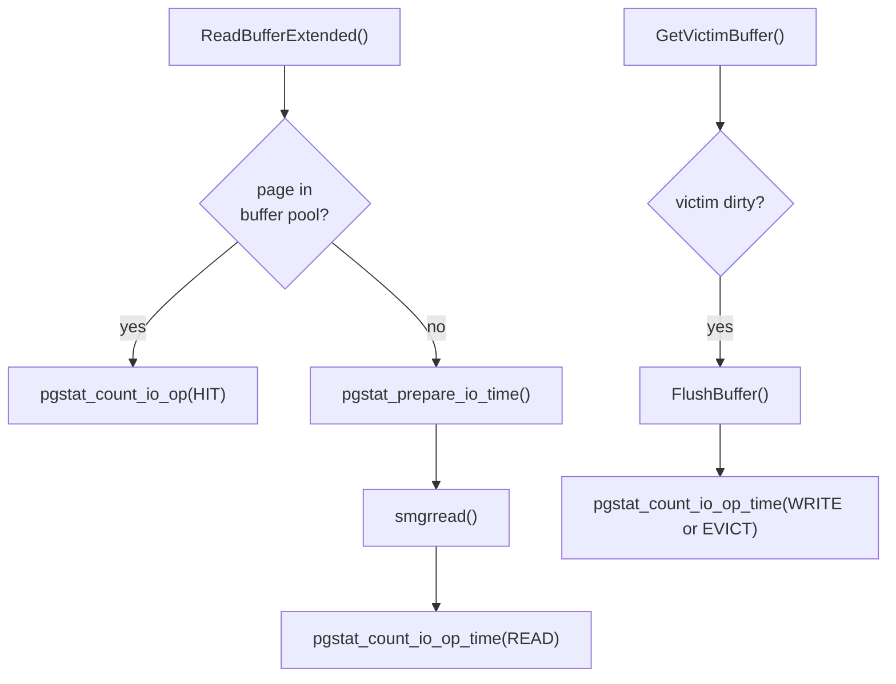

`pg_stat_io` is a system view, introduced in PostgreSQL 16, that exposes cumulative I/O operation counts and timing broken down along three dimensions: the backend type performing the I/O, the type of object being read or written, and the context in which the I/O was initiated. Before this view existed, the only per-backend I/O signal available was `pg_stat_bgwriter`. It conflated unrelated counters and covered only a subset of processes.

## The Three Dimensions

Every row in `pg_stat_io` identifies a unique combination of `backend_type`, `io_object`, and `io_context`. Not all combinations are meaningful — rows that can never accumulate any counts are omitted from the view entirely.

**`backend_type`** identifies the category of PostgreSQL process. The tracked types are:

| backend_type string | BackendType constant | Notes |
|---|---|---|
| `client backend` | `B_BACKEND` | Regular query-serving processes |
| `autovacuum launcher` | `B_AUTOVAC_LAUNCHER` | Only reads; no vacuum context |
| `autovacuum worker` | `B_AUTOVAC_WORKER` | Reads in vacuum context are common |
| `background worker` | `B_BG_WORKER` | Extensions; may use temp relations |
| `background writer` | `B_BG_WRITER` | Only writes and fsyncs; no reads |
| `checkpointer` | `B_CHECKPOINTER` | Only writes, writebacks, and fsyncs |
| `standalone backend` | `B_STANDALONE_BACKEND` | Single-user mode |
| `startup` | `B_STARTUP` | Recovery process |
| `walsender` | `B_WAL_SENDER` | Reads during base backup |

PostgreSQL excludes the archiver (`B_ARCHIVER`), logger (`B_LOGGER`), WAL receiver (`B_WAL_RECEIVER`), and WAL writer (`B_WAL_WRITER`). The WAL writer omission is intentional — its I/O is not yet tracked in `pg_stat_io` as of PG16 (`pgstat_tracks_io_bktype()`, `pgstat_io.c`).

**`io_object`** distinguishes the type of storage being accessed:

- `relation` — shared buffers backed by permanent or unlogged relations
- `temp relation` — local buffers for temporary tables; only possible in `normal` context, and only for backend types that can create temp tables

**`io_context`** reflects the buffer access strategy in use at the time of the I/O. The mapping is direct: `IOContextForStrategy()` (`freelist.c`) converts a `BufferAccessStrategy` into an `IOContext` enum value.

| io_context | BufferAccessStrategy | When used |
|---|---|---|
| `normal` | `NULL` (no strategy) | Regular sequential and random access |
| `bulkread` | `BAS_BULKREAD` | Sequential scans that use a ring buffer |
| `bulkwrite` | `BAS_BULKWRITE` | `COPY`, `CREATE TABLE AS`, `INSERT ... SELECT` |
| `vacuum` | `BAS_VACUUM` | VACUUM's own buffer ring |

The context is captured at the point of the buffer request, not at the point of the physical I/O. A buffer miss in `bulkread` context produces a `read` in `bulkread`, even though the data comes from the OS the same way as a normal read.

## Counters

Each (backend_type, io_object, io_context) row carries a set of operation counters. Not every counter is defined for every row — `NULL` in a cell means the operation is structurally impossible for that combination, not that zero operations occurred. Zero operations show as `0`.

| Column | IOOp constant | Description |
|---|---|---|
| `reads` | `IOOP_READ` | Pages fetched from the OS into the buffer pool |
| `writes` | `IOOP_WRITE` | Dirty pages flushed to the OS (not necessarily to disk) |
| `writebacks` | `IOOP_WRITEBACK` | OS writeback requests via `pg_flush_data()` (kernel hint, not fsync) |
| `extends` | `IOOP_EXTEND` | Relation extensions: new pages appended to a relation file |
| `hits` | `IOOP_HIT` | Buffer pool hits — the page was already in shared buffers |
| `evictions` | `IOOP_EVICT` | Dirty victim pages written to OS to make room for another page |
| `reuses` | `IOOP_REUSE` | Buffer reuses within a ring strategy without I/O (ring slot recycled) |
| `fsyncs` | `IOOP_FSYNC` | `fsync()` calls to durably flush pages to disk |
| `op_bytes` | — | Bytes per I/O operation; currently always `8192` (one `BLCKSZ`) |

The distinction between `writes` and `evictions` matters. A `write` is the checkpointer or bgwriter flushing a dirty buffer during normal operation. An `eviction` is any process evicting a dirty buffer from the pool to make room for a new page. This write is "forced" by buffer pressure rather than by scheduled flushing.

`reuses` are only tracked for strategy contexts (`bulkread`, `bulkwrite`, `vacuum`). When a ring buffer slot cycles back to the start of the ring and the old occupant is clean, PostgreSQL reuses the slot without I/O. A high `reuses` count in `bulkread` context indicates that the ring is working efficiently. High `reads` alongside low `reuses` in the same context suggests the ring is too small or the scan does not fit the ring pattern.

The view includes `hits` even though they involve no OS interaction. Their presence allows computing a cache hit ratio directly from the view without joining another table.

## Timing Columns

Five operations carry associated time columns: `read_time`, `write_time`, `writeback_time`, `extend_time`, and `fsync_time`. All are in milliseconds. These columns are `NULL` (not zero) unless `track_io_timing = on`.

`pgstat_prepare_io_time()` captures a start timestamp only when `track_io_timing` is enabled. `pgstat_count_io_op_time()` computes the delta immediately after the I/O system call returns. The overhead is two `clock_gettime()` calls per I/O operation — measurable on high-throughput systems, but typically a fraction of a percent.

`IOOP_HIT`, `IOOP_EVICT`, and `IOOP_REUSE` have no timing columns. Hits involve no I/O at all. `write_time` already captures evictions. Reuses have no measurable I/O cost.

## How Counts Are Recorded

The instrumentation path starts at the buffer manager. Every call to `ReadBufferExtended()` (`bufmgr.c`) determines the `io_context` via `IOContextForStrategy()`. It also determines the `io_object` from whether the relation uses local or shared buffers. If the requested page is found in the pool, PostgreSQL calls `pgstat_count_io_op(..., IOOP_HIT)` immediately. If not, it issues a physical read, bracketed by `pgstat_prepare_io_time()` and `pgstat_count_io_op_time(..., IOOP_READ, ...)`.



Counts accumulate in a process-local `PgStat_PendingIO` struct. This three-dimensional array is indexed by `[io_object][io_context][io_op]`. `pgstat_flush_io()` flushes the pending stats to shared memory. It acquires a per-backend-type [[subsystems/locking/lwlocks|LWLock]], then adds the pending counts to the shared `PgStat_BktypeIO`. The flush happens at report checkpoints (end of transaction, process exit, or explicit `pgstat_report_stat()` calls). This keeps contention on the shared memory slots low.

```c
/* pending stats live in process-local memory */
typedef struct PgStat_PendingIO
{
    PgStat_Counter counts[IOOBJECT_NUM_TYPES][IOCONTEXT_NUM_TYPES][IOOP_NUM_TYPES];
    instr_time     pending_times[IOOBJECT_NUM_TYPES][IOCONTEXT_NUM_TYPES][IOOP_NUM_TYPES];
} PgStat_PendingIO;
```

The shared structure mirrors this layout per backend type:

```c
typedef struct PgStat_BktypeIO
{
    PgStat_Counter counts[IOOBJECT_NUM_TYPES][IOCONTEXT_NUM_TYPES][IOOP_NUM_TYPES];
    PgStat_Counter times[IOOBJECT_NUM_TYPES][IOCONTEXT_NUM_TYPES][IOOP_NUM_TYPES];
} PgStat_BktypeIO;
```

When a query against the view invokes `pg_stat_get_io()`, the function takes a snapshot of all per-backend-type entries under shared locks (one lock per backend type). It then materialises the result set. This snapshot is consistent within a query — the view does not reflect I/O that occurs after the snapshot is taken.

## Interpreting the View

**Buffer pool pressure** shows as high `reads` in `normal` context by `client backend`. When `reads` are large relative to `hits`, `shared_buffers` is too small for the working set. The classic cache hit ratio is:

```sql
SELECT
    hits,
    reads,
    round(hits::numeric / nullif(hits + reads, 0) * 100, 2) AS hit_ratio_pct
FROM pg_stat_io
WHERE backend_type = 'client backend'
  AND io_object    = 'relation'
  AND io_context   = 'normal';
```

**Checkpoint I/O** falls under the `checkpointer` backend_type. The `writes` counter here represents pages flushed by the checkpointer's scheduled write phase. The `fsyncs` counter represents the final fsync calls that make those writes durable. High `fsync_time` relative to `write_time` suggests I/O subsystem saturation. PostgreSQL writes pages quickly, but the OS takes a long time to commit them.

**Background writer I/O** appears under `background writer`. The bgwriter only writes and requests writebacks. It never reads (`reads` is NULL for bgwriter). A large `evictions` count under `client backend` with a small count under `background writer` signals that the bgwriter is not keeping up with dirty page production. Backends are evicting pages themselves, rather than finding clean victims prepared by the bgwriter.

**Vacuum I/O overhead** is visible by filtering on `io_context = 'vacuum'`. VACUUM uses a small ring buffer (256 kB by default, controlled by `vacuum_buffer_usage_limit` in PG16). Most pages it reads are therefore not already in cache. `reads` typically dominates `hits` in vacuum context. High vacuum `reads` during busy periods may indicate that autovacuum is competing with query I/O.

**Bulk operation I/O** in `bulkread` and `bulkwrite` contexts isolates sequential scans and bulk load I/O from normal access patterns. A high `reuses` / `reads` ratio in `bulkread` context confirms that the ring buffer strategy is effective. If `reuses` is near zero while `reads` is large, the scan is bypassing the ring (e.g., the relation is smaller than the ring threshold).

**Practical breakdown query:**

```sql
SELECT
    backend_type,
    io_object,
    io_context,
    reads,
    hits,
    writes,
    evictions,
    reuses,
    fsyncs,
    round(read_time::numeric, 2)   AS read_ms,
    round(write_time::numeric, 2)  AS write_ms,
    round(fsync_time::numeric, 2)  AS fsync_ms
FROM pg_stat_io
WHERE reads > 0 OR writes > 0 OR hits > 0
ORDER BY backend_type, io_object, io_context;
```

**Identifying vacuum I/O overhead:**

```sql
SELECT
    sum(reads)      AS vacuum_reads,
    sum(hits)       AS vacuum_hits,
    sum(writes)     AS vacuum_writes,
    round(sum(read_time)::numeric, 1)  AS vacuum_read_ms
FROM pg_stat_io
WHERE io_context = 'vacuum';
```

## Version Changes

**PostgreSQL 18:** PostgreSQL 18 replaces the `op_bytes` column with three separate columns: `read_bytes`, `write_bytes`, and `extend_bytes`. This allows measuring actual bytes transferred for each operation type, rather than assuming all operations transfer exactly one block (`BLCKSZ`). The view also gains rows for WAL I/O (WAL writer activity and WAL receiver writes), previously invisible. `track_wal_io_timing` now controls WAL timing in `pg_stat_io` rather than in `pg_stat_wal`. Per-backend I/O statistics are also available via `pg_stat_get_backend_io(pid)`. `pg_stat_reset_backend_stats(pid)` clears them.

## Relationship to pg_stat_bgwriter

`pg_stat_bgwriter` and `pg_stat_checkpointer` are older views that predate `pg_stat_io`. The bgwriter-level counters (`buffers_clean`, `maxwritten_clean`) correspond to writes under `background writer` in `pg_stat_io`. The checkpointer counters (`buffers_checkpoint`, `checkpoint_write_time`) correspond to writes and timing under `checkpointer`. The older views are not deprecated, but `pg_stat_io` provides finer-grained breakdowns and covers all backend types.

One caveat: `buffers_alloc` from `pg_stat_bgwriter` (the count of new buffers allocated) has no direct counterpart in `pg_stat_io`. PostgreSQL records buffer allocations that involve reading a page from disk as `reads`, but allocations of zero-filled buffers (for relation extension) appear as `extends`.

## Resetting Statistics

All counters in `pg_stat_io` are cumulative from the last reset. Reset the entire view with:

```sql
SELECT pg_stat_reset_shared('io');
```

This calls `pgstat_io_reset_all_cb()` (`pgstat_io.c`). The function acquires a write lock on each per-backend-type slot, zeroes the shared counters, and updates the `stats_reset` timestamp visible in the view.

## NULL vs Zero

A `NULL` value in a counter column means the operation is not tracked for that row's combination of backend type, object, and context — the counter is structurally absent. A `0` means the operation is tracked but has not occurred. `pgstat_tracks_io_op()` encodes this logic. It returns false for combinations like fsync by bgwriter (it never fsyncs directly), extend by checkpointer (it never extends relations), or reuse in normal context (reuse only applies to ring strategies).

This design keeps the view sparse: only the rows and columns that can actually accumulate counts are present. This makes it easier to spot anomalies and avoids misleading zero baselines.

## Related Topics

- [[subsystems/observability/pgstat-per-subsystem|Per-Subsystem Statistics]] — describes the general framework that pg_stat_io plugs into, including how per-backend-type stat slots are managed and flushed
- [[subsystems/observability/pgstat-shmem|Statistics Shared Memory]] — covers the shared memory layout where PgStat_BktypeIO counters are stored and how snapshot reads are synchronized
- [[subsystems/storage/buffer-manager|Buffer Manager]] — the primary site where pgstat_count_io_op and pgstat_count_io_op_time are called, making it the source of nearly all pg_stat_io data
- [[subsystems/storage/shared-buffers-tuning|Shared Buffers Tuning]] — interprets the hit/read ratio and eviction patterns that pg_stat_io exposes to guide shared_buffers sizing
- [[subsystems/background/bgwriter|Background Writer]] — the bgwriter's write and writeback counters appear directly in pg_stat_io under the background writer backend type
- [[subsystems/wal/checkpoint|Checkpoint]] — checkpoint write and fsync activity is the main contributor to the checkpointer rows in pg_stat_io, including fsync_time interpretation
- [[troubleshooting/slow-queries|Slow Queries]] — shows how elevated read_time and fsync_time from pg_stat_io feed into diagnosing query latency caused by I/O saturation
- [[subsystems/observability/overview|Observability Overview]] — situates pg_stat_io within the broader cumulative statistics architecture that all `pg_stat_*` views share
- [[subsystems/background/autovacuum|Autovacuum]] — autovacuum and autoanalyze workers are tracked as their own backend type in pg_stat_io, exposing their read and extend activity separately from regular backends
