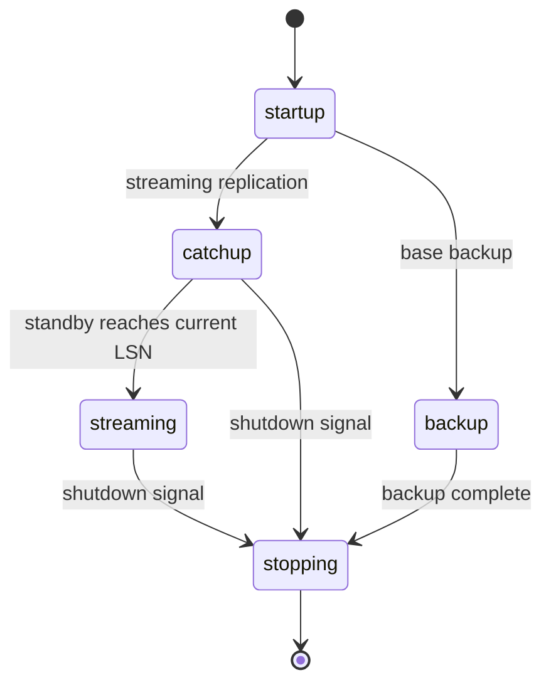
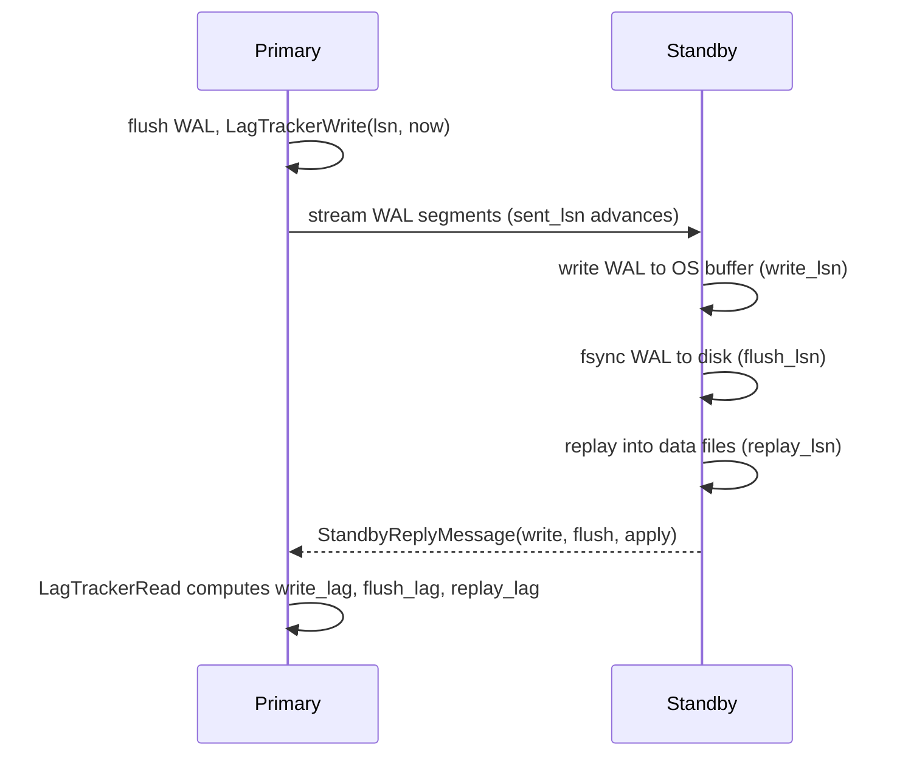

PostgreSQL exposes replication health through three system views: `pg_stat_replication` (one row per active walsender, populated on the primary), `pg_stat_wal_receiver` (a single row on a standby), and `pg_stat_replication_slots` (per-slot WAL retention counters, added in PG14). Together they provide a complete picture of how far each standby has fallen behind and how that lag is distributed across the pipeline stages.

## The walsender view: pg_stat_replication

Every streaming standby connection on the primary is served by a dedicated walsender backend process. Each walsender owns a `WalSnd` slot in the `WalSndCtl` shared-memory array (`src/include/replication/walsender_private.h`). `pg_stat_replication` materialises this array — one row per slot where `pid != 0` — by reading it under a spinlock.

### State machine

The `state` column reflects `WalSndState`:

| state | meaning |
|---|---|
| `startup` | handshake not yet complete (`WALSNDSTATE_STARTUP`) |
| `catchup` | standby is behind; walsender is streaming archived or on-disk WAL to close the gap |
| `streaming` | standby has caught up and is receiving WAL as it is generated |
| `backup` | connection is serving `pg_basebackup` or a similar base backup stream |
| `stopping` | walsender is shutting down (`WALSNDSTATE_STOPPING`) |



The transition from `catchup` to `streaming` happens when the standby's `flush_lsn` reaches the current WAL insert position. During `catchup`, the walsender reads WAL from segment files. During `streaming`, it receives wake-ups from the WAL writer via the `wal_flush_cv` condition variable in `WalSndCtlData`.

### The four LSN columns

```
sent_lsn    WAL last sent over the network
write_lsn   standby has written to its WAL buffer (not yet durable)
flush_lsn   standby has flushed to disk (durable but not yet replayed)
replay_lsn  standby has replayed into its data files (visible to queries)
```

`sent_lsn` is the primary's view of its own send pointer (`WalSnd.sentPtr`). The standby reports the other three back in periodic reply messages (`StandbyReplyMessage` in the replication protocol). The walsender stores them in `WalSnd.write`, `WalSnd.flush`, and `WalSnd.apply` under the spinlock, then reads them back in `pg_stat_get_wal_senders()` (`walsender.c`) to populate the view.

A NULL in any of the three standby-side columns means the standby has not yet sent the corresponding acknowledgement — normal during `startup` or in the first few seconds of a connection.

The byte lag from the primary's perspective is:

```sql
-- bytes of WAL that the standby has not yet replayed
SELECT pg_current_wal_lsn() - replay_lsn AS replay_lag_bytes
FROM   pg_stat_replication;
```

Because `pg_current_wal_lsn()` advances continuously, this expression gives an instantaneous snapshot. On a busy primary it will never be zero. The concern is when it grows without bound.

### Lag time columns (PG 10+)

`write_lag`, `flush_lag`, and `replay_lag` are `interval` values computed by the walsender using an internal circular ring buffer called the `LagTracker` (`walsender.c`).

The mechanism works as follows. When the primary flushes a WAL segment locally, `LagTrackerWrite()` stamps that LSN with the local flush timestamp. When the standby's reply message arrives carrying `write_lsn`, `flush_lsn`, or `replay_lsn`, `ProcessStandbyReplyMessage()` calls `LagTrackerRead()` for each position. `LagTrackerRead()` scans forward in the ring buffer to find the matching (or immediately prior) entry and computes `now - stored_timestamp`. This measures the elapsed time between the primary durably writing the WAL and the standby acknowledging each pipeline stage.

```
write_lag   time from primary flush → standby write acknowledgement
flush_lag   time from primary flush → standby flush acknowledgement
replay_lag  time from primary flush → standby apply acknowledgement
```



These columns are NULL when the standby has not sent a reply yet. They are also NULL after a ring buffer overflow. Overflow happens when the standby falls far enough behind that the tracker evicts the oldest tracked sample. Overflow sets `read_heads[i] = -1` and falls back to a saved overflow entry. When the standby eventually acknowledges that LSN, the tracker returns to normal operation. NULL lag can also appear when the standby has been fully caught up across two consecutive reply cycles. The tracker stops reporting to avoid showing stale intervals during idle periods.

`replay_lag` can appear smaller than `flush_lag` if the standby's startup process applies WAL faster than the walreceiver's acknowledgements reach the primary. The standby is applying in parallel with receiving.

### sync_state and the synchronous replication role

The `sync_state` column classifies each standby's role relative to `synchronous_standby_names`:

| sync_state | meaning |
|---|---|
| `async` | not listed in `synchronous_standby_names`, or listed but with an invalid `flush_lsn` (e.g. a `pg_basebackup` process) |
| `potential` | listed in `synchronous_standby_names` but currently a reserve: another standby with higher priority holds the active synchronous slot |
| `sync` | currently the active synchronous standby (priority-based method only) |
| `quorum` | listed in `synchronous_standby_names` and the quorum method is in use |

The walsender determines `sync_state` at view-query time by calling `SyncRepGetCandidateStandbys()` and comparing the result against the current walsender's entry. Because quorum membership can change on every commit cycle, the walsender deliberately reports all quorum-eligible standbys as `quorum` rather than individually as `sync` or `potential`. That distinction would be stale before the query returned.

`priority` (also in the view) is the 1-based position in the `synchronous_standby_names` list, or 0 for async standbys. The walsender forces base-backup connections to priority 0 regardless of their `application_name` (`walsender.c`: `priority = XLogRecPtrIsInvalid(flush) ? 0 : priority`).

Access to most columns requires the `pg_read_all_stats` privilege or superuser. Unprivileged users see only the `pid` column; all other columns are NULL. Grant monitoring roles `pg_read_all_stats` rather than superuser.

## The standby view: pg_stat_wal_receiver

On the standby, `pg_stat_wal_receiver` exposes the `WalRcvData` shared-memory struct (`src/include/replication/walreceiver.h`). It returns a single row (or NULL if no walreceiver is running). The implementation is `pg_stat_get_wal_receiver()` in `walreceiver.c`, which takes a spinlock snapshot of the shared struct.

| column | source field | meaning |
|---|---|---|
| `status` | `WalRcv.walRcvState` | `streaming` / `waiting` / `restarting` / etc. |
| `receive_start_lsn` | `WalRcv.receiveStart` | LSN where the current streaming session started |
| `written_lsn` | `WalRcv.writtenUpto` | WAL written to standby OS buffer (before fsync) |
| `flushed_lsn` | `WalRcv.flushedUpto` | WAL flushed durably to standby disk |
| `latest_end_lsn` | `WalRcv.latestWalEnd` | highest WAL end LSN reported by the primary in a keepalive |
| `latest_end_time` | `WalRcv.latestWalEndTime` | timestamp when the primary reported that LSN |
| `last_msg_send_time` | `WalRcv.lastMsgSendTime` | timestamp on the most recent message the primary sent |
| `last_msg_receipt_time` | `WalRcv.lastMsgReceiptTime` | when that message arrived at the standby |
| `slot_name` | `WalRcv.slotname` | replication slot used, if any |

`written_lsn` advances ahead of `flushed_lsn` because the walreceiver updates it after `write()` but before `pg_flush_data()`. PostgreSQL maintains the field as `pg_atomic_uint64` so the startup process can read it without acquiring the walreceiver's spinlock. This lets replay begin from OS-buffered WAL before fsync completes.

`latest_end_lsn - flushed_lsn` is the standby's own estimate of how much WAL is in flight: data the primary has generated but the standby has not yet flushed. If this number grows without bound, the standby cannot keep up with the write rate.

`now() - last_msg_receipt_time` measures how long the standby has been silent. If this exceeds `wal_receiver_timeout` (default 60 s), the walreceiver will disconnect and attempt to reconnect. A stale `last_msg_receipt_time` while `latest_end_lsn` remains static is a sign of a network stall.

```sql
-- Standby-side health check (run on the standby)
SELECT
    status,
    flushed_lsn,
    latest_end_lsn,
    latest_end_lsn - flushed_lsn        AS inflight_bytes,
    now() - last_msg_receipt_time       AS silence_duration,
    sender_host,
    slot_name
FROM pg_stat_wal_receiver;
```

## synchronous_commit and what lag matters

`synchronous_commit` controls which stage of the replication pipeline the committing backend must wait for before returning success. The mapping from GUC value to wait mode is:

| synchronous_commit | wait condition | relevant lag column |
|---|---|---|
| `off` | no wait (async commit) | none — data can be lost on crash |
| `local` | local WAL flush only | — (standby not involved) |
| `remote_write` | standby writes to OS buffer | `write_lag` / `write_lsn` |
| `on` / `remote_flush` | standby flushes to disk | `flush_lag` / `flush_lsn` |
| `remote_apply` | standby replays transactions | `replay_lag` / `replay_lsn` |

`off` and `local` do not set `SyncRepRequested()`, so backends never block on `SyncRepWaitForLSN()`. For these settings the lag columns still accumulate, but they have no effect on commit latency.

`on` (the default) maps to `SYNCHRONOUS_COMMIT_REMOTE_FLUSH` (`src/include/access/xact.h`). This means a commit does not return until the standby has flushed WAL to disk — but the standby's startup process may still be seconds behind in replaying it. Zero data loss combined with immediate query visibility on the standby requires `remote_apply`, at the cost of higher commit latency equal to `replay_lag`.

```sql
-- Monitor the lag relevant to the current synchronous_commit setting
SELECT
    application_name,
    sync_state,
    CASE current_setting('synchronous_commit')
        WHEN 'remote_write'  THEN write_lag
        WHEN 'on'            THEN flush_lag
        WHEN 'remote_flush'  THEN flush_lag
        WHEN 'remote_apply'  THEN replay_lag
    END AS commit_relevant_lag,
    pg_current_wal_lsn() - replay_lsn  AS replay_lag_bytes
FROM pg_stat_replication
ORDER BY replay_lag_bytes DESC NULLS LAST;
```

When you set `synchronous_standby_names`, only `sync` and `quorum` standbys contribute to the acknowledgement that releases waiting backends. The `flush_lag` (or `replay_lag`) of an `async` standby does not affect commit latency regardless of its value.

## Replication slots and WAL accumulation

Replication slots pin WAL on the primary at the `restart_lsn` — the oldest position the slot still needs. `wal_keep_size` retains a fixed byte count from the current position. A slot's pin instead advances only as the consumer acknowledges progress. A slot that stops consuming stops advancing its `restart_lsn`. WAL then accumulates indefinitely unless bounded by `max_slot_wal_keep_size` (PG 13+).

`pg_replication_slots` is the relevant view for WAL retention state. The `wal_status` column (computed in `slotfuncs.c` by calling `GetWALAvailability(slot.restart_lsn)`) classifies each slot:

| wal_status | meaning |
|---|---|
| `reserved` | required WAL is within `wal_keep_size`; fully protected at no extra cost |
| `extended` | WAL is retained beyond `wal_keep_size` specifically for this slot; safe but using extra disk |
| `unreserved` | the required WAL exceeds `max_slot_wal_keep_size`; may be recycled at next checkpoint |
| `lost` | required WAL segments already removed; slot is invalidated and must be dropped |

`safe_wal_size` is the number of bytes the primary can still generate before the slot transitions to `unreserved`. A negative value means the slot is already past the safety margin. NULL means either the slot is `lost` or `max_slot_wal_keep_size = -1` (unlimited — no bound at all).

An `active = false` slot with `wal_status = extended` is the common early warning sign of a subscriber that is down or lagging. In that case, the primary retains more WAL than `wal_keep_size` alone would require. If `safe_wal_size` is shrinking toward zero, the slot is at risk.

`pg_stat_replication_slots` (PG14+) is a separate view that tracks logical decoding I/O — spilled transactions, streamed transactions, byte volumes — not WAL retention. It is useful for understanding the cost of logical replication decoding, not for disk safety.

```sql
-- Slots accumulating WAL (potential disk hazard)
SELECT
    slot_name,
    slot_type,
    active,
    restart_lsn,
    pg_size_pretty(pg_current_wal_lsn() - restart_lsn) AS wal_retained,
    wal_status,
    pg_size_pretty(safe_wal_size) AS safe_wal_size
FROM pg_replication_slots
WHERE restart_lsn IS NOT NULL
ORDER BY pg_current_wal_lsn() - restart_lsn DESC NULLS LAST;
```

## Practical monitoring queries

**Lag across all standbys:**

```sql
SELECT
    pid,
    application_name,
    client_addr,
    state,
    sync_state,
    pg_size_pretty(pg_current_wal_lsn() - sent_lsn)    AS unsent,
    pg_size_pretty(pg_current_wal_lsn() - write_lsn)   AS unwritten,
    pg_size_pretty(pg_current_wal_lsn() - flush_lsn)   AS unflushed,
    pg_size_pretty(pg_current_wal_lsn() - replay_lsn)  AS unreplayed,
    write_lag,
    flush_lag,
    replay_lag,
    reply_time,
    now() - reply_time AS silence
FROM pg_stat_replication
ORDER BY pg_current_wal_lsn() - replay_lsn DESC NULLS LAST;
```

**Standbys more than 100 MB behind in replay:**

```sql
SELECT application_name, pg_size_pretty(pg_current_wal_lsn() - replay_lsn) AS lag
FROM pg_stat_replication
WHERE pg_current_wal_lsn() - replay_lsn > 100 * 1024 * 1024;
```

**Connectivity check from the standby:**

```sql
-- Run on the standby
SELECT
    status,
    flushed_lsn,
    pg_size_pretty(latest_end_lsn - flushed_lsn) AS inflight_bytes,
    now() - last_msg_receipt_time                 AS silence_duration,
    sender_host,
    slot_name
FROM pg_stat_wal_receiver;
```

**Oldest WAL consumer across standbys and slots:**

```sql
SELECT 'standby' AS source, application_name AS name, replay_lsn AS position
FROM pg_stat_replication
UNION ALL
SELECT 'slot', slot_name, restart_lsn
FROM pg_replication_slots
ORDER BY position NULLS LAST;
```

The oldest position in this list determines the minimum WAL the primary must retain.

## Clock skew and NULL lag

The lag columns can show NULL on a fully active standby if the standby's clock is ahead of the primary's. `LagTrackerRead()` explicitly returns `-1` (surfaced as NULL) when the stored flush timestamp is in the future relative to the arrival time of the reply. A negative elapsed time would be meaningless. If you see NULL `write_lag` / `flush_lag` / `replay_lag` alongside non-zero byte lag, compare clocks on primary and standby and check NTP synchronisation.

## Related Topics

- [[subsystems/replication/streaming|Streaming Replication]] — covers the walsender/walreceiver protocol and connection lifecycle that `pg_stat_replication` exposes at a higher level.
- [[subsystems/replication/synchronous-replication|Synchronous Replication]] — explains how `synchronous_standby_names`, `sync_state`, and `synchronous_commit` interact to gate commit acknowledgements on standby progress.
- [[subsystems/replication/slots|Replication Slots]] — details slot mechanics, `restart_lsn` advancement, and WAL retention policies surfaced in `pg_replication_slots`.
- [[subsystems/observability/overview|Observability Overview]] — maps the full set of statistics views and how they relate to each other across subsystems.
- [[subsystems/wal/overview|WAL Overview]] — describes WAL generation, flushing, and the LSN space that the lag columns measure distance across.
- [[troubleshooting/replication-lag|Replication Lag]] — practical diagnosis guide for high lag values observed in `pg_stat_replication`.
- [[subsystems/replication/hot-standby|Hot Standby]] — describes query execution on standbys and how `replay_lsn` and `replay_lag` affect read consistency.
