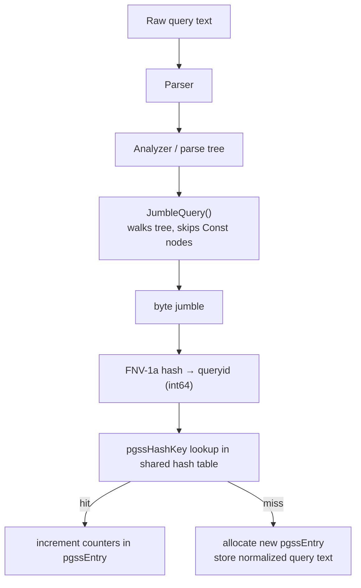

# pg_stat_statements

`pg_stat_statements` is the standard PostgreSQL contrib extension for query-level performance telemetry. It intercepts every statement that passes through the executor (and optionally the planner). It then accumulates aggregate statistics per normalized query shape. It is the primary tool for identifying which queries consume the most resources on a live system.

## Installation and Configuration

`pg_stat_statements` is a shared library that hooks into executor entry and exit points. Because it needs to intercept execution before any query runs, it must be loaded at server start:

```ini
# postgresql.conf
shared_preload_libraries = 'pg_stat_statements'
pg_stat_statements.max = 10000          # max tracked query shapes
pg_stat_statements.track = 'top'        # 'top', 'all', or 'none'
pg_stat_statements.track_planning = on  # also record plan time (PG 13+)
pg_stat_statements.track_utility = on   # track COPY, DDL, etc.
pg_stat_statements.save = on            # persist stats across restarts
```

After server restart, install the extension in each database where you want to query the view:

```sql
CREATE EXTENSION pg_stat_statements;
```

The view `pg_stat_statements` and the reset function become available. The underlying storage is a fixed-size hash table in shared memory (`pgssSharedState`), allocated at startup using `pg_stat_statements.max` slots.

## Query Normalization and the QueryID Jumble

The extension does not track individual query texts verbatim. Instead it normalizes each query into a canonical form that replaces all literal constants with positional parameters (`$1`, `$2`, ...`). The string `SELECT * FROM orders WHERE id = 42` and `SELECT * FROM orders WHERE id = 99` both normalize to `SELECT * FROM orders WHERE id = $1`. The extension counts them as the same query shape.

`JumbleQuery()` performs the normalization. It walks the query parse tree and produces a byte sequence — the "jumble" — that encodes the structural shape without literal values. A 64-bit FNV hash of that jumble becomes the `queryid`. `JumbleQuery()` computes the hash over the post-parse-analysis tree, so structurally equivalent queries written with different whitespace or capitalization still collapse to the same `queryid`.



`pg_stat_statements` stores the normalized query text once per entry. If the slot for a given `queryid` is evicted due to `pg_stat_statements.max` overflow, its counters are lost. `pg_stat_statements` then increments the `dealloc` counter in `pg_stat_statements_info`.

**PostgreSQL 17:** CALL statement parameters, savepoint names, and two-phase commit GIDs are now normalized to placeholders, so procedural calls with different argument literals collapse to the same query shape.

**PostgreSQL 18:** `CREATE TABLE AS` and `DECLARE` (cursor declaration) statements are now tracked by the extension. `SET` statement values are normalized to placeholders. For constant lists (e.g., long `IN (...)` clauses), query ID jumbling uses only the first and last constant rather than all constants. This reduces `queryid` divergence for queries that differ only in the length of a literal list.

## Hook Architecture

The extension registers executor hooks in `_PG_init`:

- `pgss_ExecutorStart` — called before plan execution begins; records start timestamp when planning time tracking is active.
- `pgss_ExecutorEnd` — called after the last row is fetched or the statement is cancelled; reads `queryDesc->totaltime` and calls `pgss_store` to update the shared hash entry.
- `pgss_ProcessUtility` — intercepts utility statements (DDL, `COPY`, `VACUUM`, etc.) when `track_utility` is enabled.
- `pgss_planner` (PG 13+) — wraps the planner to capture `plan_time` when `track_planning = on`.

`pgss_store` takes the normalized query text, the `queryid`, and all measured counters. It acquires a shared-memory lock on the relevant hash bucket. Then it either updates an existing `pgssEntry` or inserts a new one.

## Key View Columns

| Column | Type | Meaning |
|---|---|---|
| `queryid` | int8 | Jumble hash identifying the query shape |
| `query` | text | Representative normalized query text |
| `calls` | int8 | Number of times the statement was executed |
| `total_exec_time` | float8 | Cumulative executor time (ms) |
| `mean_exec_time` | float8 | `total_exec_time / calls` (ms) |
| `stddev_exec_time` | float8 | Standard deviation of per-execution time (ms) |
| `rows` | int8 | Total rows returned or affected |
| `shared_blks_hit` | int8 | Blocks served from shared buffer cache |
| `shared_blks_read` | int8 | Blocks read from OS (cache miss or file) |
| `shared_blks_dirtied` | int8 | Shared blocks dirtied (buffer modified) |
| `shared_blks_written` | int8 | Shared blocks written to disk by this backend |
| `temp_blks_read` | int8 | Temp file blocks read (sort/hash spill) |
| `temp_blks_written` | int8 | Temp file blocks written (sort/hash spill) |
| `wal_bytes` | int8 | WAL bytes generated by the statement (PG 13+) |
| `total_plan_time` | float8 | Cumulative planner time (ms); requires `track_planning` |
| `mean_plan_time` | float8 | Average plan time per execution (ms) |

**PostgreSQL 17:** PostgreSQL 17 renames `blk_read_time` to `shared_blk_read_time` and `blk_write_time` to `shared_blk_write_time` to make their scope explicit. Two new columns, `local_blk_read_time` and `local_blk_write_time`, track I/O time for temporary-file blocks (sorts and hash spills), mirroring the shared-block timing columns. The `stats_since` column records the timestamp when an entry was first created. The `minmax_stats_since` column records the last time PostgreSQL reset the per-entry min/max statistics (e.g., `min_exec_time`, `max_exec_time`). This may differ from `stats_since` if only min/max counters have been selectively cleared.

**PostgreSQL 18:** Two new columns, `parallel_workers_to_launch` and `parallel_workers_launched`, record how many parallel workers each statement requested and how many actually started. The `wal_buffers_full` column counts how many times a statement had to write WAL because `wal_buffers` was full. This is a signal that `wal_buffers` is undersized for the workload.

The `stddev_exec_time` column is particularly valuable: high variance relative to `mean_exec_time` indicates a query that sometimes hits the buffer cache and sometimes triggers physical I/O — a classic symptom of a working-set larger than `shared_buffers`.

## Practical Monitoring Queries

### Top queries by mean execution time

Finds latency outliers — queries that are slow per invocation regardless of frequency.

```sql
SELECT
    queryid,
    calls,
    round(mean_exec_time::numeric, 2)    AS mean_ms,
    round(stddev_exec_time::numeric, 2)  AS stddev_ms,
    round(total_exec_time::numeric, 2)   AS total_ms,
    left(query, 80)                      AS query_snippet
FROM pg_stat_statements
WHERE calls > 10
ORDER BY mean_exec_time DESC
LIMIT 20;
```

### Top queries by total execution time (hidden load)

Identifies queries that consume the most cumulative CPU/IO even if each individual call is fast. These are the true load drivers.

```sql
SELECT
    queryid,
    calls,
    round(total_exec_time::numeric, 2)   AS total_ms,
    round(mean_exec_time::numeric, 2)    AS mean_ms,
    round((total_exec_time / sum(total_exec_time) OVER ()) * 100, 1) AS pct_total,
    left(query, 80)                      AS query_snippet
FROM pg_stat_statements
ORDER BY total_exec_time DESC
LIMIT 20;
```

### Queries causing most I/O (buffer cache misses)

```sql
SELECT
    queryid,
    calls,
    shared_blks_read,
    shared_blks_hit,
    round(shared_blks_read::numeric /
          nullif(shared_blks_read + shared_blks_hit, 0) * 100, 1) AS miss_pct,
    left(query, 80) AS query_snippet
FROM pg_stat_statements
WHERE shared_blks_read + shared_blks_hit > 1000
ORDER BY shared_blks_read DESC
LIMIT 20;
```

### Queries spilling to disk (temp I/O)

Any entry with `temp_blks_written > 0` indicates the executor ran out of `[[subsystems/executor/work-mem-and-spill|work_mem]]` and spilled a sort or hash to a temporary file. These are prime candidates for `work_mem` tuning or query restructuring.

```sql
SELECT
    queryid,
    calls,
    temp_blks_written,
    temp_blks_read,
    round(mean_exec_time::numeric, 2) AS mean_ms,
    left(query, 100)                  AS query_snippet
FROM pg_stat_statements
WHERE temp_blks_written > 0
ORDER BY temp_blks_written DESC
LIMIT 20;
```

## Resetting Statistics

`pg_stat_statements_reset()` zeroes all counters in the shared hash table. Calling it with a `queryid` argument (PG 12+) resets only that entry:

```sql
-- Reset everything
SELECT pg_stat_statements_reset();

-- Reset a single query shape (PG 12+)
SELECT pg_stat_statements_reset(userid => 0, dbid => 0, queryid => 3602979538);
```

A common operational pattern is to reset after a schema migration or configuration change to obtain a clean baseline for the new workload.

**PostgreSQL 17:** `pg_stat_statements_reset()` gains a `minmax_only` boolean parameter. Calling `pg_stat_statements_reset(minmax_only := true)` clears only the min/max per-execution statistics (e.g., `min_exec_time`, `max_exec_time`) for all entries without touching call counts or cumulative totals. This is useful for discarding cold-start outliers after a warmup period while preserving long-running aggregate data. The `minmax_stats_since` column is updated to the reset time; `stats_since` is unaffected.

## track_planning

When `pg_stat_statements.track_planning = on`, the planner hook `pgss_planner` is active and `total_plan_time` / `mean_plan_time` / `stddev_plan_time` are populated. This is useful for detecting:

- Queries with high plan time relative to execution time (parse-heavy workloads, many bind parameters).
- Plan cache thrashing on generic vs. custom plan selection.

`pg_stat_statements` does not include planning time in `total_exec_time`; it tracks the two independently.

## track Setting: top vs. all

`pg_stat_statements.track = 'top'` records only top-level statements — queries issued directly by clients. `track = 'all'` additionally records statements executed inside PL/pgSQL functions, `DO` blocks, and `SPI` calls. With `track = 'all'`:

- Each nested SQL statement inside a function gets its own `pgssEntry`.
- The outer function call also gets an entry (for utility-type tracking).
- This can rapidly exhaust `pg_stat_statements.max` on systems with many stored procedures.

`track = 'none'` disables the extension without unloading the library.

## Correlating queryid with auto_explain

`auto_explain` (when `log_min_duration` fires) logs the `queryid` alongside the `EXPLAIN` output when `auto_explain.log_format = 'json'`. This allows you to:

1. Identify a high-cost `queryid` in `pg_stat_statements`.
2. Search the PostgreSQL log for matching `queryid` values to retrieve actual `EXPLAIN (ANALYZE, BUFFERS)` output for a sampled execution.

The `queryid` in `auto_explain` JSON output matches the `queryid` in `pg_stat_statements` because both derive from the same `JumbleQuery` computation in the core planner (exposed via `pgstat_report_query_id`).

## Overflow and pg_stat_statements.max

The shared hash table has a fixed capacity of `pg_stat_statements.max` entries (default 5000). When the table is full and a new query shape arrives:

- The entry with the lowest `calls` count is evicted (LRU-like approximation).
- The `dealloc` counter in `pg_stat_statements_info` is incremented.

On systems with highly diverse query text (e.g., ORMs generating ad-hoc column lists, un-parameterized queries with inline literals that defeat normalization), raise `pg_stat_statements.max` to 20000-50000 and monitor `dealloc` regularly. Repeated eviction means the statistics are systematically incomplete.

**PostgreSQL 18:** For queries containing long constant lists (e.g., `IN (1, 2, 3, ..., 1000)`), jumbling now samples only the first and last constant rather than hashing all of them. This prevents large `IN` lists from inflating the jumble and causing different-length lists to hash to different `queryid` values. That reduces spurious entry proliferation for this common ORM pattern.

## Practical Guidance

- Always load `pg_stat_statements` in production. The overhead is low (roughly 1-3% CPU on OLTP workloads). The diagnostic value is irreplaceable.
- Set `track_planning = on` unless you have confirmed planning time is negligible; the cost is minimal.
- Combine with `auto_explain` to move from "this query shape is slow" to "here is a specific bad plan."
- Use `stddev_exec_time / mean_exec_time` (coefficient of variation) as a triage metric: values above 1.0 warrant investigation for buffer-cache sensitivity or lock contention.
- Schedule periodic snapshots of `pg_stat_statements` into a logging table rather than relying on the live view, which loses data on reset or server restart (unless `save = on`).
- On multi-tenant databases, filter by `dbid` and `userid` to isolate per-tenant workloads.
- On PG 17+, use `pg_stat_statements_reset(minmax_only := true)` after a warmup period to clear cold-start outliers without discarding cumulative call and time data.

## Related Topics

- [[subsystems/observability/query-normalization|Query Normalization]] — covers the `JumbleQuery` mechanism and queryid computation that pg_stat_statements relies on to deduplicate query shapes.
- [[subsystems/observability/auto-explain|auto_explain]] — companion extension that captures EXPLAIN output for slow queries, with queryid values that match those in pg_stat_statements.
- [[subsystems/observability/pg-stat-activity|pg_stat_activity]] — shows live in-flight queries; combines with pg_stat_statements to connect historical aggregates to currently running sessions.
- [[subsystems/observability/pg-stat-database|pg_stat_database]] — database-wide I/O and transaction counters that provide the denominator context for interpreting per-query block statistics.
- [[subsystems/executor/work-mem-and-spill|work_mem and Spill]] — explains why queries accumulate temp_blks_written in pg_stat_statements and how to tune work_mem to eliminate spills.
- [[subsystems/planner/cost-model|Cost Model]] — understanding planner cost estimates helps interpret why high-plan-time queries appear when track_planning is enabled.
- [[troubleshooting/slow-queries|Slow Queries]] — practical diagnosis workflow that uses pg_stat_statements as the primary entry point for identifying performance problems.
- [[subsystems/planner/reading-explain|Reading EXPLAIN Output]] — the companion skill for interpreting the plans captured by auto_explain once a queryid points to a specific slow invocation.
- [[subsystems/planner/generic-plans|Generic vs. Custom Plans]] — prepared-statement planning mode is a common source of the plan-time and row-estimate anomalies visible when correlating pg_stat_statements with actual plans.
