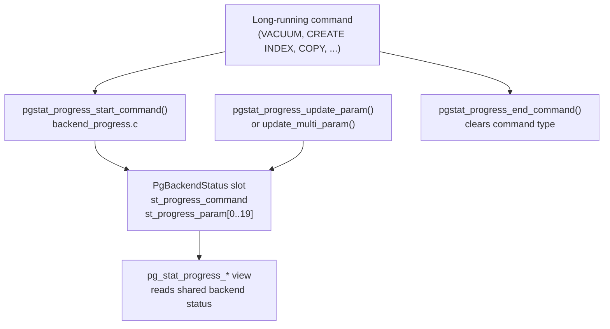

The [[subsystems/observability/pgstat-shmem|statistics shared memory]] layer provides a generic engine for storing and retrieving cumulative statistics, but the substance of what gets counted lives in a set of per-subsystem source files. Each tracked entity — individual functions, the WAL archiver, the checkpointer, replication slots, subscriptions — has its own counters, its own flush strategy, and its own view in the system catalog. This page covers those per-subsystem slices. It explains what each one measures and why those measurements matter for monitoring a production database.

## Function statistics

`pg_stat_user_functions` reports call counts and accumulated execution time for every user-defined function, grouped by OID. PostgreSQL only populates this view when you set `track_functions` to `pl` (PL-language functions only) or `all` (every function call). The default is `none`, so the view is empty on out-of-the-box installations (`pgstat_track_functions`, `pgstat_function.c`).

`pgstat_init_function_usage` and `pgstat_end_function_usage` bracket each function call. At the start of the call, the executor records the current wall-clock time. It also saves two baselines: the accumulated `total_time` already stored in the backend-local pending entry for that function, and a backend-wide counter `total_func_time` that tracks how much time has been charged to *any* function call so far in this session. At the end of the call, PostgreSQL splits the time elapsed into two components:

- **total_time**: the full wall-clock duration of the call, corrected for recursion. Recursive calls accumulate `total_func_time` normally. The save-and-restore around `save_f_total_time` prevents double-counting when a function calls itself.
- **self_time**: elapsed time minus time already attributed to other function calls during this invocation. It answers "how much time was this function *itself* executing, ignoring callee time?"

The distinction matters in practice: a thin PL/pgSQL wrapper that calls expensive SQL helper functions will show a high `total_time` but a low `self_time`. Sorting `pg_stat_user_functions` by `self_time` descending isolates functions that are genuinely compute-heavy rather than merely sitting atop slow callees.

The per-function pending accumulator (`PgStat_FunctionCounts`) lives in backend-local memory. `pgstat_function_flush_cb` flushes it to the shared-memory hash entry at transaction commit. The flush acquires the entry's `LWLock`. It adds the pending `numcalls`, `total_time`, and `self_time` to the shared `PgStat_StatFuncEntry`. Then it clears the local buffer (`pgstat_function.c`).

Function stats entries in the shared hash are keyed by database OID and function OID. They follow the same lifecycle as relation stats. `pgstat_create_function` registers a transactional create, so a rolled-back `CREATE FUNCTION` leaves no orphan stats entry behind. `pgstat_drop_function` registers a transactional drop.

## Archiver statistics

`pg_stat_archiver` is a single-row view that tracks whether WAL file archiving is keeping up. Because there is exactly one archiver process in a PostgreSQL cluster, PostgreSQL stores its statistics as a fixed-size entry directly in `PgStat_ShmemControl` rather than in the dynamic hash (`PgStatShared_Archiver`, `pgstat_internal.h`). No OID-based keying is needed.

The archiver process calls `pgstat_report_archiver` after each archive attempt, passing the WAL segment name and a success/failure flag. Successful calls increment `archived_count` and record `last_archived_wal` and `last_archived_timestamp`; failed calls do the same for `failed_count` and `last_failed_*` (`pgstat_archiver.c`).

Because only the archiver process writes these counters, the implementation uses a *changecount* protocol rather than an [[subsystems/locking/lwlocks|LWLock]] for the write path: the writer bumps a `uint32 changecount` to an odd value before writing and back to even after. Readers retry the copy if the value changed during their read. This avoids any lock acquisition on the critical path of archiving itself. PostgreSQL uses the LWLock on `PgStatShared_Archiver` only for the reset-offset mechanism (the "what was the counter value at last reset" snapshot, needed to produce correct cumulative values after `pg_stat_reset_shared('archiver')` is called).

For application developers, elevated `failed_count` is the primary signal that archive_command is broken — commonly a misconfigured `archive_command`, a full archive destination, or a network mount that has gone stale. `last_failed_timestamp` indicates when it last went wrong. Comparing it against `last_archived_timestamp` reveals how long the failure streak has been running.

## Checkpointer statistics

`pg_stat_checkpointer` exposes counters from the checkpointer background process. Like archiver stats, checkpointer stats are fixed-size (a single `PgStatShared_Checkpointer` in `PgStat_ShmemControl`) and use the changecount protocol for low-overhead writes (`pgstat_checkpointer.c`).

The counters the view exposes break down into three groups:

**Checkpoint frequency.** `timed_checkpoints` counts checkpoints triggered by `checkpoint_timeout` expiring; `requested_checkpoints` counts those triggered by backends writing enough WAL to hit `max_wal_size` or by explicit calls to `CHECKPOINT`. A high ratio of requested to timed checkpoints indicates that WAL generation is outpacing the configured timeout. This is the root cause of the `LOG: checkpoints are occurring too frequently` warning gated on `checkpoint_warning`.

**I/O volume.** `buf_written_checkpoints` counts shared buffers flushed by the checkpointer process itself. `buf_written_backend` counts pages that regular backends had to write themselves. This happens when the buffer they needed was dirty and the checkpointer had not yet gotten to it. It is a form of write amplification that increases client latency. `buf_fsync_backend` counts the subset of those backend-driven writes that also required an `fsync` call.

**Timing.** `checkpoint_write_time` and `checkpoint_sync_time` (in milliseconds) split checkpoint I/O into the spread-write phase and the final `fsync` phase respectively. A very high `checkpoint_sync_time` relative to `checkpoint_write_time` suggests two possible causes: `checkpoint_completion_target` is too low and the final sync is seeing a large burst of dirty pages, or the storage subsystem has slow sync latency.

PostgreSQL keeps pending accumulations in the process-global `PendingCheckpointerStats` (`PgStat_CheckpointerStats`). `pgstat_report_checkpointer` flushes them at the end of each checkpoint. The function skips the write entirely if all fields are zero. This avoids unnecessary shared-memory churn on quiet systems.

## Replication slot statistics

`pg_stat_replication_slots` tracks activity on logical replication slots. Physical slots do not appear in this view — the implementation explicitly returns early for physical slots in `pgstat_reset_replslot` (`pgstat_replslot.c`).

The counters in `PgStat_StatReplSlotEntry` cover two distinct mechanisms. Logical decoding uses both when a transaction is too large to hold in memory:

**Spill statistics** (`spill_txns`, `spill_count`, `spill_bytes`): when a transaction being decoded exceeds `logical_decoding_work_mem`, the decoder spills changes to temporary files on disk. `spill_txns` counts distinct transactions that spilled at least once; `spill_count` counts individual spill-to-disk operations within those transactions; `spill_bytes` is the total data volume written. High spill rates indicate one of two things: subscriber apply workers are applying changes slowly, causing the slot to hold a large transaction window, or individual transactions are genuinely very large.

**Streaming statistics** (`stream_txns`, `stream_count`, `stream_bytes`): when streaming logical replication is in use, the publisher can stream in-progress transactions to subscribers before they commit. These counters track how many transactions were streamed and how many bytes were sent. `total_txns` and `total_bytes` sum both spilled and streamed transactions.

PostgreSQL keys slot stats entries by slot index (an array offset in the in-memory slot array) rather than by a catalog OID, because replication slots have no OID. The index is volatile across restarts, so the serialization callbacks `pgstat_replslot_to_serialized_name_cb` and `pgstat_replslot_from_serialized_name_cb` translate between index and slot name. They run when persisting stats to disk at shutdown and when reloading them at startup. If a slot was dropped while the server was down, the name lookup fails. PostgreSQL then silently discards the orphaned stats.

## Subscription statistics

`pg_stat_subscription_stats` records error counts for logical replication subscriptions. The view is separate from `pg_stat_subscription` (which shows connection and apply-worker status): this one accumulates historical failure counts rather than current live state.

Each subscription has a `PgStat_StatSubEntry` in the shared hash, keyed by subscription OID (`pgstat_subscription.c`). The only counters are `apply_error_count` and `sync_error_count`. An apply error occurs when a logical replication apply worker fails to apply a change from the publisher; a sync error occurs during the initial table synchronization phase. `pgstat_report_subscription_error` increments both. It writes to the backend-local pending buffer (`PgStat_BackendSubEntry`) for flushing via `pgstat_subscription_flush_cb`.

These counters are cumulative since the last reset. A non-zero and growing `apply_error_count` in production means that the subscription has been encountering and retrying errors — usually schema mismatches, constraint violations on the subscriber, or serialization failures. The apply worker logs the actual error details; the counter in `pg_stat_subscription_stats` just provides a quick first-glance signal without scanning logs.

## Progress reporting

The `pg_stat_progress_*` family of views — covering VACUUM, ANALYZE, CLUSTER, CREATE INDEX, COPY, and BASE_BACKUP — uses a different mechanism from the cumulative stats described above. PostgreSQL does not accumulate progress across calls; it reflects the *current live state* of a long-running operation in a specific backend. The data lives in each backend's own `PgBackendStatus` slot in shared memory, which is the same slot visible in [[subsystems/observability/pg-stat-activity|pg_stat_activity]].

The API is deliberately generic. Any command that wants to report progress calls `pgstat_progress_start_command` with a `ProgressCommandType` enum value (one of `PROGRESS_COMMAND_VACUUM`, `PROGRESS_COMMAND_ANALYZE`, `PROGRESS_COMMAND_CLUSTER`, `PROGRESS_COMMAND_CREATE_INDEX`, `PROGRESS_COMMAND_BASEBACKUP`, `PROGRESS_COMMAND_COPY`) and the OID of the relation being processed. This sets `st_progress_command` and `st_progress_command_target` in the backend's status entry. It also zeroes out the `st_progress_param` array — an array of 20 `int64` slots whose meaning is command-specific (`PGSTAT_NUM_PROGRESS_PARAM`, `backend_progress.h`).

During the operation, the command calls `pgstat_progress_update_param(index, value)` to write individual slots, or `pgstat_progress_update_multi_param` to update several atomically within a single changecount window. Each `pg_stat_progress_*` view interprets specific array indices as named columns — for example, VACUUM uses index 0 for the phase, index 1 for the heap blocks total, index 2 for the heap blocks scanned, and so on. When the command finishes, `pgstat_progress_end_command` resets `st_progress_command` to `PROGRESS_COMMAND_INVALID`. This causes the backend to disappear from all progress views.

Because progress state lives in the backend's own `PgBackendStatus` slot, writes are always single-writer and require no lock beyond the changecount protocol already used by `PgBackendStatus`. Reads by monitoring clients use the same retry loop: snapshot the changecount, copy the data, verify the changecount is still the same even value. This ensures that readers never see a partially-updated progress snapshot (`backend_progress.c`).

The progress views are most useful during routine maintenance windows. `pg_stat_progress_vacuum` is particularly valuable for estimating how long a VACUUM on a large table has to run. Comparing `heap_blks_scanned` to `heap_blks_total` gives an approximate completion fraction. The `phase` column shows whether VACUUM is in the sequential scan, index vacuuming, or heap truncation phase.

## Related Topics

- [[subsystems/observability/pgstat-shmem|statistics shared memory]]
- [[subsystems/observability/pg-stat-activity|pg_stat_activity]]
- [[subsystems/observability/overview|observability overview]]
- [[subsystems/background/archiver|WAL archiver]]
- [[subsystems/wal/checkpoint|checkpointing]]
