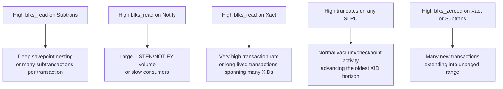

The `pg_stat_slru` view exposes hit, miss, and eviction counters for each of PostgreSQL's internal Simple LRU (SLRU) caches, making cache pressure on transaction-status subsystems directly observable. These caches underpin commit logging, subtransaction tracking, async notification, and other low-level mechanisms. As a result, unusual read or write rates in this view often surface problems that are invisible elsewhere in the stats system.

## What SLRUs Are

SLRU (Simple LRU) caches, implemented in `slru.c`, are fixed-size arrays of shared-memory 8 KB page buffers used for storing sequential, page-numbered data. Each SLRU is managed with a plain linear scan over its small buffer pool — there is no hashtable. It uses a least-recently-used eviction policy, except that the latest page is never swapped out (slru.c lines 9–14). Access is coordinated with a single control [[subsystems/locking/lwlocks|LWLock]] protecting shared state, plus per-buffer LWLocks for I/O.

PostgreSQL maintains several named SLRUs, each tracking a different class of transaction metadata:

| SLRU name | Directory | Purpose |
|---|---|---|
| `Xact` | `pg_xact` | Transaction commit/abort status — the [[subsystems/storage/clog|CLOG]] |
| `CommitTs` | `pg_commit_ts` | Commit timestamps (when `track_commit_timestamp` is on) |
| `MultiXactMember` | `pg_multixact/members` | Member XIDs for multi-transaction locks |
| `MultiXactOffset` | `pg_multixact/offsets` | Offset index for MultiXact members |
| `Subtrans` | `pg_subtrans` | Parent-transaction mapping for [[subsystems/transactions/subtransactions|subtransactions]] |
| `Notify` | `pg_notify` | Pending LISTEN/NOTIFY messages |
| `Serial` | `pg_serial` | Serializable predicate lock conflicts |
| `other` | — | Catch-all for extension-defined SLRUs |

The name list is defined as `slru_names[]` in `pgstat_internal.h`. The catch-all `"other"` entry is always last, and any SLRU whose name is not in the list maps to that entry.

## View Columns and Their Meanings

The `PgStat_SLRUStats` struct (defined in `pgstat.h`) holds one counter per significant event; the view columns map directly to these fields:

| Column | Struct field | What it counts |
|---|---|---|
| `blks_zeroed` | `blocks_zeroed` | Pages initialised to zero (new page allocation via `SimpleLruZeroPage`) |
| `blks_hit` | `blocks_hit` | Requests satisfied from the in-memory buffer pool without I/O |
| `blks_read` | `blocks_read` | Pages read from disk because they were not in the buffer pool |
| `blks_written` | `blocks_written` | Individual page write-outs during eviction or explicit flushes |
| `blks_exists` | `blocks_exists` | Calls to `SimpleLruDoesPhysicalPageExist()` to probe on-disk existence |
| `flushes` | `flush` | Calls to `SimpleLruWriteAll()`, which writes all dirty buffers |
| `truncates` | `truncate` | Calls to `SimpleLruTruncateNoLock()`, which removes obsolete segments |

A high `blks_hit` relative to `blks_read` indicates a healthy cache. A growing `blks_read` means the SLRU evicts pages before they are reused. This implies that the working set exceeds the buffer pool size. SLRU pool sizes are fixed and small (typically 8–32 slots), so a large working transaction range, rather than an undersized pool, most likely causes this.

## How the Counters Are Collected

Each backend accumulates SLRU events into a static `pending_SLRUStats` array (one `PgStat_SLRUStats` entry per SLRU) held in process-local memory. The individual accumulation functions — `pgstat_count_slru_page_hit()`, `pgstat_count_slru_page_read()`, and so on — simply increment the relevant field in `pending_SLRUStats[slru_idx]`. Each also sets the `have_slrustats` flag.

`pgstat_slru_flush()` writes these pending counts to shared memory during the regular statistics flush cycle. The flush acquires an exclusive [[subsystems/locking/lwlocks|LWLock]] on `PgStatShared_SLRU.lock` and adds the pending values into the shared `stats[]` array. It then zeroes the local pending buffer. If the `nowait` flag is set and the lock cannot be acquired immediately, the flush is deferred.

When a backend queries `pg_stat_slru`, `pgstat_fetch_slru()` calls `pgstat_snapshot_fixed(PGSTAT_KIND_SLRU)`. This function acquires a shared lock and copies the entire shared `stats[]` array into a local snapshot, then releases the lock. This snapshot-on-read design ensures consistent column values within a single query without holding the lock for the duration of SQL processing.

The instrumentation calls in `slru.c` are placed at the precise transition points:

- `pgstat_count_slru_page_hit()` is called inside `SimpleLruReadPage()` and `SimpleLruReadPage_ReadOnly()` when the requested page is already in a buffer slot (lines 430, 515).
- `pgstat_count_slru_page_read()` is called after a page is read from disk (line 475).
- `pgstat_count_slru_page_zeroed()` is called from the zero-page path (line 309).
- `pgstat_count_slru_page_written()` is called inside the internal write-page routine (line 767).
- `pgstat_count_slru_flush()` is called at the start of `SimpleLruWriteAll()` (line 1167).
- `pgstat_count_slru_truncate()` is called at the start of the truncate path (line 1233).

In some cases, these calls happen inside critical sections. To avoid any risk of allocation failure at a bad moment, the accumulator uses statically allocated memory rather than palloc (pgstat_slru.c line 32).

## Diagnosing SLRU Pressure

**Subtrans pressure** is the most frequently encountered problem. The `pg_subtrans` SLRU maps each subtransaction XID to its parent. When a transaction opens many savepoints (or when application frameworks simulate autonomous transactions via savepoints), each subtransaction gets its own XID and a corresponding entry in this SLRU. If the set of active subtransaction XIDs spans more pages than the pool holds, `blks_read` will climb. The fix is usually to reduce savepoint nesting depth or batch work into fewer subtransactions.

**Notify pressure** (`blks_read` on `Notify`) indicates that NOTIFY messages are accumulating faster than listeners are consuming them. The `pg_notify` SLRU stores pending messages, and PostgreSQL truncates it after all listeners have caught up. Heavy publisher traffic against slow or absent listeners can push the active working set beyond the pool.

**Xact (CLOG) pressure** is rare in normal operations because recent commit-status pages are almost always in memory. It can occur under extreme transaction rates where the XID range in flight spans many SLRU pages. It can also occur when a very old transaction holds back the oldest-XID horizon, keeping a large span of pages relevant. Long-running transactions interacting with [[subsystems/transactions/xid-wraparound|XID wraparound]] avoidance can produce this pattern.

**CommitTs pressure** appears only when `track_commit_timestamp = on`. High read rates here accompany the same conditions as CLOG pressure, since commit timestamps are stored page-for-page in the same XID number space.

**Serial SLRU** stores conflict information for serializable transactions. Pressure here is a signal that the predicate lock manager is tracking a very large number of concurrent serializable transactions. The `flushes` counter for Serial is also useful: it increments on each checkpoint, so `flushes` can double as a rough checkpoint-frequency gauge for this subsystem.

## Resetting Stats

Individual SLRU counters can be reset via `pg_stat_reset_slru(name text)`. Passing `NULL` resets all SLRUs. PostgreSQL stores the reset timestamp in `stat_reset_timestamp` (the `stats_reset` column in the view). This timestamp anchors rate calculations to the last reset.

## Related Topics

- [[subsystems/storage/clog]] — the `Xact` SLRU, storing commit/abort status per XID
- [[subsystems/transactions/subtransactions]] — why the `Subtrans` SLRU can see pressure under deep savepoint nesting
- [[subsystems/transactions/xid-wraparound]] — conditions that widen the active XID range and can indirectly stress CLOG and CommitTs SLRUs
- [[subsystems/locking/lwlocks]] — the lock type used to protect both the SLRU buffer pools and the shared stats array
- [[subsystems/observability/pgstat-shmem]] — the shared-memory statistics infrastructure that SLRU stats plug into
- [[subsystems/observability/pg-stat-io]] — complementary I/O statistics for the main buffer pool
