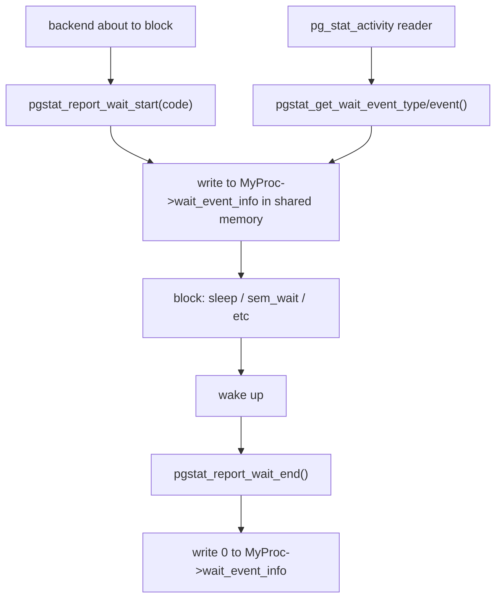

Wait events are the mechanism PostgreSQL uses to make a backend's blocking state visible to monitoring tools. Whenever a backend is about to sleep — waiting for a lock, an I/O to complete, a client message, or a signal from another process — it stamps a 32-bit wait event code into a shared memory location before blocking. It clears the code on wake. `pg_stat_activity.wait_event_type` and `wait_event` surface these stamps as human-readable strings.

## How the Mechanism Works

Each backend has a `uint32 wait_event_info` field in its `PGPROC` struct (`src/include/storage/proc.h`). During backend startup, `pgstat_set_wait_event_storage()` points the process-local pointer `my_wait_event_info` at this field inside shared memory. Before shared memory is available (very early startup), the pointer targets a process-local variable instead, so it is always safe to call.

The two hot-path functions are declared inline in `src/include/utils/wait_event.h`:

```c
static inline void
pgstat_report_wait_start(uint32 wait_event_info)
{
    *(volatile uint32 *) my_wait_event_info = wait_event_info;
}

static inline void
pgstat_report_wait_end(void)
{
    *(volatile uint32 *) my_wait_event_info = 0;
}
```

The write is unconditional and has no lock — a 4-byte aligned store is atomic on every platform PostgreSQL targets. The `volatile` qualifier prevents the compiler from eliding the write. The value is zero when a backend is running normally. Any non-zero value means the backend is blocked.

The 32-bit word is split into a class in the high byte and an event identifier in the lower three bytes:

```
  31      24 23                    0
 +---------+------------------------+
 |  class  |       event id         |
 +---------+------------------------+
  0xFF000000  0x00FFFFFF
```

`pgstat_get_wait_event_type()` masks out the top byte. It switches on the known class constants. `pgstat_get_wait_event()` does the same for the event identifier, dispatching to per-class helper functions that return string names. For `LWLock` events, the event id is the tranche number. `GetLWTrancheName()` translates the tranche number to a name.



A monitoring query reading `pg_stat_activity` calls into the same `pgstat_get_wait_event_type` / `pgstat_get_wait_event` functions to convert the raw integer to strings. Because the read happens without any lock, it may observe a value mid-transition. The cost of doing it correctly vastly outweighs the negligible risk of a torn read on a four-byte aligned value.

## Querying Wait Events

```sql
SELECT pid,
       wait_event_type,
       wait_event,
       state,
       left(query, 80) AS query
FROM   pg_stat_activity
WHERE  wait_event IS NOT NULL
ORDER  BY wait_event_type, wait_event;
```

A `NULL` `wait_event` means the backend is active and not blocked. The most operationally useful aggregation groups by type and event:

```sql
SELECT wait_event_type,
       wait_event,
       count(*) AS waiters
FROM   pg_stat_activity
WHERE  wait_event IS NOT NULL
  AND  backend_type = 'client backend'
GROUP  BY 1, 2
ORDER  BY 3 DESC;
```

**PostgreSQL 17:** The `pg_wait_events` system catalog view was added, listing every known wait event type and event name with a human-readable description. Previously, the full enumeration existed only in documentation. `pg_wait_events` makes it queryable from SQL. Joining it with `pg_stat_activity` on `wait_event_type` and `wait_event` annotates live session data with descriptions.

```sql
-- Annotate active waits with descriptions from pg_wait_events (PG 17+)
SELECT a.pid,
       a.wait_event_type,
       a.wait_event,
       w.description,
       left(a.query, 80) AS query
FROM   pg_stat_activity AS a
JOIN   pg_wait_events AS w
       ON  w.type = a.wait_event_type
       AND w.name = a.wait_event
WHERE  a.wait_event IS NOT NULL;
```

## Wait Event Classes

| Class | `wait_event_type` string | Meaning |
|---|---|---|
| `PG_WAIT_LOCK` | `Lock` | Waiting for a heavyweight lock |
| `PG_WAIT_LWLOCK` | `LWLock` | Waiting for a lightweight lock |
| `PG_WAIT_BUFFER_PIN` | `BufferPin` | Waiting to acquire a buffer pin |
| `PG_WAIT_IO` | `IO` | Waiting for an I/O system call |
| `PG_WAIT_IPC` | `IPC` | Waiting for a signal from another process |
| `PG_WAIT_CLIENT` | `Client` | Waiting for the connected client |
| `PG_WAIT_TIMEOUT` | `Timeout` | Sleeping until a timer fires |
| `PG_WAIT_ACTIVITY` | `Activity` | Background process idle loop |
| `PG_WAIT_EXTENSION` | `Extension` | Custom wait event from an extension |

## Lock Class

Lock waits represent contention on PostgreSQL's heavyweight lock manager — the mechanism used for relation-level, tuple-level, and transaction-level synchronisation. The event id encodes the lock tag type, which maps to the `LockTagTypeNames[]` array in `src/backend/utils/adt/lockfuncs.c`. The name exposed in `wait_event` is exactly the string from that array.

| `wait_event` | Lock tag type | Acquired when |
|---|---|---|
| `relation` | `LOCKTAG_RELATION` | Any access to a table, index, sequence, or view — even a SELECT acquires `AccessShareLock` |
| `extend` | `LOCKTAG_RELATION_EXTEND` | Extending a relation file to allocate a new block; held only for the duration of the extension |
| `page` | `LOCKTAG_PAGE` | GIN index operations that need page-level serialisation |
| `tuple` | `LOCKTAG_TUPLE` | Locking a heap tuple to perform an update or delete while another transaction holds a conflicting row lock |
| `transactionid` | `LOCKTAG_TRANSACTION` | Waiting for another transaction to commit or abort — by far the most common Lock wait in OLTP workloads |
| `virtualxid` | `LOCKTAG_VIRTUALTRANSACTION` | Waiting for a virtual transaction ID to be released; occurs during lock conflict resolution before the backend acquires a real XID |
| `spectoken` | `LOCKTAG_SPECULATIVE_TOKEN` | Speculative insertion (used by `INSERT ... ON CONFLICT`) waiting for a conflicting speculative insert to resolve |
| `advisory` | `LOCKTAG_ADVISORY` | Application-level advisory locks via `pg_advisory_lock()` |
| `object` | `LOCKTAG_OBJECT` | Locks on non-relation database objects (roles, schemas, tablespaces) |

The `transactionid` wait is the most important diagnostic signal in a busy OLTP system. A backend may need to update or delete a row already modified by another transaction. In that case, it calls `XactLockTableWait()`. This blocks the backend until the holder's transaction commits or aborts. High `transactionid` wait counts with a common `relation` in the blocker's query nearly always indicate a hot row — a row that many concurrent transactions are trying to modify.

```sql
-- Find which transactions are blocking others and what they are running
SELECT blocked.pid,
       blocked.query AS blocked_query,
       blocking.pid AS blocking_pid,
       blocking.query AS blocking_query
FROM   pg_stat_activity AS blocked
JOIN   pg_stat_activity AS blocking
       ON  blocking.pid = ANY(pg_blocking_pids(blocked.pid))
WHERE  blocked.wait_event_type = 'Lock'
  AND  blocked.wait_event = 'transactionid';
```

## LWLock Class

LWLocks (lightweight locks) are PostgreSQL's shared-memory mutex for protecting in-memory data structures. Unlike heavyweight locks, they do not participate in deadlock detection and have no per-lock grant queue beyond a simple wait list. The event id for an LWLock wait is the tranche number, which resolves to a name via `GetLWTrancheName()` (`src/backend/storage/lmgr/lwlock.c`).

The most diagnostically important LWLock wait events:

| `wait_event` | Tranche | What it protects | Pressure signal |
|---|---|---|---|
| `BufferContent` | `LWTRANCHE_BUFFER_CONTENT` | The contents of a single shared buffer page (content lock) | High concurrent scans on the same pages; too few `shared_buffers` relative to working set |
| `BufferMapping` | `LWTRANCHE_BUFFER_MAPPING` | The hash table mapping block numbers to buffer slots | Buffer pool saturation; too many lookups hitting the same partition of the mapping table |
| `WALInsert` | `LWTRANCHE_WAL_INSERT` | WAL insertion buffer slots | Heavy write workload; all backends compete to claim a slot before writing WAL records |
| `WALWriteLock` | individual lock `WALWriteLock` | The actual WAL file write, flushing from WAL buffers to disk | WAL I/O bottleneck; disk or `wal_sync_method` contention |
| `LockManager` | `LWTRANCHE_LOCK_MANAGER` | The heavyweight lock table partitions | High lock acquisition rate or deadlock detection overhead |
| `LockFastPath` | `LWTRANCHE_LOCK_FASTPATH` | Per-backend fast-path lock slots | Contention from backends acquiring/releasing locks at high frequency |
| `ProcArrayLock` | individual lock `ProcArrayLock` | The array of active backends and their XIDs | Frequent XID assignment, snapshot creation, or `pg_terminate_backend()` calls |
| `XidGenLock` | individual lock `XidGenLock` | Transaction ID generation | High transaction rate; mitigated in PG 14+ by improved XID assignment batching |
| `RelationMappingLock` | individual lock `RelationMappingLock` | The system catalog OID-to-filenode mapping | Concurrent DDL |

`BufferContent` and `WALInsert` are the two LWLocks most commonly responsible for throughput degradation in production. A backend acquires a `BufferContent` exclusive lock to modify a buffer page. It acquires a shared lock to read it. When many backends scan the same frequently-evicted pages, the exclusive-to-shared handoff creates a serialisation bottleneck. `WALInsert` pressure appears in write-heavy workloads. There, backends hold the WAL insertion lock while they construct WAL records in the in-memory WAL buffers.

```sql
-- Identify LWLock waits by specific tranche
SELECT wait_event,
       count(*) AS waiters
FROM   pg_stat_activity
WHERE  wait_event_type = 'LWLock'
GROUP  BY wait_event
ORDER  BY waiters DESC;
```

## IO Class

IO waits cover every blocking system call that touches persistent storage. Most I/O is initiated through the buffer manager. As a result, most IO waits appear when a page is missing from `shared_buffers` and must be fetched from the OS. IO waits also appear when WAL must be durably written.

| `wait_event` | When it occurs |
|---|---|
| `DataFileRead` | Reading a heap or index page from disk into a shared buffer |
| `DataFileWrite` | Writing a dirty buffer to its relation file during [[subsystems/background/bgwriter|bgwriter]], checkpointer, or backend-driven eviction |
| `DataFileExtend` | Extending a relation file to add a new block |
| `DataFileSync` | `fsync()` of a data file, typically during checkpointing |
| `WALWrite` | Writing WAL buffers to the WAL segment file (`XLogWrite()` in `xlog.c`) |
| `WALSync` | `fsync()` of WAL segments at commit when `synchronous_commit = on` |
| `WALRead` | Reading WAL during recovery, logical decoding, or `pg_waldump` |
| `SLRURead` | Reading a page from a Simple LRU buffer ([[subsystems/storage/clog|CLOG]], subtransaction status, multixact, commit timestamp) |
| `SLRUWrite` | Writing a dirty SLRU page |
| `SLRUSync` | `fsync()` of an SLRU file during checkpoint |
| `BufFileRead` / `BufFileWrite` | Reading or writing temporary files for sort spills and hash joins that exceed `work_mem` |

`WALWrite` and `WALSync` together represent the commit path for synchronous transactions. A backend calls `XLogFlush()` before returning to the client when `synchronous_commit` is on. `XLogFlush()` acquires `WALWriteLock` (an LWLock), writes any unflushed WAL buffers, and then fsyncs. In a system where many short transactions commit simultaneously, the WAL write path becomes a serialisation point — evidenced by concurrent `WALWrite` IO waits plus `WALWriteLock` LWLock waits.

`SLRURead` appears when the CLOG (commit log) buffer cache misses. CLOG records transaction commit/abort status in 8KB pages. A large or long-running system with many recent transactions may see this wait when visibility checks pull in CLOG pages that are not currently buffered. `SLRUWrite` and `SLRUSync` occur during checkpoint processing.

## IPC Class

IPC waits signal that a backend is blocked waiting for a notification or state change from another process, rather than an OS resource.

| `wait_event` | What it means |
|---|---|
| `MessageQueueReceive` | A parallel query worker is waiting for a message from the Gather node or another worker via a DSM-backed message queue |
| `MessageQueueSend` | A parallel query worker is waiting to push a result tuple to the Gather node because the queue is full |
| `ExecuteGather` | The Gather/GatherMerge node in the leader is waiting for a parallel worker to produce tuples |
| `ParallelFinish` | The leader is waiting for all parallel workers to finish their scan |
| `BgWorkerShutdown` | A backend is waiting for a background worker it launched to terminate |
| `BgWorkerStartup` | Waiting for a background worker to finish starting up |
| `SyncRep` | A backend is blocked waiting for a standby to acknowledge WAL flush (`synchronous_standby_names` is set) |
| `ReplicationOriginDrop` | Waiting to drop a replication origin while other processes may be using it |
| `BufferIO` | Waiting for another backend to complete an I/O it has already started for a shared buffer (the second backend piggybacks on the first rather than issuing a duplicate read) |
| `CheckpointDone` | Waiting for the checkpointer to complete a requested checkpoint |
| `ProcArrayGroupUpdate` | A backend is waiting to join or complete a group XID removal from the proc array |
| `XactGroupUpdate` | Waiting to join a group CLOG update, used by backends that commit at the same instant |

`MessageQueueReceive` and `MessageQueueSend` are the dominant waits in parallel query workloads. Sustained `MessageQueueSend` pressure on workers means the Gather node cannot drain results fast enough — typically because the leader is CPU-bound processing tuples or because `work_mem` limits the queue. `SyncRep` waits are invisible to the client until the standby's `write_lsn` / `flush_lsn` / `replay_lsn` catches up, making `pg_stat_replication` the companion view for diagnosing them.

## Client Class

Client waits occur when a backend is waiting on the network connection to the client process. These are normal in any interactive workload but become problematic when long client waits consume backend slots.

| `wait_event` | Direction | Meaning |
|---|---|---|
| `ClientRead` | client → server | The backend has sent its response and is now waiting for the client's next query message. Normal idle state between queries. |
| `ClientWrite` | server → client | The backend has data to send but the client's receive buffer is full — the client is consuming results too slowly. |
| `WalSenderWaitForWAL` | — | A walsender is waiting for the WAL writer to flush WAL so it can stream it to a replica |
| `WalSenderWriteData` | server → replica | A walsender is blocked writing to the replication socket because the replica is not consuming WAL fast enough |

`ClientRead` is the expected state for backends sitting in a connection pool or waiting for the application to send the next query. A large fraction of backends in `ClientRead` is normal and healthy.

`ClientWrite` indicates a slow consumer. It can be a serious problem: the backend holds open transactions and locks while it waits, blocking other work. Connection poolers that intercept the protocol at the TCP level can eliminate `ClientWrite` pressure by buffering result rows server-side. That shifts the problem to memory and pooler latency.

## Timeout Class

Timeout waits are deliberate sleeps. They do not indicate contention, but they show how much time rate-limiting or delay paths consume.

| `wait_event` | When it fires |
|---|---|
| `PgSleep` | Backend is executing `pg_sleep()`, `pg_sleep_for()`, or `pg_sleep_until()` |
| `VacuumDelay` | [[subsystems/background/autovacuum|Autovacuum]] or manual VACUUM is sleeping between work chunks because `vacuum_cost_delay` is non-zero |
| `CheckpointWriteDelay` | The checkpointer is sleeping between buffer writes to pace I/O according to `checkpoint_completion_target` |
| `RecoveryApplyDelay` | Standby has applied WAL ahead of the configured `recovery_min_apply_delay` and is waiting for the timer |
| `BaseBackupThrottle` | `pg_basebackup` is rate-limited via `--max-rate` |
| `SpinDelay` | A spinlock acquisition is retrying with a sleep; indicates brief but very high-frequency lock contention |
| `VacuumTruncate` | VACUUM is waiting to acquire the exclusive lock needed to truncate empty pages from the end of a relation |

`SpinDelay` deserves attention: PostgreSQL uses spinlocks to protect very short critical sections (a few instructions). If backends are sleeping in `SpinDelay`, it means another backend is holding a spinlock long enough for other backends to exhaust their busy-wait loop — a sign of unusual contention or a CPU-bound critical section.

## Extension Class

Extensions can register their own wait events by calling `WaitEventExtensionNew()`, which allocates a tranche id in the `LWTRANCHE_FIRST_USER_DEFINED` range. The `wait_event_type` will show `Extension`. `wait_event` will show the name the extension registered. `pg_stat_activity` exposes these transparently alongside built-in events.

**PostgreSQL 17:** Extensions can register named custom wait events that replace the generic `Extension` placeholder in `wait_event`. Prior to PG 17, all extension waits appeared as a single undifferentiated `Extension` event. From PG 17, each registered event has its own name visible in both `pg_stat_activity` and `pg_wait_events`, making per-extension wait profiling practical without external instrumentation.

## Diagnostic Patterns

### transactionid contention — hot row updates

```
wait_event_type = 'Lock', wait_event = 'transactionid'
```

Multiple backends are trying to update or delete the same row simultaneously. The first acquires a row lock. The rest call `XactLockTableWait()` and block. Every commit by the holder wakes one waiter. The waiter then re-checks the tuple's visibility, and it may block again if a second holder exists. This cascading pattern can stall dozens of backends behind a single slow transaction.

Remedies: reduce transaction duration for the update hotspot; introduce application-level queuing or batching; consider whether the row is a counter that can be replaced with a sequence or a partitioned accumulator.

### BufferContent pressure — shared_buffers too small

```
wait_event_type = 'LWLock', wait_event = 'BufferContent'
```

Many backends are competing for the exclusive content lock on shared buffer pages. This happens when the working set does not fit in `shared_buffers`, causing high eviction rates and repeated reads of the same pages. It also appears on extremely hot index leaf pages — a root or high-branching-factor index page touched by every query.

Remedies: increase `shared_buffers`; review queries doing full scans on large tables; consider partitioning a hot index; add partial indexes to reduce scan scope.

### WALInsert pressure — write-heavy workload

```
wait_event_type = 'LWLock', wait_event = 'WALInsert'
```

Multiple backends are inserting WAL records concurrently and contending for WAL insertion buffer slots. The WAL insertion path acquires an insertion lock to claim a position in the WAL buffer, writes the record, then releases. Each lock covers one of eight buffer slots, so contention increases with more concurrent writers.

Remedies: enable `wal_compression` to shrink records and reduce insertion time; reduce the number of short concurrent transactions through batching; check that storage is not already saturating (which would keep the insertion lock held longer); on very write-heavy systems, `wal_buffers` increase helps marginally.

### ClientRead — connection pooler or slow application

```
wait_event_type = 'Client', wait_event = 'ClientRead'
```

This is not inherently a problem — a backend waiting for the client's next query is idle. The concern is _count_: if most backends are in `ClientRead`, the application is using persistent connections without sending queries, consuming backend slots. A PgBouncer-style pooler at `transaction` level eliminates idle backends from the PostgreSQL process table entirely.

```sql
-- Find backends that have been idle for more than 5 minutes
SELECT pid, usename, application_name,
       now() - state_change AS idle_duration
FROM   pg_stat_activity
WHERE  wait_event = 'ClientRead'
  AND  state = 'idle'
  AND  now() - state_change > interval '5 minutes'
ORDER  BY idle_duration DESC;
```

## Related Topics

- [[subsystems/observability/pg-stat-activity|pg_stat_activity]] — the primary view that exposes `wait_event_type` and `wait_event` for each backend, making wait event data queryable in SQL
- [[subsystems/locking/lwlocks|LWLocks]] — covers the lightweight lock implementation that drives the entire `LWLock` wait event class, including tranche allocation and the wait list mechanism
- [[subsystems/locking/overview|Locking Overview]] — explains the heavyweight lock manager that underlies `Lock` class wait events such as `transactionid` and `relation`
- [[subsystems/storage/wait-event-set|Wait Event Set]] — the lower-level infrastructure (`WaitEventSet`, latches, and epoll/kqueue) that backends use to sleep until a wait event resolves
- [[subsystems/storage/buffer-manager|Buffer Manager]] — the component that issues `BufferContent`, `BufferMapping`, and `BufferIO` waits when pages are loaded into or evicted from `shared_buffers`
- [[troubleshooting/lock-waits|Lock Wait Troubleshooting]] — practical diagnosis guide for `Lock` and `LWLock` wait events including blocking query identification and remediation
- [[subsystems/background/autovacuum|Autovacuum]] — background process responsible for `VacuumDelay` and `VacuumTruncate` timeout waits and a frequent participant in `Lock` contention
- [[subsystems/observability/overview|PostgreSQL Observability Overview]] — the broader cumulative statistics architecture that wait events are one part of, alongside query, I/O, and vacuum counters.
- [[subsystems/wal/overview|WAL Overview]] — WAL structure and segment lifecycle that underlie the `WALWrite`, `WALSync`, and `WALInsert` wait events described here.
