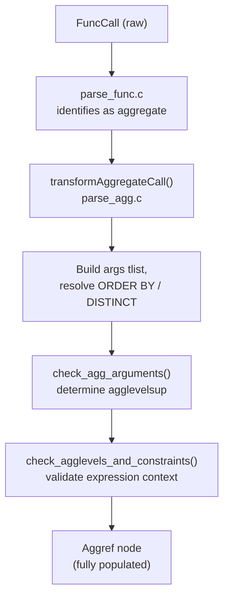

Aggregate analysis is the part of [[subsystems/parser/semantic-analysis|semantic analysis]] that handles the special semantic rules around aggregate functions, window functions, and grouping operations. It converts a raw `FuncCall` node that was identified as an aggregate into a fully annotated `Aggref` node. It determines which query level the aggregate belongs to. It enforces placement restrictions. Later, it verifies that every non-aggregate column in a query that uses GROUP BY is properly grouped.

## The Two-Pass Design

Aggregate processing deliberately happens in two phases. The first phase runs during expression transformation, when `parse_func.c` recognises a function call as an aggregate. `parse_func.c` then hands control to `transformAggregateCall()` (`parse_agg.c`). The second phase runs after the entire query is assembled. At that point, `parseCheckAggregates()` (`parse_agg.c`) does a final sweep over the query tree to enforce grouping constraints and detect aggregates in illegal positions such as recursive CTE terms.

This split is intentional: placement constraints against things like recursive queries cannot be checked during expression analysis because the recursive structure of the query is not yet complete. The analyzer catches most misplaced-aggregate errors eagerly during the first phase, but it defers structural constraints to the second.

## Building the Aggref Node

When `transformAggregateCall()` receives a partially-built `Aggref`, `parse_func.c` has already set several fields: the aggregate's OID, its `aggkind`, and its collation. It has not yet set the argument structures, ordering, and level information. `transformAggregateCall()` finishes the job.

For regular aggregates, `transformAggregateCall()` wraps arguments in `TargetEntry` nodes to form an internal target list (`agg->args`). It adds any ORDER BY columns that were not already in the argument list as resjunk entries. DISTINCT processing produces a `SortGroupClause` list in `agg->aggdistinct`. Because DISTINCT currently requires sort support, `transformAggregateCall()` rejects any type without a btree sort operator here, with a clear error.

Ordered-set aggregates (such as `percentile_cont`) carry two categories of arguments: *direct args*, which are evaluated once per group, and *aggregated args*, which are evaluated per input row. `transformAggregateCall()` splits the flat argument list at the boundary between direct and aggregated args. It places the former in `agg->aggdirectargs`. It converts the latter into the same target-list structure used by regular aggregates. The ORDER BY for an ordered-set aggregate always corresponds one-to-one with the aggregated args, so `transformAggregateCall()` never adds resjunk entries.

After `transformAggregateCall()` processes arguments, it builds `aggargtypes` from the actual resolved types of all non-resjunk arguments. It excludes resjunk entries added purely for ORDER BY from this list, because they do not affect the aggregate's identity in `pg_aggregate`.

## Aggregate Level Resolution

SQL allows an aggregate in a subquery to belong to an outer query level. For example, `SELECT ... FROM t WHERE x = (SELECT SUM(outer.y) FROM ...)` has the aggregate logically belonging to the outer `SELECT`. The `agglevelsup` field on `Aggref` encodes this: 0 means the aggregate belongs to the current query, 1 means its parent, and so on.

`check_agg_arguments()` (`parse_agg.c`) determines the level by scanning the aggregate's arguments — including any FILTER expression, but not direct args — for `Var` nodes and nested `Aggref` nodes. The rule is: the aggregate's level is the minimum variable or aggregate level found among its arguments. If the arguments contain no variables at all, the analyzer considers the aggregate local (level 0).

Two invariants are enforced here:

1. **No same-level nesting.** If the arguments contain an `Aggref` at the same level as the outer aggregate, that is a nested aggregate call. It raises an error immediately.
2. **No cross-level CTEs.** An outer-level aggregate cannot reference a CTE defined below its own level, because there is no clean execution model for it.

Direct arguments have their own checks. A direct arg may not contain a variable at a lower level than the aggregate itself. It also may not contain any aggregate at or below the aggregate's own level.

Once `check_agg_arguments()` determines the level, it walks up the `parentParseState` chain and sets `p_hasAggs` to `true` on the `ParseState` at the aggregate's own level — not the current pstate. This ensures the planner later inserts an `Agg` node at the right point in the plan tree.

## Placement Restrictions

`check_agglevels_and_constraints()` (`parse_agg.c`) uses `pstate->p_expr_kind` to determine whether an aggregate or `GROUPING()` expression appears in a legal position. The allowed positions include `SELECT` targets, `HAVING`, `ORDER BY`, `DISTINCT ON`, `WINDOW PARTITION`, and `WINDOW ORDER`. Prohibited positions include `WHERE`, `GROUP BY`, `JOIN` conditions, `DEFAULT` expressions, index predicates, check constraints, partition expressions, recursive CTE terms, and many others, each with a precise error message.

The same switch statement handles both `Aggref` and `GroupingFunc` nodes. Window functions have their own parallel switch in `transformWindowFuncCall()`, which additionally rejects them inside `HAVING` and inside other window definitions.

## Grouping Validation

After the analyzer assembles the full `Query` node, `parseCheckAggregates()` performs grouping correctness checks. The key invariant it enforces is the standard SQL rule: any column reference in the `SELECT` list or `HAVING` clause that is not inside an aggregate call must either appear in the `GROUP BY` clause or be functionally dependent on the grouped columns.

`check_ungrouped_columns()` (`parse_agg.c`) walks the target list and HAVING qual. It skips inside aggregate arguments, since vars inside an aggregate do not need to be grouped. However, it treats direct arguments of ordered-set aggregates as if they were outside aggregates. When `check_ungrouped_columns()` finds a suspect `Var` that is not in the group-by list, it tries one last escape hatch. `check_functional_grouping()` checks whether the table has a primary key or unique constraint that makes the ungrouped column functionally determined by the grouped columns. If it does, `check_ungrouped_columns()` accepts the column. It adds the constraint OID to `qry->constraintDeps`, so that dropping the constraint later will invalidate cached plans.

For `GROUPING SETS`, `ROLLUP`, and `CUBE` clauses, `expand_grouping_sets()` (`parse_agg.c`) expands the compact parsed representation into a flat list of individual grouping sets before this check runs. A `ROLLUP(a, b, c)` over three columns generates four sets: `{a,b,c}`, `{a,b}`, `{a}`, and `{}`. A `CUBE` over n columns generates 2^n sets (with an enforced limit of fewer than 31 columns to keep the bitmask computation safe). For the ungrouped-column check, `check_ungrouped_columns()` considers only columns present in every grouping set — the intersection — reliably grouped. It tracks them separately in `groupClauseCommonVars`.

`finalize_grouping_exprs()` (`parse_agg.c`) handles `GROUPING()` expressions. It runs before `check_ungrouped_columns()`. It must operate on the unflattened query tree, because it writes back into the node. Each argument of a `GROUPING()` call must match exactly one entry in the group-by list. `finalize_grouping_exprs()` records the matching `ressortgroupref` value in `GroupingFunc.refs`. This reference is what the executor later uses to look up whether a given group key is "active" in the current grouping set.

## Polymorphic Transition Types

Two utility functions in `parse_agg.c` assist the planner and executor in working with polymorphic aggregates. `get_aggregate_argtypes()` extracts the actual resolved input types from an `Aggref` into a flat array. `resolve_aggregate_transtype()` resolves a polymorphic transition type (such as `ANYELEMENT`) to a concrete OID using `enforce_generic_type_consistency()`, given the concrete input types. This is necessary because the transition state type drives how the executor allocates and copies state during aggregation.

A related group of functions — `build_aggregate_transfn_expr()`, `build_aggregate_finalfn_expr()`, `build_aggregate_serialfn_expr()`, and `build_aggregate_deserialfn_expr()` — build stub `FuncExpr` trees for each phase function of an aggregate. These trees are never executed. They exist solely so that polymorphic functions can interrogate their argument types at runtime via `get_fn_expr_argtype()`. The argument `Param` nodes are synthetic (`PARAM_EXEC` with `paramid = -1`). They carry only type information.

## Key Structures

| Structure | Purpose |
|---|---|
| `Aggref` | Parsed aggregate call: OID, args tlist, aggorder, aggdistinct, aggfilter, agglevelsup, aggkind |
| `GroupingFunc` | `GROUPING()` pseudo-aggregate: args, refs (set by finalize), agglevelsup |
| `check_agg_arguments_context` | Walker state for level computation: tracks min_varlevel, min_agglevel, min_ctelevel |
| `check_ungrouped_columns_context` | Walker state for grouping validation: groupClauses, groupClauseCommonVars, func_grouped_rels |
| `SortGroupClause` | Represents one ORDER BY or DISTINCT column within an aggregate's arg list |

## Related Topics

- [[subsystems/parser/semantic-analysis|Semantic analysis]] — how `transformAggregateCall` fits into the overall query analysis pipeline
- [[subsystems/executor/overview|Executor overview]] — the `Agg` node that evaluates the `Aggref` trees at runtime
