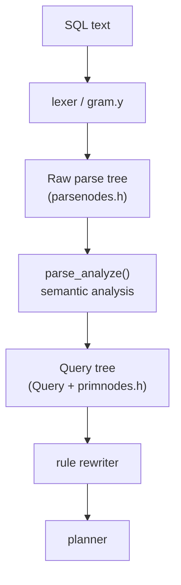
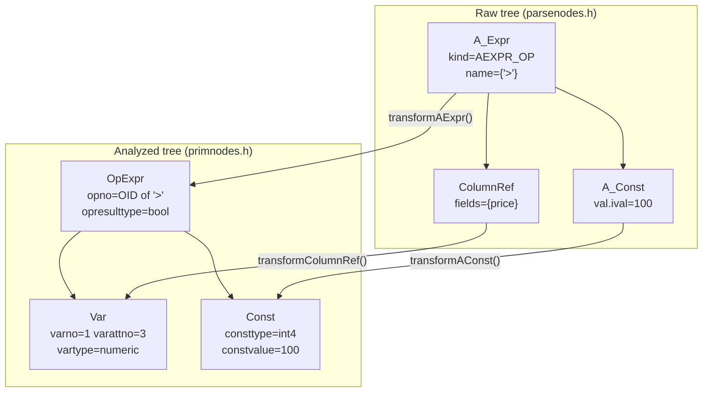

# Parse Tree Nodes

PostgreSQL's query processing pipeline operates in two distinct worlds of tree nodes, separated by the boundary between the grammar and semantic analysis. Understanding which world a node belongs to — and why — clarifies how queries move from text to execution.

## Two Worlds, One Pipeline

The grammar (`gram.y`) produces *raw nodes*: structures that faithfully represent what the user typed, using unresolved names wherever names appear. A column reference is just a list of strings. A function call is just a name and some arguments. No catalog lookups have happened yet, so no OIDs appear, no types are known, and no operators have been resolved.

Semantic analysis (parse analysis) then walks the raw tree. It produces *analyzed nodes*, also called expression nodes. These live in `primnodes.h` rather than `parsenodes.h`. An analyzed `Var` knows the exact range-table index and attribute number of the column. An analyzed `Const` carries the type OID and actual `Datum`. An `OpExpr` holds the `pg_operator` OID. This world is what the planner and executor actually consume.

The boundary is clean by design. Only the parser produces raw nodes, and only parse analysis consumes them. They never appear in a `Query` tree that has finished analysis. Analyzed nodes, conversely, never appear in the raw output of `gram.y`. The separation means each stage has a stable, well-defined input contract.



The `Query` struct itself (`parsenodes.h`) sits at the junction. Parse analysis produces it, so it counts as an analyzed structure. Its fields, though, reference both raw remnants (utility statements) and fully analyzed expression trees.

## Raw Node Types

### SELECT parse node

`SelectStmt` (`parsenodes.h`) is the top-level node for a `SELECT`. For simple queries, it is a single leaf node. For set operations (`UNION`, `INTERSECT`, `EXCEPT`), `gram.y` builds a binary tree of `SelectStmt` nodes. The `op`, `larg`, and `rarg` fields describe the structure, and `all` distinguishes `UNION` from `UNION ALL`.

Key fields of a leaf `SelectStmt`:

| Field | Type | Meaning |
|---|---|---|
| `targetList` | `List *` | output columns, each a `ResTarget` |
| `fromClause` | `List *` | FROM items (`RangeVar`, `JoinExpr`, `RangeSubselect`, …) |
| `whereClause` | `Node *` | WHERE predicate, an expression tree |
| `groupClause` | `List *` | GROUP BY expressions |
| `havingClause` | `Node *` | HAVING predicate |
| `sortClause` | `List *` | ORDER BY, list of `SortBy` nodes |
| `limitOffset` | `Node *` | OFFSET expression |
| `limitCount` | `Node *` | LIMIT/FETCH FIRST expression |
| `withClause` | `WithClause *` | CTE definitions |

### DML parse nodes

The DML statement nodes follow the same pattern: a `RangeVar` names the target relation. Each statement type also has its own fields for the statement-specific clauses. `InsertStmt` uses a nested `SelectStmt` (or NULL for `DEFAULT VALUES`) as its `selectStmt`. `UpdateStmt` carries a `targetList` of `ResTarget` nodes whose `val` fields hold the new-value expressions. All three support `returningList` for `RETURNING` clauses.

None of these nodes carry OIDs — the table name in `RangeVar.relname` is still a plain string at this stage.

### ColumnRef

`ColumnRef` (`parsenodes.h`, line 288) represents a qualified or unqualified column reference as the parser saw it. Its `fields` list contains `String` nodes for each name component, or an `A_Star` node for the `*` wildcard. A reference like `t.col` produces two `String` entries; a bare `col` produces one.

```c
typedef struct ColumnRef {
    NodeTag  type;
    List    *fields;    /* String nodes or A_Star */
    int      location;
} ColumnRef;
```

The name resolution that turns a `ColumnRef` into a `Var` — determining which range table entry and which attribute the name refers to — happens entirely in parse analysis.

### A_Expr

`A_Expr` (`parsenodes.h`, line 326) covers all infix, prefix, and postfix operator expressions the grammar recognizes. Its `name` field is a list of `String` nodes forming the possibly-schema-qualified operator name (e.g., `{"+"}` or `{"pg_catalog", "="}`) — no OID yet. The `kind` field (`A_Expr_Kind`) distinguishes plain operators from special syntax such as `BETWEEN`, `LIKE`, `IN`, and `IS DISTINCT FROM`.

```c
typedef struct A_Expr {
    NodeTag      type;
    A_Expr_Kind  kind;
    List        *name;    /* operator name as string list */
    Node        *lexpr;   /* left operand, or NULL */
    Node        *rexpr;   /* right operand, or NULL */
    int          location;
} A_Expr;
```

AND/OR/NOT expressions arrive differently: the grammar uses `BoolExpr` directly in the raw tree (which is one of the analyzed node types reused at the raw stage).

### A_Const

`A_Const` (`parsenodes.h`, line 354) holds a literal constant value. The `val` field is a tagged union (`ValUnion`) that can be an integer, float, boolean, string, or bit string. The `isnull` flag represents the SQL `NULL` literal. Unlike the analyzed `Const`, `A_Const` carries no type OID — analysis infers the type from context.

### TypeCast

`TypeCast` (`parsenodes.h`, line 367) represents an explicit `CAST(expr AS type)` or the `expr::type` shorthand. Its `arg` is the expression being cast. Its `typeName` is a `TypeName` node naming the target type as a string (e.g., `integer`, `pg_catalog.text`). Type resolution happens in analysis, not here.

### FuncCall

`FuncCall` (`parsenodes.h`, line 420) is one of the most important raw nodes because it is ambiguous in the raw tree: a `FuncCall` might become a plain `FuncExpr`, an `Aggref`, or a `WindowFunc` depending on context and catalog lookup.

```c
typedef struct FuncCall {
    NodeTag     type;
    List       *funcname;      /* possibly-qualified function name */
    List       *args;          /* argument expressions */
    List       *agg_order;     /* ORDER BY within aggregate */
    Node       *agg_filter;    /* FILTER clause */
    WindowDef  *over;          /* OVER clause */
    bool        agg_within_group;
    bool        agg_star;      /* foo(*) */
    bool        agg_distinct;
    bool        func_variadic;
    int         location;
} FuncCall;
```

The presence of `agg_order`, `agg_star`, `agg_distinct`, or `agg_filter` hints that the call is aggregate-like, but only catalog lookup during analysis confirms this.

### ResTarget

`ResTarget` (`parsenodes.h`, line 511) serves different purposes depending on context:

- In a `SELECT` target list, `name` is the optional `AS` alias and `val` is the output expression.
- In an `INSERT` column list, `name` is the destination column name.
- In an `UPDATE` target list, `name` is the destination column name and `val` is the new-value expression.

This multi-role design lets the same node type appear in all three DML contexts.

### RangeVar

`RangeVar` (`primnodes.h`, line 63) names a table or view in a FROM clause or DML target. It holds up to three name components (`catalogname`, `schemaname`, `relname`) as plain strings, an optional `alias`, and an `inh` flag indicating whether the reference should include child tables (the default for unqualified references).

Despite living in `primnodes.h`, `RangeVar` is a raw node — it carries no OID. The relation lookup that produces a range table entry happens in parse analysis.

### JoinExpr

`JoinExpr` (`primnodes.h`, line 1983) represents one JOIN in a FROM clause. Its `larg` and `rarg` are the joined subtrees (each of which can be another `JoinExpr`, a `RangeVar`, or a `RangeSubselect`). The join condition lives in either `quals` (for `ON` conditions) or `usingClause` (for `USING`). The `jointype` field distinguishes inner, left, right, full, and cross joins.

### RangeSubselect

`RangeSubselect` (`parsenodes.h`, line 612) wraps a subquery appearing in a FROM clause. It holds the untransformed `SelectStmt` and an `alias`.

### SortBy

`SortBy` (`parsenodes.h`, line 540) represents one element of an `ORDER BY` clause. Its `node` is the sort expression (which may be a column number literal, a column name `ColumnRef`, or any expression). Its `sortby_dir` and `sortby_nulls` fields encode direction and null ordering.

## The location Field

Every raw node type that references source text includes an `int location` field. This is a byte offset into the original query string, not a line number. `gram.y` stores it as soon as the grammar rule fires, using the `@N` position markers. Parse analysis preserves these offsets in the analyzed nodes it creates.

The location field's primary consumer is the error cursor mechanism: when analysis or the planner detects an error, it can call `parser_errposition(pstate, location)` to highlight the offending token in the error message output. Without location tracking, PostgreSQL could only report which query failed, not which expression within it.

## How Raw Nodes Become Analyzed Nodes

Parse analysis in `src/backend/parser/` walks the raw tree recursively, replacing each raw expression node with its analyzed counterpart. The mapping is:

| Raw node | Analyzed node(s) | Resolved by |
|---|---|---|
| `ColumnRef` | `Var` | `transformColumnRef()` — range table lookup |
| `A_Const` | `Const` | `transformAConst()` — type inference from context |
| `A_Expr` | `OpExpr`, `BoolExpr`, `ScalarArrayOpExpr` | `transformAExpr()` — operator OID lookup |
| `FuncCall` | `FuncExpr`, `Aggref`, `WindowFunc` | `transformFuncCall()` — catalog lookup + context |
| `TypeCast` | `FuncExpr` (coercion) | `transformTypeCast()` — coercion catalog lookup |

The diagram below traces the transformation of `price > 100` through the two-world boundary:



A `Var` carries `varno` (the range table index) and `varattno` (the attribute number within that relation). The `vartype` OID replaces the untyped name. An `OpExpr` carries the `pg_operator` OID (`opno`) and the result type OID. The planner fills in its underlying implementation function OID (`opfuncid`) before execution. An `Aggref` additionally carries `aggfnoid` (the `pg_proc` OID) and the type of its transition state.

## Inspecting a Real Parse Tree

Two GUCs expose raw and analyzed trees via the server log:

- **`debug_print_parse`** (`PGC_USERSET`): logs the analyzed `Query` tree after parse analysis completes, before the rewriter. Despite the name, it shows the *analyzed* tree, not the raw grammar output.
- **`debug_pretty_print`** (`PGC_USERSET`, default `true`): when enabled alongside the above, indents the tree output for readability.

```sql
SET debug_print_parse = true;
SET debug_pretty_print = true;
SELECT price FROM products WHERE price > 100;
```

The server log will contain the `Query` node with its `targetList`, `rtable`, and `jointree` fields expanded. Each `Var` node shows `varno`, `varattno`, and `vartype`. Each `OpExpr` shows `opno` and `opresulttype`. The `location` fields appear as integer byte offsets.

To see the truly raw output of `gram.y` before analysis, one must use `debug_print_parse` with `pg_parse_query()` directly (from C code), or instrument the parser with a log statement before `parse_analyze()` is called.

## See Also

- [[subsystems/parser/overview]] — how the parser fits into the broader query pipeline
- [[subsystems/parser/semantic-analysis]] — the analysis phase that transforms raw nodes into analyzed ones

## Related Topics

- [[subsystems/parser/overview|Parser Overview]] — how lexing, grammar, and parse analysis fit together as a pipeline
- [[subsystems/parser/semantic-analysis|Semantic Analysis]] — the pass that resolves names, OIDs, and types to produce analyzed nodes
- [[subsystems/planner/overview|Planner Overview]] — the planner consumes the analyzed Query tree produced from these nodes
- [[subsystems/executor/expression-eval|Expression Evaluation]] — how analyzed expression nodes (Var, OpExpr, Const) are evaluated at runtime
- [[subsystems/catalog/syscache|SysCache]] — the catalog cache used during parse analysis to resolve operator and function OIDs
- [[subsystems/catalog/relcache|RelCache]] — relation descriptor cache used when resolving RangeVar references to OIDs during analysis
