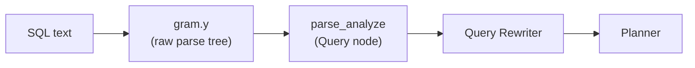

# Semantic Analysis (parse_analyze)

Semantic analysis is the third stage of query processing, sitting between the grammar parser and the rewriter. It converts a **raw parse tree** (a tree of unresolved names and tokens) into a **Query node** (a fully resolved, type-checked representation) that the rewriter and planner can consume.

## Position in the pipeline



The raw parse tree uses node types like `SelectStmt`, `ColumnRef`, `A_Const`, `FuncCall`, and `ResTarget` — all of which carry unresolved string names. The Query node uses `Var`, `Const`, `FuncExpr`, `Aggref`, `TargetEntry`, and `RangeTblEntry` — all with resolved OIDs, type information, and catalog references.

## Entry point

```c
Query *parse_analyze(RawStmt *parseTree, const char *sourceText,
                     Oid *paramTypes, int numParams,
                     QueryEnvironment *queryEnv);
```

`parse_analyze` creates a `ParseState` and sets it up. Then it calls `transformStmt`.

For queries with `$1`, `$2` parameters (prepared statements), `parse_analyze_withcontext` passes the parameter type array so it can type parameter references.

## ParseState

`ParseState` (`src/include/parser/parse_node.h`) is the working state threaded through all transform functions:

| Field | Purpose |
|---|---|
| `p_sourcetext` | Original SQL string (for error messages) |
| `p_rtable` | Range table being built (list of `RangeTblEntry`) |
| `p_joinlist` | FROM clause join list |
| `p_namespace` | Visible RTEs and their column aliases |
| `p_lateral_active` | Whether LATERAL is currently in scope |
| `p_ctenamespace` | CTEs visible to the current query level |
| `p_hasAggs` | Set to true if any aggregate is found |
| `p_hasWindowFuncs` | Set to true if any window function is found |
| `p_hasTargetSRFs` | Set to true if any set-returning function is in targetlist |
| `p_hasSubLinks` | Set to true if any subquery is found |
| `p_pre_columnref_hook` | Extension hook called before resolving a column reference |
| `p_post_columnref_hook` | Extension hook called after resolving a column reference |
| `parentParseState` | Parent ParseState for subqueries |

## transformStmt

`transformStmt` dispatches to the appropriate transform function based on the node type:

| Raw node | Transform function | Output |
|---|---|---|
| `SelectStmt` | `transformSelectStmt` / `transformSetOperationStmt` | `Query` (CMD_SELECT) |
| `InsertStmt` | `transformInsertStmt` | `Query` (CMD_INSERT) |
| `UpdateStmt` | `transformUpdateStmt` | `Query` (CMD_UPDATE) |
| `DeleteStmt` | `transformDeleteStmt` | `Query` (CMD_DELETE) |
| `MergeStmt` | `transformMergeStmt` | `Query` (CMD_MERGE) |
| Utility stmts | `transformUtilityStmt` | Utility `Query` (CMD_UTILITY) |

## Range table construction

`transformFromClause` processes the FROM clause. It calls `transformFromClauseItem` for each item:

| RTE type | Created by | `rtekind` |
|---|---|---|
| Plain table | `addRangeTableEntry` | `RTE_RELATION` |
| Subquery | `addRangeTableEntryForSubquery` | `RTE_SUBQUERY` |
| JOIN | `addRangeTableEntryForJoin` | `RTE_JOIN` |
| Function call | `addRangeTableEntryForFunction` | `RTE_FUNCTION` |
| VALUES list | `addRangeTableEntryForValues` | `RTE_VALUES` |
| CTE reference | `addRangeTableEntryForCTE` | `RTE_CTE` |

The transform functions append each `RangeTblEntry` to `p_rtable`. Range table indices (varno) start at 1.

## Column name resolution

When the analyzer encounters a `ColumnRef` node, `transformColumnRef` searches the current namespace for a matching column:

1. `refnameRangeTableEntry` finds the RTE by table alias or relation name.
2. `scanRTEForColumn` searches the RTE's column list.
3. If found, `transformColumnRef` returns a `Var` node with `varno` = RTE index and `varattno` = column number.

`transformColumnRef` tries unqualified column references against all visible RTEs in `p_namespace`. Ambiguity raises an error.

System columns (`ctid`, `xmin`, `xmax`, `cmin`, `cmax`, `tableoid`) have negative `varattno` values.

## transformExpr

`transformExpr` (`parse_expr.c`) is the recursive heart of expression analysis. It handles:

| Raw node | Result |
|---|---|
| `ColumnRef` | `Var` (resolved column reference) |
| `A_Const` | `Const` (typed constant) |
| `TypeCast` | `FuncExpr` (cast function) or `RelabelType` |
| `FuncCall` | `FuncExpr`, `Aggref`, or `WindowFunc` |
| `A_Expr` | Operator expression → `OpExpr` / `BoolExpr` / `NullTest` etc. |
| `SubLink` | `SubPlan` (deferred to planner) or `InitPlan` |
| `CaseExpr` | `CaseExpr` with typed branches |
| `ArrayExpr` | `ArrayExpr` with element type |
| `RowExpr` | `RowExpr` |
| `ParamRef` | `Param` (for `$N` references) |

`transformExpr` applies type coercion where necessary via `coerce_type` and `coerce_to_target_type`, looking up implicit cast functions in `pg_cast`.

## Aggregate detection

When `transformAggregateCall` processes a `FuncCall` that resolves to an aggregate function:

1. `transformAggregateCall` builds an `Aggref` node with the aggregate's OID, argument types, and `DISTINCT`/`ORDER BY`/`FILTER` clauses.
2. It sets `p_hasAggs` to `true`.
3. Nested aggregates raise an error immediately.
4. `transformAggregateCall` places the `Aggref` in the target list. The planner will later insert an `Agg` node.

## Window function detection

`transformWindowFuncCall` is similar but builds a `WindowFunc` node and sets `p_hasWindowFuncs`. Window functions reference a `WindowClause` by name or inline definition.

## Output: the Query node

The finished `Query` node contains:

| Field | Content |
|---|---|
| `commandType` | CMD_SELECT / CMD_INSERT / CMD_UPDATE / CMD_DELETE |
| `rtable` | List of `RangeTblEntry` |
| `jointree` | `FromExpr` with `fromlist` (RTEs/JoinExprs) and `quals` (WHERE) |
| `targetList` | List of `TargetEntry` (SELECT columns or SET assignments) |
| `groupClause` | List of `SortGroupClause` |
| `havingQual` | HAVING expression |
| `windowClause` | List of `WindowClause` |
| `sortClause` | ORDER BY |
| `limitCount` / `limitOffset` | LIMIT / OFFSET |
| `cteList` | List of `CommonTableExpr` |
| `hasAggs` / `hasWindowFuncs` | Flags set during transform |

## See also

- [[subsystems/parser/overview]] — the grammar and raw parse tree
- [[subsystems/rewriter/overview]] — the rewriter that processes the Query node next
- [[subsystems/planner/overview]] — the planner that consumes the rewritten Query
- [[subsystems/executor/expression-eval]] — how Expr trees from the Query are evaluated at runtime
