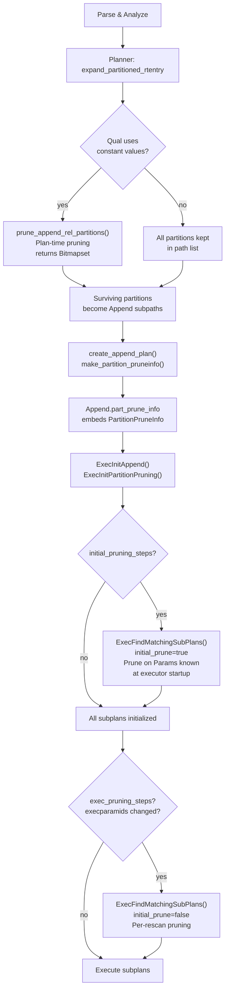
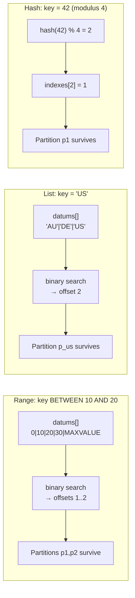
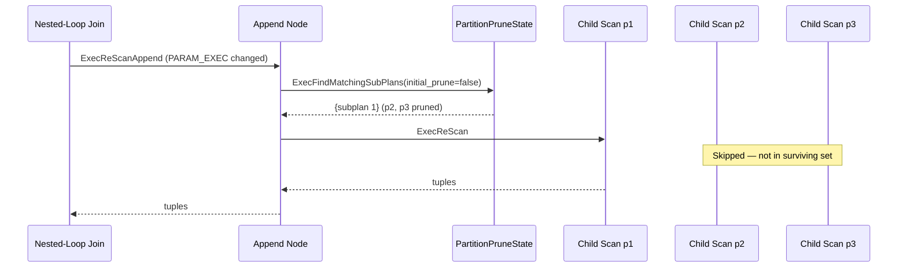

# Partition Pruning

Partition pruning is the mechanism PostgreSQL uses to eliminate child partitions from a query plan or execution. It applies this when it can prove those partitions cannot contain any rows that satisfy the query's predicates. Rather than scanning every partition unconditionally, the planner and executor evaluate the WHERE clause against each partition's bounds and discard those with disjoint key ranges. On a table with hundreds of partitions, a well-pruned plan may touch only one or two, turning a full-table sequential scan into a narrow targeted read.

`src/backend/partitioning/partprune.c` implements pruning entirely. The GUC `enable_partition_pruning` controls it. Pruning operates in two distinct phases with different points in the query lifecycle.

## Pruning Phases Overview



## Plan-Time Pruning (Static)

Plan-time pruning runs entirely inside the planner, before the planner produces a `PlannedStmt`. Its entry point is `prune_append_rel_partitions()` (`partprune.c`), called from `expand_partitioned_rtentry()` in `src/backend/optimizer/util/inherit.c`.

The function receives a `RelOptInfo` for the partitioned relation and inspects `rel->baserestrictinfo` — the list of restriction clauses derived from the WHERE clause. It returns a `Bitmapset` of surviving partition indexes (positions in `rel->part_rels[]`). The planner never adds partitions outside the set to the path list. As a result, the Append or MergeAppend node it builds has fewer children from the start.

Plan-time pruning applies only when the comparison value is a constant at plan time — a `Const` node, or an expression that folds to one after `eval_const_expressions()`. Simplification folds stable functions called with constant arguments, so they qualify. Volatile functions (e.g. `random()`) and expressions involving `Var` nodes from other relations are not usable.

```
/* simplified call path */
expand_partitioned_rtentry()          /* inherit.c */
  → prune_append_rel_partitions(rel)  /* partprune.c */
      → gen_partprune_steps(rel, clauses, PARTTARGET_PLANNER, &gcontext)
      → get_matching_partitions(&context, pruning_steps)
          → perform_pruning_base_step()   /* one per PartitionPruneStepOp */
              → get_matching_{range,list,hash}_bounds()
```

### GeneratePruningStepsContext

`gen_partprune_steps()` fills a `GeneratePruningStepsContext` before handing off to the recursive `gen_partprune_steps_internal()`:

| Field | Type | Meaning |
|---|---|---|
| `rel` | `RelOptInfo *` | The partitioned relation being pruned |
| `target` | `PartClauseTarget` | Which phase this step generation targets |
| `steps` | `List *` | Output list of `PartitionPruneStep` nodes |
| `has_mutable_op` | `bool` | Any stable operator found in useful clauses |
| `has_mutable_arg` | `bool` | Any mutable comparison value (not exec params) |
| `has_exec_param` | `bool` | Any `PARAM_EXEC` found in useful clauses |
| `contradictory` | `bool` | Clauses provably contradict each other; prune all |
| `next_step_id` | `int` | Counter for assigning step IDs |

`PartClauseTarget` is an enum controlling which expressions are usable:

| Value | Meaning |
|---|---|
| `PARTTARGET_PLANNER` | Only constants; used during plan-time pruning |
| `PARTTARGET_INITIAL` | Params known at executor startup (e.g. `$1` in prepared statements) |
| `PARTTARGET_EXEC` | `PARAM_EXEC` params that change per rescan (nested-loop parameters) |

### PartClauseInfo

Each WHERE clause that can be matched to a partition key column is distilled into a `PartClauseInfo`:

| Field | Type | Meaning |
|---|---|---|
| `keyno` | `int` | Partition key column index (0-based) |
| `opno` | `Oid` | Operator OID used in the comparison |
| `op_is_ne` | `bool` | True if the original operator was `<>` |
| `expr` | `Expr *` | The right-hand side expression being compared |
| `cmpfn` | `Oid` | OID of the comparison support function |
| `op_strategy` | `int` | Btree strategy number for the operator |

`match_clause_to_partition_key()` is the workhorse that translates a single clause into a `PartClauseInfo`. It handles `OpExpr`, `NullTest`, `ScalarArrayOpExpr` (IN lists), and `BoolExpr` (OR/AND). The function returns a `PartClauseMatchStatus`:

| Status | Meaning |
|---|---|
| `PARTCLAUSE_NOMATCH` | Clause is irrelevant to partition key |
| `PARTCLAUSE_MATCH_CLAUSE` | Normal match; `*pc` filled |
| `PARTCLAUSE_MATCH_NULLNESS` | IS NULL / IS NOT NULL matched to key |
| `PARTCLAUSE_MATCH_STEPS` | Clause decomposed into sub-steps (IN list, OR) |
| `PARTCLAUSE_MATCH_CONTRADICT` | Clause provably contradicts partition bounds |
| `PARTCLAUSE_UNSUPPORTED` | Clause form not supported for pruning |

## Pruning Steps

Pruning steps are the intermediate representation between raw qual clauses and the final partition bitmap. There are two concrete step types, both extending the abstract `PartitionPruneStep` (which carries only a `step_id`):

### PartitionPruneStepOp

`PartitionPruneStepOp` represents a test on one or more partition key columns using a btree comparison operator. The planner generates it from `OpExpr` and `ScalarArrayOpExpr` clauses:

| Field | Type | Meaning |
|---|---|---|
| `step.step_id` | `int` | Globally unique step ID within this pruning context |
| `opstrategy` | `StrategyNumber` | Btree strategy (`BTLessStrategyNumber`, `BTEqualStrategyNumber`, etc.) |
| `exprs` | `List *` | Comparison expressions (one per key column covered) |
| `cmpfns` | `List *` | OIDs of comparison functions parallel to `exprs` |
| `nullkeys` | `Bitmapset *` | Key column indexes matched to IS NULL (hash only) |

### PartitionPruneStepCombine

`PartitionPruneStepCombine` represents a Boolean combinator over the results of prior steps:

| Field | Type | Meaning |
|---|---|---|
| `step.step_id` | `int` | Step ID |
| `combineOp` | `PartitionPruneCombineOp` | `PARTPRUNE_COMBINE_UNION` (OR) or `PARTPRUNE_COMBINE_INTERSECT` (AND) |
| `source_stepids` | `List *` | IDs of the input steps whose results to combine |

AND clauses produce `PARTPRUNE_COMBINE_INTERSECT` steps; OR clauses produce `PARTPRUNE_COMBINE_UNION` steps. A top-level AND list with multiple steps produces a final combine step intersecting all of them.

## Strategy-Specific Bound Matching

### Range Partitioning

`get_matching_range_bounds()` receives a `StrategyNumber` and an array of `Datum` values (one per key column covered by the clause). It performs a binary search over `PartitionBoundInfo.datums[]` using `partition_range_datum_bsearch()` to find `[minoff, maxoff]` — the inclusive range of bound offsets whose intervals overlap the query predicate.

For a predicate `key = 5`:
1. Binary-search for the lower bound that includes 5: find the first datum strictly greater than 5, then step back one.
2. The single interval between that bound and its successor contains the matching rows.
3. The default partition is included only if the value falls outside all defined intervals.

For inequality predicates (`key > 5`, `key < 10`), `get_matching_range_bounds()` widens the range of offsets accordingly, including all intervals up to the appropriate sentinel.

### List Partitioning

`get_matching_list_bounds()` uses `partition_list_bsearch()` — a binary search over the sorted list of discrete values in `PartitionBoundInfo.datums[]`. Each entry maps to a single partition via `boundinfo->indexes[]`.

- For equality (`key = 'US'`): binary search returns the exact offset, yielding at most one partition.
- For inequality (`key <> 'US'`): `get_matching_list_bounds()` returns every partition except the matching one, plus the default partition.
- For `IS NULL`: it returns the null partition (`boundinfo->null_index`) if one exists.

List partitioning always has `partnatts = 1`. PostgreSQL does not support multi-column list partitions.

### Hash Partitioning

`get_matching_hash_bounds()` can only prune under equality conditions where the query supplies values for all partition key columns. The function computes:

```c
rowHash = compute_partition_hash_value(partnatts, partsupfunc,
                                       partcollation, values, isnull);
greatest_modulus = boundinfo->nindexes;
partition_index = partindices[rowHash % greatest_modulus];
```

If `partindices[rowHash % greatest_modulus]` is non-negative, only that one partition survives. If the query supplies fewer values than there are key columns (partial equality), the function returns all valid offsets — no pruning is possible. Hash partitioning has no default partition and no NULL partition.



## PruneStepResult

Each base step produces a `PruneStepResult` that carries:

| Field | Type | Meaning |
|---|---|---|
| `bound_offsets` | `Bitmapset *` | Set of `datums[]` offsets whose partition is selected |
| `scan_default` | `bool` | Include the default partition in the result |
| `scan_null` | `bool` | Include the null-key partition in the result |

`get_matching_partitions()` iterates through the step list in order, executing each base step via `perform_pruning_base_step()` and each combine step via `perform_pruning_combine_step()`. `get_matching_partitions()` translates the final combine step's result from bound offsets to a `Bitmapset` of partition indexes. It returns that `Bitmapset` to the caller.

## Plan Representation: PartitionPruneInfo

Plan-time pruning removes partitions from the path list before the planner builds the plan. Execution-time pruning requires embedding the pruning logic in the plan tree so the executor can evaluate it. PostgreSQL embeds this via `PartitionPruneInfo`, attached to `Append` and `MergeAppend` plan nodes:

```c
/* plannodes.h */
typedef struct Append {
    Plan    plan;
    ...
    struct PartitionPruneInfo *part_prune_info;  /* NULL if no run-time pruning */
} Append;
```

`create_append_plan()` and `create_merge_append_plan()` in `createplan.c` call `make_partition_pruneinfo()` (`partprune.c`). It builds the `PartitionPruneInfo` by calling `gen_partprune_steps()` twice — once with `PARTTARGET_INITIAL` to find steps safe to run at executor startup, and once with `PARTTARGET_EXEC` to find steps that must be re-evaluated on every rescan. If neither pass produces any steps, the function returns NULL. The plan node then has no pruning state.

### PartitionPruneInfo

```c
typedef struct PartitionPruneInfo {
    List      *prune_infos;      /* List of Lists of PartitionedRelPruneInfo */
    Bitmapset *other_subplans;   /* Subplans not covered by any hierarchy */
} PartitionPruneInfo;
```

`prune_infos` is a list of lists because a single Append node may have children from multiple independent partition hierarchies (e.g. a UNION ALL combining two partitioned tables). Each inner list represents one hierarchy, with `PartitionedRelPruneInfo` nodes ordered from topmost partitioned table down to leaf level.

### PartitionedRelPruneInfo

`PartitionedRelPruneInfo` has one node per partitioned table level. For a two-level hierarchy (monthly partitions, each sub-partitioned by region), the inner list has two `PartitionedRelPruneInfo` nodes.

| Field | Type | Meaning |
|---|---|---|
| `rtindex` | `Index` | Range table index of this partitioned rel |
| `present_parts` | `Bitmapset *` | Partition indexes with live subplans or sub-parts |
| `nparts` | `int` | Length of `subplan_map[]`, `subpart_map[]`, `relid_map[]` |
| `subplan_map[]` | `int[nparts]` | For leaf partition `p`: zero-based subplan index, or -1 |
| `subpart_map[]` | `int[nparts]` | For non-leaf partition `p`: index into this hierarchy's list, or -1 |
| `relid_map[]` | `Oid[nparts]` | Partition OID at index `p`, or 0 if pruned at plan time |
| `initial_pruning_steps` | `List *` | Steps to run at executor startup (no `PARAM_EXEC`) |
| `exec_pruning_steps` | `List *` | Steps to run on each rescan (uses `PARAM_EXEC`) |
| `execparamids` | `Bitmapset *` | All `PARAM_EXEC` IDs referenced in `exec_pruning_steps` |

## Execution-Time Pruning (Dynamic)

Execution-time pruning operates in two sub-phases: *initial* pruning at executor startup, and *per-rescan* pruning during execution.

### Executor Startup: Initial Pruning

`ExecInitAppend()` calls `ExecInitPartitionPruning()` (`execPartition.c`) when `plan->part_prune_info` is non-NULL. This function:

1. Allocates a `PartitionPruneState` with contexts for each partitioned level.
2. Calls `ExecFindMatchingSubPlans(prunestate, initial_prune=true)` if `do_initial_prune` is set.
3. Returns a `Bitmapset` of surviving subplan indexes.

`ExecInitAppend()` initializes only subplans whose index is in the surviving set (it starts their child plan nodes). This matters for performance: an unopened index scan or sort node consumes no resources.

Initial pruning applies to parameters that are bound before scanning starts — specifically `PARAM_EXTERN` parameters from a prepared statement's bind phase. A query like:

```sql
PREPARE q(date) AS SELECT * FROM measurements WHERE day = $1;
EXECUTE q('2024-06-01');
```

will prune all partitions except the one containing June 2024 at executor startup, before opening a single child scan.

### Per-Rescan: Exec Pruning

When a nested-loop join's inner side is a partitioned table, the join parameter changes for each outer row. The `PARAM_EXEC` carrying the join parameter appears in `exec_pruning_steps`. `prunestate->execparamids` tracks which parameter IDs matter.

`ExecReScanAppend()` calls `ExecFindMatchingSubPlans(prunestate, initial_prune=false)` when any parameter in `execparamids` has changed (detected via `bms_overlap(chgParam, prunestate->execparamids)`). `ExecFindMatchingSubPlans()` updates the surviving subplan set. The Append node then skips children not in the new set.



### PartitionPruneState

The executor's working state for pruning. Allocated by `ExecInitPartitionPruning()`:

| Field | Type | Meaning |
|---|---|---|
| `execparamids` | `Bitmapset *` | Union of all `execparamids` from all levels |
| `do_initial_prune` | `bool` | At least one level has `initial_pruning_steps` |
| `do_exec_prune` | `bool` | At least one level has `exec_pruning_steps` |
| `prune_context` | `MemoryContext` | Short-lived context for each pruning pass |
| `num_partprunedata` | `int` | Length of `partprunedata[]` |
| `partprunedata` | `PartitionPruningData[]` | Per-level state including context and maps |

## IN Lists and OR Clauses

### IN Lists (ScalarArrayOpExpr)

The parser parses `WHERE key IN (1, 2, 3)` as a `ScalarArrayOpExpr` with `useOr = true`. `match_clause_to_partition_key()` expands the array elements into individual equality clauses. If the array is a compile-time constant, it matches each element independently and combines their results with `PARTPRUNE_COMBINE_UNION`. This correctly handles list and range partitions: each IN value independently selects its partition(s). The union is the set of all partitions that could hold any of the values.

For `NOT IN` (`<> ANY(array)`), `match_clause_to_partition_key()` uses the negated operator. If it finds the negator in the partition's operator family, the result is all partitions except the ones excluded by each element — intersected rather than unioned.

### OR Clauses (BoolExpr)

`WHERE key = 1 OR key = 5` is an `OR_EXPR` `BoolExpr`. `gen_partprune_steps_internal()` processes each argument recursively and collects their step IDs into a `PARTPRUNE_COMBINE_UNION` step. The result is the union of the partition sets matching any branch of the OR.

`AND` clauses (explicit `AND_EXPR` or the implicit AND across the WHERE clause list) produce `PARTPRUNE_COMBINE_INTERSECT` steps, narrowing the result to only partitions that satisfy all branches simultaneously.

## PartitionBoundInfo and Bound Storage

PostgreSQL stores partition bounds in `pg_class.relpartbound` as a serialized `PartitionBoundSpec` node per child partition. When the planner or executor needs to prune, it reads the per-relation `PartitionDesc`, which contains the in-memory `PartitionBoundInfo` (`src/include/partitioning/partbounds.h`):

| Field | Meaning |
|---|---|
| `strategy` | `'r'` / `'l'` / `'h'` |
| `ndatums` | Number of entries in `datums[]` |
| `datums[]` | Array of bound datums; for RANGE: lower bound per partition; for LIST: all discrete values |
| `kind[]` | For RANGE: `MINVALUE`, `MAXVALUE`, or value datum per bound |
| `indexes[]` | Maps bound offsets to partition indexes; for HASH: indexed by `hash % greatest_modulus` |
| `nindexes` | Length of `indexes[]` |
| `null_index` | Partition accepting NULL key values, or −1 |
| `default_index` | Default partition index, or −1 |

For RANGE, `datums[]` stores the lower bounds of each partition in sorted order. `indexes[]` has `ndatums + 1` entries: one slot per interval between adjacent bounds, plus a sentinel slot at each end. `indexes[i]` is the partition that owns the half-open interval `[datums[i-1], datums[i])`.

The default partition complicates pruning: when no explicit partition covers a key value, the planner or executor must include the default partition. Pruning code sets `PruneStepResult.scan_default` when it cannot rule out the default partition.

## enable_partition_pruning GUC

```
enable_partition_pruning = on   (default)
```

Setting `enable_partition_pruning = off` disables both plan-time and execution-time pruning. `prune_append_rel_partitions()` returns all partitions unconditionally. `make_partition_pruneinfo()` returns NULL, so the plan embeds no `PartitionPruneInfo`. The GUC carries the `GUC_EXPLAIN` tag, so `EXPLAIN` output includes its current value when settings are shown.

Disabling pruning is occasionally useful for debugging unexpected plan changes, or for comparing benchmark results across partition counts without pruning interfering.

## EXPLAIN Output

`EXPLAIN (ANALYZE)` reports pruned subplans via `ExplainMissingMembers()` in `explain.c`, which calls `ExplainPropertyInteger("Subplans Removed", ...)` with the count of children that pruning eliminated:

```
Append  (cost=0.00..12.50 rows=200 width=8)
  Subplans Removed: 11
  ->  Seq Scan on measurements_y2024m06 ...
```

In text format, `Subplans Removed: N` appears immediately after the Append node line when execution-time pruning removed at least one subplan. In JSON/YAML/XML formats, `EXPLAIN` always emits the property (even when zero) as `"Subplans Removed": N`.

Plan-time pruning is invisible in the plan text. Partitions eliminated before the planner builds the plan simply do not appear as children of the Append node. Only execution-time pruning generates the "Subplans Removed" annotation — this happens when the planner builds the plan with all partitions, but the executor skips some at runtime.

Example: a table with monthly partitions, pruned to a single month by a constant predicate:

```sql
EXPLAIN SELECT * FROM measurements WHERE day = '2024-06-15';

Seq Scan on measurements_y2024m06 measurements
  Filter: (day = '2024-06-15'::date)
```

The Append node disappears entirely when plan-time pruning reduces the partition count to one, because `create_append_plan()` flattens a single-child Append.

## Interaction with Partition-Wise Join and Aggregate

Partition pruning and partition-wise join interact in a layered way. The planner first prunes the partition set of each individual relation using `prune_append_rel_partitions()`. It then evaluates `try_partitionwise_join()` on the surviving partitions only. The planner skips partition pairs where pruning removed either side entirely.

Partition-wise aggregate follows the same pattern: the planner pushes aggregation down to per-partition subqueries. It may independently prune each subquery if the GROUP BY or HAVING clause touches the partition key.

The `GeneratePruningStepsContext.has_exec_param` flag also matters here: if `exec_pruning_steps` exist, the executor needs to re-prune on every rescan of the inner side of a nested loop. This re-pruning interacts with partition-wise join by potentially disabling different inner-side children on each outer row, effectively making the join adaptive to the data distribution.

## Call Path Reference

| Phase | Entry point | Location | Triggered by |
|---|---|---|---|
| Plan-time | `prune_append_rel_partitions()` | `partprune.c` | `expand_partitioned_rtentry()` in `inherit.c` |
| Plan embedding | `make_partition_pruneinfo()` | `partprune.c` | `create_append_plan()` in `createplan.c` |
| Executor init | `ExecInitPartitionPruning()` | `execPartition.c` | `ExecInitAppend()` |
| Initial prune | `ExecFindMatchingSubPlans(true)` | `execPartition.c` | Called from `ExecInitPartitionPruning()` |
| Per-rescan | `ExecFindMatchingSubPlans(false)` | `execPartition.c` | `ExecReScanAppend()` when `chgParam` overlaps `execparamids` |

## See Also

- [[subsystems/partitioning/overview]] — declarative partitioning overview, partition bounds, routing
- [[subsystems/planner/overview]] — how the planner builds Append paths and RelOptInfo hierarchies
- [[subsystems/executor/overview]] — executor framework, PlanState, rescan protocol
- [[code-paths/simple-select]] — full SELECT execution path from parser to tuple output

## Related Topics

- [[subsystems/partitioning/overview|Partitioning Overview]] — declarative partitioning, bound definitions, and routing logic that pruning depends on
- [[subsystems/planner/cost-model|Cost Model]] — how partition count after pruning affects the planner's cost estimates
- [[subsystems/planner/statistics|Statistics]] — per-partition statistics used alongside pruning for selectivity estimation
- [[subsystems/executor/parallel|Parallel Query]] — interaction between pruning and parallel Append plans
- [[subsystems/executor/joins|Hash Join / Nested Loop]] — nested-loop parameters that trigger per-rescan exec pruning
- [[subsystems/catalog/pg-class|pg_class]] — where partition bound specs are stored (relpartbound column)
