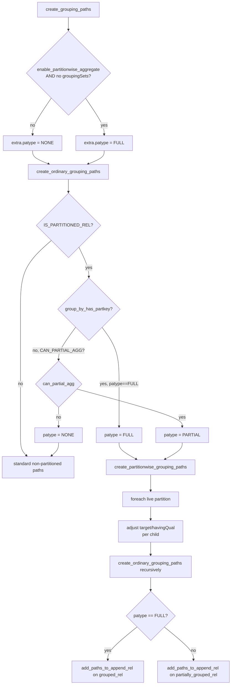

# Partition-wise Aggregation

Partition-wise aggregation is a query planning optimization that pushes aggregate operations down to individual partitions of a partitioned table instead of aggregating all rows at once. When enabled, each partition computes its own aggregate results. The planner then assembles a final answer by appending (full mode) or combining partial states (partial mode) across partitions. This allows partition pruning and parallel query to interact more naturally with aggregation — pruned partitions contribute nothing, and parallel workers can each cover distinct partitions.

## The GUC: `enable_partitionwise_aggregate`

```sql
SET enable_partitionwise_aggregate = on;  -- default: off
```

The `PGC_USERSET` GUC `enable_partitionwise_aggregate`, declared in `src/backend/utils/misc/guc_tables.c` (line 964), controls this behavior. PostgreSQL stores its value in the global `bool enable_partitionwise_aggregate` (defined in `src/backend/optimizer/path/costsize.c`). The GUC carries the `GUC_EXPLAIN` flag, meaning `EXPLAIN` reports its effective value.

The default is `off` because partition-wise aggregation is not always a win. When groups span many partitions (many small groups, partial mode), the overhead of re-combining partial states can exceed the savings.

## Two Operating Modes

The planner selects one of three values for `PartitionwiseAggregateType` (`src/include/nodes/pathnodes.h`, line 3220):

| Enum value | Meaning |
|---|---|
| `PARTITIONWISE_AGGREGATE_NONE` | Feature disabled or inapplicable |
| `PARTITIONWISE_AGGREGATE_FULL` | Each partition is fully aggregated; results combined with `Append` only |
| `PARTITIONWISE_AGGREGATE_PARTIAL` | Each partition produces partial state; a top-level `FinalizeAggregate` combines them |

### Full Partition-wise Aggregate

Full mode applies when the `GROUP BY` clause covers all partition key columns (same expressions, same collations). Because the partition key appears in the `GROUP BY`, every row that belongs to a given group is guaranteed to reside in a single partition. Partitions are therefore fully disjoint with respect to groups — no cross-partition merging is required.

Plan shape:

```
Aggregate (optional final rollup / HAVING)
  Append
    Aggregate  ← partition 1
      Seq Scan on t_p1
    Aggregate  ← partition 2
      Seq Scan on t_p2
    ...
```

The planner omits the top-level `Aggregate` when there is no `HAVING` and the query needs no post-Append work.

### Partial Partition-wise Aggregate

Partial mode applies when the `GROUP BY` does not include all partition keys (or includes none at all), provided the aggregate functions in use support partial aggregation. Each partition runs a `PartialAggregate` step (`AGGSPLIT_INITIAL_SERIAL`) which serializes the transition state. An `Append` collects rows from all partitions. A single `FinalizeAggregate` step (`AGGSPLIT_FINAL_DESERIAL`) deserializes and combines all partial states.

Plan shape:

```
Finalize Aggregate
  Append
    Partial Aggregate  ← partition 1
      Seq Scan on t_p1
    Partial Aggregate  ← partition 2
      Seq Scan on t_p2
    ...
```

The `AggSplit` enum (`src/include/nodes/nodes.h`, line 384) encodes which phase each `Agg` node performs:

| `AggSplit` value | Bit flags | Role |
|---|---|---|
| `AGGSPLIT_SIMPLE` | 0 | Non-split, single-phase aggregation |
| `AGGSPLIT_INITIAL_SERIAL` | `SKIPFINAL \| SERIALIZE` | Partial: compute transition state, serialize output |
| `AGGSPLIT_FINAL_DESERIAL` | `COMBINE \| DESERIALIZE` | Finalize: deserialize and apply combine function |

## Planner Path

### Entry: `create_grouping_paths`

`create_grouping_paths` (`planner.c`, line 3748) is called from `grouping_planner` to build the `UPPERREL_GROUP_AGG` relation. Before delegating to `create_ordinary_grouping_paths`, it sets the initial `patype` in `GroupPathExtraData`:

```c
if (enable_partitionwise_aggregate && !parse->groupingSets)
    extra.patype = PARTITIONWISE_AGGREGATE_FULL;   /* optimistic; may downgrade */
else
    extra.patype = PARTITIONWISE_AGGREGATE_NONE;
```

The planner unconditionally excludes grouping sets from partition-wise aggregate: the executor does not support partial-mode grouping sets, and the disjointness argument for full mode does not hold across rollup levels.

### Decision: `create_ordinary_grouping_paths`

`create_ordinary_grouping_paths` (`planner.c`, line 3999) refines the mode for each relation it encounters (the function is called recursively for each child partition):

```c
if (extra->patype != PARTITIONWISE_AGGREGATE_NONE &&
    IS_PARTITIONED_REL(input_rel))
{
    if (extra->patype == PARTITIONWISE_AGGREGATE_FULL &&
        group_by_has_partkey(input_rel, extra->targetList,
                             root->parse->groupClause))
        patype = PARTITIONWISE_AGGREGATE_FULL;
    else if ((extra->flags & GROUPING_CAN_PARTIAL_AGG) != 0)
        patype = PARTITIONWISE_AGGREGATE_PARTIAL;
    else
        patype = PARTITIONWISE_AGGREGATE_NONE;
}
```

`create_ordinary_grouping_paths` uses `parse->groupClause` (the original, un-simplified clause) rather than `root->processed_groupClause`. This is intentional: a partition key column that was proven redundant by constraint exclusion is still in `groupClause`. The check must see it to validate the full-mode condition.

The `GroupPathExtraData` struct (`pathnodes.h`, line 3240) carries all necessary context across recursive calls:

| Field | Type | Purpose |
|---|---|---|
| `flags` | `int` | Bitmask: `GROUPING_CAN_USE_SORT`, `_HASH`, `_PARTIAL_AGG` |
| `partial_costs_set` | `bool` | Whether `agg_partial_costs`/`agg_final_costs` are initialized |
| `agg_partial_costs` | `AggClauseCosts` | Cost estimates for partial phase |
| `agg_final_costs` | `AggClauseCosts` | Cost estimates for finalize phase |
| `target_parallel_safe` | `bool` | Whether the output target is parallel-safe |
| `havingQual` | `Node *` | Per-partition translated `HAVING` qual |
| `targetList` | `List *` | Per-partition translated target list |
| `patype` | `PartitionwiseAggregateType` | Mode passed from parent to child |

### Partition Key Check: `group_by_has_partkey`

`group_by_has_partkey` (`planner.c`, line 7980) iterates over all `partnatts` columns of the partition scheme. For each partition key column it walks the `partexprs[i]` list and checks whether any entry is structurally equal (`equal()`) to some expression in the translated `groupClause`. A mismatch on collation (`partcollation[i]` vs `exprCollation`) causes an immediate `false` return — collation affects sort order and therefore partition membership.

### Per-partition Work: `create_partitionwise_grouping_paths`

`create_partitionwise_grouping_paths` (`planner.c`, line 7836) iterates over `input_rel->live_parts` (the Bitmapset of non-pruned partitions). For each live partition `i`:

1. Fetch `child_input_rel = input_rel->part_rels[i]`.
2. Skip dummy relations (`IS_DUMMY_REL`) — these arise from constraint exclusion/pruning.
3. Translate `havingQual` and `targetList` through `adjust_appendrel_attrs` to reference the child's columns.
4. Set `child_extra.patype = patype` (the resolved mode, not the parent's optimistic `FULL`).
5. Call `create_ordinary_grouping_paths` recursively on the child — this is what makes the feature compositional with multi-level partitioning and parallel paths.
6. Collect per-partition `child_grouped_rel` (full mode) or `child_partially_grouped_rel` (partial mode).

After the loop:

- **Full mode**: `add_paths_to_append_rel(root, grouped_rel, grouped_live_children)` — the final plan is an `Append` of fully-aggregated child rels.
- **Partial mode**: `add_paths_to_append_rel(root, partially_grouped_rel, partially_grouped_live_children)` — the final plan feeds an `Append` of partially-aggregated results into a finalize step.

## Conditions that Block Partial Aggregation

`can_partial_agg` (`planner.c`, line 7559) blocks partial (and therefore partial partition-wise aggregate) when:

| Condition | `PlannerInfo` field | Reason |
|---|---|---|
| No aggregates and no `GROUP BY` | `!parse->hasAggs && parse->groupClause == NIL` | Nothing to split |
| Grouping sets present | `parse->groupingSets` | Executor does not support partial grouping sets |
| Any aggregate lacks partial mode | `root->hasNonPartialAggs` | No `combinefn` registered for the aggregate |
| Any partial state is non-serializable | `root->hasNonSerialAggs` | Cannot pass state across worker/partition boundaries |

Additionally, `root->numOrderedAggs > 0` blocks hash aggregation (`GROUPING_CAN_USE_HASH`) but does **not** block partial aggregation per se; however, ordered-set aggregates (`WITHIN GROUP`) are counted in `numOrderedAggs` and `hasNonPartialAggs`, which means they transitively block partial mode and therefore block partial partition-wise aggregate.

`DISTINCT` aggregates (`count(DISTINCT x)`) also increment `numOrderedAggs` and set `hasNonPartialAggs`, blocking both hash aggregation and partial/partition-wise aggregate.

## Interaction with Partition Pruning

Partition pruning runs before aggregation path generation. Either the planner leaves pruned partitions absent from `input_rel->live_parts` (static pruning at plan time), or constraint exclusion marks them as dummy relations (`IS_DUMMY_REL`). `create_partitionwise_grouping_paths` skips dummy children explicitly (line 7870), so pruned partitions contribute zero aggregate paths. This means partition-wise aggregation and partition pruning compose cleanly: a query with a `WHERE` clause on the partition key will both skip pruned partitions and push aggregation into each remaining partition.

## Interaction with Parallel Query

The planner can combine partition-wise aggregation with parallel workers. When `grouped_rel->consider_parallel` is true and child input rels have `partial_pathlist` entries, `create_ordinary_grouping_paths` generates partial paths for each partition. `create_partitionwise_grouping_paths` collects these as `partial_pathlist` entries on `child_partially_grouped_rel`. The standard `gather_grouping_paths` / `generate_useful_gather_paths` machinery then wraps them in `Gather` nodes. The resulting plan can look like:

```
Finalize Aggregate
  Gather
    Partial Aggregate        ← worker 1, partition 1
      Parallel Seq Scan on t_p1
    Partial Aggregate        ← worker 2, partition 2
      Parallel Seq Scan on t_p2
```

The key invariant is that the planner calls `create_ordinary_grouping_paths` for each child with no special-casing of parallel paths. The same logic that generates parallel paths for a non-partitioned table applies recursively to each partition.

## EXPLAIN Output

### Full mode (`GROUP BY` includes partition key)

```sql
SET enable_partitionwise_aggregate = on;

EXPLAIN SELECT region, sum(amount)
FROM orders  -- partitioned by region
GROUP BY region;
```

```
HashAggregate (or GroupAggregate)
  Append
    HashAggregate
      Seq Scan on orders_north
    HashAggregate
      Seq Scan on orders_south
    HashAggregate
      Seq Scan on orders_east
```

Each partition node is a complete `Aggregate`. `Append` concatenates the results.

### Partial mode (`GROUP BY` does not include partition key)

```sql
EXPLAIN SELECT year, sum(amount)
FROM orders  -- partitioned by region, not year
GROUP BY year;
```

```
Finalize GroupAggregate
  Sort
    Append
      Partial HashAggregate
        Seq Scan on orders_north
      Partial HashAggregate
        Seq Scan on orders_south
      Partial HashAggregate
        Seq Scan on orders_east
```

Each partition produces `Partial` aggregate rows. A single `Finalize` node at the top combines them.

## Planner Flow (Mermaid)



## Limitations

| Limitation | Root cause |
|---|---|
| `GROUP BY` must include all partition key columns for full mode | `group_by_has_partkey` requires every `partexprs[i]` column to appear in `groupClause` |
| Grouping sets (`ROLLUP`, `CUBE`, `GROUPING SETS`) are always excluded | `!parse->groupingSets` guard in `create_grouping_paths`; partial grouping sets unsupported in executor |
| `DISTINCT` aggregates (`count(DISTINCT x)`) block partial mode | Set `hasNonPartialAggs` / increment `numOrderedAggs` |
| Ordered-set aggregates (`percentile_cont`, `mode`, etc.) block partial mode | Registered as non-partial aggregates (`hasNonPartialAggs`) |
| Non-serializable aggregate state blocks partial mode | `hasNonSerialAggs` — state cannot be passed across process/partition boundaries |
| Collation mismatch between partition key and `GROUP BY` expression | `group_by_has_partkey` returns `false` on OID mismatch |
| Multi-level partitioning requires each level to satisfy its own check | Recursive `create_ordinary_grouping_paths` applies the same logic at each level |

## See also

- [[subsystems/partitioning/overview]]
- [[subsystems/partitioning/partition-wise-join]]
- [[subsystems/partitioning/partition-pruning]]
- [[subsystems/executor/aggregate]]
