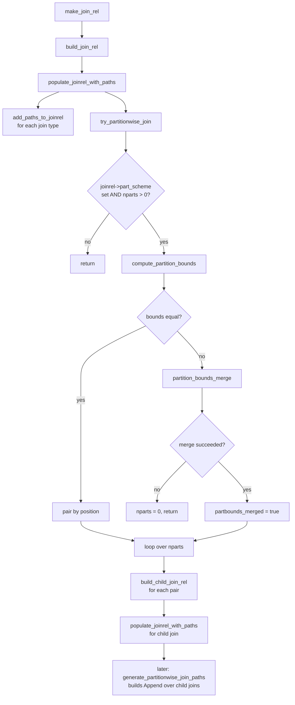

# Partition-wise Join

Partition-wise join is a query planning technique in which PostgreSQL breaks down a join between two compatibly partitioned relations into a set of smaller joins, one per pair of matching partitions. Rather than materialising the full outer relation and the full inner relation before joining them, the planner creates an independent Join node for each partition pair. It then combines the results with an `Append` node. The join keys are a subset of the partition keys, so every row from partition `P_i` of the outer side can only match rows in partition `P_i` of the inner side. No cross-partition comparisons are ever needed.

The feature was introduced in PostgreSQL 11. It is disabled by default because the planning overhead can outweigh the execution savings on small partition counts. It is enabled with `SET enable_partitionwise_join = on`.

---

## Prerequisites and the `enable_partitionwise_join` GUC

```sql
-- Default is off; set per session or in postgresql.conf
SET enable_partitionwise_join = on;
```

The GUC is declared as a `PGC_USERSET` boolean in `src/backend/utils/misc/guc_tables.c` and stored in `src/backend/optimizer/path/costsize.c`:

```c
bool enable_partitionwise_join = false;
```

When the GUC is off, `build_joinrel_partition_info()` in `relnode.c` returns immediately without populating the join relation's partition metadata. This prevents `try_partitionwise_join()` from doing any work.

The GUC also gates the initial marking of base relations in `set_append_rel_size()` (`allpaths.c`):

```c
if (enable_partitionwise_join &&
    rel->reloptkind == RELOPT_BASEREL &&
    rte->relkind == RELKIND_PARTITIONED_TABLE &&
    bms_is_empty(rel->attr_needed[InvalidAttrNumber - rel->min_attr]))
    rel->consider_partitionwise_join = true;
```

A whole-row `Var` reference (`SELECT t1, t2 FROM ...`) disables partition-wise join for that base relation because the planner cannot safely project individual partition columns in that context.

---

## PartitionScheme: determining join compatibility

Two partitioned relations can participate in a partition-wise join only if they share the same `PartitionScheme`. The scheme is a canonical descriptor that captures everything about the partitioning method except the actual bounds.

### `PartitionSchemeData` struct (`src/include/nodes/pathnodes.h`)

| Field | Type | Meaning |
|---|---|---|
| `strategy` | `char` | `PARTITION_STRATEGY_RANGE`, `_LIST`, or `_HASH` |
| `partnatts` | `int16` | Number of partition key columns |
| `partopfamily` | `Oid[]` | Operator family OID for each key column |
| `partopcintype` | `Oid[]` | Opclass input type OID for each key column |
| `partcollation` | `Oid[]` | Collation OID for each key column |
| `parttyplen` | `int16[]` | Datum length for each key column type |
| `parttypbyval` | `bool[]` | Whether each key column type is pass-by-value |
| `partsupfunc` | `FmgrInfo[]` | Support function for partition comparisons |

Schemes are interned in `PlannerInfo.part_schemes`. `find_partition_scheme()` (`plancat.c`) walks that list and returns the existing scheme if `strategy`, `partnatts`, `partopfamily`, `partopcintype`, and `partcollation` all match by `memcmp`. If no match is found, it allocates a new scheme and appends the new scheme to the list.

**Two relations are join-compatible when their `RelOptInfo.part_scheme` pointers are identical** — pointer equality, not deep equality. This is possible because schemes are interned.

```c
/* relnode.c – build_joinrel_partition_info() */
if (outer_rel->part_scheme != inner_rel->part_scheme ...)
    return;
```

---

## Equi-join on Partition Keys

Pointer-equal schemes are necessary but not sufficient. The planner must also find, for every partition key position `i`, at least one join restriction clause of the form:

```
outer_rel.partkey[i]  =  inner_rel.partkey[i]
```

The check is implemented in `have_partkey_equi_join()` (`relnode.c`). For each `RestrictInfo` in the join's restriction list it:

1. Skips pushed-down outer-join clauses and non-equality operators.
2. Assigns each operand to the outer or inner side by checking `left_relids`/`right_relids`.
3. Calls `match_expr_to_partition_keys()` to discover the key-column index (`ipk`) for each operand.
4. Rejects clauses where `ipk` differs between the two sides.
5. Rejects clauses whose `inputcollid` differs from `partcollation[ipk]`.
6. For hash partitioning, verifies `hashjoinoperator` is in the correct `partopfamily`.
7. For range/list partitioning, verifies the operator is listed in `mergeopfamilies` for the correct `partopfamily`.

If every key position has a qualifying clause, the function returns `true`. The join relation is then tagged as a partitioned relation sharing the same scheme.

---

## Planner path: from `build_join_rel` to `try_partitionwise_join`



`build_join_rel()` calls `build_joinrel_partition_info()`, which sets `joinrel->part_scheme` and `joinrel->consider_partitionwise_join` when the preconditions are met. `populate_joinrel_with_paths()` calls `try_partitionwise_join()` at the end, after all conventional join paths have been added.

---

## Full partition-wise join

In the common case both sides are partitioned with the same bounds. `compute_partition_bounds()` detects this by calling `partition_bounds_equal()` when neither side has `partbounds_merged` set. It then pairs partitions by ordinal position: `rel1->part_rels[i]` joins with `rel2->part_rels[i]`.

For each pair `try_partitionwise_join()`:

1. Skips empty or pruned partitions (those where `child_rel == NULL` or `IS_DUMMY_REL()` is true) under the same semantics as `populate_joinrel_with_paths` — e.g. an inner-join with either side empty can be dropped.
2. Constructs a translated `SpecialJoinInfo` (`build_child_join_sjinfo`) and a translated restriction list (`adjust_appendrel_attrs`).
3. Calls `build_child_join_rel()` to allocate or retrieve the child `RelOptInfo`.
4. Calls `populate_joinrel_with_paths()` recursively to add Hash Join, Merge Join, and Nested Loop paths to that child rel.

After all children have been processed, `generate_partitionwise_join_paths()` (`allpaths.c`) collects the non-dummy child joins. It calls `add_paths_to_append_rel()` to build `Append` (or `MergeAppend`) paths over them. The planner adds these paths to the parent join relation's `pathlist`. They compete normally against the non-partition-wise paths.

### EXPLAIN output — full partition-wise join

```
SET enable_partitionwise_join = on;
EXPLAIN (COSTS OFF)
SELECT t1.a, t2.b FROM prt1 t1 JOIN prt2 t2 ON t1.a = t2.b;

                   QUERY PLAN
-------------------------------------------------
 Append
   ->  Hash Join
         Hash Cond: (t2_1.b = t1_1.a)
         ->  Seq Scan on prt2_p1 t2_1
         ->  Hash
               ->  Seq Scan on prt1_p1 t1_1
   ->  Hash Join
         Hash Cond: (t2_2.b = t1_2.a)
         ->  Seq Scan on prt2_p2 t2_2
         ->  Hash
               ->  Seq Scan on prt1_p2 t1_2
   ->  Hash Join
         Hash Cond: (t2_3.b = t1_3.a)
         ->  Seq Scan on prt2_p3 t2_3
         ->  Hash
               ->  Seq Scan on prt1_p3 t1_3
```

The top-level `Append` replaces the single join node that would appear without partition-wise join. Each child `Hash Join` is completely independent and scans only its own partition pair.

---

## Partial partition-wise join

The term "partial" in the PostgreSQL literature refers specifically to **partial partition-wise aggregation** (`planner.c`), not to joins where only one side is partitioned. For joins, partition-wise join requires **both sides to be `IS_PARTITIONED_REL`**:

```c
/* try_partitionwise_join – joinrels.c line 1505 */
if (!IS_PARTITIONED_REL(rel1) || !IS_PARTITIONED_REL(rel2))
    return;
```

If only one relation is partitioned, the function returns immediately. The planner then plans the join conventionally. There is no per-partition scan of the non-partitioned side; that optimisation does not exist in PostgreSQL 16.

A join relation becomes `IS_PARTITIONED_REL` only when `build_joinrel_partition_info()` succeeds for it. Success requires both input relations to themselves be partitioned and join-compatible. This means partition-wise join can compose: the result of a partition-wise join of `{A, B}` is itself a partitioned relation. It can participate in a further partition-wise join with `C` if `{A B}` and `C` share the same scheme and have an equi-join on the partition key.

---

## Bound-merging for non-identical partition sets

When two compatibly-schemed relations have different but potentially overlapping partition bounds, `partition_bounds_merge()` (`partbounds.c`) attempts to produce a merged bound set. Each entry in that set corresponds to exactly one partition from each side.

| Strategy | Merge support |
|---|---|
| `RANGE` | Supported via `merge_range_bounds()`; matching is done by walking both bound arrays simultaneously |
| `LIST` | Supported via `merge_list_bounds()`; each list value must map to at most one partition on each side |
| `HASH` | Not supported — `partition_bounds_merge()` returns `NULL` for hash-partitioned inputs with differing bounds |

If the merge succeeds, `try_partitionwise_join()` sets `joinrel->partbounds_merged` to `true`. It also sets `joinrel->nparts` to the length of the resulting pairs list. In subsequent calls (when the join relation already has bounds), the planner uses `get_matching_part_pairs()` instead of recomputing from scratch.

If the merge fails (for example, a list value exists on both sides but maps to different partitions, or a range partition overlaps multiple partitions on the other side), `partition_bounds_merge()` returns `NULL`. The planner then sets `joinrel->nparts` to 0, and the partition-wise join falls back to a conventional plan.

---

## Interaction with partition pruning

Partition pruning operates on individual `RelOptInfo` nodes. Each child partition rel is an `RELOPT_OTHER_MEMBER_REL` with its own qual-derived constraints. When static or runtime pruning marks a child rel as dummy (`IS_DUMMY_REL`) before `try_partitionwise_join()` runs, the loop skips it:

```c
rel1_empty = (child_rel1 == NULL || IS_DUMMY_REL(child_rel1));
rel2_empty = (child_rel2 == NULL || IS_DUMMY_REL(child_rel2));
switch (parent_sjinfo->jointype)
{
    case JOIN_INNER:
    case JOIN_SEMI:
        if (rel1_empty || rel2_empty)
            continue;   /* skip this pair */
        ...
}
```

For inner joins and semi-joins either side being empty eliminates the pair. For left/anti joins only an empty outer side eliminates the pair. For full joins only both sides being empty does so. This mirrors the same logic in `populate_joinrel_with_paths`.

If a partition has been pruned entirely (`child_rel == NULL`, meaning no `RelOptInfo` was built for it at all) and the join type would otherwise produce rows (for example, a right outer join would need null-extended rows from the missing partition), the entire partition-wise join is abandoned. The planner sets `joinrel->nparts` to 0 and falls back to a conventional plan.

---

## Limitations

### Default and NULL-handling partitions

`PartitionBoundInfoData` tracks a `default_index` and a `null_index`. When one side has a default partition and the other does not, `merge_list_bounds()` and `merge_range_bounds()` handle the pairing by merging the default partition with the catch-all unmatched partitions on the other side. However, when *both* sides have default partitions, the planner must join the default partitions together. The result acts as the default partition of the join relation. The planner currently handles this for list and range strategies. Hash partitioning always returns `NULL` from `partition_bounds_merge()`, so any hash table with a default partition (unusual but theoretically possible via inheritance) will not get partition-wise join with mismatched moduli.

### Hash partitioning with different moduli

`partition_bounds_merge()` returns `NULL` unconditionally for `PARTITION_STRATEGY_HASH`. Partition-wise join is therefore only available for hash-partitioned tables when both sides have identical `PartitionBoundInfo` — i.e., the same number of partitions with the same `modulus` and `remainder` values for each.

### Sub-partitioning (multi-level partitioning)

Sub-partitioned relations are supported. `try_partitionwise_join()` calls `check_stack_depth()` at entry to guard against stack overflow from deeply nested hierarchies. `generate_partitionwise_join_paths()` recurses into child join relations that are themselves partitioned. Each level of sub-partitioning adds one level of `Append` nesting in the plan.

However, each level of the hierarchy must independently satisfy the scheme-equality and equi-join-on-key tests. A sub-partitioned table partitioned by `(a RANGE, b LIST)` can only be joined partition-wise with another table that has the identical scheme at both levels.

### Whole-row references

If the query's target list includes a whole-row `Var` for a partitioned base relation (e.g. `SELECT t1 FROM t1 JOIN t2 ...`), `set_append_rel_size()` leaves `consider_partitionwise_join = false` for that base rel. This blocks partition-wise join for any join involving it.

### N-way joins and join ordering

For an N-way join, partition-wise join availability depends on which pair of relations is considered first by the join-ordering algorithm. The planner uses the first pair where both sides are already partitioned and join-compatible to establish the scheme and bounds for the resulting join relation. Other pairs involving one conventional (non-partitioned) relation and the new join relation cannot then use partition-wise join. They would need the non-partitioned side to also be an `IS_PARTITIONED_REL`. This is documented in `src/backend/optimizer/README`.

---

## `RelOptInfo` partition fields summary

| Field | Type | Set when |
|---|---|---|
| `consider_partitionwise_join` | `bool` | `set_append_rel_size()` for base rels; `build_joinrel_partition_info()` for join rels |
| `part_scheme` | `PartitionScheme` | Same; pointer into `PlannerInfo.part_schemes` |
| `nparts` | `int` | `compute_partition_bounds()` inside `try_partitionwise_join()` |
| `boundinfo` | `PartitionBoundInfo *` | Same |
| `partbounds_merged` | `bool` | `true` when `partition_bounds_merge()` was used |
| `part_rels` | `RelOptInfo **` | Array of child partition rel pointers, length `nparts` |
| `live_parts` | `Bitmapset *` | Indexes of non-dummy child rels |
| `all_partrels` | `Relids` | Union of `relids` of all child partition rels |
| `partexprs` | `List **` | Per-key-column lists of partition key expressions |
| `nullable_partexprs` | `List **` | Same, for nullable sides of outer joins |

The macro `IS_PARTITIONED_REL(rel)` checks that all of `part_scheme`, `boundinfo`, `nparts > 0`, and `part_rels` are set (and the rel is not dummy).

The macro `REL_HAS_ALL_PART_PROPS(rel)` additionally requires `partexprs` and `nullable_partexprs` to be set — used in assertions in `try_partitionwise_join()`.

---

## See also

- [[subsystems/partitioning/overview]]
- [[subsystems/partitioning/partition-pruning]]
- [[subsystems/executor/joins]]
- [[subsystems/planner/join-ordering]]
