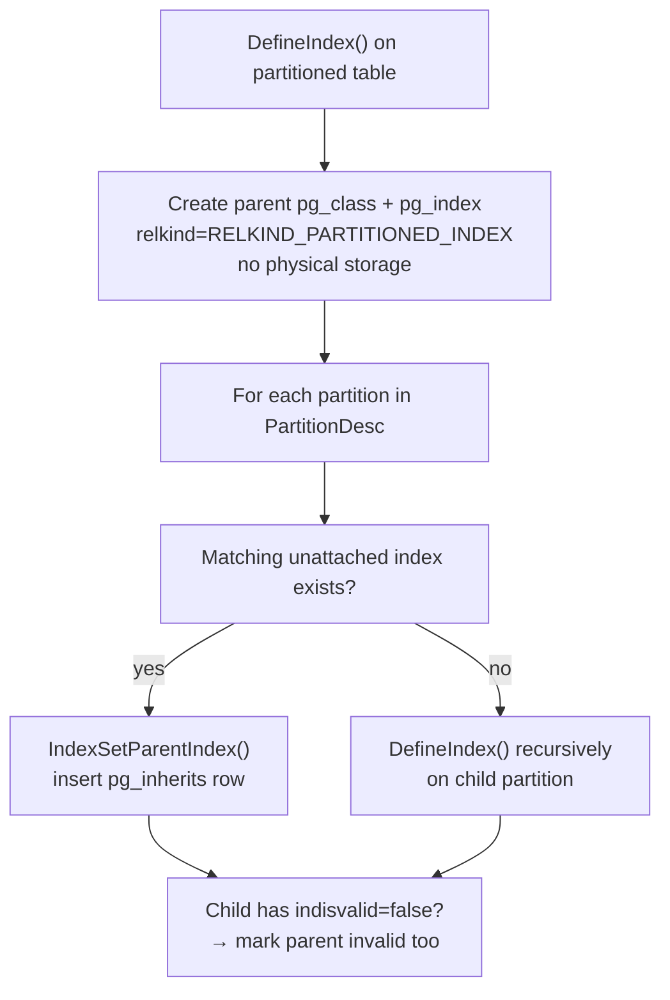

A partitioned index is a logical index definition on a partitioned table that owns a set of physical child indexes, one per partition. Each partition is an independent heap with its own storage, so no single physical index file can span the entire partitioned table. Instead, PostgreSQL represents the index as a two-level structure in the catalog: a parent entry with no storage (`relkind = 'p'`, `RELKIND_PARTITIONED_INDEX`) that owns child index relations on each leaf partition. An ordinary B-tree index is a file on disk whose entries point into a single heap. A partitioned table has no heap of its own: rows live in the child partitions, and the parent relation holds no data. A single physical index spanning all partitions is therefore impossible without a global index file. Such a file would need to be updated during partition attach, detach, and truncation. It would also require cross-partition locking for uniqueness checks. PostgreSQL instead delegates to per-partition physical indexes. It uses the parent index purely as a coordination point in the catalog.

The two-level structure is also visible in `pg_index`. The parent index's row records `indrelid` pointing to the partitioned table. Its access method never builds a file, however, because `INDEX_CREATE_SKIP_BUILD` is always set for partitioned relations (`indexcmds.c`). The child index rows each have `indrelid` pointing to their partition. They are linked to the parent through a `pg_inherits` row with `(inhparent = parent_index_oid, inhrelid = child_index_oid)` — exactly the same mechanism used to record table inheritance.

## How CREATE INDEX Propagates to Partitions

When `CREATE INDEX` runs on a partitioned table, `DefineIndex()` (`indexcmds.c`) first creates the parent index entry in `pg_class` and `pg_index` with `relkind = RELKIND_PARTITIONED_INDEX` and no physical storage. It then iterates over every partition in `PartitionDesc`. For each one, it checks whether a matching unattached index already exists on that partition by comparing `IndexInfo` structures with `CompareIndexInfo()`. If a match is found, `IndexSetParentIndex()` records the parent-child relationship in `pg_inherits`. It also sets `relispartition = true` on the child. If no match is found, `DefineIndex()` recurses with the child relation as the target, passing the parent index OID as `parentIndexId` so the child is created already wired to the parent.

For multi-level hierarchies (a partition that is itself a partitioned table), the recursion continues until all leaves have a physical index. After all children are processed, if any attached child index has `indisvalid = false`, PostgreSQL also marks the parent's `pg_index` row `indisvalid = false`. Validity propagates upward.



## CREATE INDEX ON ONLY and the Deferred Attach Path

`CREATE INDEX ON ONLY parent_table ...` (the `inh = false` flag on the `RangeVar`) creates the parent index entry but deliberately skips partition recursion. If any partitions exist, `DefineIndex()` immediately marks the parent index `indisvalid = false` via `INDEX_CREATE_INVALID` (`indexcmds.c`). The index is visible in the catalog but the planner will not use it for query execution while it remains invalid.

The rationale is lock management. The normal `CREATE INDEX` path acquires `ShareLock` on every partition while building their indexes. This can block writes across the entire table for the duration of the build. By creating only the parent entry first and building partition indexes independently—potentially with `CREATE INDEX CONCURRENTLY` on individual partitions—operators avoid holding a broad lock on an active production table.

Once a partition's index is ready, `ALTER INDEX parent_idx ATTACH PARTITION partition_idx` wires it up. `ATExecAttachPartitionIdx()` (`tablecmds.c`) verifies that the candidate index actually belongs to a partition of the parent table. It then calls `CompareIndexInfo()` to confirm that the index definitions match (key columns, operator classes, collations, expression trees, partial index predicates). If the parent index represents a constraint, the child must also have a matching constraint. Only after all checks pass does `IndexSetParentIndex()` record the relationship.

After attachment, `validatePartitionedIndex()` scans `pg_inherits` for the parent index. It counts how many child indexes have `indisvalid = true` and compares that count to `PartitionDesc.nparts`. When the counts match, it flips the parent's `indisvalid` to `true` via `CatalogTupleUpdate()` (`indexing.c`). For nested partition hierarchies the validation propagates upward: if the now-valid parent is itself a partition of a higher-level index, `validatePartitionedIndex()` recurses on the grandparent.

## When a New Partition Is Attached

`ALTER TABLE parent ATTACH PARTITION child ...` triggers `AttachPartitionEnsureIndexes()` (`tablecmds.c`). This function enforces the invariant that every partitioned index on the parent must have a corresponding index on the new partition. For each partitioned index on the parent, the function scans the candidate partition's existing indexes looking for a `CompareIndexInfo()` match that is valid and not yet attached to another parent. If a match is found, the function attaches it immediately. If none is found, it calls `DefineIndex()` to build one.

Indexes built this way during an `ATTACH PARTITION` start life with `indisvalid = true` because the partition itself is freshly attached and contains no pre-existing data that could violate the index definition. In contrast, when an operator uses `CREATE INDEX ON ONLY` and builds a partition index separately before attachment, the partition may already hold data. This is why the explicit `ATTACH INDEX` path runs through `validatePartitionedIndex()` rather than unconditionally marking the parent valid.

## Catalog Bookkeeping and indexing.c

Every change to the partition index catalog—writing the `pg_index` row for the parent, updating `indisvalid`, inserting or deleting `pg_inherits` rows that record parent-child index relationships—goes through `CatalogTupleInsert()`, `CatalogTupleUpdate()`, and `CatalogTupleDelete()` from `src/backend/catalog/indexing.c`. These routines wrap `simple_heap_insert` / `simple_heap_update` / `simple_heap_delete`. They immediately maintain the B-tree indexes that PostgreSQL keeps on its own system catalogs (for example, the index on `pg_index.indexrelid`). This is a different concern from the user-visible partition indexes being discussed: `indexing.c` is the mechanism by which *all* catalog writes keep the system indexes consistent. It operates the same way whether the tuple being modified describes a partition index, a regular index, or any other catalog object.

## Uniqueness on Partitioned Tables

A unique index on a partitioned table can only be enforced locally: the access method checks uniqueness within a single partition's B-tree but has no knowledge of sibling partitions. PostgreSQL therefore guarantees cross-partition uniqueness only when each possible row is fully determined to belong to exactly one partition by the unique key itself. This requires every partition key column to appear in the unique index's key columns with compatible operator classes and collations.

`DefineIndex()` enforces this statically. Before creating the index, it iterates over every partition key column and verifies that each one appears in the proposed unique index's column list with an equal equality operator (`indexcmds.c`). If any partition key column is missing, the command fails with:

```
unique constraint on partitioned table must include all partitioning columns
```

Expression partition keys make the situation worse. PostgreSQL cannot in general determine which columns an arbitrary expression touches. As a result, it rejects unique indexes outright whenever any partition key column is an expression rather than a plain attribute reference.

A practical implication: if a table is partitioned by `tenant_id` and you need a unique constraint on `(tenant_id, order_id)`, that is allowed. The reason is that `tenant_id` (the partition key) is a prefix. A unique constraint on `order_id` alone would be rejected. When the access pattern requires global uniqueness without including the partition key, the only recourse is to enforce it at the application layer or via a separate uniqueness mechanism outside PostgreSQL's B-tree indexes.

## The ATTACH INDEX Pattern in Practice

For large partitioned tables in active production use, the safe workflow for adding an index is:

1. `CREATE INDEX ON ONLY parent_table USING btree (col);` — creates the invalid parent index immediately, without touching any partition.
2. For each partition, `CREATE INDEX CONCURRENTLY ON partition_n (col);` — builds the index on that partition with minimal lock impact.
3. `ALTER INDEX parent_idx ATTACH PARTITION partition_n_idx;` — links the finished partition index to the parent and, once all partitions are attached, automatically flips the parent to valid.

This sequence never holds a `ShareLock` across all partitions simultaneously. Each `CREATE INDEX CONCURRENTLY` blocks only the one partition it is building on. The `ATTACH PARTITION` step takes only a brief `AccessExclusiveLock` on the child index itself. The trade-off is that the parent index remains invalid—and is therefore unused by the planner—until the last partition is attached.

## Related Topics

- [[subsystems/partitioning/overview|Table Partitioning]] — partition strategies, routing, pruning, and the catalog representation of partitioned tables
- [[subsystems/indexes/btree|B-tree Indexes]] — the physical index structure used by each partition's child index
- [[subsystems/catalog/core-catalogs|System Catalog]] — how `pg_class`, `pg_index`, and `pg_inherits` together represent the index hierarchy
- [[subsystems/locking/overview|Locking]] — lock modes taken during `CREATE INDEX`, `ATTACH PARTITION`, and `ATTACH INDEX`
