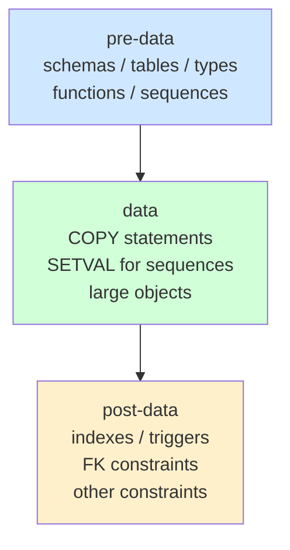

# pg_dump and pg_restore

`pg_dump` produces a logical backup of a PostgreSQL database by connecting as a regular client and issuing catalog queries. It holds a single `REPEATABLE READ` transaction open for the entire dump. This gives it a consistent snapshot of both schema and data without requiring any special server-side mechanism. `pg_dump` discovers every object it sees — tables, indexes, sequences, functions, types, large objects — by querying `pg_catalog` views. Because it is a client program, it can run against a live server with concurrent writes in progress; those writes simply fall outside the snapshot.

The consistent snapshot comes with a cost: that open transaction can delay [[subsystems/background/autovacuum|autovacuum]] and conflict with operations that require an `AccessExclusiveLock`. On a busy server, be aware that a long-running `pg_dump` is holding a snapshot that prevents dead-row cleanup for the duration.

`pg_dump` covers exactly one database. Role definitions and tablespace declarations belong to the cluster, not any individual database, so `pg_dumpall` is required to capture them.

## The Table of Contents

Every dump is organized around a **Table of Contents** (TOC): an ordered list of objects to be dumped, sorted by dependency. Each `TocEntry` (`src/bin/pg_dump/pg_backup_archiver.h`) carries:

| Field | Meaning |
|---|---|
| `desc` | Object type string: `TABLE`, `INDEX`, `SEQUENCE`, `FUNCTION`, etc. |
| `tag` | Object name |
| `catalogId` | OID in `pg_catalog` |
| `defn` | Creation DDL |
| `dropStmt` | `DROP` statement for `--clean` mode |
| `copyStmt` | `COPY` statement if this entry carries table data |
| `dependencies` | Array of `DumpId`s this entry depends on |
| `section` | `SECTION_PRE_DATA`, `SECTION_DATA`, or `SECTION_POST_DATA` |

The TOC is the backbone of selective restore. Flags like `-t` (table filter), `-n` (schema filter), and `--section` work by walking the TOC and marking entries as required or not before replaying them. The `reqs` bitmask on each entry (`REQ_SCHEMA`, `REQ_DATA`, `REQ_SPECIAL`) records which parts are wanted.

## Output Formats

`pg_dump` supports four output formats, selected with `--format`:

**plain** (`-Fp`): emits a plain SQL script. Human-readable and easy to inspect, but it offers no random access — the file must be replayed sequentially with `psql`. Parallel restore is impossible because there is no TOC index to seek into.

**custom** (`-Fc`, the default when compressed output is desired): a binary archive with an internal TOC index appended at the end of the file. The format supports arbitrary seek. That is what makes parallel and selective restore possible. `pg_restore` reads the TOC, decides which entries to replay, and can seek directly to each data block. `pg_dump` applies compression per-entry using the algorithm selected at dump time (historically zlib; PG 16 adds lz4 and zstd support via `compress_io.c`).

**directory** (`-Fd`): writes one file per table into a directory, plus a `toc.dat` file for the TOC. This is the only format that supports parallel `pg_dump` (`--jobs`), because each worker can write its own file independently. `pg_dump` compresses each per-table file individually.

**tar** (`-Ft`): produces a POSIX tar archive that is readable by standard tools. Like plain format, it does not support parallel restore or arbitrary seeking.

## Pre-data, Data, and Post-data Sections

`pg_dump` divides the dump into three logical sections, and the ordering is deliberate:

**pre-data** contains everything the data load depends on: `CREATE SCHEMA`, `CREATE TABLE`, `CREATE TYPE`, `CREATE FUNCTION`, `CREATE SEQUENCE`, and so on. Nothing in this section requires table rows to exist yet.

**data** contains the `COPY FROM STDIN` statements that load table rows, plus `SELECT setval(...)` calls to restore sequence counters. Large objects are also emitted here as a distinct group, read via `lo_open`/`lo_read` rather than as table data.

**post-data** is intentionally last. Creating an index on an empty table and then loading data is much slower than loading data and then building the index in bulk. The same reasoning applies to triggers and foreign key constraints — they add overhead per-row if present during load, but can be checked in bulk afterward. This is why `--section=post-data` alone is a valid way to add indexes to a table that was already loaded.

The `--section` flag filters TOC entries to a single section, enabling incremental or pipelined restore workflows.

## Snapshot Coordination

When `--snapshot` is passed, `pg_dump` calls `SET TRANSACTION SNAPSHOT` to adopt an externally provided snapshot identifier rather than acquiring its own. `pg_dumpall` uses this to coordinate consistent dumps across multiple databases: it acquires a single snapshot from the server and passes it to each per-database `pg_dump` invocation. This ensures all of them see the same committed state.

External tools that need coordinated multi-database dumps — or that want to combine a logical dump with a physical replica slot — can use the same mechanism via `pg_export_snapshot()`.

## Large Object Handling

Large objects are not stored in ordinary table rows. `pg_dump` reads them separately using the large-object API (`lo_open`, `lo_read`). It writes them as a dedicated section of the TOC — a `BLOBS` entry in the pre-data section followed by individual `BLOB` entries in the data section. During restore, `pg_restore` recreates the large object with `lo_create`. It writes the content back with `lo_write`. The `ArchiveHandle` in `pg_backup_archiver.c` tracks large-object state through the `StartLOsPtr`/`EndLOsPtr`/`StartLOPtr`/`EndLOPtr` function-pointer table that each format driver implements.

## Parallel Dump

Passing `--jobs N` to `pg_dump` forks N worker processes that dump table data simultaneously. Directory format is mandatory because each worker writes to its own file; a single shared file would require serialized writes. `pg_dump` still dumps schema DDL (the pre-data section) single-threaded before spawning any workers.

The work queue is a `ParallelReadyList` (defined in `pg_backup_archiver.c`) that holds `TocEntry` pointers sorted by estimated data size, largest tables first. This ordering ensures that long-running tables do not stall the queue at the end. Each worker picks the next available entry, runs its `COPY TO`, compresses, and writes the file. Workers signal completion back to the leader. The leader then updates the `depCount` counters on dependent entries.

## pg_restore

`pg_restore` reads a custom or directory format archive, parses the TOC, and replays selected entries. It does not work with plain-format dumps (those go directly to `psql`).

Key restore options and what they actually do:

| Option | Effect |
|---|---|
| `--jobs N` | Spawns N worker processes, each restoring a different table concurrently |
| `-t` / `-n` | Filters TOC entries by table or schema name before replay |
| `--section` | Restricts restore to pre-data, data, or post-data only |
| `--no-owner` | Omits `SET ROLE` / `ALTER OWNER` statements |
| `--no-privileges` | Omits `GRANT` / `REVOKE` statements |
| `-e` / `--exit-on-error` | Aborts on the first error instead of continuing |
| `--clean` | Issues `DROP` before each `CREATE` using the stored `dropStmt` |

The restore runs in three internal passes (`RestorePass` in `pg_backup_archiver.h`): a main pass that handles most object types, an ACL pass that applies `GRANT`/`REVOKE` after the objects exist, and a post-ACL pass for event triggers and materialized view refreshes. This ordering prevents a read-only table (one where the owner has revoked their own `INSERT` privilege) from blocking its own data load.

For parallel restore, each worker holds its own database connection. The leader assigns TOC entries to workers according to the dependency graph, ensuring that a table's data is not loaded before its `CREATE TABLE` entry has been replayed.

## Limitations and Gotchas

- `pg_dump` captures one database. Roles, tablespace definitions, and cluster-wide settings require `pg_dumpall`.
- Unlogged tables are dumped as unlogged. Their data is present in the dump, but a crash before the dump completes could leave an inconsistent state in the dump file itself (the snapshot consistency guarantee is about the server's view, not file-system durability).
- The open `REPEATABLE READ` transaction pins a snapshot, preventing vacuum from reclaiming dead rows in any table for the duration of the dump. On high-churn tables this can cause table bloat if the dump runs for hours.
- DDL changes concurrent with a dump can cause `cache lookup failed` errors. `pg_dump` acquires `AccessShareLock` on every table it intends to dump during `getSchemaData()`. However, there is a window between snapshot acquisition and lock acquisition where an intervening `DROP` or `ALTER` can cause catalog lookups to fail (noted in `pg_dump.c` comments).
- Custom and directory format archives embed the pg_dump version. Restoring a dump taken with a newer `pg_dump` against an older `pg_restore` binary may fail if the archive format version (`K_VERS_SELF` in `pg_backup_archiver.h`) is newer than what the older binary understands.

## Related Topics

- [[subsystems/transactions/snapshot|Snapshot]] — explains how PostgreSQL exports and imports consistent snapshots, the mechanism pg_dump relies on for its `REPEATABLE READ` dump transaction and `--snapshot` coordination.
- [[subsystems/transactions/mvcc|MVCC]] — covers the visibility rules that make a long-running dump transaction see a stable, consistent view of the database while concurrent writes proceed.
- [[subsystems/background/autovacuum|Autovacuum]] — autovacuum is blocked from reclaiming dead rows in tables while pg_dump holds its open snapshot, making this a key interaction to understand for long dumps.
- [[subsystems/storage/large-object-inv-api|Large Object Inv API]] — describes the server-side `lo_open`/`lo_read`/`lo_write` API that pg_dump uses to read and pg_restore uses to recreate large objects.
- [[subsystems/replication/base-backup|Base Backup]] — the physical counterpart to pg_dump's logical backup; understanding both helps choose the right backup strategy for a given workload.
- [[subsystems/pg-upgrade|pg_upgrade]] — the major-version upgrade tool that, like pg_dump, must navigate catalog structure and object dependencies across PostgreSQL releases.
- [[subsystems/catalog/pg-depend|pg_depend]] — the dependency catalog that pg_dump queries to construct the ordered TOC and ensure objects are restored before the objects that reference them.
