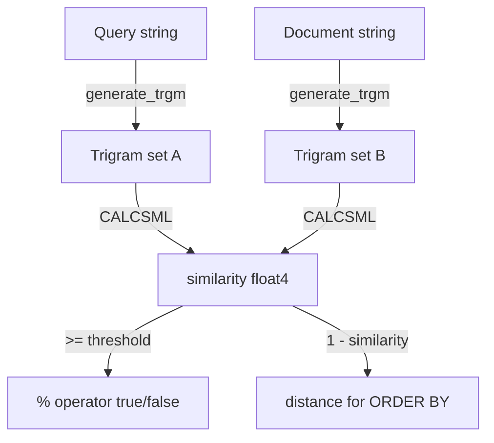
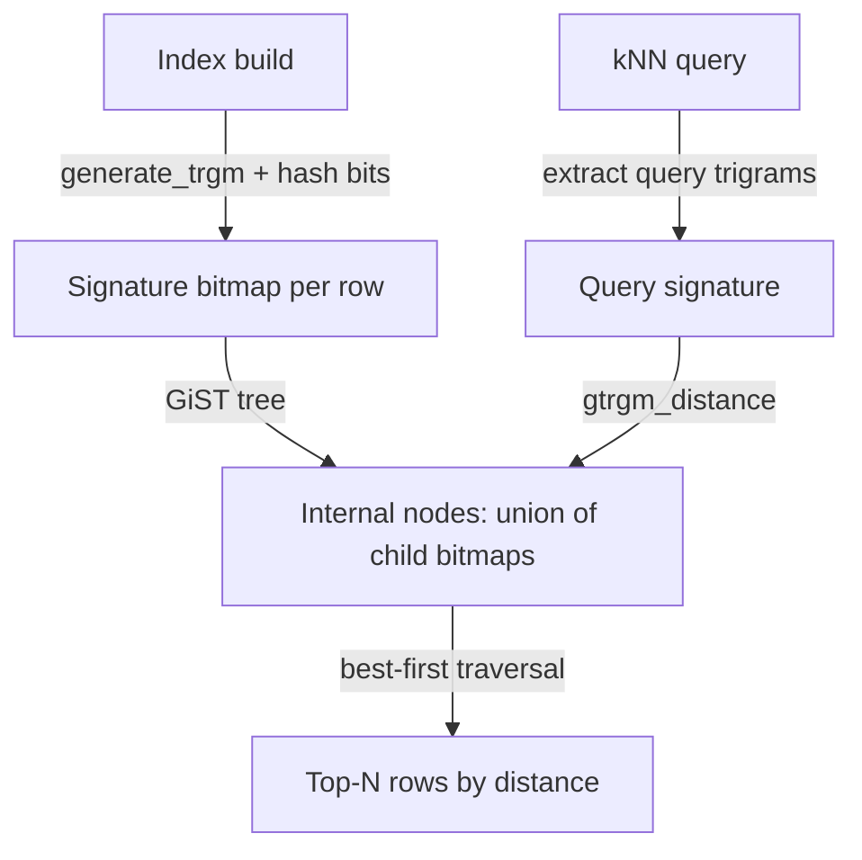

# pg_trgm: Trigram Similarity Search

The `pg_trgm` extension enables fuzzy string matching by decomposing text into overlapping three-character sequences (trigrams) and measuring how many trigrams two strings share. The result is a continuous similarity score between 0.0 and 1.0 that behaves like an edit-distance measure without the O(n·m) cost of computing edit distance directly. Combined with GIN or GiST indexes, it can also accelerate `LIKE`/`ILIKE` and regex queries that a B-tree index cannot touch.

## Trigram decomposition

Before extracting trigrams, `pg_trgm` pads the input string with two spaces on the left and one on the right (`LPADDING = 2`, `RPADDING = 1` in `trgm.h`). The string is then split into every consecutive 3-character window. "cat" becomes `"  cat "`. It produces the trigrams `" ca"`, `"cat"`, `"at "`. By default, `pg_trgm` treats non-alphanumeric characters as word separators (`KEEPONLYALNUM`). It performs comparisons case-insensitively (`IGNORECASE`).

The similarity score between two strings is the Jaccard coefficient over their trigram sets. With `DIVUNION` defined in `trgm.h`, the formula is:

```
similarity = count / (|A| + |B| - count)
```

where `count` is the number of trigrams in the intersection, `|A|` and `|B|` are the sizes of the two sets. This is equivalent to `|intersection| / |union|`, ranging from 0.0 (no shared trigrams) to 1.0 (identical sets). The macro is `CALCSML(count, len1, len2)` in `trgm.h`.

You can inspect what trigrams a string produces with `show_trgm`:

```sql
SELECT show_trgm('cat');
-- {" ca","at ","cat"}
```

## Operators and functions

The extension exposes both numeric scores and threshold-based boolean operators.

`similarity(a, b)` returns a `float4` Jaccard score. `similarity_dist(a, b)` — exposed as the `<->` operator — returns `1 - similarity(a, b)`. This is useful in `ORDER BY` clauses for nearest-neighbor ranking.

The `%` operator is the workhorse for threshold-based filtering. It returns true when `similarity(a, b) >= pg_trgm.similarity_threshold` (default 0.3). Queries like `WHERE name % 'Jon'` find all strings similar enough to "Jon" without specifying an exact cutoff in the query.

The word-similarity family handles the common case where the search string is shorter than the document. `word_similarity(str, text)` finds the best similarity between `str` and any contiguous substring of `text`, not the full string. This means `word_similarity('foo', 'foo bar baz')` scores near 1.0 even though `similarity('foo', 'foo bar baz')` would be low. The `<%` operator applies `pg_trgm.word_similarity_threshold` (default 0.6). The `<->` distance analogue is `word_similarity_dist`.

`strict_word_similarity` tightens this further: the matching extent must align with whole-word boundaries. Its threshold operator is `<<%` and its GUC is `pg_trgm.strict_word_similarity_threshold` (default 0.5).

All three GUC thresholds are registered in `trgm_op.c` via `DefineCustomRealVariable`. They are `PGC_USERSET`, so they can be changed per session with `SET pg_trgm.similarity_threshold = 0.4`.



## GIN index

The `gin_trgm_ops` operator class stores one GIN entry per trigram. At index build time, `gin_extract_value_trgm` in `trgm_gin.c` calls `generate_trgm` on each indexed string. It converts each trigram to a 32-bit integer key with `trgm2int`. The GIN posting list for each key records which rows contain that trigram.

At query time, `gin_extract_query_trgm` decomposes the query string (or extracts fixed trigrams from a `LIKE` pattern or regex). It returns the set of trigram keys to look up. The GIN consistency function then rejects any page that is missing a required trigram, often eliminating large portions of the table before heap fetches.

For `LIKE '%foo%bar%'`, the planner extracts the fixed substrings "foo" and "bar" from the pattern, computes their trigrams, and uses those as the GIN probe set via `generate_wildcard_trgm`. This only pays off when the pattern contains substrings of three or more characters; patterns like `'%a%'` yield too few trigrams to be selective.

GIN is the right choice when:
- Most queries are threshold lookups (`%`) or pattern matches (`LIKE`/`~`)
- Index build time and size are acceptable (GIN indexes are larger than GiST)
- `ORDER BY similarity DESC` will be applied after a `WHERE` filter, not as the primary scan

GIN does not support ordered kNN scans (`ORDER BY col <-> 'foo'` without a prior `WHERE`).

## GiST index

The `gist_trgm_ops` operator class represents each indexed value as a fixed-length signature bitmap rather than a list of exact trigram keys. PostgreSQL hashes each trigram into a bit position with `HASHVAL(val, siglen)`. It sets that bit with `SETBIT`. The default signature length is `SIGLEN_DEFAULT` (12 bytes = 96 bits).

Multiple distinct trigrams can hash to the same bit, so the bitmap is lossy. A GiST leaf can therefore match a query even when the indexed string does not actually satisfy it — a false positive. Each false positive requires a heap fetch and recheck. This trades precision for a compact representation.

The key advantage over GIN is that GiST implements `gtrgm_distance`. This lets the index support `ORDER BY col <-> 'query'` kNN scans. GiST traverses the tree in best-first order, returning the closest matches without scanning the entire index. GIN has no equivalent because it cannot assign a meaningful distance to a posting-list intersection.

GiST also handles concurrent inserts and deletes more gracefully than GIN. GIN batches changes into a pending list that must be vacuumed into the main tree.

GiST is the right choice when:
- The primary use case is `ORDER BY col <-> 'query' LIMIT n` kNN retrieval
- A smaller index footprint is preferred
- Write concurrency is high



## LIKE and regex acceleration

`pg_trgm` extends the planner so that a GIN or GiST index on a text column can pre-filter rows before evaluating a `LIKE`, `ILIKE`, or `~` predicate. The planner calls `generate_wildcard_trgm` to extract fixed trigrams from the pattern, then issues an index scan on those trigrams before applying the full pattern as a recheck condition. The extraction understands `LIKE` wildcard escaping (`\_` and `\%`). For regex patterns, it uses `trgm_regexp.c`, which models the NFA of the regex to identify required trigrams.

The optimization applies when:
- The pattern contains at least one fixed substring of three or more characters
- A GIN or GiST index with `gin_trgm_ops` / `gist_trgm_ops` exists on the column

Short or highly wildcarded patterns like `'%x%'` or `'%ab%'` produce too few selective trigrams and the planner may choose a sequential scan instead.

## LC_CTYPE and non-ASCII characters

`pg_trgm` must decide, for each character in a string, whether it is a word character (included in trigrams) or a separator (discarded). That is character *classification* — the domain of `LC_CTYPE` — not character *ordering*. Ordering is the domain of `LC_COLLATE`. `LC_COLLATE` controls `strcoll()` and `strxfrm()` (ordering and comparison), while `LC_CTYPE` controls `isalnum()`, `isupper()`, and `toupper()` (character class membership). (`pg_locale.c` lines 13–16.) As a result, the database's `LC_CTYPE` setting directly controls which characters appear in trigrams and which are silently dropped.

### The KEEPONLYALNUM filter

`trgm.h` defines `KEEPONLYALNUM` unconditionally, which selects:

```c
#define ISWORDCHR(c, len)   (t_isalnum_with_len(c, len))
```

`pg_trgm` silently discards every character that is not alphanumeric before trigram generation. The filter is not optional at runtime; removing it would require recompiling the extension.

### How `t_isalnum_with_len` uses LC_CTYPE

`ts_locale.c` generates `t_isalnum_with_len` via a macro:

```c
if (clen == 1 || database_ctype_is_c)
    return isalnum(TOUCHAR(ptr));       // ASCII-only C stdlib
char2wchar(character, WC_BUF_LEN, ptr, clen, mylocale);
return iswalnum((wint_t) character[0]); // Unicode-aware
```

The branch condition is `database_ctype_is_c`, a global flag set once at session startup (`postinit.c` lines 425–427):

```c
if (strcmp(ctype, "C") == 0 || strcmp(ctype, "POSIX") == 0)
    database_ctype_is_c = true;
```

`ctype` is `pg_database.datctype`, fixed at `CREATE DATABASE` time and inherited from the template (default `template1`) when not specified.

### Effect on non-ASCII scripts

When `database_ctype_is_c = true`, `pg_trgm` uses the C stdlib `isalnum()`. It only recognises ASCII characters (0–127) as alphanumeric. `pg_trgm` treats characters from any non-Latin script — Arabic, Chinese, Cyrillic, Hebrew, Thai, etc. — as separators and drops them. The result is that `show_trgm()` returns an empty array for such strings:

```sql
SELECT show_trgm('مرحبا');  -- {} with LC_CTYPE = C
SELECT show_trgm('مرحبا');  -- {"  م"," مر","با ","حبا","رحب","مرح"} with a UTF-8 LC_CTYPE
```

A GIN index built on a column containing Arabic (or any non-ASCII) text will store no trigrams for those rows. Queries against them fall back to a sequential scan, making the index useless for that content.

### Column collation vs database LC_CTYPE

A column declared `COLLATE C` does not set `database_ctype_is_c`. That flag comes exclusively from the database's own `LC_CTYPE`. A database created with `LC_CTYPE = en_US.UTF-8` but with columns using `COLLATE C` will correctly generate trigrams for non-ASCII characters. In that case `database_ctype_is_c` will be false, so the Unicode-aware `iswalnum()` path is taken.

### Fixing the problem

`LC_CTYPE` cannot be changed on an existing database (`AlterDatabase` in `dbcommands.c` does not accept an `lc_ctype` option). The only remediation is dump and restore:

```bash
pg_dump mydb > mydb.dump

psql -c "CREATE DATABASE mydb_new
           ENCODING 'UTF8'
           LC_CTYPE 'en_US.UTF-8'
           LC_COLLATE 'en_US.UTF-8'
           TEMPLATE template0;"

psql -d mydb_new < mydb.dump

# Rebuild the index — it was populated with empty trigrams under LC_CTYPE=C
psql -d mydb_new -c "REINDEX INDEX CONCURRENTLY your_trgm_index;"
```

`TEMPLATE template0` is required because PostgreSQL refuses to create a database whose `LC_CTYPE` differs from its template (`dbcommands.c` lines 1175–1180).

On PostgreSQL 10+, ICU collation avoids the OS locale dependency entirely and always takes the Unicode-aware path regardless of `database_ctype_is_c`:

```sql
CREATE DATABASE mydb
  ENCODING 'UTF8'
  LOCALE_PROVIDER icu
  ICU_LOCALE 'en'
  TEMPLATE template0;
```

## Configuration

| GUC | Default | Controls |
|-----|---------|---------|
| `pg_trgm.similarity_threshold` | 0.3 | `%` operator cutoff |
| `pg_trgm.word_similarity_threshold` | 0.6 | `<%` operator cutoff |
| `pg_trgm.strict_word_similarity_threshold` | 0.5 | `<<%` operator cutoff |

All three accept values in [0.0, 1.0] and are `PGC_USERSET`.

## Common use cases

Fuzzy name lookup is the canonical use case: `WHERE name % 'Jonn'` tolerates a single-character typo in user-supplied input without requiring soundex or a hand-maintained synonym table. Word similarity is better for searching product names or addresses where the query is a fragment of a longer stored value.

`LIKE '%keyword%'` queries on large tables normally force a sequential scan because B-tree indexes are not useful for prefix-free patterns. A GIN index with `gin_trgm_ops` converts these into index-assisted scans. This matters when the keyword has enough characters to be selective.

For autocomplete interfaces that rank suggestions by closeness, a GiST index with `ORDER BY name <-> $1 LIMIT 10` retrieves the nearest matches efficiently without scanning the full table.

See also [[subsystems/full-text-search]] for lexeme-based document search. It complements trigram similarity for cases where stemming and stop-word removal are important.

## Related Topics

- [[subsystems/indexes/gin|GIN Indexes]] — the index type used by `gin_trgm_ops`; covers posting-list structure, build phases, and the pending-list flush that affects write performance.
- [[subsystems/indexes/gist|GiST Indexes]] — the index type used by `gist_trgm_ops`; explains the signature-bitmap representation, kNN traversal, and how GiST supports ordered distance scans.
- [[subsystems/full-text-search|Full-Text Search]] — lexeme-based document search that complements trigram similarity when stemming, stop words, and ranking are required.
- [[subsystems/types/fuzzy-string-matching|Fuzzy String Matching]] — covers `fuzzystrmatch` functions (Levenshtein, Soundex, Metaphone) that offer edit-distance alternatives to trigram similarity.
- [[subsystems/types/like-ilike|LIKE and ILIKE]] — pattern matching operators whose execution pg_trgm accelerates through trigram-extracted index probes.
- [[subsystems/types/regex-matching|Regex Matching]] — covers the regex engine whose NFA pg_trgm's `trgm_regexp.c` analyzes to extract required trigrams for index pre-filtering.
- [[subsystems/catalog/collation-catalog|Collation Catalog]] — explains how `LC_CTYPE` and ICU collation providers are stored and resolved, directly affecting which characters pg_trgm treats as word characters.
