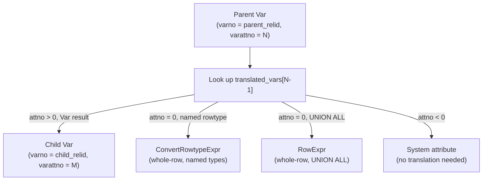

When a query targets an inheritance parent or a declaratively partitioned table, the [[subsystems/planner/overview|planner]] must plan each child relation independently yet unify them under a single result. The mechanism that makes this possible is the *append relation*: a logical grouping of the parent and all its children, each child tracked by an `AppendRelInfo` that maps every parent column to the corresponding child expression. This mapping is the core of `appendinfo.c`. Nearly every downstream step — path generation, restrict-clause cloning, UPDATE target-list translation, and row-identity tracking for multi-partition DML — depends on it.

## Append Relations and AppendRelInfo

When the planner preprocesses the range table, it detects any `RangeTblEntry` with `inh = true` — either an inheritance parent or a UNION ALL subquery treated as one. It expands that entry into a set of child RTEs. For each child, it builds one `AppendRelInfo` (`pathnodes.h`) that encodes the parent-child relationship for the duration of planning.

The central fields are:

| Field | Type | Purpose |
|---|---|---|
| `parent_relid` | `Index` | Range-table index of the parent RTE |
| `child_relid` | `Index` | Range-table index of this child RTE |
| `parent_reltype` | `Oid` | Composite type OID of the parent row; `InvalidOid` for UNION ALL |
| `child_reltype` | `Oid` | Composite type OID of the child row |
| `translated_vars` | `List *` | One entry per parent user column: the child `Var` (or expression) that corresponds to it |
| `num_child_cols` | `int` | Length of `parent_colnos[]` |
| `parent_colnos` | `AttrNumber[]` | Reverse map: for each child column, the 1-based parent column number or 0 if unmatched |
| `parent_reloid` | `Oid` | Parent relation OID (for error messages) |

The `translated_vars` list is always `Var`-typed for true inheritance children. For UNION ALL appendrels it can contain arbitrary expressions, because each branch of the union can project differently-typed or computed columns. This distinction shapes how `adjust_appendrel_attrs()` handles whole-row Vars.

`AppendRelInfo` nodes are stored in two parallel data structures on `PlannerInfo`: `append_rel_list` (a flat list, iterable in order) and `append_rel_array` (indexed by `child_relid`, enabling O(1) lookup). The array is essential during path generation and UPDATE translation, where the planner frequently needs to find the `AppendRelInfo` for a known child relid.

## Building the Translation List

`make_append_rel_info()` (`appendinfo.c`) calls `make_inh_translation_list()` to populate `translated_vars` and `parent_colnos`. The function iterates parent columns in order and, for each non-dropped column, finds the matching child column by name and verifies that its type and collation agree. The name-based lookup is needed because traditional inheritance allows `ALTER TABLE ADD COLUMN` to insert columns in different positions across the hierarchy. Multiple inheritance can also interleave columns from different parents.

As an optimisation, the search assumes that columns appear in roughly the same relative order in both relations. It first tries the child column at the same sequential position; only if that fails does it fall back to a system-cache lookup via `SearchSysCacheAttName()`. Dropped columns in the parent produce `NULL` entries in `translated_vars`, ensuring that the N-th list position always corresponds to the N-th parent attribute number.

For the degenerate case where parent and child are the same relation — which occurs when the planner builds a self-entry for the parent row in some planning contexts — no search is needed. The function simply maps each column to itself.

## Expression Translation

With `AppendRelInfo` in hand, the planner translates any expression tree from parent space to child space using `adjust_appendrel_attrs()`. This is a tree-mutating walk that rewrites `Var` nodes whose `varno` matches a parent relid, replacing them with the corresponding entry in `translated_vars`. It also rewrites all `Relids` bitmapsets (in `RestrictInfo`, `PlaceHolderVar`, etc.) by substituting child relids for parent relids.

The handling of `RestrictInfo` nodes is deliberate and careful. Because restrict-info caches selectivity estimates and equivalence-class membership, simply cloning the struct and rewriting the clause expression is not enough. The cached derivative fields — `eval_cost`, `norm_selec`, `outer_selec`, and the bucket-size estimates — are all reset to their uninitialised sentinels, so they will be recomputed in the context of the child relation's statistics. Left-hand and right-hand equivalence-class pointers (`left_ec`, `right_ec`) are intentionally kept, because each child variable is considered implicitly equivalent to its parent within the same equivalence class.

When the translated expression for a whole-row Var (attribute number 0) involves two named row types, the function wraps the child Var in a `ConvertRowtypeExpr` that coerces the child's tuple layout back to the parent row type. For UNION ALL appendrels, which have no named row type (`child_reltype = InvalidOid`), the function builds a `RowExpr` from the individual translated column Vars instead.

For multi-level inheritance hierarchies — where a child is itself a parent of further children — `adjust_appendrel_attrs_multilevel()` recurses from the immediate child up to the requested ancestor, applying one level of translation per step. The same pattern applies to `adjust_child_relids_multilevel()` for pure `Relids` bitmapset adjustments and to `adjust_inherited_attnums_multilevel()` for lists of attribute numbers (used when building per-partition UPDATE target lists).

## Row Identity Variables for Multi-Partition DML

UPDATE, DELETE, and MERGE on inheritance or partitioned tables require each leaf relation's executor node to emit a *row identity* column — the information needed to find and modify the specific tuple. For heap relations this is the `ctid`; for foreign tables, the FDW registers its own identity columns via `AddForeignUpdateTargets`. Because each leaf may have a distinct `ctid` Var pointing to a different range-table entry, sharing row-identity information across leaves requires a level of indirection.

The planner uses `RowIdentityVarInfo` (`pathnodes.h`) as a canonical registry. Each entry represents one logical row-identity concept (e.g. `"ctid"`). It holds the abstract `Var` with `varno = ROWID_VAR` rather than any concrete relid. The `rowidrels` bitmapset records which leaf relids contribute this identity column. In the plan tree, a `Var` with `varno = ROWID_VAR` and `varattno = k` is a reference to the k-th `RowIdentityVarInfo` entry in `root->row_identity_vars`.

`add_row_identity_var()` (`appendinfo.c`) registers a row-identity column for a given leaf relid. If an entry for the same `rowid_name` already exists and the abstract Var matches (type, typmod, collation), the new relid is simply added to `rowidrels`. If names match but Vars differ, a planning error is raised. For the non-inherited case — where the result relation is not an append parent — the function bypasses the registry entirely. It pushes the Var directly into `processed_tlist`.

`add_row_identity_columns()` is the dispatch point that chooses what to register per relation kind: `ctid` for ordinary heap tables, materialized views, and partitioned tables; nothing extra for the FDW case (which calls back into `add_row_identity_var()` directly via `AddForeignUpdateTargets`). For UPDATE on foreign tables, the planner also requests a whole-row Var so that the executor can construct the full new tuple.

`distribute_row_identity_vars()` runs after all leaf relations have been processed. It walks `processed_tlist` looking for `ROWID_VAR` Vars. It copies them into the reltarget of the topmost result relation, from which they propagate to each leaf target during subsequent append-rel expansion. An edge case is handled explicitly: if constraint exclusion eliminated every leaf partition, `row_identity_vars` will be empty even though the plan tree still needs identity columns. In that situation the function reopens the top result relation, calls `add_row_identity_columns()` once more to synthesise the expected columns, and returns without attempting to copy `ROWID_VAR` references.

During expression translation for DML, `adjust_appendrel_attrs_mutator()` recognises `ROWID_VAR` Vars. It resolves them to a concrete child Var by consulting `root->row_identity_vars`. If the leaf relid is a member of the entry's `rowidrels`, the concrete Var is substituted. If not — meaning the leaf cannot supply this identity column — a typed NULL constant is returned instead, ensuring the plan's output shape remains consistent across all branches.

## UPDATE Target-List Translation

For an inherited or partitioned UPDATE, the planner computes a single `processed_tlist` against the parent relation. Before planning each leaf, it calls `get_translated_update_targetlist()` (`appendinfo.c`) to produce a copy of that target list with all parent Vars rewritten to child Vars via `adjust_appendrel_attrs_multilevel()`. The planner similarly translates the column number list (`update_colnos`) through `adjust_inherited_attnums_multilevel()`.

For the case where the target relid equals the query's `resultRelation` (the non-inheritance path), the function simply copies the already-computed lists without any translation — a cheap O(n) copy rather than a tree walk.

## Interaction with Partitioning and Constraint Exclusion

The `AppendRelInfo` infrastructure is shared by both traditional inheritance and declarative partitioning. For declarative partitions, the same `append_rel_list` / `append_rel_array` structures are populated during `expand_partitioned_rtentry()` in `inherit.c`. The same `adjust_appendrel_attrs()` machinery translates all per-child expressions. [[subsystems/partitioning/partition-pruning|Partition pruning]] runs before most expression translation. It reduces the number of children for which the planner must build `AppendRelInfo` entries and generate paths. This is why pruning has a multiplicative effect on planning time for large partition counts.

[[subsystems/planner/constraint-exclusion|Constraint exclusion]] for traditional inheritance tables works at the same phase as partition pruning but uses a different mechanism: it evaluates the child table's `CHECK` constraints against the query's WHERE clause. It discards children whose constraints provably exclude all rows. The `AppendRelInfo` entries for excluded children are still created; the children are simply removed from the Append's subpath list, analogously to how pruned partitions are removed.

## Related Topics

- [[subsystems/planner/overview|Planner Overview]] — how `RelOptInfo` hierarchies and Append paths are assembled
- [[subsystems/partitioning/overview|Table Partitioning]] — declarative partitioning, bounds storage, and routing
- [[subsystems/partitioning/partition-pruning|Partition Pruning]] — plan-time and execution-time elimination of child partitions
- [[subsystems/planner/constraint-exclusion|Constraint Exclusion]] — inheritance pruning via CHECK constraints
- [[subsystems/partitioning/partition-wise-join|Partition-Wise Join]] — per-partition join planning using the same RelOptInfo hierarchy
