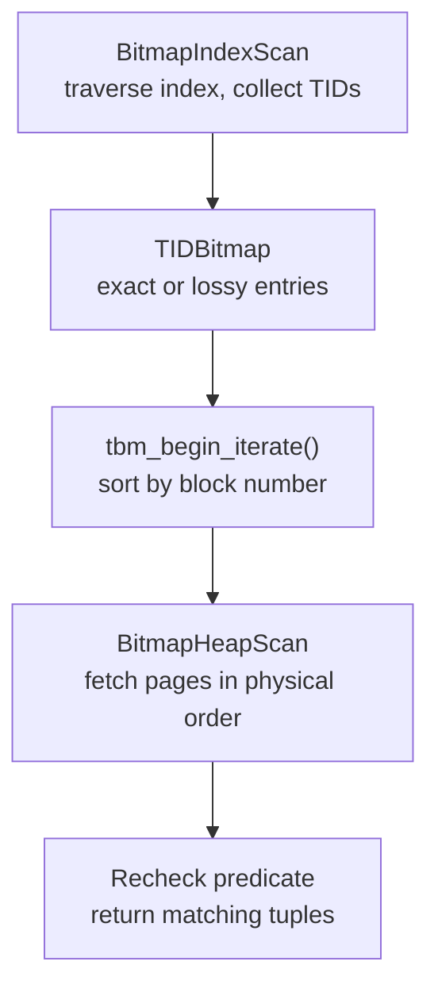

# Bitmap Heap Scans

A plain index scan fetches heap tuples one at a time, following each index entry to its heap TID as it goes. For a highly selective predicate on a well-correlated index, that is fine. Successive index entries point to nearby heap pages, so the access pattern approaches sequential. For an uncorrelated index with moderate selectivity — say 1–10% of rows — the story is different. The matching tuples are scattered randomly across the heap, so the plain index scan must issue a random read for each one. At the default `random_page_cost = 4.0`, even a few thousand such reads can exceed the cost of a full sequential scan.

The bitmap heap scan exists to close this gap. It separates the index traversal from the heap access into two distinct phases. It performs the heap access in physical page order regardless of how the index entries are ordered. The result is a scan that uses the index's selectivity without paying the full random I/O penalty of a plain index scan.

## Two-Phase Execution

The first phase is a `BitmapIndexScan`. The executor scans the index from start to finish (in index order). It records every heap page containing at least one matching tuple. The output is not a stream of tuple slots but a `TIDBitmap` — an in-memory data structure maintained in `tidbitmap.c`. In its exact form, each entry in the bitmap identifies a specific heap TID (block number plus offset within the page). The cost of this phase is entirely startup cost from the planner's perspective: no heap I/O occurs and no tuples are returned until the bitmap is complete.

The second phase is the `BitmapHeapScan`. Before touching the heap, the executor converts the bitmap to a sorted list of block numbers (`tbm_begin_iterate()`, `tidbitmap.c`). The executor then iterates over set bits in ascending block number order, fetching each heap page exactly once. For exact-mode entries the executor knows which tuple offsets to examine. For lossy-mode entries (described below), it reads the whole page and rechecks the predicate against each tuple found. The physical-order traversal is the key benefit: even a completely uncorrelated index, after its bit entries are sorted, produces a near-sequential heap access pattern.



The `BitmapHeapScan` node receives the bitmap from its outer child via `MultiExecProcNode()` (`nodeBitmapHeapscan.c`). It calls down to the child. The child runs to completion, building the entire bitmap. Only then does the heap scan begin. This is why `EXPLAIN` always shows the bitmap as startup cost: the entire index scan must finish before the scan touches the first heap page.

## Exact and Lossy Bitmaps

The `TIDBitmap` has two storage modes. It can hold both simultaneously in different regions of the page table.

In exact mode, each `PagetableEntry` (`tidbitmap.c`) represents a single heap page, with a per-tuple-offset bitmapword recording exactly which slots on that page are candidates. The executor uses these offsets to read only the relevant tuple slots on the page, avoiding a full-page scan.

When the number of entries in the bitmap reaches `maxentries` — a limit derived from `work_mem` by `tbm_calculate_entries()` — the bitmap calls `tbm_lossify()`. This collapses exact per-page entries into lossy chunks: a single entry then represents a group of `BLCKSZ / 32` consecutive heap pages (256 pages per chunk at the standard 8 KB block size), with one bit per page indicating whether the page needs to be visited. Individual tuple offsets are lost. The `ischunk` flag on `PagetableEntry` distinguishes the two modes.

`tbm_calculate_entries()` sizes the limit based on the full `work_mem` budget: `maxbytes / (sizeof(PagetableEntry) + 2 * sizeof(Pointer))`. This is substantially more permissive than the "[[subsystems/executor/work-mem-and-spill|work_mem]] / 32" rule of thumb sometimes cited — in practice, a few megabytes of `work_mem` accommodates exact bitmaps for hundreds of thousands of qualifying pages.

Lossy mode introduces false positives: the executor must visit a page because the chunk bit is set, but the page may contain no tuples that actually satisfy the predicate. This is why `Recheck Cond` appears in `EXPLAIN` output. It is also why `EXPLAIN (ANALYZE)` separates `Heap Blocks: exact=N lossy=M`. A non-zero `lossy` count means the executor fetched some pages based only on the chunk-level bit. Those pages required a full predicate recheck against every tuple.

An important subtlety: the planner always emits `Recheck Cond` unconditionally. When `lossy=0`, the recheck step still executes in the executor code path but finds no false positives. The `exact=N lossy=0` output means all pages were exact. Every heap fetch was precisely targeted.

## Cost Model

The planner generates both an `IndexPath` and a `BitmapHeapPath` for each applicable index and compares them. The `BitmapHeapPath` struct (`pathnodes.h`) holds a `bitmapqual` pointer to the subtree of `IndexPath`, `BitmapAndPath`, and `BitmapOrPath` nodes that produce the bitmap.

`cost_bitmap_heap_scan()` in `costsize.c` builds the total cost in two pieces. The startup cost is the total cost of all contributing `BitmapIndexScan` nodes — essentially the full index traversal cost. The run cost is determined by `compute_bitmap_pages()`, which estimates the number of distinct heap pages that will be fetched. For a single scan this uses the Mackert-Lohman formula:

```
pages_fetched = (2 × T × tuples_fetched) / (2 × T + tuples_fetched)
```

where `T` is the table's page count. The formula accounts for the fact that multiple index entries may point to the same heap page, so the number of distinct pages fetched grows sub-linearly with the number of matching tuples.

Once the heap page count is known, `cost_bitmap_heap_scan()` assigns a per-page cost that interpolates between `random_page_cost` and `seq_page_cost` based on coverage:

```
cost_per_page = random_page_cost
              − (random_page_cost − seq_page_cost) × sqrt(pages_fetched / T)
```

At low coverage (few pages fetched), the cost approaches `random_page_cost`. As coverage approaches the full table, the cost approaches `seq_page_cost`. This reflects the reality that a near-full bitmap scan looks increasingly sequential, and in many cases the OS read-ahead and buffer pool make it nearly as cheap as a SeqScan.

When `compute_bitmap_pages()` detects that `maxentries` would be exceeded, it estimates the number of lossy pages and adjusts the tuple count upward to account for the false-positive recheck cost. The costing also incorporates `allvisfrac`: visible-map pages can potentially be skipped entirely when no non-index qual requires a heap row.

On SSDs where `random_page_cost ≈ seq_page_cost`, the nonlinear interpolation compresses to near-zero gain, and plain `IndexScan` becomes competitive at lower selectivities than it would on spinning disks. The practical advice is to lower `random_page_cost` to 1.1–1.5 for NVMe storage; this lets the planner correctly prefer index scans at low selectivities and reduces unnecessary bitmap overhead.

## Combining Indexes with BitmapAnd

When a WHERE clause has multiple index-eligible conditions joined by AND, the planner can apply both indexes simultaneously if each has moderate selectivity. `choose_bitmap_and()` in `indxpath.c` decides this. It starts with all candidate `BitmapIndexScan` paths, deduplicates paths that cover identical clause sets (keeping the cheapest), and then sorts survivors by index access cost. It then tries building AND combinations greedily. Starting with the cheapest index as the group leader, it considers adding each subsequent index. It keeps the addition only when the estimated total heap scan cost decreases (`bitmap_and_cost_est()`).

To prevent double-counting selectivity, `choose_bitmap_and()` rejects combinations in two cases. It rejects combinations where two indexes share a WHERE clause (tracked via clause bitmap sets). It also rejects combinations where a partial index predicate is implied by the already-selected conditions. The output is either a single path if no combination improves cost, or a `BitmapAndPath` wrapping the winning set.

The resulting plan looks like:

```
Bitmap Heap Scan on orders  (cost=... rows=... width=...)
  Recheck Cond: ((status = 'active') AND (region = 'EU'))
  ->  BitmapAnd
        ->  Bitmap Index Scan on idx_orders_status
              Index Cond: (status = 'active')
        ->  Bitmap Index Scan on idx_orders_region
              Index Cond: (region = 'EU')
```

Each `BitmapIndexScan` builds its own `TIDBitmap`; the `BitmapAnd` node intersects them with `tbm_intersect()` (`tidbitmap.c`). Only pages appearing in every input bitmap are retained, so the final heap scan visits only pages that plausibly satisfy all conditions. The costing model assumes independent conditions (`cost_bitmap_and_node()` multiplies selectivities). This assumption can underestimate correlation between columns, but the heuristic is usually good enough for the planner to make the right choice.

When two conditions are each highly selective on their own — say each filters to 0.1% of rows — a composite index on both columns can outperform the BitmapAnd approach. A single index scan on `(status, region)` avoids the overhead of building two separate bitmaps and intersecting them, and may allow an index-only scan if the query needs no other columns. `choose_bitmap_and()` will still generate the BitmapAnd plan as a candidate, but the composite index path typically wins on total cost.

## Combining Indexes with BitmapOr

`generate_bitmap_or_paths()` in `indxpath.c` can handle OR predicates spanning different columns — `WHERE status = 'active' OR region = 'EU'`. The planner processes each branch of the OR separately: if an index exists that covers the branch, it generates a `BitmapIndexScan` for it. The planner then creates a `BitmapOrPath` to hold the list of contributing paths.

The `BitmapOr` executor node union-merges the bitmaps with `tbm_union()` (`tidbitmap.c`). The resulting bitmap covers all pages satisfying any branch of the OR. `cost_bitmap_or_node()` estimates the union selectivity by summing the individual branch selectivities (clamped to 1.0), under the assumption that the branches are non-overlapping — a reasonable model for `IN (list)` patterns and disjoint conditions.

BitmapOr is the mechanism that makes OR-across-columns queries index-eligible at all. Without it, the planner would have to choose between a sequential scan (which can check any OR condition) or picking one of the index conditions and filtering the other post-scan. When both branches have moderate selectivity, BitmapOr's union cost is far less than either alternative.

For OR conditions on a single column (`WHERE status = 'active' OR status = 'pending'`), the planner may instead rewrite the condition as `status = ANY(ARRAY['active', 'pending'])` and use a single index scan with an array key. The planner evaluates both the bitmap path and the rewritten form. It picks the cheaper one.

## Reading EXPLAIN Output

A typical single-index bitmap scan:

```sql
EXPLAIN (ANALYZE)
SELECT * FROM orders WHERE status = 'active';
```

```
Bitmap Heap Scan on orders  (cost=42.1..1847.3 rows=3200 width=72)
                             (actual time=1.2..8.4 rows=3241 loops=1)
  Recheck Cond: (status = 'active')
  Heap Blocks: exact=1189
  ->  Bitmap Index Scan on idx_orders_status  (cost=0.00..41.3 rows=3200 width=0)
                                               (actual time=0.9..0.9 rows=3241 loops=1)
        Index Cond: (status = 'active')
```

The index scan cost is the startup cost of the outer node. `Heap Blocks: exact=1189 lossy=0` means the scan fetched 1,189 pages with exact tuple-level addressing. No lossy degradation occurred. The scan found all 3,241 matching tuples; `EXPLAIN` shows `Recheck Cond`, but it produced no false positives.

If `work_mem` is very low or the result set is very large, lossy pages appear:

```
  Heap Blocks: exact=204 lossy=2847
```

This means the bitmap ran out of exact-mode capacity after 204 pages and collapsed the rest into lossy chunks. The executor visited the remaining 2,847 pages based on chunk-level bits. It rechecked every tuple on those pages against `status = 'active'`. The scan is still correct but does more work per page than the exact mode would.

## Practical Guidance

The bitmap scan is the planner's automatic response to moderate selectivity on uncorrelated indexes. The planner requires no explicit tuning; it generates the `BitmapHeapPath` alongside `IndexPath` and `SeqScanPath` and picks the winner.

When a `BitmapAnd` plan appears but both constituent indexes are individually highly selective, a composite index is worth considering. A single index scan is cheaper than building two bitmaps and intersecting them. It also avoids the per-bitmap memory cost.

`work_mem` affects whether the bitmap stays exact. Very low `work_mem` settings (the PostgreSQL default of 4 MB is often used as-is in production) can force large bitmaps into lossy mode, adding recheck overhead. The threshold is not `work_mem / 32`. `tbm_calculate_entries()` determines it using the full `work_mem` value divided by the size of a hash table entry. For typical result sets of tens of thousands of rows, even 4 MB keeps the bitmap exact. For multi-million-row result sets, bumping `work_mem` for the session or query avoids lossy degradation.

`enable_bitmapscan = off` disables bitmap scan path generation, forcing the planner to consider only sequential scans and index scans. This is useful for diagnosing whether the planner is choosing a bitmap scan appropriately. If disabling it makes the query substantially faster, the bitmap scan was a poor choice — often because the selectivity estimate was too high or `random_page_cost` is misconfigured. If disabling it makes the query slower, the bitmap scan was correct.

## Related Topics

- [[subsystems/executor/bitmap-and-or|BitmapAnd and BitmapOr Executor Nodes]] — the executor nodes that intersect and union TIDBitmaps produced by BitmapIndexScan children
- [[subsystems/executor/work-mem-and-spill|work_mem and Spill]] — how work_mem governs the exact/lossy threshold in TIDBitmap via tbm_calculate_entries
- [[subsystems/planner/or-clauses|OR Clauses]] — how the planner handles OR predicates and generates BitmapOr paths
- [[subsystems/planner/selectivity-estimation|Selectivity Estimation]] — the row-count estimates that drive whether a bitmap scan is chosen over a sequential scan
- [[subsystems/indexes/index-only-scans|Index-Only Scans]] — an alternative scan strategy that avoids the heap entirely when the visibility map allows it
- [[subsystems/planner/statistics|Planner Statistics]] — how pg_statistic data informs the selectivity estimates used in bitmap scan costing
- [[subsystems/storage/visibility-map|Visibility Map]] — the all-visible bits consulted by BitmapHeapScan to skip heap pages during index-only-capable scans
- [[subsystems/planner/scan-selection|Scan Type Selection]] — how the planner chooses among SeqScan, IndexScan, BitmapHeapScan, and IndexOnlyScan
- [[subsystems/planner/cost-model|Planner Cost Model]] — the cost units, GUC parameters, and Mackert-Lohman page fetch estimation
- [[subsystems/planner/index-selection|Index Selection and Index Path Costing]] — how the planner decides which indexes are applicable
- [[subsystems/indexes/index-am|Index Access Method Interface]] — the index access method interface that BitmapIndexScan calls into
- [[subsystems/planner/reading-explain|Reading EXPLAIN Output]] — interpreting EXPLAIN output including Heap Blocks and Recheck Cond
