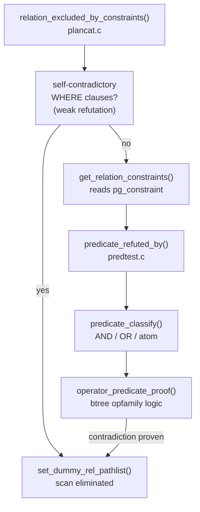
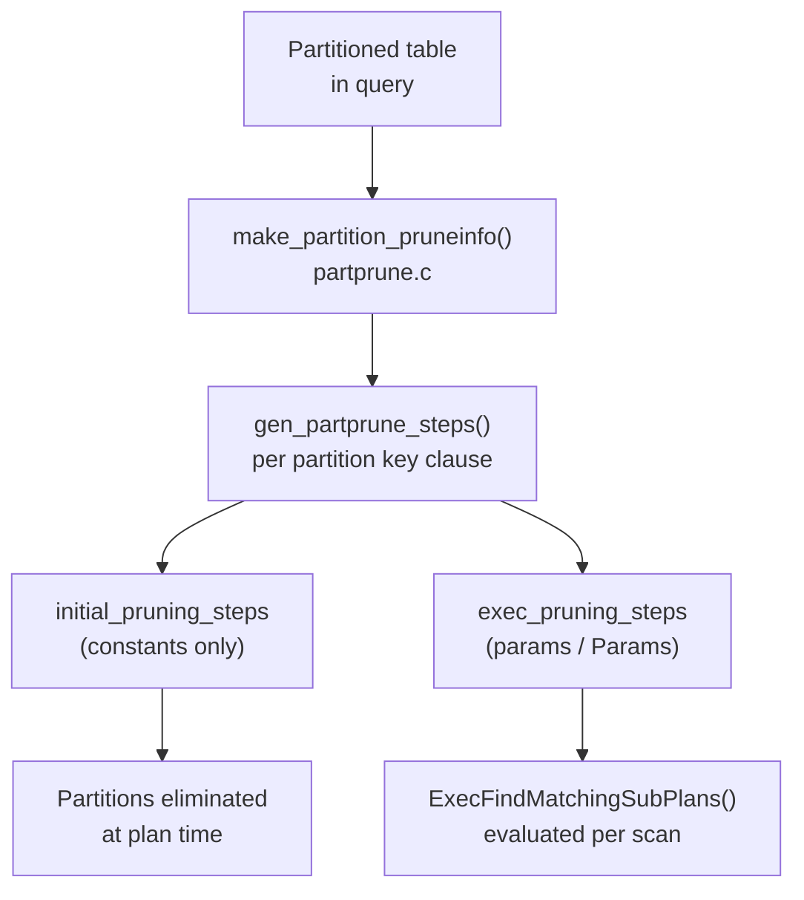

# Constraint Exclusion and Partition Pruning

When a table has a `CHECK (year = 2024)` constraint and a query filters on `WHERE year = 2023`, the planner can prove that no row in that table could ever satisfy the query. The scan is eliminated entirely from the plan — the table does not appear in `EXPLAIN` output at all. This is constraint exclusion: using the metadata the database already holds about a relation's contents to prove that a scan is unnecessary before the executor ever starts.

The mechanism matters most for inheritance-based and declarative partitioning, where a partitioned table fan-out can produce dozens or hundreds of child scans. Eliminating irrelevant children at planning time dramatically shrinks the plan. It also avoids the executor starting up scans that can never contribute rows.

## How Contradiction Is Proved

The logic lives in `predicate_refuted_by()` (`src/backend/optimizer/util/predtest.c`), a simplified theorem prover that works on expression trees. The function takes two lists of clauses and asks whether the first list refutes the second — that is, whether truth of the first list implies falsity of the second. For constraint exclusion, the CHECK constraints are the first list and the query's WHERE clauses are the second: can the constraints prove the WHERE clause false?

The prover classifies every expression as one of three structural types: an AND-clause, an OR-clause, or an atom (anything else). It then applies a small set of recursive inference rules:

- An AND-clause refutes a predicate if any single item in the AND refutes it.
- An OR-clause refutes a predicate if every item in the OR refutes it individually.
- Two atoms are compared by `predicate_refuted_by_simple_clause()`, which handles IS NULL / IS NOT NULL contradictions and then falls through to `operator_predicate_proof()`.

`operator_predicate_proof()` is where most real refutations happen. It handles binary operator expressions by consulting the system's B-tree operator family knowledge. The CHECK constraint and the WHERE clause may compare the same subexpression to constants, using operators from the same B-tree opfamily. When they do, the prover can evaluate a comparison between the two constants at planning time to determine whether the ranges are disjoint. A CHECK constraint `id BETWEEN 1 AND 1000` combined with `WHERE id > 2000` produces the test `1000 < 2000` — trivially true, so the constraint and the clause are contradictory, and the scan is eliminated.

The prover is deliberately conservative. It only claims a contradiction when it can be certain; it never guesses. If it cannot prove a refutation — because the expression is too complex, involves a user-defined operator not in a known B-tree opfamily, or contains a mutable function — it returns false. The scan then proceeds normally. The prover excludes mutable functions (`contain_mutable_functions()`) from consideration entirely, because a function that changes its answer between planning and execution could make a valid-at-plan-time refutation wrong at execution time.

NULL semantics require special care. `predicate_refuted_by()` distinguishes two modes of refutation:

- **Strong refutation**: truth of the clause list implies the predicate is *false* (not just not-true). Used when disproving CHECK constraints given a WHERE clause — the constraint must actually be violated, not merely null.
- **Weak refutation**: truth of the clause list implies the predicate is *non-true* (false or NULL). Used to detect self-contradictory WHERE clauses, since it is sufficient to prove the WHERE can never be true.

The two-mode distinction matters for IS NULL predicates. `CHECK (col IS NOT NULL)` combined with `WHERE col IS NULL` is a strong refutation — the CHECK is violated. A clause `col = 5` weakly refutes `col IS NULL`, because `5 IS NULL` yields false.

## The `constraint_exclusion` GUC

`constraint_exclusion`, an enum GUC with three settings, controls whether the planner even attempts the refutation proof:

| Setting | Behaviour |
|---|---|
| `off` | Never apply constraint exclusion. Fast planning, no scan elimination. |
| `on` | Apply to all tables in every query, including plain non-partitioned tables. |
| `partition` (default) | Apply only to inheritance children and partitioned table partitions (`RELOPT_OTHER_MEMBER_REL`). |

The default of `partition` reflects a deliberate cost/benefit calculation. For a query over a single regular table, applying constraint exclusion means calling `relation_excluded_by_constraints()` (`plancat.c`), fetching the table's CHECK constraints, and running `predicate_refuted_by()` — all overhead that yields nothing for ordinary tables. For a query that expands an inheritance tree or partitioned table into 200 children, the planner pays that same overhead 200 times, but the check typically eliminates most of those children, making the plan far cheaper to execute.

Setting `constraint_exclusion = on` is rarely warranted. Its primary use case is the legacy pattern of manually partitioning data across completely separate tables (not using PostgreSQL's inheritance or declarative partitioning), where each table has a `CHECK` constraint and the planner must be told to apply exclusion to ordinary base rels. Even then, the overhead is linear in the number of tables touched by the query. That number is bounded only by the query itself.

## Partition Pruning for Declarative Partitions

Declarative partitioning (introduced in PostgreSQL 10) has its own dedicated pruning mechanism. This mechanism is distinct from constraint exclusion. It is controlled by `enable_partition_pruning` rather than `constraint_exclusion`.

Constraint exclusion reads `pg_constraint` and uses `predicate_refuted_by()`. Partition pruning reads partition bound information directly from the partition descriptor and uses a separate step-based evaluation engine in `src/backend/partitioning/partprune.c`. The two mechanisms reach the same destination — eliminating child scans — but via different paths and with different capabilities.

The planner calls the partition pruning logic (`make_partition_pruneinfo()`, `partprune.c`) during path generation for partitioned tables. It analyses the WHERE clause against the partition key definition and generates a set of *pruning steps* — abstract instructions for testing each partition's bounds. `make_partition_pruneinfo()` stores these steps in `PartitionedRelPruneInfo` nodes and attaches them to the `PartitionPruneInfo` structure that the executor later uses.

The step generation distinguishes between clauses whose values are known at planning time (constants) and clauses whose values are parameters only known at execution time (prepared statement parameters, nested-loop outer-rel values, `= ANY(array)` elements). This distinction drives the static-vs-dynamic split.

**Static pruning** applies when partition key predicates involve constants. `gen_partprune_steps()` generates `initial_pruning_steps`. The executor evaluates these immediately during `ExecInitPartitionPruning()`, when it initialises the plan. Partitions eliminated by static pruning are never initialised at all — their subplans are never opened.

**Dynamic pruning** applies when the predicate involves execution-time parameters (`exec_pruning_steps`). The executor re-evaluates `ExecFindMatchingSubPlans()` each time a relevant `Param` changes — for example, each iteration of a nested loop that supplies a different outer key. The executor scans only partitions matching the current parameter value for that iteration; it skips the others. The `PartitionPruneState.execparamids` bitmap records which `Param` IDs trigger re-evaluation.

If a partition key clause contains no mutable operators or expressions and no exec params, `initial_pruning_steps` is left nil — there is nothing to gain at runtime beyond what was already done at plan time.

## Inheritance Tables and the Legacy Partitioning Pattern

Before declarative partitioning, the standard pattern was table inheritance: a parent table with child tables, each child having a `CHECK` constraint defining its partition range. A query against the parent expands into an `Append` node over all children; constraint exclusion eliminates children whose `CHECK` constraints contradict the WHERE clause.

This pattern still works and is covered by `constraint_exclusion = partition` (the default). The key is `RELOPT_OTHER_MEMBER_REL`: when the planner processes the children of an inheritance tree, each child is a `RelOptInfo` with `reloptkind = RELOPT_OTHER_MEMBER_REL`. The `partition` setting causes `relation_excluded_by_constraints()` to apply to exactly these rels, skipping regular base rels (`RELOPT_BASEREL`) where the overhead is not justified.

The check happens in `set_append_rel_pathlist()` (`allpaths.c`), which iterates over the children of an append relation. For each child that survives earlier size estimation, it calls `relation_excluded_by_constraints()`. If a child returns true from this check, the planner assigns it a dummy path via `set_dummy_rel_pathlist()` and skips it when building the `Append` node.

For declarative partitioned tables, `constraint_exclusion` plays almost no role. The partition pruning mechanism operates independently via `make_partition_pruneinfo()`. `enable_partition_pruning` controls it entirely. The `CONSTRAINT_EXCLUSION_PARTITION` branch in `relation_excluded_by_constraints()` still runs on the partition's `RelOptInfo`, but partition pruning will already have handled the elimination more precisely. The two mechanisms are complementary, not alternatives.

## Practical Implications

CHECK constraints used for constraint exclusion must be on the partitioning column in a form the prover can recognise. The prover requires the constraint to be an operator expression comparing the column (or the exact partition key expression) to a constant using an operator from a B-tree opfamily. The prover silently ignores constraints written as `CHECK (my_func(year) = 2024)` where `my_func` is not immutable — `contain_mutable_functions()` filters them out before any proof attempt. Even constraints with immutable user-defined functions may not be provable if the function's operator is not registered in a B-tree opfamily that the prover can look up.

After adding a `CHECK` constraint to an existing table, running `ANALYZE` is good practice. Constraint exclusion itself does not depend on statistics. Current statistics do affect the planner's row estimates for non-excluded children, and stale estimates can lead to suboptimal plans among the surviving children.

`EXPLAIN` is the definitive diagnostic. When constraint exclusion or partition pruning works, eliminated children simply do not appear in the plan. If a partition you expect to be eliminated is still present, the usual causes are: the `CHECK` constraint is syntactically different from the WHERE clause in a way the prover cannot bridge; `constraint_exclusion` is `off` for inheritance tables; `enable_partition_pruning` is `off` for declarative partitions; or the WHERE clause contains a non-immutable expression that prevents the proof.

For declarative partitioned tables, forget about `constraint_exclusion` entirely. The relevant knob is `enable_partition_pruning`, which controls both static elimination at plan time and dynamic elimination at execution time. Setting `constraint_exclusion = on` for a declarative partitioned table adds redundant overhead without changing which partitions are scanned.

## Related Topics

- [[subsystems/partitioning/partition-pruning|Partition Pruning]] — the dedicated pruning engine for declarative partitions that complements constraint exclusion with step-based bound evaluation and dynamic runtime pruning.
- [[subsystems/partitioning/overview|Partitioning Overview]] — declarative partitioning architecture that constraint exclusion and partition pruning both serve to optimise.
- [[subsystems/planner/append-paths|Append Paths]] — how the planner builds Append nodes over inheritance and partition children, the context in which constraint exclusion eliminates child scans.
- [[subsystems/planner/selectivity-estimation|Selectivity Estimation]] — the broader framework for estimating how many rows survive predicates, complementary to the hard elimination that constraint exclusion performs.
- [[subsystems/planner/predicate-pushdown|Predicate Pushdown]] — moving WHERE clauses closer to the data source, a related technique that interacts with constraint exclusion in inheritance and subquery plans.
- [[subsystems/planner/scan-selection|Scan Selection]] — how the planner chooses among access paths for the child relations that survive constraint exclusion.
- [[subsystems/catalog/core-catalogs|Core Catalogs]] — includes pg_constraint, the source of CHECK constraint metadata that relation_excluded_by_constraints() reads to drive the refutation proof.
- [[subsystems/planner/cost-model|Cost Model]] — how the planner costs the surviving scans.
- [[subsystems/storage/hot|HOT: Heap Only Tuples]] — how partition tables interact with HOT updates.
- [[code-paths/explain|EXPLAIN / EXPLAIN ANALYZE]] — reading EXPLAIN output to verify elimination.
