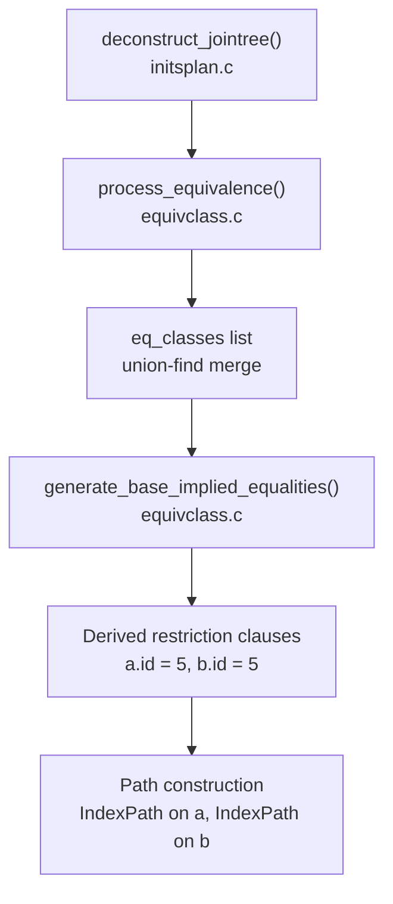

# Equivalence Classes

An equivalence class is the planner's representation of a set of expressions that are provably equal across every row surviving the query's WHERE clause. If the query contains `a.id = b.id`, the planner groups `a.id` and `b.id` into one equivalence class. If `b.id = c.id` also appears, the same class expands to `{a.id, b.id, c.id}`. This seemingly simple bookkeeping unlocks a chain of optimizations that would otherwise be impossible: derived restriction clauses, index scans driven by foreign constants, redundant clause elimination, and sort-ordering interchangeability.

The mechanism is deliberately invisible to developers and to the executor. It operates entirely inside the planner during query initialization, before any path or plan node is constructed.

## Building the Classes

Equivalence class construction happens during `deconstruct_jointree()` in `src/backend/optimizer/plan/initsplan.c`, which walks the parsed join tree processing WHERE clauses and JOIN ON clauses. Every time it encounters a mergejoinable equality — an equality operator whose operator family supports B-tree merge ordering — it calls `process_equivalence()` in `src/backend/optimizer/path/equivclass.c`.

`process_equivalence()` performs a union-find operation across the existing classes. Given a new equality `X = Y`, it scans `root->eq_classes` looking for any class that already contains an expression equal to `X` or `Y`:

- If both are found in the same class, the equality is already known — `process_equivalence()` records it as a source but creates no new class.
- If they are in different classes, `process_equivalence()` merges the two classes into one.
- If only one side is found, `process_equivalence()` adds the other expression to that class.
- If neither is found, `process_equivalence()` creates a new two-member class.

The comment in the source describes this as a standard UNION-FIND problem (`equivclass.c`: "Note: constructing merged EquivalenceClasses is a standard UNION-FIND problem"). The resulting classes accumulate in `PlannerInfo.eq_classes`.

An `EquivalenceClass` node (`pathnodes.h`) represents each class. Its key fields are:

| Field | Purpose |
|---|---|
| `ec_members` | List of `EquivalenceMember` nodes, one per expression |
| `ec_opfamilies` | B-tree operator family OIDs that define "equal" for this class |
| `ec_collation` | Collation used for comparisons |
| `ec_relids` | Union of all base relation IDs appearing in member expressions |
| `ec_has_const` | True if any member is a pseudoconstant (no Vars, no volatile functions) |
| `ec_sources` | Original `RestrictInfo` clauses that generated this class |
| `ec_derives` | Derived `RestrictInfo` clauses synthesized from this class |

Each `EquivalenceMember` wraps one expression and records `em_relids` (which base relations its Vars reference) and `em_is_const` (whether the expression is a pseudoconstant). `process_equivalence()` enforces the restriction that all source equalities must belong to the same B-tree operator family, comparing `ec_opfamilies` with `equal()` before any merge.

## Transitivity and Derived Predicates

The decisive benefit of equivalence classes is that they make transitive equality explicit. A query that contains only `a.id = b.id` and `b.id = c.id` implicitly asserts that `a.id = c.id`, but the parser does not write that clause. Once the planner merges the two equalities into a single class `{a.id, b.id, c.id}`, it records the implied relationship structurally.

When a class also contains a pseudoconstant — as in `WHERE a.id = b.id AND b.id = 5` — the impact is even more direct. The constant `5` becomes a member of the class alongside `a.id` and `b.id`. The function `generate_base_implied_equalities()` (`equivclass.c`) then generates the derived restriction clauses `a.id = 5` and `b.id = 5` and injects them into the planner's restriction lists via `process_implied_equality()`. The planner now has explicit filter clauses on both `a` and `b`, even though the original SQL only mentioned `b.id = 5`.

For classes with no constant member, `generate_base_implied_equalities_no_const()` handles the case where a single base relation exposes multiple members of the same class — for example, `WHERE t.x = t.y`. It generates intra-relation equality clauses so that each relation's scan enforces all of its class obligations before contributing rows to any join.

The sequence that achieves all this:



## Index Scans Across Join Conditions

The most practically visible consequence of equivalence classes is that they allow an index on one table to be driven by a constant that appears in the WHERE clause referencing a different table.

Consider:

```sql
SELECT *
FROM orders o
JOIN customers c ON c.id = o.customer_id
WHERE c.id = 42;
```

Without equivalence classes, the planner would know `c.id = 42` and `c.id = o.customer_id` but would not automatically derive `o.customer_id = 42`. With equivalence classes, the join condition and the filter merge into a class `{c.id, o.customer_id, 42}`. `generate_base_implied_equalities()` produces `o.customer_id = 42` as a derived restriction clause. The planner can use this clause to drive an index scan on `orders(customer_id)`.

This is particularly powerful in nested loop joins. The outer relation (`customers`) produces a value for each probe. The equivalence class propagates that value into the inner scan (`orders`) as an index lookup parameter. Each outer row causes a single index probe on the inner side rather than a full sequential scan followed by a join filter.

For join conditions without a constant, `generate_join_implied_equalities()` handles the cross-join case. When the planner is considering a specific join between an outer relation and an inner relation, it examines all equivalence classes that cover both sides. It synthesizes whichever equality clauses are needed to enforce the class at that join level. This is how the planner generates the join clause `a.id = c.id` from `{a.id, b.id, c.id}` even though the query never wrote that comparison explicitly.

## Redundant Clause Elimination

The union-find merge naturally handles redundant clauses. If a query writes `WHERE a.x = b.x AND b.x = c.x AND a.x = c.x`, all three equalities describe the same class `{a.x, b.x, c.x}`. `process_equivalence()` recognizes the third clause as already-implied when the clause is presented to it. Both its sides are already in the same class, so `process_equivalence()` creates no new class or membership. It simply adds the clause to `ec_sources` without further effect.

During path generation, when the planner needs to enforce the class across a particular join, it picks the most useful pair of members (preferring plain Vars over expressions, and hash-joinable operators over non-hash-joinable ones) and generates exactly one clause for that join. The original redundant clause is never evaluated separately.

## PathKeys and Sort Ordering

Equivalence classes do more than govern restriction and join predicates — they are also the foundation of pathkey reasoning. Pathkey reasoning lets the planner reason about sort orderings without committing to a specific expression.

A `PathKey` struct (`pathnodes.h`) represents one sort key in a path's output ordering. It contains a reference to an `EquivalenceClass` rather than a specific expression:

```
typedef struct PathKey {
    EquivalenceClass *pk_eclass;   /* the value being sorted */
    Oid              pk_opfamily;  /* B-tree opfamily defining the ordering */
    int              pk_strategy;  /* ASC or DESC */
    bool             pk_nulls_first;
} PathKey;
```

When the planner has established that `a.id = b.id` (via any inner join condition), both `a.id` and `b.id` belong to the same class. A path that is sorted on `a.id` carries the pathkey `{EC: {a.id, b.id}, ASC}`. Because the sort key is the class, not the specific column, this pathkey satisfies a request to sort by `b.id` equally well. The optimizer README states the principle: "we can consider a path sorted by any one of them to be sorted by any other too" (`src/backend/optimizer/README`).

This matters for merge join. A merge join on `a.id = b.id` requires both sides to arrive sorted. If the outer side is already sorted on `a.id`, the equivalence class tells the planner that the merge key `a.id` and `b.id` are the same sort key. The merge can then proceed without an additional sort on either side.

It also matters for satisfying ORDER BY. Consider a query with `ORDER BY a.id`, where the planner builds a plan whose final join output is sorted on `b.id`. This can happen because the inner side was indexed on `b.id` and the sort was preserved through the join. The pathkey for `b.id` points to the same equivalence class as `ORDER BY a.id`. The ordering requirement is therefore satisfied without an explicit sort node.

A class that `ec_has_const` is automatically redundant as a sort key. There is only one possible value, so any output is trivially sorted. The macro `EC_MUST_BE_REDUNDANT(ec)` captures this. The planner uses it to drop such sort keys from pathkey lists.

## Outer Join Restrictions

The planner only forms equivalence classes from inner-join conditions and WHERE-clause equalities. A LEFT JOIN's ON clause does not contribute to an equivalence class between its left and right sides.

The reason is that outer join results can include null-padded rows. After `a LEFT JOIN b ON a.id = b.id`, rows where `b` has no match carry `b.id = NULL`, even though `a.id` is not NULL. These rows are not instances of `a.id = b.id`; they are instances of `a.id != NULL` and `b.id = NULL`. If the planner formed the equivalence class `{a.id, b.id}` from the LEFT JOIN condition, it would derive `a.id = 5` from `b.id = 5` and apply it as a restriction on `a`. This would incorrectly discard rows that should appear in the join result.

The planner enforces this by tracking `JoinDomain` membership. Each outer join creates a new join domain comprising its nullable side (`pathnodes.h`). The planner confines equivalence deductions derived from an ON clause to that domain's scope. It never merges constants across domain boundaries.

There is a more limited exception. If `a.x = b.y` is a LEFT JOIN condition and `a.x = 42` is a WHERE-clause predicate, the planner can deduce `b.y = 42` and apply it as a restriction on `b`'s scan. Any `b` row with `b.y != 42` cannot contribute to the join result regardless, because `a.x = 42` has already filtered away its corresponding `a` rows. `reconsider_outer_join_clauses()` (`equivclass.c`) handles this deduction. It runs after the initial class construction and looks for outer-join clauses whose outer side is already equivalenced to a constant. When found, it injects a new `innervar = constant` equality into the class system. `reconsider_outer_join_clauses()` simultaneously replaces the original outer-join clause with a dummy `TRUE` clause that preserves the join's relid linkage without contributing any additional filter.

The planner handles full outer joins similarly, but only for the specific case of a FULL JOIN USING column whose merged expression is equivalenced to a constant. Both sides can then receive the constant as a restriction.

## What Equivalence Classes Do Not Cover

Foreign key constraints and primary key constraints in the catalog do not create equivalence classes. Only equality conditions actually written in the query — or derivable from written conditions by transitivity within the rules above — form classes. The existence of a foreign key from `orders.customer_id` to `customers.id` gives the planner no information unless the query also contains an explicit join condition `orders.customer_id = customers.id`.

Similarly, partial equality information does not apply: `a.x LIKE b.x || '%'` is not a mergejoinable equality. It therefore creates no equivalence class, and no transitive deductions follow from it. Only operators in a B-tree operator family's `BTEqualStrategyNumber` slot qualify.

## Observing the Effect

The most direct way to observe equivalence-class-derived predicates is `EXPLAIN VERBOSE`. With VERBOSE output, the planner's filter conditions and index conditions include any derived equality that was not in the original SQL:

```sql
EXPLAIN VERBOSE
SELECT * FROM orders o
JOIN customers c ON c.id = o.customer_id
WHERE c.id = 42;
```

The plan for `orders` will show an index condition or filter of `o.customer_id = 42` even though the original query only stated `c.id = 42`. That derived clause is the work of the equivalence class.

A simpler diagnostic: if `EXPLAIN` shows an index scan on a join table driven by a literal constant, and the WHERE clause only mentions that constant via a different table's column, equivalence classes are why the index can be used at all.

Stale statistics or disabled index access methods can mask this. If the index scan is cheaper than the sequential scan only because of the derived constant, and statistics are stale enough that the planner misjudges selectivity, the plan may fall back to a sequential scan plus join filter. This can happen even when the equivalence class has done its job correctly. `EXPLAIN ANALYZE` will show the discrepancy between estimated and actual rows in that case.

## Related Topics

- [[subsystems/planner/join-ordering|Join Ordering]] — equivalence classes drive `has_eclass_joins` flags that determine which relation pairs the planner considers joinable, directly shaping the join search space
- [[subsystems/planner/index-selection|Index Selection]] — derived restriction clauses generated from equivalence classes are the primary mechanism by which a constant on one table enables an index scan on another
- [[subsystems/planner/restrict-info|RestrictInfo]] — the `RestrictInfo` nodes stored in `ec_sources` and `ec_derives` are the link between equivalence class bookkeeping and the clause lists consulted during path construction
- [[subsystems/planner/sort-avoidance|Sort Avoidance]] — PathKey reasoning, which is built on top of equivalence classes, is the mechanism the planner uses to avoid explicit sort nodes by exploiting pre-existing orderings
- [[subsystems/planner/join-method-selection|Join Method Selection]] — merge join correctness depends on PathKey equivalence: two paths sorted on different members of the same class are treated as compatibly ordered for merge join purposes
- [[subsystems/planner/predicate-pushdown|Predicate Pushdown]] — equivalence-class-derived predicates are injected into base-relation restriction lists, achieving pushdown of constants across join conditions without any explicit pushdown logic
- [[subsystems/planner/selectivity-estimation|Selectivity Estimation]] — derived equality clauses produced by equivalence classes are subject to the same selectivity calculations as user-written clauses, so stale statistics on join columns can distort the benefit of index probes
- [[subsystems/planner/cost-model|Cost Model]] — parameterized index paths driven by equivalence-class-derived constants are costed as per-row probes using the same formulas as any other index path
- [[subsystems/locking/predicate-locking|Predicate Locking]] — a separate predicate-tracking system used for serializable isolation, with a different scope from planner equivalence classes
- [[subsystems/storage/hot|HOT Updates]] — an unrelated use of "equivalence" terminology in the heap-only-tuple update mechanism; not the same concept as planner equivalence classes
