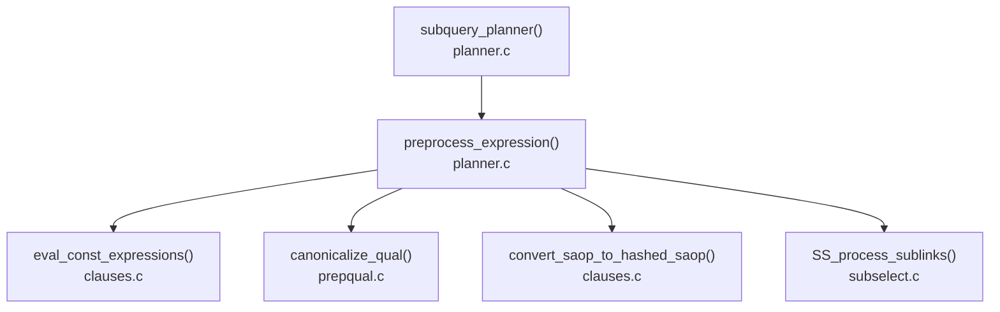

# Expression Preprocessing and Constant Folding

Before the planner builds access paths and assigns costs, it simplifies every expression tree in the query. This preprocessing pass (`eval_const_expressions()`, `clauses.c`) runs early in `subquery_planner()`, before path enumeration begins, via the internal wrapper `preprocess_expression()` (`planner.c`). It is applied to every part of the query: the WHERE clause, the target list, HAVING, join conditions, ORDER BY and LIMIT expressions, and range-table function arguments.

The simplifications matter for three distinct reasons. Fewer nodes in the expression tree mean fewer CPU operations at execution time. Some transformations expose index opportunities that would otherwise be invisible — a non-constant right-hand side of a comparison blocks index use; folding it to a constant restores that use. Simplified expressions also interact better with the selectivity estimation machinery: the histogram and most-common-value statistics are keyed on operators and column references in their canonical forms.



`eval_const_expressions()` itself is a thin wrapper. It initialises context and delegates to `eval_const_expressions_mutator()`, a recursive tree-walker that replaces each node with its simplified form. The context carries the query's bound parameters (relevant for prepared statements), a stack of active function expansions (for recursion prevention during inlining), and a flag distinguishing the "safe" planning path from the more aggressive estimation path used by the statistics machinery.

## Constant folding

The most basic transformation is evaluating expressions whose inputs are all known at planning time. `eval_const_expressions()` can execute immediately any operator or function call whose arguments have all reduced to `Const` nodes, replacing it with the resulting constant. `2 + 2` becomes the integer constant `4`. `'2024-01-01'::date + interval '1 day'` becomes the date constant `'2024-01-02'`. These reductions happen recursively from the leaves up, so composite expressions like `extract(epoch from now()) / 86400.0` can collapse to a single float if the inputs allow it.

Folding applies only to functions and operators marked `IMMUTABLE` in `pg_proc`. `eval_const_expressions()` does not fold a function marked `STABLE` during normal planning — `evaluate_function()` (`clauses.c`) explicitly checks `funcform->provolatile == PROVOLATILE_IMMUTABLE` and returns `NULL` otherwise, leaving the call in place. The planner must never pre-evaluate a `VOLATILE` function, because it may return different results on every call. Pre-evaluation would produce the wrong row-per-call semantics.

`eval_const_expressions()` reduces a function call with a constant-NULL argument and a `proisstrict` annotation to NULL, without executing the function at all. A strict function by definition returns NULL whenever any input is NULL, so evaluation can be skipped entirely.

The folding logic also handles the case where a strict function's NULL argument is the only non-constant input; in that case the entire expression collapses to a typed null constant regardless of what the remaining non-constant arguments might be.

### Stability and index use

The practical consequence of the IMMUTABLE/STABLE distinction appears in common query patterns:

```sql
-- The right-hand side folds to a single timestamp constant at plan time
WHERE created_at > now() - interval '7 days'
```

`now()` is `STABLE`, not `IMMUTABLE` — it returns the same value within a transaction but can vary across transactions. During normal constant folding, the planner therefore does not fold the subtraction. However, the planner evaluates `now()` once per transaction. The interval subtraction operator is `IMMUTABLE`, so once `now()` is known, the result is constant for that planning invocation. In practice the planner does evaluate `now()` at plan time (since `now()` is called from a stable context at planning). The right-hand side then becomes a constant that the index machinery can use directly.

Contrast this with a `VOLATILE` function:

```sql
-- random() is VOLATILE; the planner cannot fold the comparison value
WHERE x > random()
```

Here no constant folding is possible. The RHS stays as a function call node. The selectivity estimator sees this as a non-constant expression. It cannot look up a histogram bucket for it, so it falls back to a generic 0.5 selectivity estimate. As a result, the planner cannot select an index for this filter on `x` via a normal index scan qual.

### Bound parameters in prepared statements

When a prepared statement is executed with `EXECUTE`, the bound parameter values are available at re-planning time as a `ParamListInfo` attached to `root->glob->boundParams`. `eval_const_expressions_mutator()` checks each `Param` node against this list; if the parameter is flagged `PARAM_FLAG_CONST`, it replaces the `Param` node with a `Const` node carrying the actual value. This means that for prepared statements, constant folding sees the actual parameter values and can apply all the same reductions as a plain query.

## SQL function inlining

`eval_const_expressions_mutator()` calls `simplify_function()` for every `FuncExpr` and `OpExpr` node it encounters. For simple SQL functions, `simplify_function()` delegates to `inline_function()` (`clauses.c`). `inline_function()` re-parses the function body and substitutes the call's actual arguments into the body expression, effectively erasing the function boundary.

The value of inlining is that the planner then sees the expanded expression. A function like:

```sql
CREATE FUNCTION active_orders(cid int) RETURNS bigint
LANGUAGE sql STABLE AS $$
  SELECT count(*) FROM orders WHERE customer_id = cid AND status = 'active'
$$;
```

When called as `WHERE active_orders(o.customer_id) > 5`, without inlining the planner sees only a STABLE opaque function call returning a bigint. With inlining it sees the full subquery, can push the `status = 'active'` predicate to an index, and estimates selectivity from actual statistics on the `orders` table.

`inline_function()` enforces a conservative set of preconditions before attempting the substitution. The function must be SQL-language, non-set-returning, non-security-definer, and not returning RECORD. Its body must parse to a single SELECT statement with a single expression in the target list — no FROM clause, no WHERE, no aggregation, no sublinks, no CTEs. These checks are literal field-by-field tests on the parsed `Query` structure (`clauses.c`, around line 4683). A function that passes those structural tests still fails inlining if its body contains mutable functions (for an IMMUTABLE wrapper) or volatile functions (for a STABLE wrapper) — the volatility contract must be preserved.

`inline_function()` also blocks inlining for VOLATILE functions. It does not inline a VOLATILE SQL function, because inlining changes the number of times its body is evaluated. A non-inlined call inside a row-level filter is invoked once per passing row. If the body is VOLATILE and references a side effect, placing the expanded body inline could change semantics.

If any argument expression is used more than once in the body, inlining checks that the argument is cheap (no subplans, cost below a threshold of 10 operators). Inlining an expensive or volatile argument multiple times would be wrong.

When `inline_function()` successfully inlines a function, it adds the function's OID to `root->glob->invalItems`. This ensures the plan's dependency set still includes the function, so a later `CREATE OR REPLACE FUNCTION` invalidates cached plans that no longer contain a direct reference to it.

## NOT pushdown and Boolean simplification

When `eval_const_expressions_mutator()` encounters a `NOT` expression, it calls `negate_clause()` (`prepqual.c`) on the already-simplified argument, rather than merely wrapping it in a new `NOT` node. `negate_clause()` applies a set of algebraic rules:

- **Double negation**: `NOT (NOT x)` → `x`. `negate_clause()` returns the inner NOT's single argument directly.
- **Operator negation**: `NOT (a < b)` → `a >= b`, using the operator's negator from `pg_operator`. This replaces the NOT node with a single comparison operator. That operator is cheaper to evaluate, and it is a form the selectivity estimator understands directly.
- **De Morgan's laws**: `NOT (a AND b)` → `(NOT a OR NOT b)`, and `NOT (a OR b)` → `(NOT a AND NOT b)`. `negate_clause()` recursively negates each sub-clause.
- **NullTest flip**: `NOT (x IS NULL)` → `x IS NOT NULL`, and vice versa (for scalar types; row-type NullTest is not flipped because the two forms are not logical inverses).
- **Boolean test flip**: `NOT (x IS TRUE)` → `x IS NOT TRUE`, and similar for IS FALSE, IS UNKNOWN.

The source comment states the motivation for preferring De Morgan transformations, even when they increase the node count: exposing top-level AND/OR structure is valuable. The qual-canonicalisation pass that runs after `eval_const_expressions()` can flatten adjacent AND and OR levels. It can then produce normal forms that match stored predicate-implication knowledge.

A related simplification handles expressions like `x = false` or `true <> x`, which the parser can generate from boolean comparisons. `eval_const_expressions_mutator()` rewrites these to `NOT x` and immediately runs them back through `negate_clause()`, eliminating the comparison entirely.

## Boolean short-circuiting

`simplify_or_arguments()` and `simplify_and_arguments()` process the argument lists of OR and AND nodes respectively. Both remove constant branches and detect terminal conditions:

- In an OR, a constant TRUE forces the whole expression to TRUE. `simplify_or_arguments()` simply drops a constant FALSE. If all branches are FALSE, the whole OR is FALSE. A single surviving branch replaces the OR node entirely.
- In an AND, a constant FALSE forces the whole expression to FALSE. `simplify_and_arguments()` drops a constant TRUE. If all branches are TRUE, the whole AND is TRUE.

Both functions also flatten nested ORs and ANDs into a single N-argument form. If an OR contains another OR as an argument, `simplify_or_arguments()` splices the inner OR's arguments into the outer list. This N-argument flattening is important for the selectivity estimator. The selectivity estimator adds up individual per-clause selectivities across AND arms.

## CASE simplification

`eval_const_expressions_mutator()` processes CASE expressions branch by branch. Each WHEN condition is simplified first. If it reduces to a constant FALSE or NULL, the mutator drops that branch without simplifying the branch's result expression. This avoids errors in dead branches like `CASE WHEN false THEN 1/0 ELSE 0 END`. If a WHEN condition reduces to TRUE, that branch's result expression becomes the default result. The mutator discards all subsequent branches. If all branches are eliminated, the mutator replaces the CASE expression with its ELSE expression.

For the `CASE expr WHEN val ...` form, if the test expression simplifies to a constant, the planner substitutes that constant for `CaseTestExpr` placeholder nodes throughout the remaining branches. This allows branch conditions to be folded against the known test value.

A CASE reduced to a single surviving branch with a constant TRUE condition becomes just its result expression — the CASE node disappears. This means that query rewrites or views that generate defensive CASE patterns around constants will not pay any execution overhead.

## COALESCE simplification

The mutator simplifies `COALESCE` left-to-right. It drops a constant NULL argument. If it reaches a constant non-NULL argument before any non-constant argument, it replaces the COALESCE with that constant directly. If it reaches a constant non-NULL argument after some non-constant arguments, it drops all remaining arguments after it — they can never be reached.

```sql
-- Simplifies to just 'default' (a constant) at planning time
COALESCE(NULL, NULL, 'default', some_function())
```

## ScalarArrayOpExpr and IN lists

The parser parses `IN (1, 2, 3)` as `x = ANY(ARRAY[1, 2, 3])`, representing it as a `ScalarArrayOpExpr` node. During `eval_const_expressions()`, the mutator folds the array argument `ARRAY[1, 2, 3]` to a single `Const` node carrying an `ArrayType` datum. The `ScalarArrayOpExpr` then has a constant array. This opens two optimisations.

First, if all arguments to the `ScalarArrayOpExpr` are constants, the whole expression folds to a boolean constant at plan time, just like any other constant operator call.

Second, after `eval_const_expressions()` returns, `preprocess_expression()` calls `convert_saop_to_hashed_saop()` on qualifying expressions. If the constant array has at least `MIN_ARRAY_SIZE_FOR_HASHED_SAOP` elements (currently 9, `clauses.c:2251`) and a hash function exists for the element type, the executor will evaluate the `ANY` test by building a hash table over the array at execution startup rather than scanning it linearly. The threshold reflects the crossover point where hash lookup beats linear scan; at 9 elements the savings are marginal but the constant factor favours hashing.

For selectivity estimation, `scalararraysel()` (`selfuncs.c`) handles a `ScalarArrayOpExpr` with a constant array. It iterates the array elements and combines per-element selectivities.

## Effect on EXPLAIN output

`EXPLAIN` shows the preprocessed expression tree, not the original SQL text. After preprocessing, the plan's qual nodes are the simplified forms. A query written with `WHERE x = 1 OR x = 2` may have gone through OR simplification and appear in the plan as `x = ANY('{1,2}'::integer[])` if the parser generated a `ScalarArrayOpExpr`. A `WHERE created_at > now() - interval '7 days'` will show a concrete timestamp literal on the right-hand side if the subtraction was folded. An inlined SQL function will not appear as a function call at all — its body expression will appear directly in the qual list.

This disconnect between written SQL and plan output is not a display artifact. The plan operates on the simplified form, and the executor never sees the original expression tree.

## Developer implications

A function wrapping an otherwise-constant computation benefits from being declared `STABLE` rather than `VOLATILE`. With STABLE, the planner is free to fold the function's result once per plan rather than evaluating it per row. With VOLATILE, every comparison involving the function is a per-row call. Constant folding stops at that node, and any index path requiring a constant on the comparison's right-hand side is unavailable.

SQL function inlining is the mechanism by which wrapping logic in a SQL function does not automatically create a planning barrier. Provided the function is a single SELECT expression (no joins, no FROM, no aggregation), the planner will inline it and see the underlying expression. The planner will inline a STABLE SQL function returning a scalar from a single-row lookup and cost its subquery in context. The barrier only arises when the structural conditions for inlining fail — when the function body has a FROM clause, aggregation, or is VOLATILE.

A VOLATILE function anywhere in a WHERE clause prevents constant folding of every expression that depends on it, not just the function call itself. A composite expression like `x > volatile_fn() + 1` leaves both the addition and the comparison as runtime operations even though the `+ 1` step is itself immutable — the input to that addition is not constant.

## See also

- [[subsystems/planner/overview]] — where preprocessing fits in the planning pipeline
- [[subsystems/planner/cost-model]] — how folded constants affect row estimates
- [[subsystems/planner/index-selection]] — how constant RHS values enable index quals
- [[subsystems/planner/generic-plans]] — how bound parameter folding interacts with plan caching
