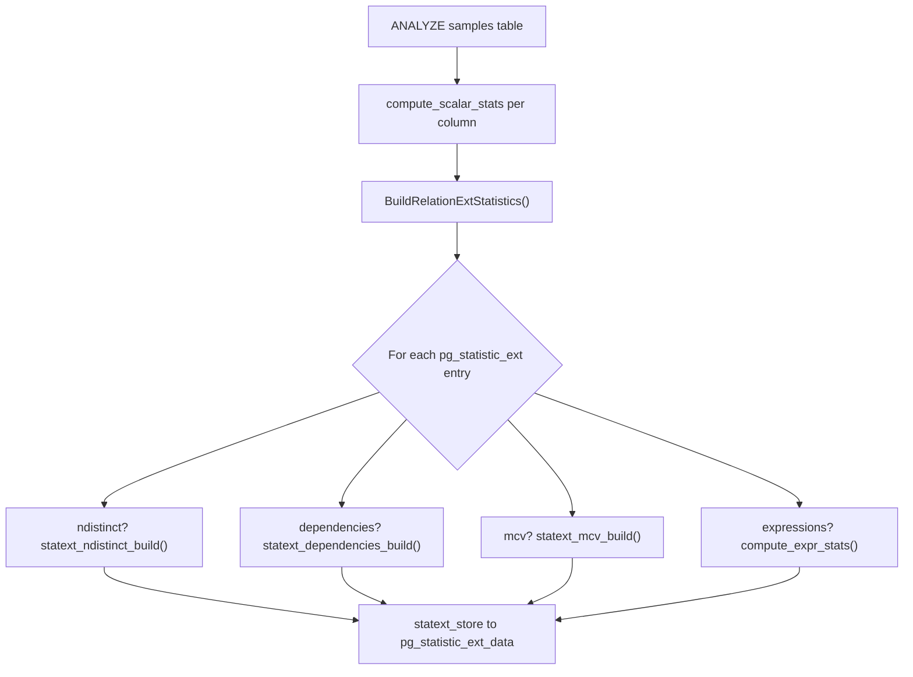
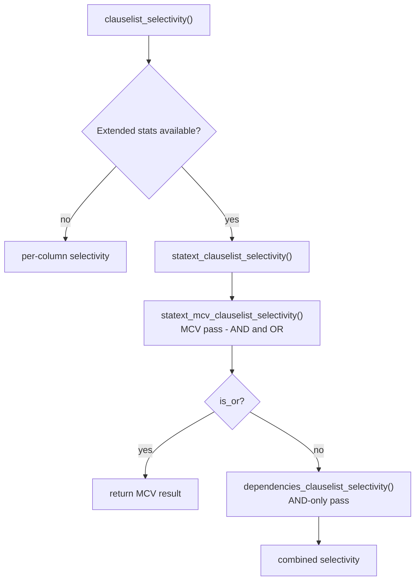

# Extended Statistics

Extended statistics store cross-column information that the planner cannot derive from `pg_statistic`'s per-column histograms and most-common-value lists. That gap is what forces the planner to assume independence between columns when it has nothing else to go on. They live in the `pg_statistic_ext` / `pg_statistic_ext_data` catalog pair, are populated by [[code-paths/analyze|ANALYZE]] through `BuildRelationExtStatistics()`, and are consumed during planning by the extended-statistics branch of `clauselist_selectivity()`. This page covers that catalog layout, the ANALYZE-time build process, and how the planner's selectivity code consumes the result; for `CREATE STATISTICS` syntax, when to reach for each statistics kind, and diagnosing correlation problems from SQL, see [[sql-features/create-statistics|CREATE STATISTICS and Extended Statistics]].

## Catalog layout

`pg_statistic_ext` (OID `3381`) stores the definition of a statistics object: which columns or expressions it covers and which kinds were requested.

| Field | Type | Meaning |
|---|---|---|
| `stxrelid` | `oid` | Relation the statistics cover |
| `stxname` | `name` | Statistics object name |
| `stxkeys` | `int2vector` | Attribute numbers of covered columns |
| `stxkind` | `char[]` | Requested kinds: `'d'` ndistinct, `'f'` dependencies, `'m'` MCV, `'e'` expressions |
| `stxexprs` | `pg_node_tree` | Expression trees for non-column statistics targets |
| `stxstattarget` | `int16` | Per-object statistics target; NULL means use column or global default |

`pg_statistic_ext_data` (OID `3429`) stores the data ANALYZE computed, one row per `(stxoid, stxdinherit)` pair so that inherited and non-inherited variants can coexist.

| Field | Type | Meaning |
|---|---|---|
| `stxoid` | `oid` | References `pg_statistic_ext` |
| `stxdinherit` | `bool` | Whether inheritance children were included |
| `stxdndistinct` | `pg_ndistinct` | Serialised ndistinct coefficients |
| `stxddependencies` | `pg_dependencies` | Serialised dependency data |
| `stxdmcv` | `pg_mcv_list` | Serialised MCV list |
| `stxdexpr` | `pg_statistic[]` | Per-expression statistics, same format as `pg_statistic` |

The split mirrors `pg_class` / `pg_statistic`. The definition persists across ANALYZE cycles and carries DDL ownership. The data row, by contrast, is replaced wholesale each time ANALYZE runs. The `pg_stats_ext` view joins both into a human-readable form.

## Building statistics during ANALYZE

Once ANALYZE has sampled the table and computed per-column statistics, it calls `BuildRelationExtStatistics()` (`extended_stats.c`). This function fetches every `pg_statistic_ext` row for the relation via `fetch_statentries_for_relation()`. For each one, it:

1. Confirms every covered column was included in this ANALYZE run (`lookup_var_attr_stats()`) — a statistics object is skipped entirely if any of its columns is missing from the sample, such as after a column-restricted `ANALYZE table (col)`.
2. Computes the effective statistics target via `statext_compute_stattarget()`: the minimum of the per-object target (`stxstattarget`), the maximum of the participating columns' per-column targets, and `default_statistics_target`. A target of 0 skips rebuilding, leaving whatever data was previously collected in place.
3. Runs the build function for each requested kind against the sample rows already collected for per-column statistics — no additional table scan is performed.
4. Writes the results to `pg_statistic_ext_data` via `statext_store()`.



### ndistinct

`statext_ndistinct_build()` (`mvdistinct.c`) iterates every subset of the covered columns and calls `ndistinct_for_combination()`. This function applies the same Haas-Stokes estimator used for per-column `n_distinct`. For columns `(a, b, c)` this produces coefficients for `(a,b)`, `(a,c)`, `(b,c)`, and `(a,b,c)` — the single-column estimates already exist in `pg_statistic`. `statext_ndistinct_build()` stores each subset as an `MVNDistinctItem` (`statistics.h`), using the same sign convention as `stadistinct`: positive is an absolute count, negative is a fraction of total rows.

### dependencies

`statext_dependencies_build()` (`dependencies.c`) sorts the sample rows by each candidate determinant column set and, for every distinct value of the determinant, counts how many distinct values appear in the dependent column. The fraction of rows where only one dependent value appears is the *degree*: 1.0 means the determinant perfectly predicts the dependent column, 0.0 means no relationship. `statext_dependencies_build()` keeps only combinations with a non-zero degree, serialized as `MVDependency` entries into `stxddependencies`.

### mcv

`statext_mcv_build()` (`mcv.c`) sorts the sample rows lexicographically across the covered columns and groups them into distinct value combinations. It discards groups below a statistical significance threshold (`get_mincount_for_mcv_list()`) and keeps the top N by frequency, where N is the effective statistics target. Each retained `MCVItem` stores the combination's values, null flags, the observed `frequency`, and the `base_frequency` — the frequency the independence assumption would have predicted for that combination. The gap between the two is what lets the planner detect correlation for that specific value combination. `statext_mcv_build()` caps the list at `STATS_MCVLIST_MAX_ITEMS` (10,000) and serializes it into `stxdmcv`.

### expressions

`compute_expr_stats()` evaluates each declared expression for every sample row and computes ordinary single-column statistics over the results, storing them in `stxdexpr` using the same layout as `pg_statistic`. This feeds expression values into the same ndistinct/dependencies/mcv machinery used for plain columns.

## How the planner consumes extended statistics

`clauselist_selectivity()` (`clausesel.c`) calls `statext_clauselist_selectivity()` (`extended_stats.c`) whenever the relation has at least one usable extended statistics object. When more than one object could apply to a given kind, `choose_best_statistics()` picks the one covering the most not-yet-estimated clause columns, preferring fewer total keys to break ties.

Estimation runs in two passes:

1. **MCV pass** — In each round, `statext_mcv_clauselist_selectivity()` greedily selects the statistics object covering the most remaining clause attributes. It sums the frequencies of matching MCV entries and marks those clauses in `estimatedclauses` so later estimators skip them. It then repeats. This pass handles both AND and OR clause lists. It blends the MCV-covered mass with a per-column estimate for the uncovered tail via `mcv_combine_selectivities()`.
2. **Dependencies pass** — `dependencies_clauselist_selectivity()` applies functional dependencies to whatever AND clauses the MCV pass left unestimated, selecting the strongest applicable dependency via `find_strongest_dependency()` (most covered attributes, then highest degree).

Given a dependency `a → b` with degree `f` and per-column selectivities `P(a)` and `P(b)`, the planner combines the two as:

```
P(a, b) = f × min(P(a), P(b)) + (1 − f) × P(a) × P(b)
```

The first term covers the fraction of rows consistent with the dependency, whose combined selectivity cannot exceed the more selective column's own selectivity; the second term covers the remainder, treated as independent. A perfect dependency (`f = 1.0`) collapses the estimate to `min(P(a), P(b))`. For chains of dependencies (`a → b → c`), the planner replaces the implied attribute's selectivity with the corresponding conditional-probability form of this formula before folding it into the product for the whole clause list. Dependencies therefore compose along the chain rather than being applied independently of each other.

Later estimators never revisit clauses marked in `estimatedclauses` by either pass. Anything left over — clauses with no covering statistics object — falls back to ordinary per-column selectivity estimation.



## Related Topics

- [[sql-features/create-statistics|CREATE STATISTICS and Extended Statistics]] — SQL syntax, when to use each statistics kind, diagnosing correlation problems, and practical limitations
- [[subsystems/planner/selectivity-estimation|Selectivity Estimation]] — the per-column selectivity machinery that extended statistics correct when columns are correlated
- [[subsystems/planner/statistics|Statistics]] — the base `pg_statistic` catalog and per-column statistics that extended statistics complement
- [[subsystems/planner/stale-statistics-and-bad-plans|Stale Statistics and Bad Plans]] — how outdated or missing statistics, including extended statistics, lead to poor plan choices
- [[code-paths/analyze|ANALYZE]] — the command that populates both `pg_statistic` and `pg_statistic_ext_data`
- [[subsystems/planner/cost-model|Cost Model]] — the cost formulas that consume selectivity estimates
- [[subsystems/planner/index-selection|Index Selection]]
- [[subsystems/planner/join-ordering|Join Ordering]]
- [[subsystems/planner/statistics-import|Statistics Import]] — importing statistics across databases, including extended statistics objects
- [[architecture/statistics-data-structures|Statistics Data Structures]] — internal representation of `MVNDistinct`, `MVDependency`, and MCV list structs
