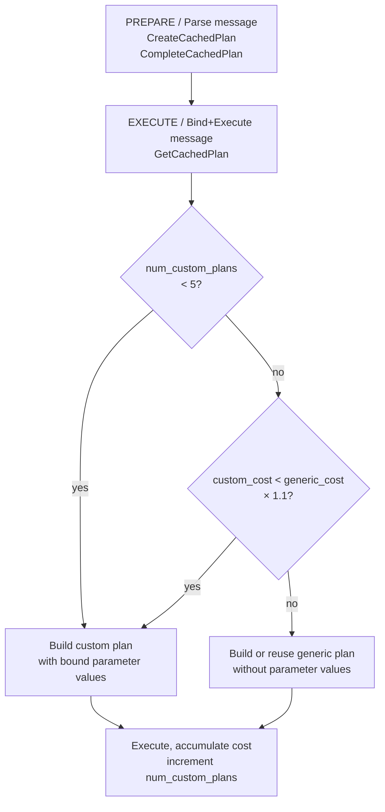

# Generic vs. Custom Plans (Prepared Statements)

When a client issues `PREPARE` or the extended query protocol sends a `Parse` message, PostgreSQL stores the parsed query and later chooses between two planning strategies:

- **Custom plan**: re-plan the query on every execution, substituting the actual parameter values. The planner can use the specific values to make better choices (e.g., pick an index scan for `WHERE id = 42` vs. a sequential scan for `WHERE status = 'pending'`).
- **Generic plan**: plan the query once, treating parameters as opaque placeholders (`$1`, `$2`, …). The plan is reused across executions. Planning cost is paid once, but the plan may be suboptimal for some parameter values.

## Data structures

```c
/* src/include/utils/plancache.h */

typedef struct CachedPlanSource
{
    /* The parsed query tree (lives in context owned by this struct) */
    List       *query_list;          /* list of Query nodes */
    const char *query_string;        /* original SQL text */

    /* Planning statistics */
    double      generic_cost;        /* estimated cost of generic plan */
    double      total_custom_cost;   /* cumulative cost of custom plans so far */
    int         num_custom_plans;    /* executions using custom plan */

    bool        fixed_result;        /* result columns won't change */
    bool        is_oneshot;          /* for portal-level single use */
    bool        is_complete;         /* CompleteCachedPlan has run */

    CachedPlan *gplan;               /* cached generic plan, or NULL */
    ...
} CachedPlanSource;

typedef struct CachedPlan
{
    List       *stmt_list;           /* PlannedStmt list */
    bool        is_oneshot;
    bool        is_saved;            /* in long-lived memory context */
    bool        is_valid;            /* false if invalidated */
    int         generation;          /* incremented on each rebuild */
    ...
} CachedPlan;
```

`CachedPlanSource` is the long-lived object (persists for the lifetime of the prepared statement). `CachedPlan` is the plan itself. Schema changes may invalidate it, causing the planner to discard and rebuild it.

## Planning sequence



## The 5-execution warm-up

For the first five executions, PostgreSQL always builds a custom plan. This generates enough samples to estimate the average custom plan cost (`total_custom_cost / num_custom_plans`).

After five executions, PostgreSQL calls `ChooseCustomPlan()` (`plancache.c`) on every execution:

```c
static bool
ChooseCustomPlan(CachedPlanSource *plansource, ParamListInfo boundParams)
{
    double avg_custom_cost = plansource->total_custom_cost /
                             plansource->num_custom_plans;
    /* Use generic if it's not much more expensive than average custom */
    if (cached_plan_cost(plansource->gplan) < avg_custom_cost * 1.1)
        return false;   /* use generic */
    return true;        /* use custom */
}
```

The 1.1 factor gives a 10% tolerance in favor of the generic plan (to avoid thrashing). If the generic plan costs within 10% of the average custom plan cost, the generic plan wins on account of lower planning overhead.

### When generic plans win

Generic plans are favored when:
- The table is small and the optimizer's choice is unlikely to change with different parameter values.
- The query shape doesn't benefit from parameter-specific statistics (e.g., `LIMIT $1` — the plan is the same regardless of the limit value).
- Planning is expensive (many joins, complex subqueries) and the per-execution planning overhead is significant.

### When custom plans win

Custom plans are favored when:
- Columns have highly skewed data distributions: `WHERE status = $1` where `status = 'active'` covers 1% of rows but `status = 'deleted'` covers 90%.
- The query has parameters that drive index selection: `WHERE id = $1` should use an index, but the generic plan might choose a sequential scan because, without a value, the planner assumes a broad range.
- The table statistics are fresh and precise enough that custom plans reliably outperform.

## plan_cache_mode GUC

The `plan_cache_mode` GUC overrides the automatic choice:

| Value | Behavior |
|---|---|
| `auto` (default) | Use the heuristic above |
| `force_generic_plan` | Always use a generic plan after the first execution |
| `force_custom_plan` | Always re-plan with bound parameter values |

```sql
SET plan_cache_mode = force_custom_plan;  -- per-session override
```

`force_custom_plan` is useful when parameter skew causes bad generic plans. `force_generic_plan` reduces planning overhead for OLTP workloads with many executions of simple queries.

## Plan invalidation

A `CachedPlan` is invalidated when:

- A referenced table is modified by DDL (detected via relation cache invalidation callbacks).
- A function used in the query is redefined.
- A search path or other session parameter that affects name resolution changes.

Invalidation sets `plan->is_valid = false`. The next `GetCachedPlan` call detects this. It calls `RevalidateCachedQuery()` to re-parse and potentially re-plan, and it resets the custom/generic statistics. `GetCachedPlan` increments the generation counter (`plan->generation`) so that any portal currently executing the old plan can safely finish before the planner frees it.

## Extended query protocol vs. PREPARE

The extended query protocol (used by libpq, JDBC, etc.) creates a server-side `CachedPlanSource` for each `Parse` message. An unnamed prepared statement (`""`) is a single-use plan source that is discarded after the next `Sync`. Named prepared statements (`PREPARE foo AS …`) persist until the session ends or `DEALLOCATE` is called.

PL/pgSQL also uses `CachedPlanSource` internally for each SQL statement in a function body; it always uses custom plans for the first execution and then follows the same heuristic.

## Observability

```sql
-- Inspect cached plans
SELECT name, statement, prepare_time, calls, generic_plans, custom_plans
FROM pg_prepared_statements;
```

`generic_plans` and `custom_plans` columns (PG 16+) show how many executions used each strategy for the current session's prepared statements.

## See also

- [[subsystems/planner/overview]] — how the planner produces PlannedStmt from a Query
- [[subsystems/planner/statistics]] — why statistics quality determines whether custom plans win
- [[subsystems/planner/cost-model]] — how generic_cost and custom_cost are computed
- [[code-paths/extended-query]] — the Parse/Bind/Execute protocol cycle
