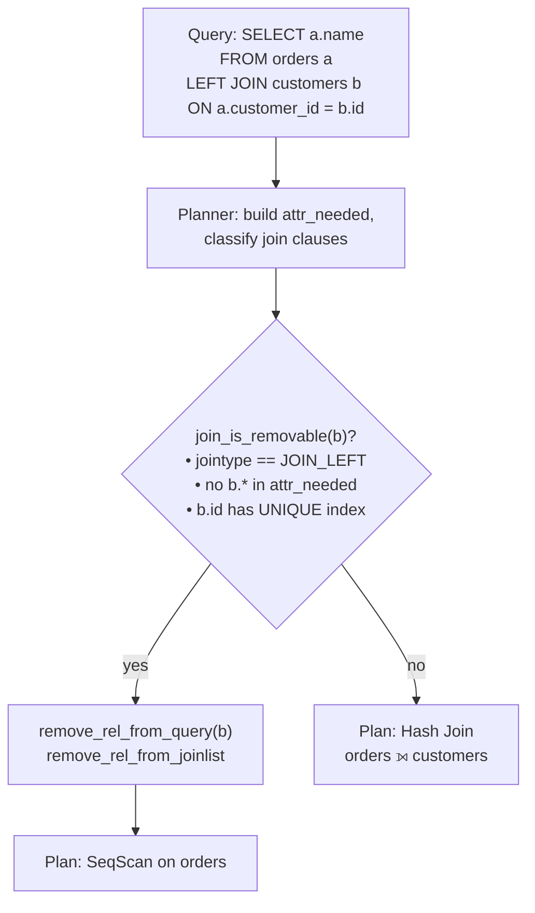

# Join Elimination

The PostgreSQL planner can remove a join entirely from the plan — not just strengthen it from LEFT to INNER, but delete the joined relation from the query tree so that no join node appears in the executor plan at all. This is join elimination. It applies when the joined table contributes nothing to the query's result: none of its columns are selected, filtered on, grouped by, ordered by, or otherwise referenced above the join. Suppose the planner can further prove that the join can never produce more than one matching row per outer row. Then executing the join would simply duplicate the outer relation's rows — or in the LEFT JOIN case, pad them with NULLs that are immediately discarded. Either way, the join is useless, and the planner can remove it.

The gain is not just planning-time simplicity. The eliminated table disappears from the plan entirely: no scan, no join node, no potential filter. Some ORM-generated queries defensively join a lookup table "in case" it is needed. For these, elimination means the join costs nothing when no column from the lookup table is actually projected.

## When a Join Is Removable

`remove_useless_joins()` and `join_is_removable()` (`src/backend/optimizer/plan/analyzejoins.c`) implement join elimination. `query_planner()` (`src/backend/optimizer/plan/planmain.c`) invokes them after the planner has built base-relation data structures and classified all join and restriction clauses. That timing matters. The planner needs `attr_needed` bitmaps, which track which relations require each attribute. It needs them before it can confirm that nothing above the join consumes any output of the candidate relation.

`remove_useless_joins()` scans `root->join_info_list`, the list of `SpecialJoinInfo` nodes that describes every explicit outer join in the query. For each entry, it calls `join_is_removable()`. This applies a battery of checks:

**The join must be a LEFT JOIN to a single base relation.** The implementation currently handles only `JOIN_LEFT` with a single-rel right-hand side. A different path handles inner joins that are candidates for removal: `reduce_outer_joins()` (`prepjointree.c`) can promote a LEFT join to INNER first. Then `remove_useless_joins()` can potentially remove what remains, if the conditions below hold after further analysis. The initial check, though, gates on `JOIN_LEFT`.

**No attribute of the inner relation may be needed above the join.** The check walks `innerrel->attr_needed[]`, a per-attribute bitmap of which relations require that attribute. If any attribute's bitmap extends beyond the input relids of the join itself — meaning something above the join references it — the planner blocks elimination. This single check rules out SELECT lists, WHERE clauses, HAVING conditions, ORDER BY expressions, and anything else that has caused the planner to record a need for the attribute. The planner applies a parallel check to the `PlaceHolderVar` list, to handle expressions it wrapped in a placeholder during subquery pullup.

**The join condition must make the inner relation provably unique.** Even if the query projects no inner columns, a non-unique join key means one outer row could match multiple inner rows. The join would multiply rows, even though the extra copies are never used downstream. With a LEFT JOIN, the join would pass through the outer row unmodified when there is no match, but could duplicate it when there are multiple matches. The planner therefore requires proof that at most one inner row can match any given outer row.

`rel_is_distinct_for()` performs this uniqueness proof. For a plain table, it calls `relation_has_unique_index_for()` (`src/backend/optimizer/path/indxpath.c`). That function walks the table's `rel->indexlist` looking for a unique index that covers every column referenced by the join conditions. The index must be:

- marked `unique` and `immediate` (not a deferrable unique constraint),
- not a partial index (`indpred == NIL`).

The planner excludes partial indexes because uniqueness holds only over the rows that satisfy the partial index predicate. At this stage, it cannot verify that the join is similarly restricted. The planner excludes deferred unique constraints because they are not guaranteed to hold at the time the query runs.

A query like:

```sql
SELECT a.name
FROM orders a
LEFT JOIN customers b ON a.customer_id = b.id;
```

passes all checks if `customers.id` has a unique (or primary key) index. The planner sees that `b` has no attributes in `attr_needed` for anything above the join. It also sees that the join condition `a.customer_id = b.id` covers the unique key of `b`. The planner removes the join. The plan becomes a plain sequential scan of `orders`.

The same elimination applies when a chain of LEFT JOINs ends in a useless table. `remove_useless_joins()` restarts its scan after each removal. Removing one table can update `attr_needed` in ways that make a previously ineligible join newly removable.

## The Uniqueness Requirement vs. Foreign Keys

It might seem natural to use a foreign key constraint here: if `orders.customer_id` is a FK referencing `customers.id`, the join produces exactly one match per order row. PostgreSQL does not exploit FK constraints for join elimination, however. Foreign keys can be declared `NOT VALID` (meaning past data was not checked at definition time). Even a fully validated FK can have deferred enforcement. Using an FK to prove uniqueness of the inner relation would mean reasoning about what rows exist — a data-level claim. The planner cannot guarantee such a claim holds at execution time.

Unique indexes are different. A `UNIQUE` or `PRIMARY KEY` constraint enforces a structural property at write time — unless the constraint is deferrable. The `immediate` flag check in `rel_supports_distinctness()` and `relation_has_unique_index_for()` screens out deferred constraints. For immediately-enforced unique indexes, the planner can trust that no two rows share the same key value. This makes the uniqueness proof purely structural.

This is the reverse of the situation for outer-join-to-inner promotion (`reduce_outer_joins()` in `prepjointree.c`). That transformation needs to know that a strict WHERE clause would reject a NULL that the LEFT JOIN produces — a claim about the query's filter structure, not about the data. Join elimination needs to know that no duplicate inner rows exist — a claim about the inner relation's data structure. Only a unique index safely provides that guarantee.

## What the Plan Looks Like

When the planner eliminates a join, it calls `remove_rel_from_query()` to scrub all references to the removed relation from the planner's data structures: `attr_needed` bitmaps, equivalence classes, join clause lists, `SpecialJoinInfo` entries, and placeholder lists. The planner frees the relation's `RelOptInfo`. The join no longer appears in the joinlist, so the join search never considers it. No join node of any kind appears in the final plan.



EXPLAIN output reflects this directly. Without elimination:

```
Hash Left Join
  Hash Cond: (a.customer_id = b.id)
  -> Seq Scan on orders a
  -> Hash
       -> Seq Scan on customers b
```

With elimination:

```
Seq Scan on orders a
```

The `customers` table simply disappears. No join node, no hash build, no second scan.

## Subquery and UNION Cases

Join elimination applies to more than plain tables on the right-hand side. The `rel_is_distinct_for()` function also handles subquery RTEs by checking whether the subquery's output is provably distinct over the join columns, via `query_is_distinct_for_with_collations()`. A subquery that ends in `GROUP BY`, `DISTINCT`, or a non-`ALL` set operation can satisfy this check. For example:

```sql
SELECT d.*
FROM d
LEFT JOIN (SELECT * FROM b GROUP BY b.id, b.c_id) s
  ON d.a = s.id AND d.b = s.c_id;
```

Here the subquery is distinct over `(id, c_id)` by virtue of its `GROUP BY`. Also, `d.*` references no column from `s`. So the planner eliminates the join.

## Self-Join Elimination (PostgreSQL 18)

PostgreSQL 18 adds a related but distinct optimisation: self-join elimination, implemented in `remove_useless_self_joins()` (`analyzejoins.c`). This targets inner joins where both sides are the same table:

```sql
SELECT a.* FROM t AS a JOIN t AS b ON a.id = b.id WHERE a.id = 5;
```

If the join is on a unique key, each row of `a` can match at most one row of `b`. Since `a` and `b` are the same table, `a.id = b.id` matches exactly the row `a` itself. The planner can replace the inner alias `b` with `a` throughout the query. It then removes the join node.

`query_planner()` calls `remove_useless_self_joins()` immediately after `remove_useless_joins()`. It groups range-table entries that refer to the same relation. For each group, it then checks whether it can collapse the join between any pair. The elimination rewrites Var references from the removed alias to the surviving one. It merges restriction clause lists. It deletes the redundant `RelOptInfo`. This is most valuable for queries that ORM logic generates by unconditionally joining a table to itself, or for cases where equivalence-class derivation produces a redundant self-join condition.

## What Cannot Be Eliminated

**Non-unique join keys.** A one-to-many relationship means one outer row can join to multiple inner rows. Even if the query projects none of those inner rows, the join multiplies rows. Removing it would change the result count. Without a unique index covering the join key, `rel_supports_distinctness()` returns false immediately. The planner does no further analysis.

**Any reference to the inner table.** If the inner table's columns appear anywhere that is not local to the join itself — SELECT list, WHERE, GROUP BY, ORDER BY, HAVING, a lateral subquery above the join, a PlaceHolderVar needed above the join — `attr_needed` or the placeholder check will find it. That blocks elimination. This includes implicit references such as `COUNT(b.id)`.

**Expression join conditions.** The uniqueness check in `relation_has_unique_index_for()` matches join condition expressions against index column expressions. If the join condition involves a non-trivial expression on the inner side that does not correspond to an indexed column, the check fails. The planner similarly excludes partial indexes because it cannot confirm that the join covers only the indexed subset.

**INNER JOIN without outer-join promotion.** `join_is_removable()` only fires on `JOIN_LEFT`. An explicit `INNER JOIN` where the inner side produces no output columns and is unique would logically be removable too, but the current code does not handle this case directly. Instead, it relies on `reduce_outer_joins()` having already done any LEFT-to-INNER conversion. It then trusts that planning the resulting INNER join normally will be harmless: the optimizer will pick the cheapest path anyway, including the possibility of a nested loop with an index on the unique key, which costs essentially nothing.

## Related Topics

- [[subsystems/planner/outer-join-promotion|Outer Join Promotion]] — the complementary transformation that strengthens LEFT JOINs to INNER before elimination is considered, handled by `reduce_outer_joins()` in the same planning phase.
- [[subsystems/planner/join-method-selection|Join Method Selection]] — once joins that cannot be eliminated remain, the planner chooses between hash, merge, and nested-loop strategies for each surviving join.
- [[subsystems/planner/equivalence-classes|Equivalence Classes]] — the equi-join conditions that drive join elimination are also recorded in equivalence classes, which the planner uses to derive additional implied constraints.
- [[subsystems/planner/in-vs-exists-vs-join|IN vs EXISTS vs JOIN]] — discusses when the planner rewrites EXISTS subqueries into joins, which can then become candidates for join elimination.
- [[subsystems/indexes/partial-indexes|Partial Indexes]] — partial indexes are explicitly excluded from the uniqueness proof used by join elimination; understanding why clarifies the structural requirements.
- [[subsystems/planner/constraint-exclusion|Constraint Exclusion]] — a related structural optimisation that uses table constraints to prune scan paths, sharing the theme of using schema-level guarantees to simplify plans.
- [[subsystems/planner/reading-explain|Reading EXPLAIN]] — explains how to confirm in EXPLAIN output that a join has been successfully eliminated, as the joined table simply disappears from the plan.
- [[subsystems/planner/overview|Planner Overview]] — how join elimination fits into the overall planning pipeline.
- [[subsystems/planner/join-ordering|Join Ordering]] — how the planner searches the remaining join space after elimination.
- [[subsystems/planner/subqueries|Subquery Planning and Flattening]] — subquery pull-up, which may introduce joins that are then candidates for elimination.
- [[subsystems/indexes/btree|B-tree Index Internals]] — the unique index structures the elimination check depends on.
