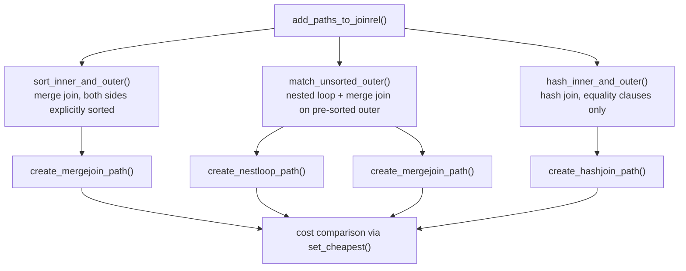

# Join Method Selection

Once the planner has determined which relations to join and in what order (see [[subsystems/planner/join-ordering]]), it must decide *how* to execute each individual join. PostgreSQL has three join algorithms: nested loop, hash join, and merge join. The choice between them has more impact on query performance than almost any other planning decision. A hash join that avoids disk spilling can complete in seconds on tables where a nested loop without an index would run for hours.

The planner evaluates all three methods for every join it considers, generating candidate paths for each viable algorithm and comparing their estimated costs. The function `add_paths_to_joinrel()` in `joinpath.c` orchestrates this: it calls `sort_inner_and_outer()` for merge joins that require explicit sorting, `match_unsorted_outer()` for nested loops and merge joins on pre-sorted inputs, and `hash_inner_and_outer()` for hash joins. The planner passes the cheapest surviving paths up to the next join level.

## Nested Loop

A nested loop join is the conceptually simplest algorithm. For each row on the outer (left) side, the executor scans the inner (right) side looking for matching rows. If the outer side produces `N` rows and each inner scan costs `C`, the total run cost is `N * C`.

The value of `C` depends entirely on what the inner path is. When the join clause matches an index on the inner relation, the inner path is a parameterized index scan: each outer row supplies the join key as a lookup argument. The cost of each inner "scan" is then a single B-tree probe. The planner calls this path *parameterized by* the outer relation. This means the path cannot execute standalone: it requires a value from outside. The planner records this in the path's `param_info` field. It only attaches such paths to nested loops, since hash joins and merge joins must materialize the inner side completely and cannot accept per-row parameters.

When no such index exists, `C` is the full cost of scanning the entire inner relation. With a million-row inner table and a ten-thousand-row outer side, that is ten billion row comparisons. The planner's model (`initial_cost_nestloop()` and `final_cost_nestloop()`, `costsize.c`) computes this faithfully. Startup cost is the sum of both inputs' startup costs. Run cost adds `(outer_rows - 1) * inner_rescan_cost` to account for re-scanning the inner side on every subsequent outer row. For an unindexed inner relation, `inner_rescan_cost` is the full sequential scan cost. The total then explodes.

The power of parameterized nested loops is that an index probe is nearly free in absolute terms — a few page reads, often cached. A join between a `customers` table (outer, say 50,000 rows) and an indexed `orders` table (inner, 10 million rows) can be cheaper as a nested loop than as a hash join, because the hash join must first load all 10 million orders into a hash table.

`match_unsorted_outer()` in `joinpath.c` generates nested loop candidates. For each outer path, it considers several inner-path alternatives: the cheapest total-cost path, the same path wrapped in a Materialize node (which caches the inner result and avoids repeated I/O), the cheapest startup-cost path if different, and any parameterized paths available from `innerrel->cheapest_parameterized_paths`. The last category is how the planner finds the indexed inner path: if the inner relation registered a parameterized index-scan path during base-relation path generation, `match_unsorted_outer()` picks it up here.

Nested loop joins do not work for RIGHT JOIN or FULL JOIN. The executor needs to emit unmatched inner rows, which requires the inner side to remember which rows have already been joined. The nested-loop node in the executor does not have that capability.

## Hash Join

A hash join avoids repeated inner scans by doing all inner work once upfront. During the build phase, the executor hashes every row from the inner (build) side on the join key. It inserts each row into an in-memory hash table. During the probe phase, the executor scans the outer (probe) side once. It hashes each outer row on the join key and looks it up in the table. The total cost is build cost plus `outer_rows * hash_probe_cost`, where `hash_probe_cost` is much cheaper than a table scan.

Hash joins require equality conditions — the hash function must produce equal values for matching rows. `hash_inner_and_outer()` in `joinpath.c` generates them. It scans the join's restrict list for clauses with a valid hash join operator (`restrictinfo->hashjoinoperator != InvalidOid`). If no hashable clause exists, the planner creates no hash join path.

The build side is always the inner path as modelled in the planner, but the physical build side need not be the table the SQL author calls "inner". The planner assigns the smaller estimated relation to the build side: `hash_inner_and_outer()` uses `innerrel->cheapest_total_path` for the build and `outerrel->cheapest_total_path` for the probe. The DP search that assigns left/right roles to relations (see [[subsystems/planner/join-ordering]]) has already oriented the join so the cheaper side is inner. If row estimates are wrong and the large table ends up as the build side, the result is a larger hash table, more memory pressure, and more spilling.

The cost model (`initial_cost_hashjoin()` and `final_cost_hashjoin()`, `costsize.c`) accounts for build-side hashing at `(cpu_operator_cost * num_hash_clauses + cpu_tuple_cost)` per inner row, and probe-side hashing at `cpu_operator_cost * num_hash_clauses` per outer row, plus the inner relation's total I/O cost as startup. This makes hash join startup cost proportional to the inner relation size — a notable asymmetry that the planner exploits when choosing between hash joins and nested loops for queries with a `LIMIT`.

### Batching and [[subsystems/executor/work-mem-and-spill|work_mem]]

The hash table must fit in memory or the join degrades significantly. The memory budget for hash (and other hashing) operations is `work_mem * hash_mem_multiplier`, computed by `get_hash_memory_limit()` in `nodeHash.c`. The `hash_mem_multiplier` GUC (introduced in PostgreSQL 13) lets hash operations use more memory than sorts. `work_mem` also bounds sorts. With the default `hash_mem_multiplier` of 2.0, a hash join can use twice the `work_mem` budget that a sort node gets.

When the inner relation exceeds this limit, `ExecChooseHashTableSize()` in `nodeHash.c` partitions the join into batches. Each batch is a subset of the hash keyspace: the hash value determines which batch a row belongs to. For batch 0, the executor loads inner rows into the hash table directly. For later batches, it writes them to temporary files. When the executor exhausts batch 0, it reads batch 1's inner rows from disk into the hash table, then re-reads batch 1's outer rows from their temp files. The process repeats for all batches. The executor writes and reads every batched row once more than it would in an in-memory join.

The planner estimates the number of batches at plan time by calling `ExecChooseHashTableSize()` directly during `initial_cost_hashjoin()`. When `numbatches > 1`, the cost model adds `seq_page_cost * innerpages` to startup (writing inner batches) and `seq_page_cost * (innerpages + 2 * outerpages)` to run cost (reading inner batches and reading/writing outer batches). This accurately penalizes joins that spill, but the penalty depends on the planner's row-count estimate being correct.

`EXPLAIN ANALYZE` exposes batching in the `Hash` node output:

```
Hash  (cost=...) (actual ... Batches: 4  Memory Usage: 4096kB)
```

`Batches: 1` means the join ran entirely in memory. Any value greater than 1 means spilling occurred. If the actual batch count is higher than what `EXPLAIN` (without `ANALYZE`) predicts, the planner underestimated the inner relation's size. Raising `work_mem` for the session is the first lever:

```sql
SET work_mem = '256MB';
EXPLAIN ANALYZE SELECT ...;
```

If raising `work_mem` brings `Batches` to 1, the join's total time typically drops substantially, because it no longer incurs the disk I/O penalty.

## Merge Join

A merge join reads both inputs in sorted order on the join key. It advances through them together, like the merge step of merge sort. Both inputs must present their rows in the same sort order. When they do, the merge join reads every row exactly once. The overall cost is then linear in the combined row count.

The dominant cost question is whether the sort work is required at all. If both sides arrive pre-sorted — from an index scan on the join key, or from an earlier sort node — the merge join's run cost is pure CPU work at approximately `cpu_operator_cost` per row pair examined. If either side must be sorted, the planner adds a sort node whose cost is `O(N log N)` in the row count. When both sides need explicit sorting, merge join's total cost often exceeds hash join's, since the planner can build a hash join in a single pass at O(N) cost.

The planner generates merge join paths through two routes. `sort_inner_and_outer()` in `joinpath.c` handles the case where both sides need explicit sorts. It considers every available merge ordering (derived from the join's merge clauses). It generates a path where both sides are sorted to match. `match_unsorted_outer()` handles the case where the outer side is already ordered (e.g., from an index scan). It looks for matching inner paths that are either already ordered or can be sorted to match.

The merge join cost model (`initial_cost_mergejoin()` and `final_cost_mergejoin()`, `costsize.c`) accounts for the fraction of each input that actually needs to be scanned. For inner joins, the merge can stop as soon as either side is exhausted, so `mergejoinscansel()` estimates how far into each sorted input the matching keys extend. The model charges only for the portion of each input from the first matching key to the last. That can be substantially less than the full input for selective joins.

Unlike hash joins, merge joins can handle non-equality join conditions. A condition like `a.ts BETWEEN b.start_ts AND b.end_ts` has no hash join operator, but if both sides are sorted on the relevant timestamp column the merge algorithm can advance through them correctly. This is one scenario where a merge join is the only viable non-nested-loop alternative.

Merge join also has a natural synergy with ORDER BY. If the query's final result must be sorted on the join key, a merge join may satisfy that ordering for free. This avoids a separate sort node. The planner models this through pathkeys: a merge join's output pathkeys are the join's merge pathkeys. If those match the query's required sort order, the planner does not need a top-level sort.

## How the Planner Chooses

The three algorithms are not mutually exclusive candidates evaluated in isolation. The planner generates paths for all viable methods. It compares their estimated costs. The cheapest path wins, subject to any GUC overrides.

The key factors driving the decision:

| Factor | Favors |
|--------|--------|
| Small outer + indexed inner | Nested loop (parameterized) |
| Both sides large, equality condition | Hash join |
| Both sides pre-sorted (index scans) | Merge join |
| Large `work_mem`, no index | Hash join |
| Small `work_mem`, large inner | Nested loop or merge join |
| Non-equality join condition | Nested loop or merge join |
| Result must be sorted on join key | Merge join |
| LIMIT / early-stop query | Nested loop (low startup cost) |

The `enable_nestloop`, `enable_hashjoin`, and `enable_mergejoin` GUCs add `disable_cost` (1e10) to the startup cost of the corresponding path type when set to `off`. This effectively suppresses that method without formally forbidding it. The planner will still use a disabled method if it is the only legal option. These GUCs are useful for isolating performance problems: disabling hash join and checking whether the resulting plan is faster or slower can confirm whether a hash join is actually contributing to a slowdown.



## The Build/Probe Side Problem

For hash joins, the planner always puts the inner relation on the build side and the outer relation on the probe side. The DP join-ordering search (see [[subsystems/planner/join-ordering]]) orients each join so the smaller estimated relation is inner. This makes it the hash table. This assignment relies on `RelOptInfo.rows` — the estimated output row count after applying filter predicates.

When statistics are wrong, the wrong side can end up as the build side. A classic failure mode is a table whose actual row count after filtering is ten times the planner's estimate. If the planner believes that table is small and assigns it as the build side, the hash table is ten times larger than expected. This likely triggers batching or memory pressure that the plan cost did not account for. The first symptom visible in `EXPLAIN ANALYZE` is `Batches: N` with N unexpectedly large, combined with actual rows on one side of the join far exceeding estimated rows.

## Diagnosing Join Method Problems

When a query plan is unexpectedly slow and a join is involved, the first step is to identify which join node and which method is responsible. `EXPLAIN (ANALYZE, BUFFERS)` exposes both the estimated and actual row counts at every node, and the buffer hit/miss counts that reveal excessive I/O.

**Unexpected nested loop on large tables.** The planner chose a nested loop because it estimated a small outer side. Check the actual row count on the outer scan node. If actual rows far exceed estimated rows, a much larger outer relation than the planner expected is driving the join. This turns what should have been a cheap parameterized index lookup into thousands or millions of them. Fixing the statistics (run `ANALYZE`) or explicitly overriding the join order usually resolves this. Alternatively, `SET enable_nestloop = off` for the session forces the planner away from nested loops. This confirms the diagnosis.

**Hash join batching.** `Batches: N` in the `Hash` node with N > 1 means disk I/O is occurring during the join. The immediate remedy is `SET work_mem = 'NNNmb'` for the session and re-running `EXPLAIN ANALYZE` to check whether `Batches` drops to 1. If it does, either raising `work_mem` globally (if memory permits) or `hash_mem_multiplier` may help. If a bad row estimate causes the batching — actual inner rows far exceeding the estimate — fixing statistics is the more durable fix.

**Merge join with expensive sort.** A merge join plan that includes explicit sort nodes carries their `O(N log N)` startup cost. If the sorted column has an available index, an index scan on that column would arrive pre-sorted. This eliminates the sort and potentially makes the merge join significantly cheaper. The planner should discover this automatically if the index exists and statistics are accurate. If the merge join is appearing in a plan where you would expect an index scan on the join key, check that the index covers the join key in the right sort order (ascending vs. descending). Also check that `random_page_cost` is not so high that the planner avoids the index scan.

## Related Topics

- [[subsystems/planner/join-ordering|Join Ordering]] — how the planner determines join order via dynamic programming and GEQO, setting the context in which method selection operates
- [[subsystems/planner/cost-model|Cost Model]] — the cost units, page cost constants, and CPU cost parameters that feed into nested loop, hash join, and merge join cost functions
- [[subsystems/planner/index-selection|Index Selection]] — how the planner generates parameterized index scan paths that make nested loop joins competitive against large inner relations
- [[subsystems/executor/joins|Joins (Executor)]] — the executor nodes that implement the three join algorithms at runtime, including how batched hash joins read and write temp files
- [[subsystems/executor/hash-join-spill|Hash Join Spill]] — detailed mechanics of how hash join batching splits the hash keyspace and writes overflow rows to disk when work_mem is exceeded
- [[subsystems/executor/work-mem-and-spill|work_mem and Spill]] — how work_mem and hash_mem_multiplier bound the memory available to hash joins and influence the batching decision
- [[subsystems/planner/selectivity-estimation|Selectivity Estimation]] — how the planner estimates row counts that determine which side becomes the hash build side and whether a nested loop is viable
- [[subsystems/indexes/btree|B-tree Index Internals]] — the B-tree index that enables parameterized inner scans.
- [[subsystems/memory/palloc|palloc Memory Allocator]] — memory allocation for hash table construction.
