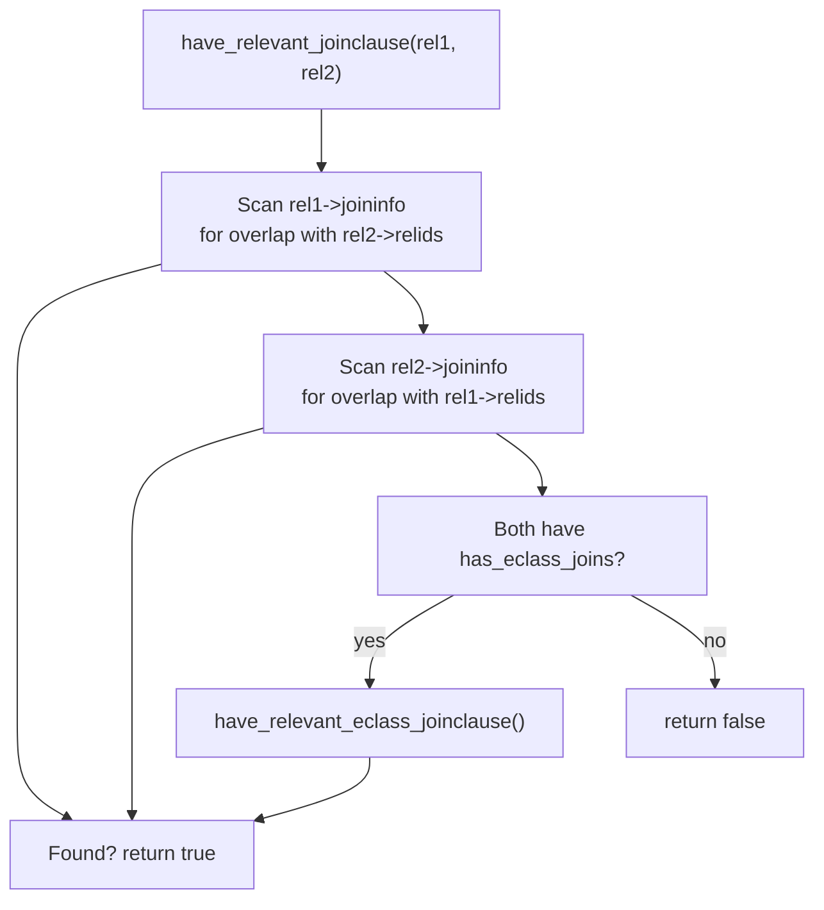

Every [[subsystems/planner/join-ordering|join ordering]] decision ultimately reduces to one question: given two relations, is there a predicate that makes joining them worthwhile? Answering that question by scanning the full WHERE clause list at every candidate pair would be prohibitively slow. Instead, the planner maintains a per-relation index called the `joininfo` list: it distributes each [[subsystems/planner/restrict-info|RestrictInfo]] that references more than one base relation into the `joininfo` list of every base relation it touches. The DP join search can then determine in constant time whether two relations share a join predicate, without touching any clause that cannot possibly apply.

## The joininfo List as an Index

A `joininfo` list is a field on every `RelOptInfo` (`pathnodes.h`). It holds all join clauses — [[subsystems/planner/restrict-info|RestrictInfo]] nodes — in which that base relation participates. When the DP algorithm is deciding whether to combine relation A with relation B, it calls `have_relevant_joinclause()` (`joininfo.c`). This function walks A's and B's `joininfo` lists, looking for any entry whose `required_relids` overlaps the other rel's `relids`. A single hit is sufficient to confirm that a join clause exists. The planner does not fully evaluate any clause at this stage.

Only base relations carry `joininfo` lists. Join rels — the intermediate results built during the DP search — do not. The distribution mechanism (`add_join_clause_to_rels()`, `joininfo.c`) iterates over the base relids in a clause's `join_relids` bitmask. It appends the clause exclusively to those base-relation entries. This is a deliberate design choice: join rels are ephemeral and rebuilt during planning, while `RelOptInfo` nodes for base relations are created once and persist for the entire planning session.

## How Distribution Happens: initsplan.c

Clause classification in `initsplan.c` drives distribution. After the planner has constructed its initial set of `RestrictInfo` nodes from the WHERE clause and JOIN/ON conditions, it calls `classify_node_clauses()` to route each clause to the right place. Restriction clauses — those whose `clause_relids` resolves to exactly one base relation — go onto that relation's `baserestrictinfo` list, where they become candidates for index quals and per-scan filters. Join clauses — those referencing two or more base relations — go through `add_join_clause_to_rels()`. This function distributes the same `RestrictInfo` pointer (not a copy) to every base relation whose relid appears in `join_relids`.

The result is that each base relation's `joininfo` list contains every join predicate that could become applicable when that relation enters a join. The list is effectively a set of "open invitations" — clauses waiting to be evaluated as soon as all the relations they reference have been assembled.

`remove_join_clause_from_rels()` (`joininfo.c`) reverses this process. The planner calls it when a relation turns out to need no join at all — for example, if it is proved empty or collapsed to a constant. The planner then withdraws the relation's clauses, to avoid misleading the search into treating them as valid join conditions.

## Relevance Without Full Applicability

The semantics of `have_relevant_joinclause()` are deliberately looser than "this clause can be fully evaluated at this join step." A clause is *relevant* if any of its `required_relids` overlap the other relation's `relids` — the clause need not be fully evaluable using only those two relations.

The source comment in `joininfo.c` makes this explicit with the example `WHERE a.x = (b.y + c.z)`. This clause references three relations: `a`, `b`, and `c`. When the planner is deciding whether to join `b` with `c`, it finds this clause in one of their `joininfo` lists. The clause is relevant: cross-joining `b` and `c` first produces a combined relation that contains `b.y + c.z`. That combined result can then drive an index lookup on `a.x` in the subsequent join step. The relevance check correctly signals that joining `b` and `c` is not clauseless even though the clause cannot be applied at that join step.

This distinction keeps the join search from treating multi-relation predicates as invisible. A join that looks clauseless in a strict "fully evaluable now" sense may still create an intermediate result that makes a later index join efficient.

## EquivalenceClass Joins and the Dual Check

Not every join condition produces a `joininfo` entry. When the planner absorbs an equality connecting two relations into an [[subsystems/planner/equivalence-classes|EquivalenceClass]] (EC) — for example, `a.x = b.x` absorbed into an EC covering both `a` and `b` — it may never create an explicit `RestrictInfo` in either relation's `joininfo` list. The equivalence class itself encodes the join condition. The planner derives join paths from it directly.

`have_relevant_joinclause()` handles this by falling back to `have_relevant_eclass_joinclause()` when both relations have the `has_eclass_joins` flag set. The planner computes this flag during EC processing. It indicates that at least one EC spans the relation and could produce a join clause with some other relation. The two-stage check — `joininfo` first, EC second — ensures the planner correctly identifies joinable pairs regardless of which mechanism encoded the predicate.

## Joininfo and the DP Join Search

The DP loop in `join_search_one_level()` (`joinrels.c`) uses `joininfo` reachability as its primary strategy for limiting which pairs to consider. For each relation at the current level, the planner calls `make_rels_by_clause_joins()`. This function inspects the relation's `joininfo` list. It attempts joins only with relations that share an entry. Cartesian product joins — via `make_rels_by_clauseless_joins()` — are a fallback reserved for relations with no applicable join clauses at all.

The `joininfo` index therefore directly controls planning cost. Without it, the planner would need to test every pair of relations against every clause at every level. That would turn a roughly quadratic scan into an expensive cross-product. With it, clause-driven join enumeration is fast: a single pass over a typically short list determines all the joins worth considering.

## See also

- [[subsystems/planner/restrict-info|RestrictInfo]] — the clause wrapper whose nodes populate joininfo lists
- [[subsystems/planner/join-ordering|Join ordering]] — the DP search that queries joininfo at every level
- [[subsystems/planner/equivalence-classes|Equivalence classes]] — the parallel mechanism for equality-derived join conditions
- [[subsystems/planner/predicate-pushdown|Predicate pushdown]] — how restriction clauses are routed to baserestrictinfo
- [[subsystems/planner/overview|Planner overview]]
