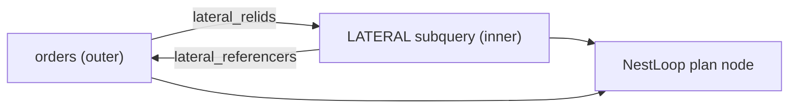

## What LATERAL Means

The `LATERAL` keyword marks a subquery or set-returning function (SRF) in the `FROM` clause, allowing it to reference columns from `FROM` items that appear earlier in the same `FROM` list. Without `LATERAL`, the planner evaluates each range table entry in isolation. The SQL standard prohibits cross-references between sibling `FROM` items. `LATERAL` lifts that restriction for the marked item. This turns the item into a correlated table expression whose inputs change with every outer row.

```sql
SELECT o.id, recent.amount
FROM orders o,
     LATERAL (
         SELECT amount
         FROM payments
         WHERE order_id = o.id
         ORDER BY paid_at DESC
         LIMIT 1
     ) AS recent;
```

The parser sets `RangeTblEntry.lateral = true` on any subquery, function, or values RTE preceded by the keyword (`src/include/nodes/parsenodes.h`). A lateral flag with no actual outer-column references in the body is harmless but has no effect on planning.

## LATERAL vs. Correlated Subquery

Both constructs reference an outer query's columns, but they occupy different positions in the query. The planner treats them very differently.

| Dimension | Correlated scalar/boolean subquery | LATERAL subquery |
|---|---|---|
| Syntax position | `SELECT` list, `WHERE`, `HAVING` | `FROM` clause |
| Return type | Scalar or boolean | Table (zero-to-many rows, named columns) |
| Can carry `LIMIT` | No | Yes — the central use case |
| Planner first tries | Decorrelation via `pull_up_sublinks` / `convert_EXISTS_to_join` | NestLoop with parameterized inner side |
| Flattening (`pull_up_subqueries`) | Often possible | Blocked by lateral cross-references in most practical cases |

`pull_up_subqueries` (in `prepjointree.c`) attempts to inline ordinary subqueries into the parent jointree. This makes all their relations visible to the full join-ordering search. `is_simple_subquery` enforces the preconditions. For a `LATERAL` RTE, those checks almost always fail, because the subquery's `WHERE` contains references to outer rels. Pulling those quals up would require repositioning them relative to any surrounding outer joins. The planner does not implement that repositioning. A lateral subquery with aggregation, `ORDER BY`, or `LIMIT` is ineligible for pullup by the same rules that apply to non-lateral subqueries. The net result: lateral subqueries remain as opaque plan nodes joined via NestLoop.

## Planner Representation

After parsing, each lateral RTE has a `RelOptInfo` in the planner. During `create_lateral_join_info`, the planner walks the body of each lateral RTE. It collects all `Var` nodes that reference other base relations into `lateral_vars`. From those it derives:

- `direct_lateral_relids` — the set of rels the lateral rel directly references.
- `lateral_relids` — the transitive closure, including indirect dependencies through `PlaceHolderVar` evaluation sites.
- `lateral_referencers` — the inverse: which rels hold a lateral dependency on this rel.

`LateralJoinInfo` nodes (one per lateral relationship) record that a given lateral RTE cannot appear in a join before all rels in its `lateral_relids` have been joined in. The join search in `joinpath.c` uses these nodes to prune any join ordering that would violate the dependency ordering. Because the lateral rel can only appear on the inner side of a join that already has its dependencies on the outer side, this partially constrains the join order before the planner makes any cost-based decisions.



When `create_nestloop_path` assembles a NestLoop path, it verifies that all `lateral_vars` on the inner path resolve against the outer path's output relids before accepting the combination.

## Execution Model

**LATERAL always produces a NestLoop join.** This is not a heuristic choice — it is structurally required. The inner plan tree contains `Param` nodes that receive their values from the outer side at runtime. Hash Join and Merge Join build their inner side once. They cannot re-execute it per outer row, so they are structurally incompatible with lateral dependencies. The join path code in `joinpath.c` only ever calls `create_nestloop_path` for a join involving a lateral inner rel.

```
NestLoop
  ->  Seq Scan on orders          (outer)
  ->  Index Scan on payments      (inner, re-executed per outer row)
        Index Cond: (order_id = $0)   -- $0 bound from orders.id
```

For each outer row, the executor binds the lateral parameters. It re-executes the entire inner subtree from scratch. In PostgreSQL 14+ the `Memoize` node can sit between the NestLoop and the inner plan to cache recent inner results when parameters repeat, but it applies only when the lateral expressions are hashable and the inner plan is deterministic.

Without an index on the inner table's join column, every outer row drives a full sequential scan of the inner table. This makes the query O(outer_rows × inner_table_size). An index reduces the inner cost to O(log N + k), where k is the rows returned per outer row.

For the SQL-level use cases this planning machinery supports — top-N per group, lateral SRF expansion, computed aliases, `LEFT JOIN LATERAL ... ON true` — see [[sql-features/lateral]].

## Performance-Relevant Internals

Two planner-internal factors shape lateral join performance beyond the general "always NestLoop" rule:

- **Row estimate accuracy**: the planner estimates lateral subquery cardinality using static statistics on the inner table without accounting for the specific parameter values passed from the outer side. This can cause cardinality mis-estimates that cascade into poor cost choices. Extended statistics (`CREATE STATISTICS`) on inner-table columns correlated with the join column may improve selectivity estimates.
- **Parallel query**: the outer side of a lateral NestLoop can participate in parallel query. Each worker re-executes the inner side independently for its portion of the outer rows.

## Related Topics

- [[sql-features/lateral|LATERAL (SQL Feature)]] — SQL-level documentation of the LATERAL keyword, complementing this planner-focused view with syntax and semantics from the user perspective.
- [[subsystems/executor/joins|Joins]] — executor-level coverage of NestLoop, Hash Join, and Merge Join nodes; explains why lateral inner sides are always driven by NestLoop.
- [[subsystems/executor/memoize|Memoize]] — the Memoize node that caches inner-side results for repeated lateral parameter values, directly affecting lateral join performance.
- [[subsystems/planner/subqueries|Subqueries]] — correlated subqueries in WHERE/SELECT; contrasts with lateral subqueries in FROM and covers the shared decorrelation infrastructure.
- [[subsystems/planner/join-ordering|Join Ordering]] — how the planner searches join orderings; lateral dependencies impose partial ordering constraints that prune the search space before cost-based decisions.
- [[subsystems/planner/join-method-selection|Join Method Selection]] — explains when NestLoop, Hash Join, and Merge Join are chosen; lateral joins always force NestLoop regardless of cost.
- [[subsystems/planner/predicate-pushdown|Predicate Pushdown]] — how quals are pushed into subquery RTEs; lateral cross-references constrain where predicates can move and interact with this mechanism.
