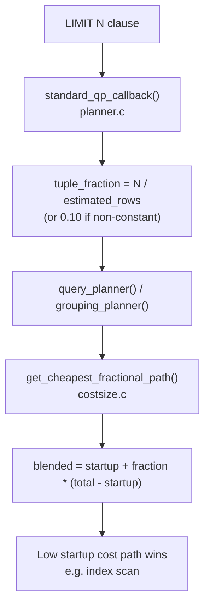

# LIMIT and Plan Selection

A `LIMIT` clause does more than truncate the result set — it fundamentally changes which plan the optimizer considers cheapest. Without `LIMIT`, the planner optimizes for total cost: produce all rows as efficiently as possible, even if producing the first row takes a long time. With `LIMIT`, the query only ever fetches a small fraction of rows, so a plan with low startup cost and high per-row cost often wins decisively over a plan that amortizes a large up-front investment over millions of rows.

The entire mechanism flows through a single scalar called `tuple_fraction`. The planner threads it through `query_planner()` and `standard_qp_callback()` in `src/backend/optimizer/plan/planner.c`. `get_cheapest_fractional_path()` and `get_cheapest_fractional_path_for_pathkeys()` in `src/backend/optimizer/path/costsize.c` consume it at path-selection time.

## tuple_fraction: Fraction of Rows Expected to Be Consumed

`tuple_fraction` is the planner's estimate of what fraction of the query's result rows the executor will actually consume. The planner interprets it as:

- `0.0` — fetch all rows (default for a plain `SELECT` with no `LIMIT`)
- `0 < f < 1` — fetch approximately that fraction of the output rows
- `f >= 1.0` — fetch that absolute number of rows (used when a constant `LIMIT` is present)

When a `LIMIT N` clause is present with a known constant `N` and the estimated count of output rows is `R`, `standard_qp_callback()` computes:

```c
/* Simplified from planner.c */
if (limit_tuples > 0) {
    tuple_fraction = (double) limit_tuples / clamp_row_est(path->rows);
    if (tuple_fraction >= 1.0)
        tuple_fraction = 0.0;  /* fetching everything anyway */
}
```

A `LIMIT 10` on an estimated 10,000-row result produces `tuple_fraction = 0.001`. The planner passes this value into `query_planner()`. It biases all subsequent path comparisons toward paths with low startup cost.

Non-constant `LIMIT` (e.g., `LIMIT $1`) falls back to a guess of `0.10`. This means the planner assumes it will consume 10% of rows. If your typical parameter value is `LIMIT 1`, the planner may choose a suboptimal plan.

## Blending Startup and Total Cost

`get_cheapest_fractional_path()` (`src/backend/optimizer/path/costsize.c`) selects the cheapest path given a `tuple_fraction`, by computing a blended cost for each candidate path:

```
blended = startup_cost + fraction * (total_cost - startup_cost)
```

This formula interpolates between pure startup cost (fraction = 0) and pure total cost (fraction = 1). For `fraction = 0.001`, the formula weights startup cost approximately 1,000 times more heavily than incremental cost. The path with the lowest blended cost wins.

`get_cheapest_fractional_path_for_pathkeys()` applies the same blending but restricts candidates to paths that already provide the required sort order. The planner uses this when `ORDER BY` is present alongside `LIMIT`, since a pre-sorted path eliminates the sort node entirely.



A sequential scan followed by a sort has startup cost roughly equal to reading the full table plus sort overhead — all rows must be in memory (or on disk) before the first output row appears. An index scan on a btree column has near-zero startup cost: the executor locates the first leaf page after a root-to-leaf traversal. It then returns rows one at a time. This asymmetry makes even a modest `LIMIT` decisive in the blending formula.

Consider a table with 1,000,000 rows:

| Path | Startup cost | Total cost | Blended (fraction=0.001) |
|------|-------------|------------|--------------------------|
| Seq scan + sort | ~18,000 | ~21,000 | ~18,003 |
| Index scan | ~0.3 | ~4,200 | ~4.5 |

At `tuple_fraction = 0.001` the index scan's blended cost (~4.5) beats the sort plan (~18,003) by a factor of ~4,000. Even in cases where the index scan's total cost exceeds the sort plan's total cost, a small enough `tuple_fraction` ensures the blending formula still selects the index scan. The crossover point where the sort plan becomes cheaper typically occurs above 5–20% of the table. The exact point depends on `random_page_cost` and index correlation.

## ORDER BY col LIMIT N: Nearly Always an Index Scan

The `ORDER BY col LIMIT N` pattern is the canonical LIMIT optimization. When a btree index exists on `col`, the planner can generate an index scan path that is already ordered. Two advantages compound. The index scan eliminates the sort node entirely, saving the full sort startup cost. The fractional cost blending also assigns near-zero weight to the tail of the index scan that will never execute.

```sql
CREATE TABLE events (id bigint, ts timestamptz, payload text);
CREATE INDEX events_ts_idx ON events (ts DESC);

-- No LIMIT: planner chooses seq scan + sort (lower total cost at scale)
EXPLAIN SELECT * FROM events ORDER BY ts DESC;
```

```
 Sort  (cost=14521.51..14771.51 rows=100000 width=48)
   Sort Key: ts DESC
   ->  Seq Scan on events  (cost=0.00..1541.00 rows=100000 width=48)
```

```sql
-- With LIMIT 10: planner flips to index scan
EXPLAIN SELECT * FROM events ORDER BY ts DESC LIMIT 10;
```

```
 Limit  (cost=0.42..1.01 rows=10 width=48)
   ->  Index Scan using events_ts_idx on events  (cost=0.42..5874.42 rows=100000 width=48)
```

The `Limit` node stops the index scan after 10 rows. The sort plan's startup cost (~14,521) is never competitive once `tuple_fraction` is small. `standard_qp_callback()` sets `root->query_pathkeys` from the `ORDER BY` clause before the planner generates paths. This lets ordered index-scan paths enter `rel->pathlist`, where `get_cheapest_fractional_path_for_pathkeys()` evaluates them.

## cursor_tuple_fraction GUC

When an application executes a query via `DECLARE CURSOR`, it signals intent to fetch rows incrementally. PostgreSQL models this using the `cursor_tuple_fraction` GUC (default `0.1`). This GUC injects a `tuple_fraction` of 0.1 even without an explicit `LIMIT`:

```c
/* planner.c */
if (cursorOptions & CURSOR_OPT_FAST_PLAN)
    tuple_fraction = cursor_tuple_fraction;
else
    tuple_fraction = 0.0;
```

Lowering `cursor_tuple_fraction` to `0.01` more aggressively favors index scans for cursor queries. Raising it toward `1.0` biases toward total-cost optimization. This GUC is the right tuning knob for applications that use server-side cursors but fetch unpredictable fractions of results.

```sql
-- Bias cursor planning toward fast-start (fetch few rows typical)
SET cursor_tuple_fraction = 0.01;
DECLARE my_cursor CURSOR FOR SELECT * FROM events ORDER BY ts DESC;
FETCH 10 FROM my_cursor;
```

## LIMIT on Aggregates: No Help

Aggregate functions (`COUNT`, `SUM`, `AVG`, etc.) must consume their entire input before emitting a single output row. A `LIMIT` above an aggregate saves nothing for the aggregate computation itself:

```sql
-- LIMIT 1 saves nothing: aggregate must scan the whole table
EXPLAIN ANALYZE SELECT COUNT(*) FROM events LIMIT 1;
```

```
 Limit  (cost=1541.00..1541.01 rows=1 width=8)
   ->  Aggregate  (cost=1541.00..1541.01 rows=1 width=8)
         ->  Seq Scan on events  (cost=0.00..1291.00 rows=100000 width=0)
```

The `Limit` node sits above `Aggregate`, but the seq scan and aggregate execute fully regardless. Inside `grouping_planner()`, when the planner considers aggregate paths, it resets `root->tuple_fraction` to `0.0` for the scan beneath the aggregate node. `LIMIT` reduces the aggregate's output (often a single row), not the scan feeding it.

## The OFFSET Pitfall

`OFFSET M LIMIT N` causes the planner to set `limit_tuples = M + N` for cost estimation. The executor must physically traverse all `M + N` rows — there is no mechanism to skip rows cheaply:

```sql
-- Fast: reads 10 rows
SELECT * FROM events ORDER BY ts DESC LIMIT 10;

-- Slow: reads 1,000,010 rows, discards first 1,000,000
SELECT * FROM events ORDER BY ts DESC LIMIT 10 OFFSET 1000000;
```

Even with an index scan, the executor steps through one million index entries and heap pages before returning the first useful result row. Large `OFFSET` pagination is O(N) in the offset size.

### Keyset Pagination: The Fix

Keyset (seek) pagination replaces `OFFSET` with a `WHERE` predicate on the last seen key values:

```sql
-- Page 1
SELECT id, ts FROM events ORDER BY ts DESC, id DESC LIMIT 10;

-- Page 2: pass last (ts, id) from previous page as bind parameters
SELECT id, ts FROM events
WHERE (ts, id) < ('2024-01-15 12:00:00', 987654)
ORDER BY ts DESC, id DESC
LIMIT 10;
```

Each page fetch is O(log N + page_size). A composite index on `(ts DESC, id DESC)` supports both the ordering and the seek predicate. This lets the index scan position directly at the correct leaf entry, rather than skipping rows from the beginning.

## LIMIT 1 with EXISTS as a COUNT Alternative

Using `COUNT(*) > 0` to check for the existence of at least one matching row is a common anti-pattern. `COUNT(*)` is an aggregate — it must scan all qualifying rows:

```sql
-- Inefficient: full aggregate scan even though we only need existence
SELECT CASE WHEN COUNT(*) > 0 THEN true ELSE false END
FROM orders WHERE customer_id = 42;

-- Efficient: stops at first matching row
SELECT EXISTS (SELECT 1 FROM orders WHERE customer_id = 42);

-- Equivalent with explicit LIMIT 1 (redundant but clear)
SELECT 1 FROM orders WHERE customer_id = 42 LIMIT 1;
```

The planner rewrites `EXISTS` into a subplan with an implicit limit. This produces a `tuple_fraction` near zero and allows an index scan to stop after the first qualifying row. The explicit `LIMIT 1` form achieves the same effect through the `tuple_fraction` machinery.

## Practical Guidance

**Check EXPLAIN when using ORDER BY + LIMIT.** If you see a `Sort` above a `Seq Scan` on a query with `ORDER BY col LIMIT N`, an index on `col` will almost always produce a dramatically faster plan. Create the index and verify the plan flips.

**Non-constant LIMIT uses a 10% guess.** `LIMIT $1` forces `tuple_fraction = 0.10` regardless of the actual parameter value. If your typical limit is 1 or 5 rows from millions, the planner may underestimate how aggressively to favor the index scan. Consider hinting via `SET enable_seqscan = off` temporarily or restructuring to use a constant LIMIT in performance-critical paths.

**Tune cursor_tuple_fraction per workload.** Default is 0.1 (optimize for fetching 10% of rows). If your application always fetches all cursor rows, set it to 1. If it typically fetches only a few rows, lower values (0.01) push more aggressively toward fast-start plans.

**Never use OFFSET for deep pagination in production.** Large `OFFSET` values cause O(N) scans. Use keyset pagination with a composite index matching the `ORDER BY` columns.

**LIMIT on top-level aggregates is a no-op for performance.** The aggregate is a pipeline barrier. `LIMIT` only truncates the aggregate's output. Replace existence checks with `EXISTS` or `LIMIT 1` on the raw scan.

**Watch for plan instability at the LIMIT threshold.** A query used both with and without `LIMIT` may flip plans. Use `pg_hint_plan` or `plan_cache_mode = force_generic_plan` if you need stable plans across both variants.

**EXPLAIN (ANALYZE, BUFFERS) to verify actual vs estimated rows.** A large discrepancy in row estimates corrupts `tuple_fraction`. This can cause the planner to choose the wrong plan. Fix statistics with `ANALYZE` or adjust `default_statistics_target` for skewed columns.

## Related Topics

- [[subsystems/planner/cost-model|Cost Model]] — defines startup and total cost components that the tuple_fraction blending formula interpolates between when selecting the cheapest fractional path.
- [[subsystems/planner/index-selection|Index Selection]] — explains how the planner evaluates index paths that become the winning choice when LIMIT drives tuple_fraction toward zero.
- [[subsystems/planner/sort-avoidance|Sort Avoidance]] — covers how pre-sorted index paths eliminate sort nodes, compounding the savings from LIMIT-driven plan selection.
- [[subsystems/planner/scan-selection|Scan Selection]] — describes the trade-offs between sequential and index scans that LIMIT resolves by heavily weighting startup cost.
- [[subsystems/executor/limit-offset|Limit/Offset]] — executor-side implementation of the Limit node that physically stops row retrieval once the requested count is satisfied.
- [[subsystems/planner/generic-plans|Generic Plans]] — relevant when non-constant LIMIT parameters force the planner to use a fixed tuple_fraction guess rather than a per-execution value.
- [[subsystems/planner/stale-statistics-and-bad-plans|Stale Statistics and Bad Plans]] — inaccurate row estimates corrupt tuple_fraction and can cause the wrong plan to win the blended cost comparison.
