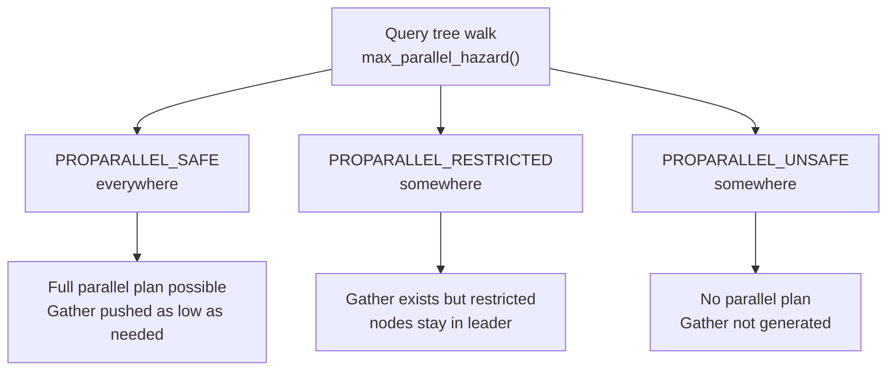

# Optimization Fences

The PostgreSQL planner is a search over a space of equivalent query plans. Its power comes entirely from the transformations the planner may apply: pushing a predicate closer to a base table so that fewer rows travel through upper plan nodes, choosing an index scan over a sequential scan, reordering joins, or distributing work across parallel workers. An optimization fence is anything that prevents one of those transformations. The planner cannot see past a fence, so it makes all planning decisions above the fence without knowledge of what lies below it.

Fences arise from correctness requirements — moving a predicate across the fence would change the query's result or violate a security invariant — and from fundamental constraints of how indexes and operators work. Removing a fence often requires either a schema change or a query rewrite, not just a GUC tweak.

## Volatile Functions

Every PostgreSQL function carries a volatility marker in `pg_proc.provolatile`. The three values encode a contract with the planner:

- `IMMUTABLE` (`i`): the function returns the same result for the same arguments, always — it does not read the database and session state does not affect it. The planner may fold calls to immutable functions on constant arguments at planning time. It is free to evaluate the function as few times as it likes.
- `STABLE` (`s`): the result is stable within a single query but may differ between queries. The planner may assume the function returns the same value every time it is called with the same arguments during one execution. It cannot cache the result across queries, but within one query it treats the function as effectively constant.
- `VOLATILE` (`v`): the function may return a different result on every call, or may have side effects. The planner must call it once for every row it is supposed to evaluate. This is the default if no volatility is specified.

The volatility classification determines what transformations are safe. `contain_volatile_functions()` (`clauses.c`) walks an expression tree. It returns true if any volatile function or operator is present. The planner calls this check at several decision points: before deciding whether a WHERE clause can be pushed into a subquery, before deciding whether a plan node can be parallelized, and before attempting certain constant-folding optimizations.

### Predicate Pushdown

When the planner processes a subquery or view in the FROM clause, one of its first moves is to push outer WHERE clauses down into the subquery so that the subquery can filter rows earlier and expose fewer to the parent query. `qual_is_pushdown_safe()` (`allpaths.c`) governs whether a specific clause is safe to push. If the clause contains a volatile function, the planner refuses the push. The resulting plan evaluates the subquery in full. It returns all its rows as a `SubqueryScan`. It applies the outer predicate only then.

This is not merely theoretical. A view like:

```sql
CREATE VIEW expensive AS
  SELECT *, compute_something(data) AS result FROM large_table;
```

wrapped in:

```sql
SELECT * FROM expensive WHERE id = 42;
```

If `compute_something` is stable or immutable, the planner can push the `id = 42` predicate down into this query: it inlines the view, and the predicate filters `large_table` directly. If `compute_something` is volatile, the planner cannot inline the view with the predicate inside it: it must materialise the full view output first.

### Parallelism

A plan node can only send work to parallel workers if every function it evaluates is safe to run in a parallel context. The planner's parallel safety classification uses `max_parallel_hazard()` and `is_parallel_safe()` (`clauses.c`). These functions walk the query tree and track the worst hazard encountered. Each function has a `proparallel` property that is one of:

- `PARALLEL SAFE`: may run in workers without restriction.
- `PARALLEL RESTRICTED`: may only run in the parallel leader, not in workers. This limits how high up the plan tree the planner can place a `Gather` or `Gather Merge` node.
- `PARALLEL UNSAFE`: prevents all parallelism for the plan tree containing it.

A volatile function is implicitly `PARALLEL UNSAFE`. When `max_parallel_hazard_walker()` encounters one, it sets `max_hazard = PROPARALLEL_UNSAFE`. It returns immediately — there is no point searching further. The planner then refuses to add a `Gather` node above any plan node that contains the function, regardless of table size or `max_parallel_workers_per_gather`.

Other constructs that `max_parallel_hazard_walker()` treats as unsafe or restricted include CTEs that are not inlined, SubPlans that are not themselves parallel-safe, `PARAM_EXEC` parameters not in the known-safe list, `NextValueExpr` (sequence access), and `SELECT FOR UPDATE/SHARE` queries. Window functions are restricted rather than unsafe, since their output might vary across workers if row ordering is not fully deterministic.

### Fixing a Volatility Mislabel

If a function is truly stable or immutable, declaring it correctly is the primary fix:

```sql
ALTER FUNCTION myfunc(text) STABLE;
ALTER FUNCTION myfunc(text) IMMUTABLE;
```

To inspect the current classification:

```sql
SELECT proname, provolatile, proparallel
FROM pg_proc
WHERE proname = 'myfunc';
```

The critical trap is `IMMUTABLE` on a function that reads table data. Table contents can change between queries. The planner may inline a function declared `IMMUTABLE` but containing a `SELECT` at plan time. It may cache the function's result, producing stale results. Functions that read tables must be at most `STABLE`.

## Security-Barrier Views

A view created with `WITH (security_barrier = true)`, or any view that implements a row-level security policy, is a hard optimization fence. The planner cannot push WHERE clause predicates from the outer query into the view's definition, even if the predicates contain only immutable functions.

The reason is privilege escalation. Suppose a view restricts rows to those the calling user is permitted to see:

```sql
CREATE VIEW my_rows WITH (security_barrier = true) AS
  SELECT * FROM accounts WHERE owner = current_user;
```

Without the fence, the planner could evaluate an outer predicate like `WHERE log_access(account_id)` inside the view before the `owner = current_user` filter. That would call `log_access` on rows the user was never supposed to see. The security barrier guarantees that the view's own filters run first.

The implementation is in two parts. `process_security_barrier_quals()` (`initsplan.c`) copies the RTE's `securityQuals` list into the relation's `baserestrictinfo` with ascending security levels. The planner must apply higher security levels before lower ones. When the planner then considers pushdown candidates for a security-barrier subquery, it sets `safetyInfo.unsafeLeaky` to true (`allpaths.c`). `qual_is_pushdown_safe()` then calls `contain_leaked_vars()` (`clauses.c`) on each candidate predicate. It refuses any predicate that references a Var through a non-leakproof function.

Similarly, `pull_up_subqueries_recurse()` (`prepjointree.c`) will not flatten a security-barrier RTE into the parent query at all (`rte->security_barrier` check at the top of `is_simple_subquery()`). Doing so would scatter the RTE's Vars across the upper query's expression tree. That would make it impossible to enforce evaluation ordering.

The EXPLAIN output makes this visible: a security-barrier view appears as a `Subquery Scan` node with the outer predicate shown as a `Filter` above it, not pushed into the child node.

### Leakproof Functions

The one avenue through the fence is `LEAKPROOF`. A function declared `LEAKPROOF` by a superuser asserts that it cannot expose information through side channels — it will not throw errors that reveal row content, will not have observable timing differences based on input values, and will not write to any external storage. `contain_leaked_vars()` returns false for expressions that pass through only leakproof functions, so the security barrier allows such predicates through.

```sql
-- Declaring a function leakproof (requires superuser)
ALTER FUNCTION safe_check(integer) LEAKPROOF;
```

Most built-in operators on standard types (integer equality, range comparisons) are already leakproof. User-defined functions are never leakproof by default.

## Function Wrapping of Indexed Columns

An index on column `email` stores the original values of `email`. A query with `WHERE lower(email) = 'foo@example.com'` applies `lower()` to the column. This produces a derived value that is not in the index. The planner has no way to invert the function and scan the index for values of `email` that would produce a given `lower()` result. It falls back to a sequential scan. It evaluates `lower(email)` for every row.

The same pattern applies to any expression on a column: `date_trunc('day', created_at)`, `regexp_replace(name, ...)`, `substring(code, 1, 3)`. Wrapping the indexed column in any non-trivial function blocks index use.

There are three ways to address this:

**Expression index.** Create an index on the exact expression the query uses:

```sql
CREATE INDEX ON users (lower(email));
```

The planner matches index paths to WHERE clauses by comparing the clause's expression with the index's stored expressions. If the query writes `WHERE lower(email) = $1` and an index exists on `lower(email)`, the planner can use it. The expression in the query must match exactly. `LOWER(email)` written differently would need to be the same expression tree after parse analysis. It is, for case-insensitive function names.

**Range rewrite.** For predicates on date/time functions, expand the range explicitly:

```sql
-- Instead of:
WHERE date_trunc('day', created_at) = '2024-01-01'

-- Write:
WHERE created_at >= '2024-01-01' AND created_at < '2024-01-02'
```

The rewritten form allows a B-tree range scan on a plain index on `created_at`.

**Collation or type choice.** For case-insensitive text matching, use the `citext` extension type or an ICU collation that treats case differences as equivalent at the collation level. You can then create the index with the same collation. Equality operators on that collation will use the index without requiring a function call.

To diagnose whether function wrapping is the problem, EXPLAIN the query and look for a `Seq Scan` with a `Filter` that shows the function being applied. Compare against an EXPLAIN on a query that omits the function — if an index scan appears, the function is the blocker.

## Implicit Type Coercions

PostgreSQL's type system resolves operators and functions by matching argument types. When types do not match exactly, the parser inserts implicit casts. Where the cast lands determines whether an index is usable.

**Cast on the constant side** is harmless. `WHERE int_col = '42'` resolves to the integer equality operator with `'42'` cast to `integer`. The index on `int_col` stores integers. The comparison is on `integer`. The planner uses the index normally.

**Cast on the column side** is fatal to index use. `WHERE varchar_col = 42` may resolve by casting the `varchar_col` expression to `integer` (or by some cross-type operator that the index's operator class does not support). EXPLAIN will show the cast explicitly: `Filter: ((col)::integer = 42)`. The cast wraps the column. That is precisely the function-wrapping problem described above.

Foreign key columns with type mismatches are a common source. When you join or filter a `bigint` foreign key column against an `integer` expression, the parser inserts an implicit cast on the column side. This silently disables index use for the join or predicate. The fix is to match types exactly in the application, or to cast the constant rather than the column: `WHERE bigint_fk_col = 42::bigint`.

A related case is operator class mismatch. An index on a `varchar` column uses the `text_ops` operator class. A predicate using `varchar_col ILIKE 'foo%'` uses the `ilike` operator. That operator is not in `text_ops`. The planner generates no index path. The fix is an index on `lower(varchar_col)` with an appropriate operator class, or a `pg_trgm` index for substring patterns.

## OR Predicates

A WHERE clause with `WHERE a = 1 OR b = 2` refers to two different columns. A single B-tree index on `a` covers the `a = 1` branch but not the `b = 2` branch, and vice versa. The planner's options are:

- **Sequential scan** with the full OR condition as a filter.
- **BitmapOr** of two bitmap index scans, one per branch. Each index scan builds a TID bitmap. The executor ORs the two bitmaps together. It then accesses the heap in physical order. Whether BitmapOr wins over a sequential scan depends entirely on selectivity. If each branch is highly selective, the combined bitmap covers a small fraction of the heap. BitmapOr is then cheaper. If each branch is low-selectivity, the bitmaps overlap almost the entire table. The sequential scan then wins.

`generate_bitmap_or_paths()` (`indxpath.c`) generates the BitmapOr path automatically. No manual rewriting is needed if selectivity is high enough for it to win. If it does not win and you need it to win, the usual approach is to split the query:

```sql
-- Can plan each branch with its own optimal index
SELECT * FROM t WHERE a = 1
UNION ALL
SELECT * FROM t WHERE b = 2 AND NOT (a = 1);
```

For small lists, the planner internally rewrites `WHERE col IN (1, 2, 3)` to `col = 1 OR col = 2 OR col = 3`. This then follows the same logic. For large IN lists, the planner switches to a hash probe strategy rather than an OR chain. This has different index implications.

## OFFSET and Cursor-Style Queries

`OFFSET N LIMIT M` does not instruct the planner to skip N rows — it instructs the executor to fetch and discard them. The plan must still produce every row up to and including row N+M before any output appears. For deep offsets, this makes `OFFSET`-based pagination O(offset + page_size). The cost grows linearly with page depth, regardless of how selective the query is.

The planner does account for this: a query with `LIMIT M` gets startup-cost optimization (it prefers plans that deliver early rows cheaply), but `OFFSET` does not reduce the set of rows the plan must produce. An index scan that can deliver rows in sorted order will still beat a hash sort for a `LIMIT` clause, but the plan pays the offset cost either way.

Keyset pagination eliminates the problem entirely:

```sql
-- Instead of: SELECT * FROM events ORDER BY created_at LIMIT 100 OFFSET 50000
-- Use:
SELECT * FROM events
WHERE (created_at, id) > ($last_created_at, $last_id)
ORDER BY created_at, id
LIMIT 100;
```

The composite condition `(created_at, id) > (val, val)` is a range predicate that a composite B-tree index on `(created_at, id)` can satisfy with a direct seek to the right position. The plan is an index range scan over exactly 100 rows, regardless of how many pages precede the current position.

## Parallel Query Blockers

A parallel query works by placing a `Gather` or `Gather Merge` node above a plan subtree and distributing that subtree's work across background workers. Any plan node below the `Gather` that is not parallel-safe prevents the planner from launching workers for that subtree.

The planner calls `max_parallel_hazard()` on the full query tree before planning begins. This records the worst hazard level in `PlannerGlobal.maxParallelHazard`. It then calls `is_parallel_safe()` on individual plan nodes when deciding whether to push them below a `Gather`. `max_parallel_hazard_walker()` (`clauses.c`) finds the worst hazard level by recursing through all expressions, flagging:

- Any function with `proparallel = PROPARALLEL_UNSAFE` (which includes all volatile functions).
- `NextValueExpr` (sequence access) — unsafe.
- `CoerceToDomain` — restricted.
- Window functions — restricted.
- SubPlans that are not themselves marked parallel-safe — restricted.
- `PARAM_EXEC` Params that are not in the known-safe list — restricted (correlated subqueries generate them, and the planner cannot pass them to workers).
- `SELECT FOR UPDATE/SHARE` — unsafe (requires row locking per-backend).

`PARALLEL RESTRICTED` nodes prevent the planner from pushing those nodes below a `Gather`, but the `Gather` can still exist above them. `PARALLEL UNSAFE` anywhere in a plan subtree prevents the planner from placing a `Gather` above that subtree at all.

The result is that a single volatile function anywhere in a query — even in a SELECT list column that the user expects to run after all filtering — prevents all parallel execution for the entire query. The fix is either to remove the volatile function, to wrap the query in a CTE that separates the volatile expression from the parallel-eligible filtering work, or to correct a mislabeled function's volatility and parallel-safety properties.



## Diagnosing Fences

Most of these fences are visible in EXPLAIN output:

- A `Seq Scan` where you expected an index scan is the canonical signal. Check whether the WHERE clause wraps the indexed column in a function or cast.
- A `Subquery Scan` with an outer `Filter` (rather than the filter inside the subquery node) indicates that something blocked predicate pushdown — either a security barrier, a volatile function, or a structural reason like `DISTINCT` or aggregation in the subquery.
- Absence of `Gather` or `Gather Merge` in a plan on a large table means the planner could not parallelize it. `SET debug_parallel_query = regress` (PG 15+) annotates nodes with their parallel safety classification.
- A `BitmapOr` node under `Bitmap Heap Scan` means the planner chose to union two index scans for an OR predicate. That is the correct outcome for selective OR clauses.

For volatility, the catalog query:

```sql
SELECT proname, provolatile, proparallel, proleakproof
FROM pg_proc
WHERE proname = 'myfunc';
```

shows all three relevant labels at once. `provolatile` is `'v'`/`'s'`/`'i'`, `proparallel` is `'u'`/`'r'`/`'s'`, and `proleakproof` is a boolean.

## Related Topics

- [[subsystems/planner/predicate-pushdown|Predicate Pushdown]] — detailed coverage of how the planner decides which WHERE clauses can be pushed into subqueries and views, directly constrained by optimization fences.
- [[subsystems/planner/parallel-query|Parallel Query]] — explains how the planner constructs parallel plans and why volatile or restricted functions prevent Gather nodes from being placed.
- [[subsystems/planner/ctes|CTEs]] — CTEs can act as optimization fences themselves when not inlined, making them a common tool for deliberately isolating volatile expressions.
- [[subsystems/planner/or-clauses|OR Clauses]] — covers BitmapOr path generation and the selectivity conditions under which OR predicates can use indexes rather than falling back to sequential scans.
- [[subsystems/indexes/expression-indexes|Expression Indexes]] — the primary workaround for function-wrapping fences, allowing the planner to match indexed expressions to query predicates.
- [[subsystems/rewriter/updatable-views|Updatable Views]] — security-barrier views and row-level security interact with the rewriter before the planner, affecting which view definitions can be flattened.
- [[subsystems/planner/scan-selection|Scan Selection]] — describes how the planner chooses between sequential scans, index scans, and bitmap scans, and how fences eliminate candidate paths.
- [[subsystems/planner/index-selection|Index Selection and Index Path Costing]] — how index paths are generated and costed
- [[subsystems/planner/cost-model|Planner Cost Model]] — the cost model that optimization fences distort
- [[subsystems/planner/subqueries|Subquery Planning and Flattening]] — subquery flattening and when it fails
- [[subsystems/row-level-security|Row-Level Security]] — row-level security and how it interacts with security barriers
- [[subsystems/indexes/index-am|Index Access Method Interface]] — expression indexes and operator class matching
